# 1. Getting Ready

## 1.1 miniAuto Introduction

**1.1.1 Product Introduction**

miniAuto is an entry-level AI vision robot car powered by an Atmega328 microcontroller and fully compatible with the Arduino programming platform.

It comes equipped with an AI vision module, ultrasonic sensor, 4-channel line follower, multifunctional expansion board, Bluetooth communication module, and an anti-blocking gripper. miniAuto also offers multiple sensor expansion ports, making it easy for users to explore secondary development and expand its capabilities.

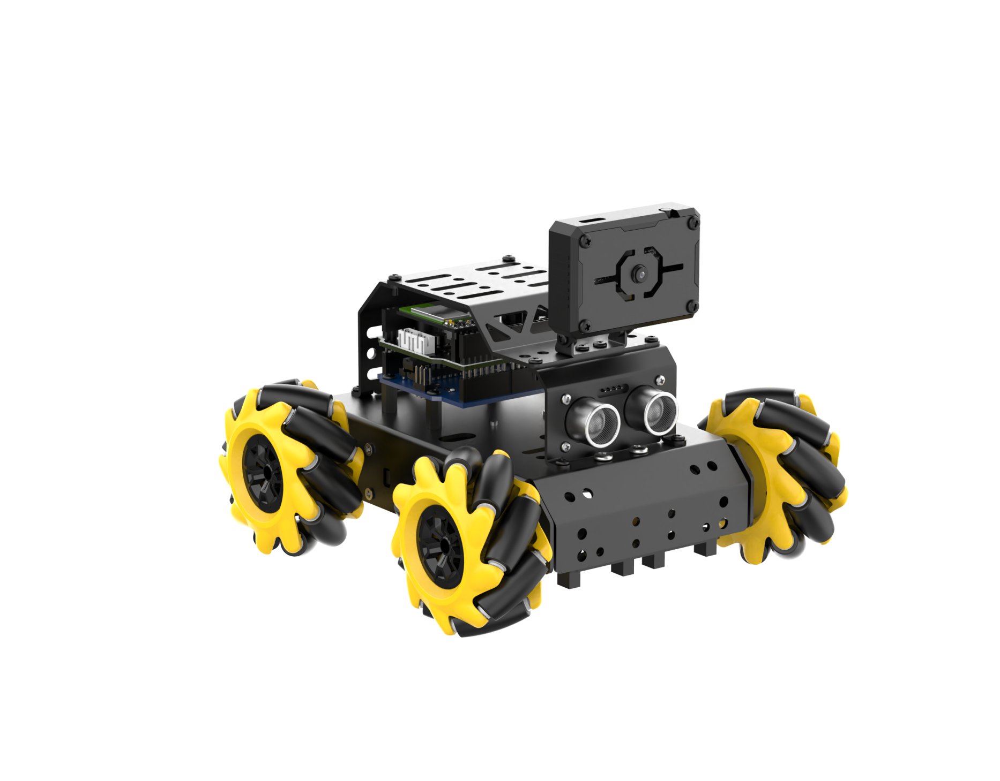

**1.1.2 Notes**

Instructions on the usage and storage of this product:

(1) This product contains small parts and sharp pins. It is not suitable for children under 12 years old.

(2) Minors should use this product only under adult supervision and guidance.

(3) Avoid swallowing or applying pressure to small or sharp components to prevent injury.

(4) The product includes conductive components. Do not touch them with metal objects while the power is on.

(5) Do not force the robot to move while it is powered on, as this may cause damage.

(6) If the product will not be used for an extended period, please fully charge the battery, then remove it and store it in a cool, dry place.

**1.1.3 Copyright Notice**

This tutorial is the exclusive property of Shenzhen Hiwonder Technology Co., Ltd. No organization or individual is permitted to excerpt, copy, translate, or distribute any part of this tutorial without prior authorization.  

Shenzhen Hiwonder Technology Co., Ltd. reserves the right to pursue legal action against any party that infringes upon the copyright of this material.

**1.1.4 Disclaimer**

The product described in this manual, including both hardware and software, is provided "**as is**". While every effort has been made to ensure the accuracy of the content, this manual may contain errors or omissions. The information provided is subject to regular review, and we welcome user feedback and suggestions for improvement.

Please note that product features and specifications may change with version upgrades. For the most up-to-date information, we recommend contacting our customer service team before placing an order.

Additionally, unless explicitly stated by Hiwonder, we do not accept liability for any damage or loss resulting from product failure or malfunction when used under extreme conditions or in unintended applications.

## 1.2 Packing List

(1) MiniAuto Standard kit Packing List

| **No.** |                        **Components**                        | **Quantity** |                         **Picture**                          |
|:-------:|:------------------------------------------------------------:|:------------:|:------------------------------------------------------------:|
|    1    | Chassis bracket (chassis * 1 Top cover * 1 Back cover * 1 Front cover *1 ) |      4       |  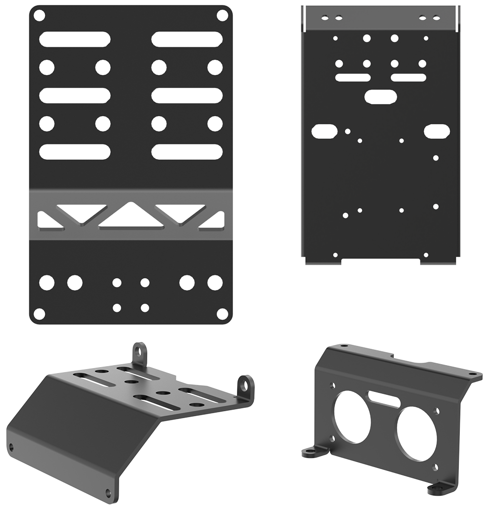  |
|    2    | ESSP32-S3 Vision module (ESSP32-S3 Vision module * 1 camera mounting bracket * 2) |      3       | 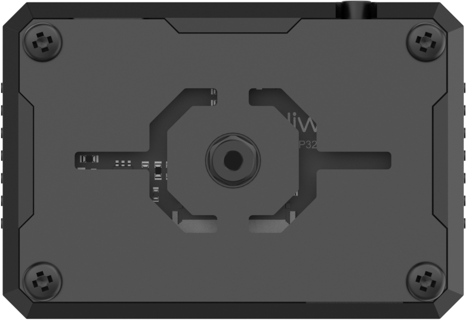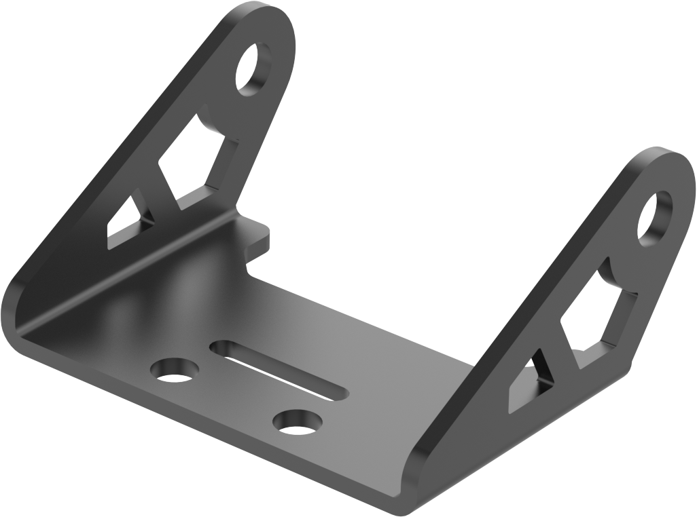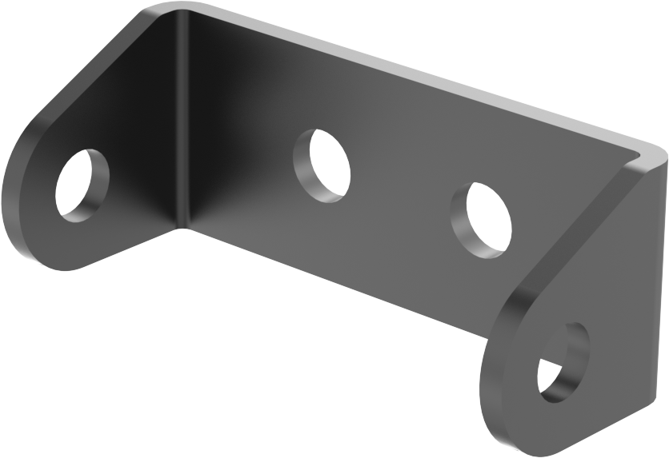 |
|    3    | Mecanum wheels (wheel A * 2 wheel B * 2 coupling * 4 Pan head screw * 4) |      4       |  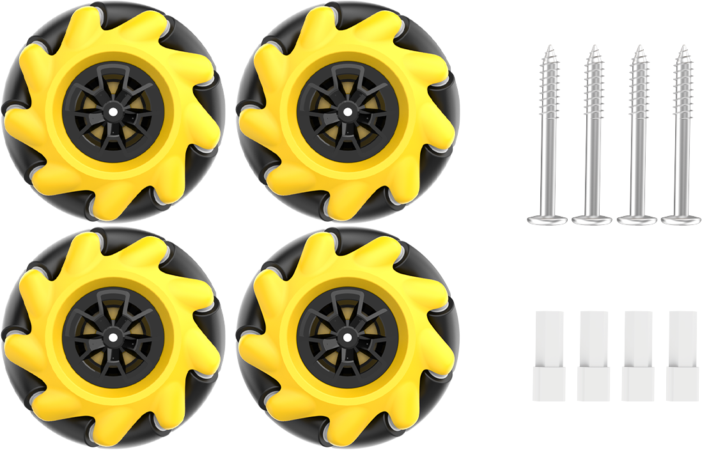  |
|    4    |                            Motor                             |      4       |  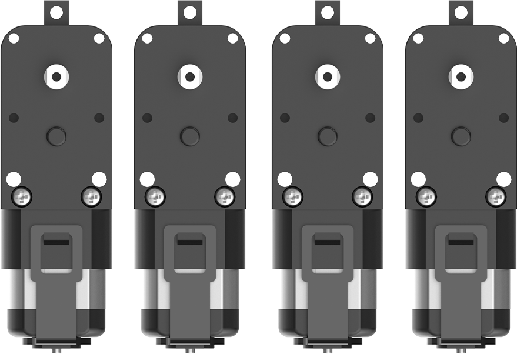  |
|    5    |                         Type-C cable                         |      1       |  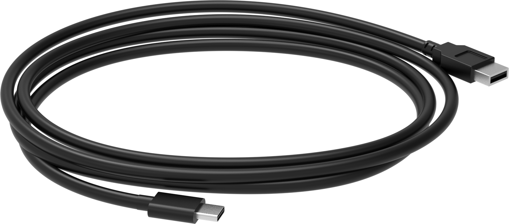  |
|    6    |                            UNO R3                            |      1       |  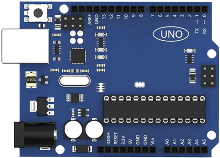  |
|    7    |                    UNO R3 Expansion Board                    |      1       |  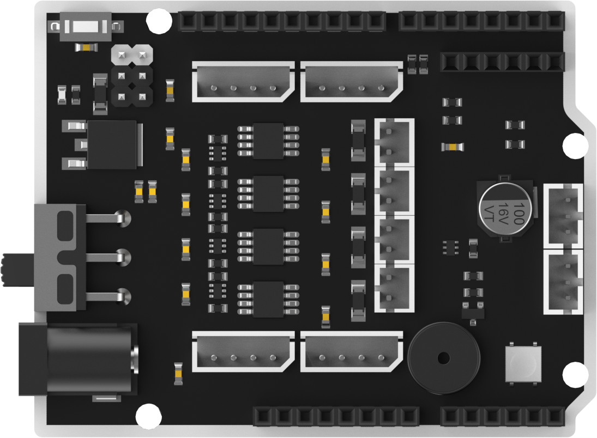  |
|    8    |                         Type-B cable                         |      1       |  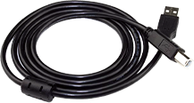  |
|    9    |                       Bluetooth module                       |      1       |  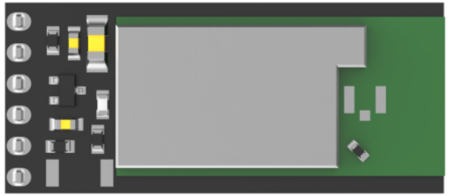  |
|   10    |                           Charger                            |      4       | 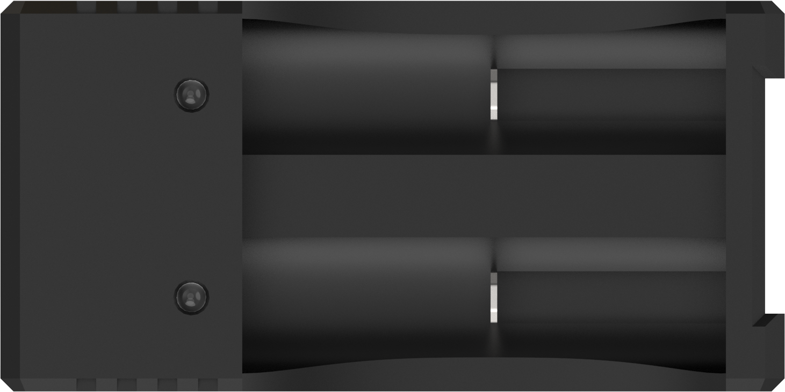  |
|   11    |                      18650 LiPo battery                      |      2       | 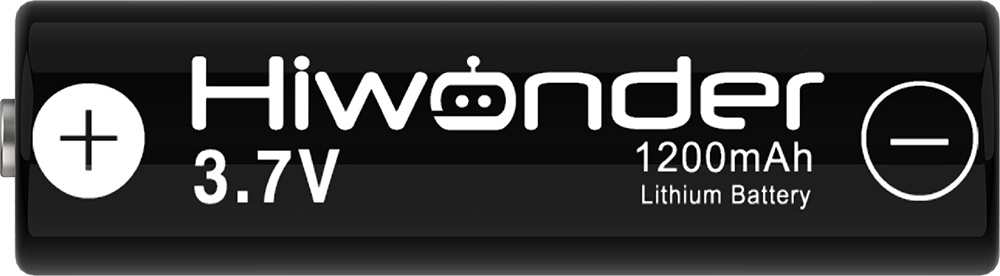  |
|   12    |                          USB cable                           |      1       | 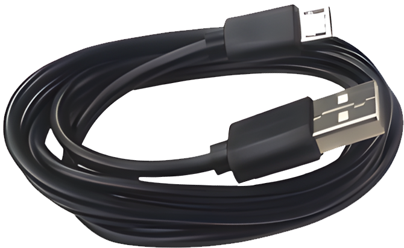  |
|   13    |                        Battery Holder                        |      1       | 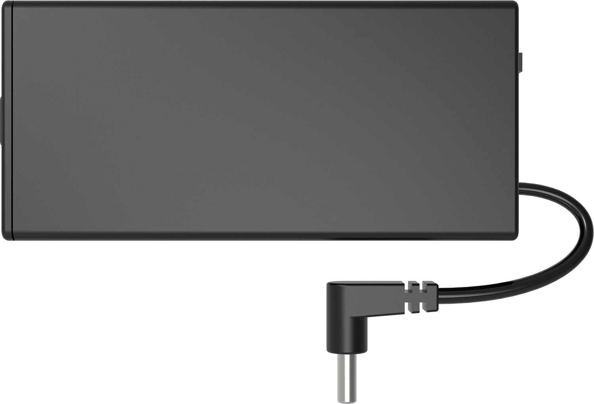  |
|   14    |                   Glowy ultrasonic sensor                    |      1       | 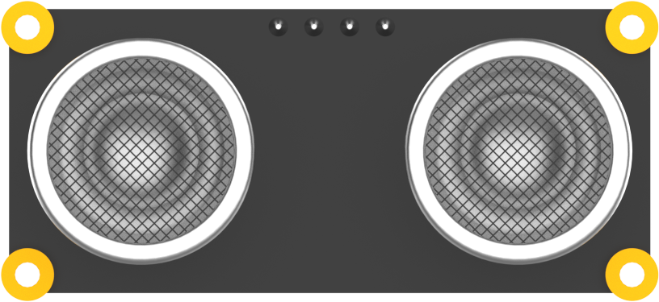  |
|   15    |                   4-Channel line follower                    |      1       | 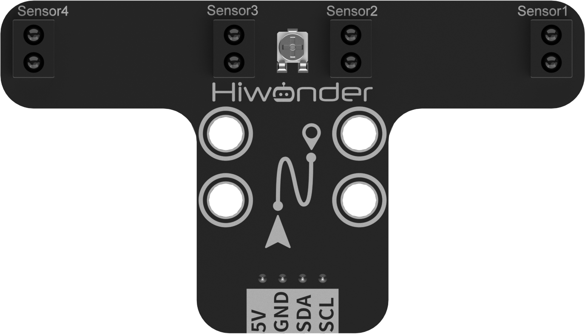  |
|   16    |                         screwdriver                          |      1       |   |
|   17    | Accessory bag (M3*4 flat head screw * 10 M3*25 flat head screw * 10 M3*6 black round head screw * 25 M2*6 black round head screw * 10 M4*8 black round head screw * 6 M3 nut * 20 M3*8 Double-pass Copper Column * 5 M4*30 Double-pass Copper Column * 5 M3*6+6 Single-pass nylon column * 3 100mm 4Pin wire * 2 200mm 4Pin wire * 2) |      1       | 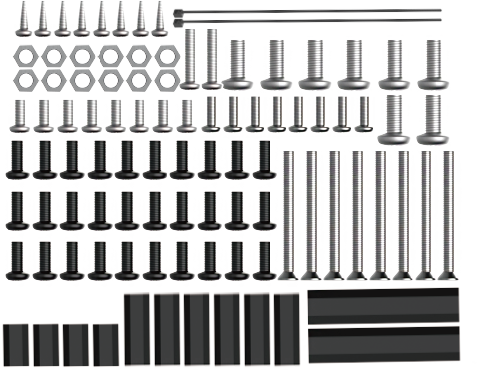 |

(2) MiniAuto Advanced kit Packing List

| **No.** |                        **Components**                        | **Quantity** |                                                                                                                                               **Picture**                                                                                                                                               |
|:-------:|:------------------------------------------------------------:|:------------:|:-------------------------------------------------------------------------------------------------------------------------------------------------------------------------------------------------------------------------------------------------------------------------------------------------------:|
|    1    | Chassis bracket (chassis * 1 Top cover * 1 Back cover * 1 Front cover *1 ) |      4       |                                                                                                                                                                                                                          |
|    2    | ESSP32-S3 Vision module (ESSP32-S3 Vision module * 1 camera mounting bracket * 2) |      3       |  |
|    3    | Mecanum wheels (wheel A * 2 wheel B * 2 coupling * 4 Pan head screw * 4) |      4       |                                                                                                                                                                                                                           |
|    4    |                            Motor                             |      4       |                                                                                                                                                                                                                           |
|    5    |                         Type-C cable                         |      1       |                                                                                                                                                                                                                           |
|    6    |                            UNO R3                            |      1       |                                                                                                                                                                                                                           |
|    7    |                    UNO R3 Expansion Board                    |      1       |                                                                                                                                                                                                                           |
|    8    |                         Type-B cable                         |      1       |                                                                                                                                                                                                                           |
|    9    |                       Bluetooth module                       |      1       |                                                                                                                                                                                                                           |
|   10    |                           Charger                            |      4       |                                                                                                                                                                                                                          |
|   11    |                      18650 LiPo battery                      |      2       |                                                                                                                                                                                                                          |
|   12    |                          USB cable                           |      1       |                                                                                                                                                                                                                          |
|   13    |                        Battery Holder                        |      1       |                                                                                                                                                                                                                          |
|   14    |                   Glowy ultrasonic sensor                    |      1       |                                                                                                                                                                                                                          |
|   15    |                   4-Channel line follower                    |      1       |                                                                                                                                                                                                                          |
|   16    |                         screwdriver                          |      1       |                                                                                                                                                                                                                          |
|   17    | Accessory bag(M3*4 flat head screw * 10 M3*25 flat head screw * 10 M3*6 black round head screw * 25 M2*6 black round head screw * 10 M4*8 black round head screw * 10 M3 nut * 20 M3*8 Double-pass Copper Column * 5 M4*30 Double-pass Copper Column * 5 M3*6+6 Single-pass nylon column * 3 100mm 4Pin wire * 2 200mm 4Pin wire * 2) |      1       |                                                                                                            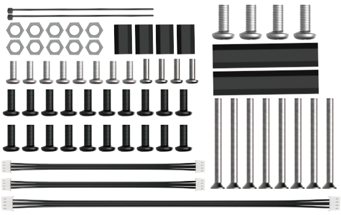                                                                                                            |
|   18    |                Gripper bracket (Assembled)                |      1       |                                                                                                             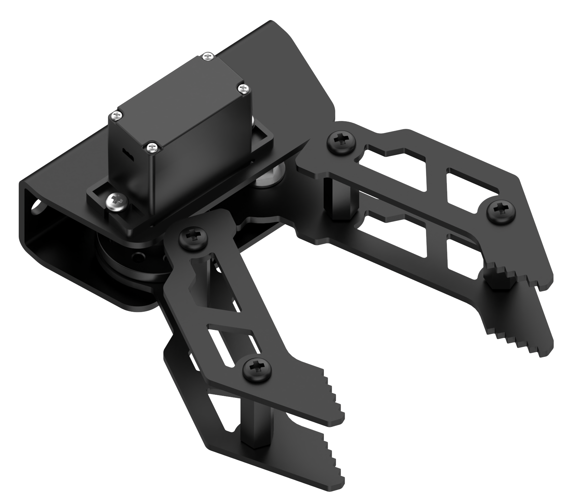                                                                                                             |

## 1.3 Assembly Instruction

## 1.4 Charging Instruction

**1.4.1 Battery Charging Instructions**

For safety reasons, lithium batteries may not be fully charged during transportation. Please charge the battery for approximately **1 hour** before first use.

Charging Steps:

(1) Insert the two 18650 batteries into the charger as shown in the figure below. The charging indicator will turn **red** while charging and **green** once charging is complete.  

:::{Note}

Do **not** reverse the positive and negative terminals of the batteries. If a charger is required, please use one that supports **5V, 1–2A** output.

:::

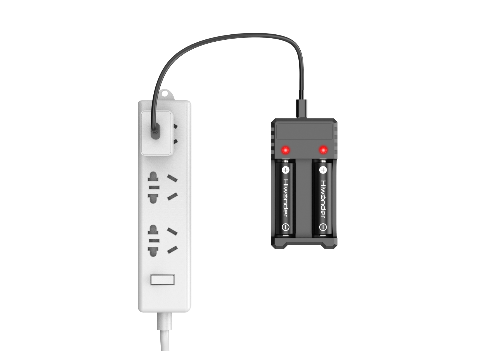

(2) Turn ON the battery holder case after placing the batteries.

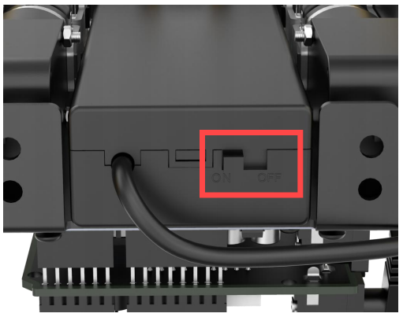

**1.4.2 Battery Safety Guide**

(1) Please use the charger provided in the kit to charge the battery.

(2) While charging, the adapter indicator will display **red**. It will turn **green** once the battery is fully charged. Be sure to disconnect the power promptly after charging is complete to avoid overcharging.

(3) If the robot will not be used for an extended period, fully charge the battery, switch off the battery case, and store it in a cool, dry place.

(4) Do not modify, weld, or tamper with the battery or charger in any way.

(5) Keep the battery away from high temperatures and liquids to prevent overheating, fire hazards, or performance degradation.

:::{Note}

Hiwonder shall not be held responsible for any product damage, economic loss, or safety incidents resulting from failure to follow the safety guidelines outlined in this manual.

:::
