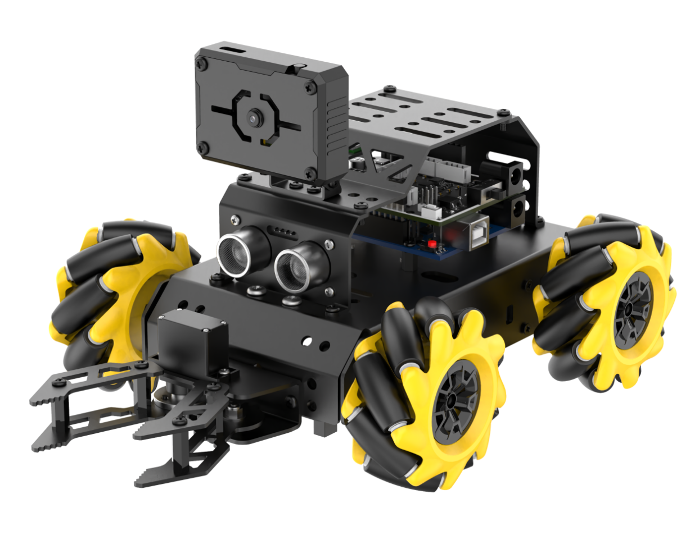

# 学前先看

## 1. 认识miniAuto

### 1.1 产品简介

miniAuto是幻尔面向嵌入式开发者推出的入门级AI视觉小车，它基于Atmega328微控制器开发，完全兼容Arduino编程平台。

miniAuto集成了AI视觉处理模块、发光超声波测距模块、四通道巡线传感器、多功能扩展板蓝牙通讯模块、防堵转机械爪等高性能硬件，并预设了多个拓展接口，支持多种传感器接入，方便用户进行二次开发与拓展。

### 1.2 发货清单

- #### 标准版清单

|     |     |   |   |
| :-------------------------------------------------------: | :-------------------------------------------------------: | :-----------------------------------------------------: | :-----------------------------------------------------: |
|                         **底盘**                          |                         **上盖**                          |                        **后盖**                         |                        **前盖**                         |
|     |     |   |  |
|                     **摄像头U型支架**                     |                      **摄像头支架**                       |         **麦克纳姆轮+联轴器+M2.3\*25盘头螺丝**          |                       **电机\*4**                       |
|    |    |  |  |
|                        **电池盒**                         |                   **ESP32-S3视觉模块**                    |                    **4路巡线传感器**                    |                   **发光超声波模块**                    |
|    |  |  |  |
|                       **蓝牙模块**                        |                     **数据线 Type-B**                     |                   **Arduino UNO主板**                   |                    **Arduino扩展板**                    |
|  |    |  |  |
|                      **数据线 USB**                       |                     **数据线 Type-C**                     |                        *充电器**                        |                       **电池\*2**                       |
|    |    |                                                         |                                                         |
|                        **螺丝刀**                         |                   **螺丝与线材配件包**                    |                                                         |                                                         |

- #### 豪华版清单

**豪华版清单=标准版+豪华版扩展包**

|  |  |  |  |
| :-----------------------------------------------------: | :-----------------------------------------------------: | :-----------------------------------------------------: | :-----------------------------------------------------: |
|                   **机械爪主动支架**                    |                  **机械爪夹层支架\*2**                  |                   **机械爪从动支架**                    |                      **爪子底座**                       |
|  |  |  |  |
|                   **PWM舵机/LFD-01**                    |                       **主舵盘**                        |                     **爪子固定件**                      |                        **轴承**                         |
|  |  |                                                         |                                                         |
|                        **扳手**                         |                     **螺丝配件包**                      |                                                         |                                                         |

## 2. 组装教程

### Step1

### Step2

### Step3

### Step4

### Step5

### Step6

### Step7

### Step8

### Step9

### Step10

### Step11

### Step12

### Step13

### 完成效果

## 3. 充电及注意事项

**开机之前请先按照“[2. 组装教程](#bookmark1)”内容组装好机器人。**

### 3.1 电池充电及安装

锂电池由于运输中不能充满，初次使用，请先给电池充电，充电时间为1小时左右。

充电步骤如下：

1)  将两节18650的电池如下图所示插入充电器充电。指示灯由红色变为绿色代表充电完成。

    注意！电池正负极切勿装反！如需使用充电头则需注意用5V 1-2A。

    

2)  安装电池后请将电池盒开关拨到“**ON**”即可。

    

### 3.2 电池使用注意事项

1)  请使用套件附带的充电器给电池充电。

2)  电池充电时适配器指示灯亮红色，充满电后指示灯亮绿色；充满后请及时断开电源，避免电池过度充电。

3)  若预计长时间不使用机器人，请将电池充满电，将电池盒上的开关拨到“**OFF**”挡，存放在阴凉干燥的的地方。

4)  严禁私自改装、焊接、修改电池充电器或锂电池。

5)  电池储存远离高温和各类液体，防止过热、起火或受潮导致功能衰退、减小。

:::{warning}

因未按本册规范使用而造成产品损坏、经济损失及安全事故等后果，我司不承担任何相关责任。

:::

### 3.3 设备使用注意事项

1)  请使用miniAuto配套的APP Wonderbot进行连接，请勿在手机设置里通过密钥的形式进行配对。

2)  下载程序时，需先将蓝牙模块拔掉，否则会占用UART串口，导致程序下载失败，若拔下后仍无法烧录，请联系我司技术支持解决问题。

3)  请勿使用超声波持续探测距离过近的物体。

4)  若电池电量过低，可能驱动不了机器人，请保持电量在**7V**以上。

5)  若巡线效果不佳，可通过调节巡线传感器的灵敏度，在“**4. 拓展学习资料**”中查看教程。

6)  若小车无法平移，请查看“**组装接线教程**”，确认麦轮以及接线是否正确。

7)  若购买了豪华版的用户，还需注意以下：

- 开机后不要强行掰动舵机，避免舵机产生损伤。

- 请勿将舵机长时间处于极限位置，避免舵机堵转。

- 手指请勿靠近爪子的关节部分，避免夹伤。

- 舵机属于精密器件，也是易耗品，长时间或过度使用需要更换。
