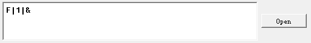

# 10.Serial Communication Instruction

## 10.1 Master-Slave Device Communication Principles

### 10.1.1 Introduction

This section aims to introduce to you the detailed information about the master-slave relationship between the miniAuto and different devices (such as STM32, 51 microcontroller, Arduino, Raspberry Pi) during communication. It helps you understand how miniAuto communicates as a subordinate device with other devices and how other devices control miniAuto as a master device.

In this chapter, miniAuto is typically utilized as a subordinate device. It uses the UART serial port to transmit the information to other devices.

### 10.1.2 Master-Slave Relationship

In a master-slave control system, miniAuto acts as a subordinate device and other devices such as microcontrollers act as master devices.

(1) miniAuto Functions

① Receive and parse signals sent by the master device:

The miniAuto waits for serial port signals, and upon receiving data, it will parse the received data according to the communication protocol to obtain the data information. Then it uses the obtained information to call corresponding functions.

② Call miniAuto’s functions based on received data:

When a signal is parsed, the corresponding function of miniAuto needs to be called, such as controlling the servo movement, reading the servo angle, controlling the buzzer, and controlling the RGB lights.

③ Data encapsulation and feedback:

When a read command is received, miniAuto needs to call the corresponding read function. Encapsulate the read data into a data packet according to the communication protocol, and send it back to the master device.

### 10.1.3 Other Master Devices

**Command packing and sending:**

The master device needs to package control commands and data into data packets according to the communication protocol to sends them to miniAuto.

**Control coordination:**

The master is responsible for coordinating the entire system, ensuring there are no conflicts in communication and operation between miniAuto and other devices to maintain a stable working state.

**Data reception:**

The master sends a read command to read the servo status information data sent by miniAuto. It verifies the integrity and accuracy of the received data and parses the data packet for extracting useful information.

* **Hardware Connection**

Take miniAuto connected to a PC as an example:

(1) Use DuPont wires to respectively connect the RXD, TXD, and GND of the USB adapter to the IO12, IO10, and GND interfaces on the Arduino UNO.

(2) Connect the USB adaptor to the PC.

(3) Data Transmission Format

The default UART serial data transmission format of miniAuto is as follows:

| Baud rate | 9600 |
| :-------- | :--: |
| Data bits |  8   |
| Parity    | None |
| Stop bits |  1   |

(4) Communication Protocol

The command format sent from the host to miniAuto is as follows: it starts with a function code, followed by a "\|", and ends with a "&" symbol.

##  10.2 PC Serial Port Controlling Routine

[miniAuto Slave Program]()

[Serial Port Utility]()

This article demonstrates how to achieve joystick control, color adjustment of RGB LED, speed adjustment, ultrasonic sensor and battery level check, servo control, and obstacle avoidance control of the miniAuto using the PC serial.

### 10.2.1 Working Principle

(1) By connecting miniAuto to TTL serial and interfacing it with a PC, serial communication is established to control miniAuto through the serial port. The default UART serial data transmission format of miniAuto is as follows:

| Baud rate | 9600 |
| :-------: | :--: |
| Data bits |  8   |
|  Parity   | None |
| Stop bits |  1   |

(2) Communication protocol

The command format sent from the host to miniAuto is as follows: it starts with a function code, followed by a "\|", and ends with a "&" symbol.

### 10.2.2 Getting Ready

* **Software Preparation**

(1) Locate and open the Serial Port Utility in the same directory as this lesson.

(2) Make sure the baud rate is set to 9600, parity to NONE, data bits to 8 and the stop bits to 1 in the debugging assistant. Then check the “ASCII” to send. The configuration is shown below:

### 10.2.3 Function Implementation

Send protocol commands to control miniAuto.

* **Command name: Slider control**

(1) Function code: A

(2) Sub-function code:

| Code | Name                                  | Command data |
| ---- | ------------------------------------- | ------------ |
| 0    | Move to the left                      | None         |
| 1    | Move forward to the left diagonally   | None         |
| 2    | Forward                               | None         |
| 3    | Move forward to the right diagonally  | None         |
| 4    | Move to the right                     | None         |
| 5    | Move backward to the right diagonally | None         |
| 6    | Backward                              | None         |
| 7    | Move backward to the left diagonally  | None         |
| 8    | Stop                                  | None         |
| 9    | Turn left in place                    | None         |
| 10   | Turn right in place                   | None         |

(3) Command data: Input the corresponding command data according to the selected sub-function. If no command data is required, leave it blank.

(4) For example: Send the command data **"A\|2\|&"** to activate miniAuto's forward movement.

* **Command name: Adjust RGB color**

(1) Function code: B

(2) Parameter data:

| Parameter | Meaning                          | Range |
| --------- | -------------------------------- | ----- |
| r         | RGB light: red light intensity   | 0-255 |
| g         | RGB light: green light intensity | 0-255 |
| b         | RGB light: blue light intensity  | 0-255 |

(3) Instruction: All three parameters of this command need to be entered when issuing this command. The input order is: r-g-b.  

(4) Command data: Please ensure that each parameter value is within the valid range, and the input data is an integer.

(5) For example: Send the command data **"B\|255\|0\|0\|&"** to make the RGB light turn red.

* **Command name: Adjust speed**

(1) Function code: C

(2) Parameter data:

| Parameter | Meaning                 | Range  |
| --------- | ----------------------- | ------ |
| x         | Straight movement speed | 10-100 |

(3) Instruction: 1.This command controls miniAuto's movement.  

After this command is executed, the car will not immediately start moving at this speed. The speed set will be written into the car's internal memory. It will move at this speed the next time it starts moving.

(4) Command data: Please make sure that each parameter value is within the valid range, and the input data is an integer.

(5) For example: The command data **"C\|50\|&"** is used to make miniAuto go straightly at the speed of 50.

After sending the command, miniAuto will send it back as a response.

* **Command name: Check data of ultrasonic sensor and battery level.**

(1) Function code: D

(2) Parameter: No parameter

(3) For example: Send the command data **"D\|&"** to obtain the distance detected by miniAuto's ultrasonic sensor and the remaining battery level.

(4) After the data is sent, miniAuto will return the requested data. The format of the returned data is "\$x,y\$". “x” is the distance data to be obtained in the unit of mm. “y” is the battery level to be obtained in the unit of mV.

* **Command name: Servo control**

(1) Function code: E

(2) Parameter:

| Parameter | Meaning                            | Range |
| --------- | ---------------------------------- | ----- |
| x         | Rotation angle of miniAuto’s servo | 0-60  |

(3) Instruction: 1.This command controls the servo rotation and drive the robotic gripper to open and close.  

To prevent the servo from colliding with the robot body when driving the gripper, affecting the demonstration effect, the input of the servo rotation angle has been optimized. The best servo motion parameter is between 0 and 60.

(4) Command data: The smaller the servo rotation angle, the more the gripper will close, and vice versa.

(5) For example: The command data **"E\|30\|&"** is used to rotate the servo by 30 degrees.

* **Command name: Obstacle avoidance control**

(1) Function code: F

(2) Instruction:1.This command enables or disables miniAuto's obstacle avoidance.  

(3) After starting the obstacle avoidance function, miniAuto will go straight by default. The movement speed is not controlled by the speed adjustment command.

(4) Parameter:

<table  class="docutils-nobg" style="margin:0 auto" border="1">
<colgroup>
<col  />
<col  />
<col  />
</colgroup>
<tbody>
<tr>
<td>Parameter</td>
<td>Meaning</td>
<td> Range</td>
</tr>
<tr>
<td>x</td>
<td>Obstacle avoidance function switch flag</td>
<td>
0：Turn off obstacle avoidance

1：Turn on obstacle avoidance
</td>
</tr>
</tbody>
</table>
(5) For example: Send the command data **"F\|1\|&"** to turn on the obstacle avoidance function of the miniAuto.

