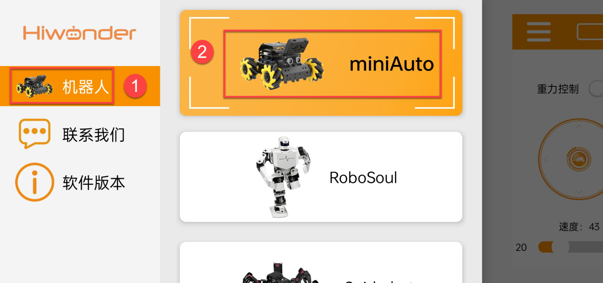
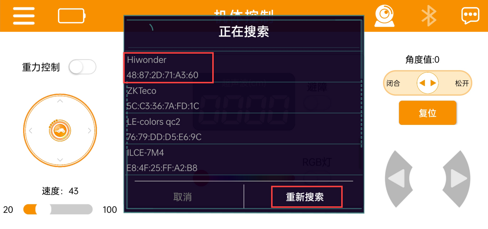
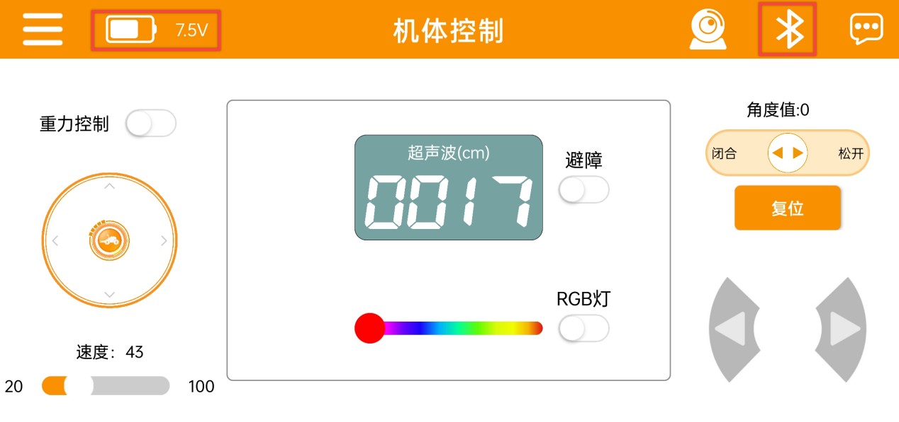
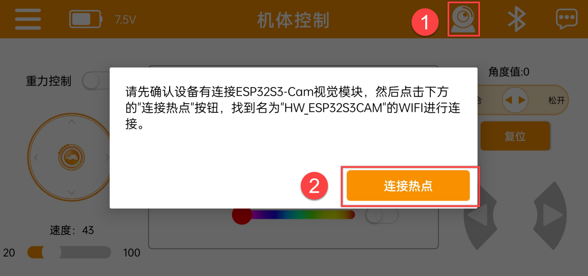
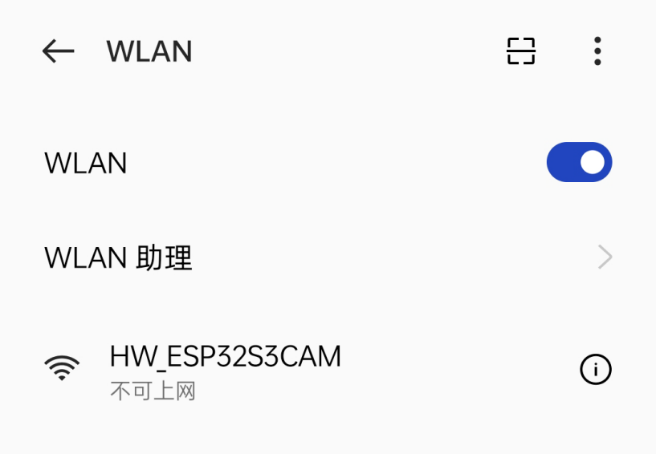
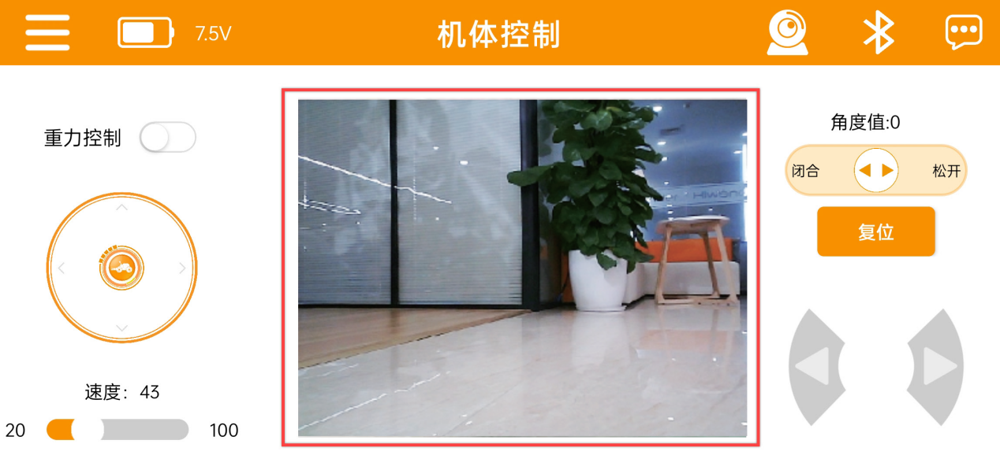
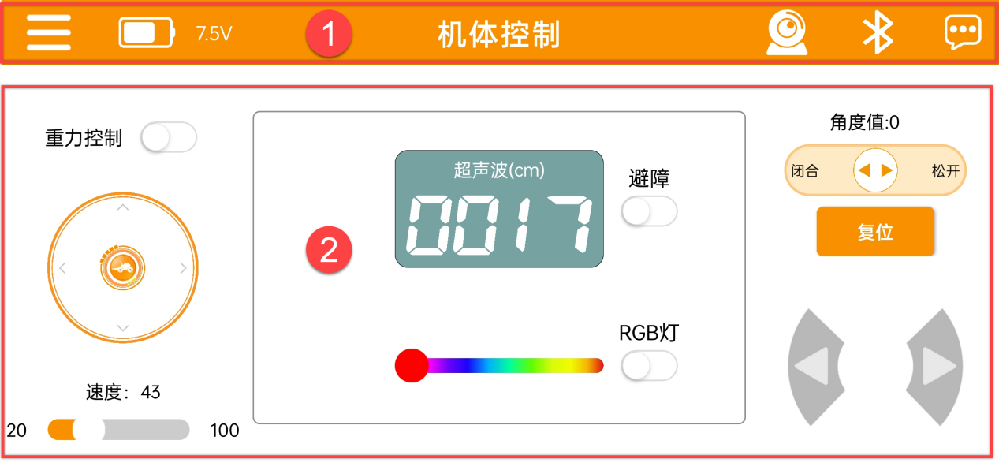
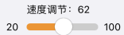
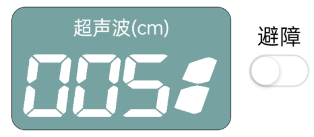
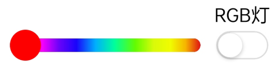

# 手机APP控制

## 2.1 手机APP遥控

### 1. 手机APP安装

[安卓系统](https://play.google.com/store/apps/details?id=com.Wonder.bot)

[iOS系统](https://apps.apple.com/cn/app/wonderbot-lobot/id1519146341)

### 2. 手机APP连接

:::{Note}

APP使用前，请先在手机设置中开启蓝牙与定位服务。

请通过APP内的蓝牙按钮与设备进行配对连接，请勿在手机设置里通过密钥的形式进行配对。

:::

1)  将小车开机，打开手机APP“**Wonderbot**”，点击左上角的图标选择机器人类型，在此处选择“**miniAuto**”。

2)  选择后，进入玩法界面，点击右上角闪烁的图标，并在蓝牙列表中找到“**Hiwonder**”，然后点击连接。

:::{Note}

若未看到“Hiwonder”的名称，请点击“重新搜索”来查找设备。

:::

3)  连接成功后，右上角蓝牙图标将保持长亮，同时左侧将显示电池电量。

4)  点击右上角的图标可查看实时图像回传。首先点击“**连接热点**”。

5)  在手机Wi-Fi设置中找到“**HW_ESP32S3CAM**”，点击连接。

6)  返回APP界面，进入图传模式，即可查看当前的实时图传画面。

### 3.功能介绍

通过按钮可控制miniAuto的运动。该界面分为了两部分，如下所示：

1.  菜单栏
<table class="docutils-nobg" border="1" style="text-align:center">
    <thead><tr><th>图标</th><th>功能描述</th></tr></thead>
    <tbody>
        <tr><td></td><td>返回主界面选择机器人类型</td></tr>
        <tr><td></td><td>实时显示当前的电池电量</td></tr>
        <tr><td></td><td>打开图像回传功能</td></tr>
        <tr><td></td><td>蓝牙连接</td></tr>
        <tr><td></td><td>更多信息</td></tr>
</tbody>
</table>

2.  控制区

<table class="docutils-nobg" border="1" style="text-align:center">
    <thead><tr><th>图标</th><th>功能描述</th></tr></thead>
    <tbody>
        <tr><td></td><td>开启/关闭重力控制模式</td></tr>
        <tr><td></td><td>拖动摇杆可控制小车朝各个方向平移</td></tr>
        <tr><td></td><td>调节小车的移动速度</td></tr>
        <tr><td></td><td>显示超声波探测距离,点击避障按钮，开启超声波避障</td></tr>
        <tr><td></td><td>调节超声波RGB彩灯颜色</td></tr>
        <tr><td></td><td>（豪华版功能）控制机械爪开合</td></tr>
        <tr><td></td><td>（豪华版功能）控制机械爪回归初始姿态</td></tr>
        <tr><td></td><td>控制小车左右转</td></tr>
</tbody>
</table>
