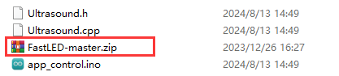
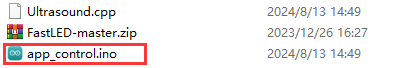
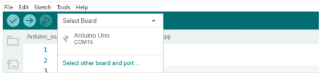

# 3. Default Program Download Instruction

The firmware, which includes basic game functions such as **knob control** and **app control**, is **not pre-installed by default**.

## 3.1 Getting Ready 

Follow the steps in [**2.Set Arduino Environment/2.2 Arduino IDE Instruction**](https://docs.hiwonder.com/projects/miniAuto/en/latest/docs/2.Set_Arduino_Environment.html#arduino-ide-instruction) to import the .zip library file located in [**Default Program/app_control**](../_static/source_code/app_control.zip) into the Arduino IDE.

If the [**FastLED-master.zip**](../_static/source_code/app_control.zip) library has already been imported previously, you may skip this step.

## 3.2 Program Download 

[Default Program](../_static/source_code/app_control.zip)

:::{Note}

- Please **remove the Bluetooth module** before downloading the program. Failure to do so may result in a download error due to a **serial port conflict**.

- When connecting the Type-B download cable, **switch the battery box to 'OFF'**. This helps prevent the cable from accidentally contacting the power pins on the expansion board, which could cause a **short circuit**.

:::

(1) Open the **"app_control.ino"** file located in the **"app_control"** folder within the same directory as this section.

(2) Connect the Arduino board to your computer using the **UNO data cable (Type-B)**.

(3) Click **"Select Board"** in the Arduino IDE. The software will automatically detect the connected Arduino's serial port. Then, click **Connect**.

(4) Click  to download the program to the Arduino board. Wait for the process to complete.

## 3.3 Program Outcome 

Please go to [4. App Control](https://docs.hiwonder.com/projects/miniAuto/en/latest/docs/4.App_control.html) to view the program results.