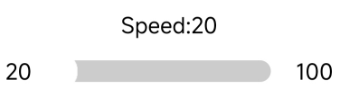
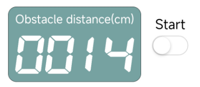
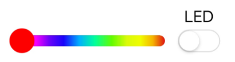
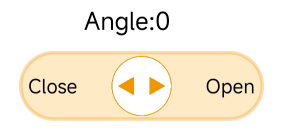
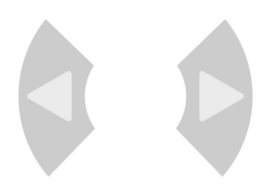
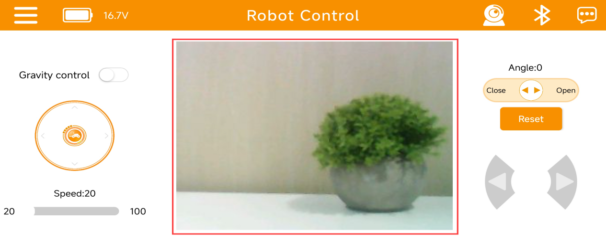

# 4. App Control

## 4.1 App Installation

**iOS users:** Search for [Wonderbot]() in the App Store to download the app.  

**Android users:** [Wonderbot]()

## 4.2 App Connection

:::{Note}

* Make sure to enable both Bluetooth and GPS in your phone’s settings before using the app.

* Use the Bluetooth button within the app to pair and connect to the device. Do not use the phone’s system Bluetooth settings to pair.

:::

(1) Turn on the **miniAuto** and launch the **Wonderbot** app. Tap  to select **miniAuto** under the “Robot” section.

(2) Next, tap the **flashing Bluetooth icon**  on the main screen. In the Bluetooth device list, find **"Hiwonder"** and tap to connect.

:::{Note}

If **"Hiwonder"** does not appear, tap **"Search Again"** to refresh the list.

:::

(3) Once connected, the **Bluetooth icon**  in the top right corner will remain solid. The **battery level** will also appear on the left side of the screen.

## 4.3 Function Introduction

### 4.3.1 Robot Control

The **miniAuto** can be controlled using the on-screen buttons within the app. The app interface is divided into two main sections: the **menu bar** and the **control area**.

(1) Menu Bar

|                           **Icon**                           |                   **Function Description**                   |
| :----------------------------------------------------------: | :----------------------------------------------------------: |
| |      Return to the main screen to select the robot type      |
| |    Display miniAuto’s current battery level in real time     |
| | Image transmission function: view the live feed from the ESP32 camera |
| |                     Bluetooth connection                     |
| |                       More information                       |

(2) Control Area

<table  class="docutils-nobg" style="margin:0 auto" border="1">
<colgroup>
<col  />
<col  />
</colgroup>
<tbody>
<tr>
<td ><strong>Icon</strong></td>
<td ><strong>Function Description</strong></td>
</tr>
<tr>
<td ><</td>
<td >Turn on/off the gravity control mode</td>
</tr>
<tr>
<td ><</td>
<td >Manage miniAuto’s movement</td>
</tr>
<tr>
<td ><</td>
<td >Adjust miniAuto’s motion speed</td>
</tr>
<tr>
<td ><</td>
<td >
Display ultrasonic distance in obstacle avoidance mode.

Turn on/off the ultrasonic obstacle avoidance function
</td>
</tr>
<tr>
<td ><</td>
<td >Adjust the color of the ultrasonic RGB light</td>
</tr>
<tr>
<td ><</td>
<td >Advanced kit: Control the opening and closing of the robotic gripper for</td>
</tr>
<tr>
<td ><</td>
<td >Advanced kit: Return the robotic gripper to the neutral position</td>
</tr>
<tr>
<td ><</td>
<td >Control miniAuto to turn left and right</td>
</tr>
</tbody>
</table>

### 4.3.2 Live Camera Feed

(1) Tap  in the upper right corner to open the live camera view, then select **“Connect Hotspot”**.

(2) Go to your phone’s **Wi-Fi settings**, find **“HW_ESP32S3CAM”**, and connect to it.

(3) Return to the app to enter **image transmission mode**, where you can view the **live camera feed**.

