# 5. Motion Control Basic Lesson

## 5.1 Motion Library Analysis

This section covers the programming implementation of motion control for a mecanum wheel robot car, including motor initialization, speed control, turning, translation, and other essential functions. You will also learn about the relevant library files used in the process.

### 5.1.1 Program Outcome

The **miniAuto** moves straight, then sequentially moves left, backward, and right. Before coming to a stop, it performs a turn in place, followed by a drift.

### 5.1.2 Brief Analysis of Library Function

[motor_test.ino](../_static/source_code/motor_test.zip)

* **Motor Initialization Function "Motor_Init()"**

This function initializes the motor pins by setting the I/O mode to **output** using the **pinMode** function within a for loop. The **Velocity_Controller** function is then called to bring the robot to a stationary state.

{lineno-start=47}

```
 /* 电机初始化函数(Motor initialization function) */
void Motor_Init(void){
  for(uint8_t i = 0; i < 4; i++){
    pinMode(motordirectionPin[i], OUTPUT);
  }
  Velocity_Controller( 0, 0, 0, 0);
}
```

* **Motor Setting Function "Motor_Init()"**

This function adjusts the speed and direction of each wheel based on the parameter values passed in. Within the for loop, the robot's turning is modified according to the calculated results. The **map** function is used to scale the calculated value from the range **0–100** to **50–255**. The **digitalWrite** and **analogWrite** functions are then used to set the motor's direction and speed, respectively.

{lineno-start=87}

```
/**
 * @brief PWM与轮子转向设置函数(PWM and wheel turning setting function)
 * @param Motor_x   作为PWM与电机转向的控制数值。根据麦克纳姆轮的运动学分析求得。("Motor_x" is the control value for PWM and motor rotating. Calculated based on the kinematics analysis of mecanum wheels)
 * @retval None
 */
void Motors_Set(int8_t Motor_0, int8_t Motor_1, int8_t Motor_2, int8_t Motor_3) {
  int8_t pwm_set[4];
  int8_t motors[4] = { Motor_0, Motor_1, Motor_2, Motor_3};
  bool direction[4] = { 1, 0, 0, 1};///< 前进 左1 右0(Forward, left 1, right 0)
  for(uint8_t i; i < 4; ++i) {
    if(motors[i] < 0) direction[i] = !direction[i];
    else direction[i] = direction[i];

    if(motors[i] == 0) pwm_set[i] = 0;
    else pwm_set[i] = map(abs(motors[i]), 0, 100, pwm_min, 255);

    digitalWrite(motordirectionPin[i], direction[i]); 
    analogWrite(motorpwmPin[i], pwm_set[i]); 
  }
}
```

* **Motor Speed Control Function "Velocity_Controller()"**

This function accepts four parameters: **direction**, **speed**, **self-rotation speed**, and a flag to enable **drift**. It calculates the speed for each motor and then calls the **Motors_Set** function to adjust the PWM values and motor directions accordingly. The function uses trigonometric calculations to determine motor speeds based on the direction. Additionally, it accounts for the effects of self-rotation speed and drift, making it a complex motion control algorithm.

{lineno-start=65}

```
void Velocity_Controller(uint16_t angle, uint8_t velocity,int8_t rot,bool drift) {
  int8_t velocity_0, velocity_1, velocity_2, velocity_3;
  float speed = 1;
  angle += 90;
  float rad = angle * PI / 180;
  if (rot == 0) speed = 1;///< 速度因子(Speed factor)
  else speed = 0.5; 
  velocity /= sqrt(2);
  if (drift) {
    velocity_0 = (velocity * sin(rad) - velocity * cos(rad)) * speed;
    velocity_1 = (velocity * sin(rad) + velocity * cos(rad)) * speed;
    velocity_2 = (velocity * sin(rad) - velocity * cos(rad)) * speed - rot * speed * 2;
    velocity_3 = (velocity * sin(rad) + velocity * cos(rad)) * speed + rot * speed * 2;
  } else {
    velocity_0 = (velocity * sin(rad) - velocity * cos(rad)) * speed + rot * speed;
    velocity_1 = (velocity * sin(rad) + velocity * cos(rad)) * speed - rot * speed;
    velocity_2 = (velocity * sin(rad) - velocity * cos(rad)) * speed - rot * speed;
    velocity_3 = (velocity * sin(rad) + velocity * cos(rad)) * speed + rot * speed;
  }
  Motors_Set(velocity_0, velocity_1, velocity_2, velocity_3);
}
```

## 5.2 Move Forward & Turn

This section demonstrates how to control the robot car's forward movement and left/right turns by adjusting the rotation direction of motors **M1 to M4**.

### 5.2.1 Working Principle

According to the characteristics of mecanum wheels, the robot moves forward when all four wheels rotate forward. When the **left wheels rotate in reverse** and the **right wheels rotate forward**, the robot rotates **counterclockwise in place**. Conversely, when the **left wheels rotate forward** and the **right wheels rotate in reverse**, the robot rotates **clockwise in place**. This is illustrated in the following force analysis diagram:

<p class="common_img" style="width:100%;">
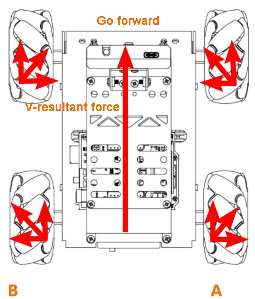
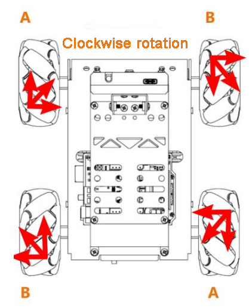
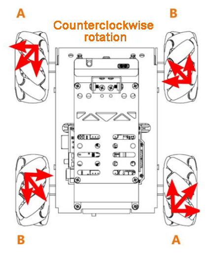
</p>

According to the principles of kinematics, when two forces are equal in magnitude and opposite in direction, they cancel each other out. Any force can be decomposed into two perpendicular vector components. If **wheels A and B** rotate at the same speed, the rightward force component from wheel A and the leftward force component from wheel B will cancel each other, resulting in a net velocity directed forward.

Based on **Newton's Second Law (F = ma)**, if the direction of acceleration is forward, then the resulting net force must also be in the forward direction.

### 5.2.2 Program Flowchart


<p id="anchor_5_2_3"></p>

### 5.2.3 Program Download

[forward_and_back.ino](../_static/source_code/forward_and_back.zip)

:::{Note}

Please remove the Bluetooth module before downloading the program, as a serial port conflict may prevent the download from completing successfully.

:::

(1) Locate and open the **"forward_and_back/forward_and_back.ino"** program file in the corresponding directory of this section.


(2) Connect the Arduino to your computer using the **Type-B cable**.

(3) Click **"Select Board"**, and the software will automatically detect the current Arduino serial port. Then, click to connect.

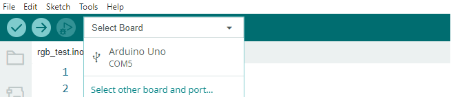

(4) Click  to download the program to the Arduino and wait for the process to complete.


### 5.2.4 Project Outcome

After the program is successfully downloaded, turn on the robot. It will move forward for 1 second, then turn left for 1 second, and finally turn right for 1 second.

### 5.2.5 Program Analysis

[forward_and_back.ino](../_static/source_code/forward_and_back.zip)

* **Define Pin and Create Object**

(1) Define the motorpwmPin array to store the PWM control pin numbers for the four motors, and the motordirectionPin array to store the direction control pin numbers.

{lineno-start=18}

```
#include <Arduino.h>

const static uint8_t pwm_min = 50;
const static uint8_t motorpwmPin[4] = { 10, 9, 6, 11};            ///< 控制轮子速度引脚(pins for controlling the motor speed)
const static uint8_t motordirectionPin[4] = { 12, 8, 7, 13};       ///< 控制轮子方向引脚(pins for controlling the motor direction)
```

(2) Declare three function prototypes:

`Motor_Init` for motor initialization

`Velocity_Controller` for speed control

`Motors_Set` for setting motor speeds

{lineno-start=24}

```
void Motor_Init(void);
void Velocity_Controller(uint16_t angle, uint8_t velocity,int8_t rot,bool drift);
void Motors_Set(int8_t Motor_0, int8_t Motor_1, int8_t Motor_2, int8_t Motor_3);
```

* **"setup()" Initialization and Motion Control**

(3) Initialize serial communication and set the data read timeout to **500 ms**. Then, call the `Motor_Init()` function to initialize the motors.

{lineno-start=28}

```
void setup() {
  Serial.begin(9600);
  // 设置串行端口读取数据的超时时间(Set the timeout for reading data from the serial port)
  Serial.setTimeout(500);
  Motor_Init(); 
```

(4) Call the `Velocity_Controller()` function to move the robot forward at a speed of **100** for **1 second**.

{lineno-start=33}

```
  Velocity_Controller(0,100,0,0);   ///< 直行(Move forward)
  delay(1000);
```

(5) Call the `Velocity_Controller()` function to rotate the robot left in place at a speed of **100** for **1 second**.

{lineno-start=35}

```
  Velocity_Controller(0, 0,100,0);  ///< 原地左转(Turn left in place)
  delay(1000);
```

(6) Call the `Velocity_Controller()` function to rotate the robot right in place at a speed of **-100** for **1 second**.

{lineno-start=37}

```
  Velocity_Controller(0, 0,-100,0); ///< 原地右转(Turn right in place)
  delay(1000); 
```

(7) Finally, call the `Velocity_Controller()` function to stop all motors.

{lineno-start=39}

```
  Velocity_Controller(0,0,0,0);     ///< 静止(Stop)   
}
```

* **"Motor_Init()"  Motor Initialization Function**

Set the motor direction pins to **output mode**, then call the Velocity_Controller() function to stop the motors.

{lineno-start=47}

```
void Motor_Init(void){
  for(uint8_t i = 0; i < 4; i++){
    pinMode(motordirectionPin[i], OUTPUT);
  }
  Velocity_Controller( 0, 0, 0, 0);
}
```

* **"Velocity_Controller()" Velocity Control Function**

(1) Initialize the speed values for the four motors as integers. Set the speed factor to **1**, and set the angle to **90°** to adjust the robot's heading. Then, convert the angle from degrees to radians.  

{lineno-start=64}

```
void Velocity_Controller(uint16_t angle, uint8_t velocity,int8_t rot,bool drift) {
  int8_t velocity_0, velocity_1, velocity_2, velocity_3;
  float speed = 1;
  angle += 90;
  float rad = angle * PI / 180;
```

(2) Check if rot equals 0. If so, set speed to **1**; otherwise, set it to **0.5**.

{lineno-start=69}

```
  if (rot == 0) speed = 1;///< 速度因子(Speed factor)
  else speed = 0.5; 
```

(3) Reduce the calculated speed values accordingly.

{lineno-start=71}

```
  velocity /= sqrt(2);
```

(4) Compute the speed for all four motors based on the drift value.

{lineno-start=72}

```
  if (drift) {
    velocity_0 = (velocity * sin(rad) - velocity * cos(rad)) * speed;
    velocity_1 = (velocity * sin(rad) + velocity * cos(rad)) * speed;
    velocity_2 = (velocity * sin(rad) - velocity * cos(rad)) * speed - rot * speed * 2;
    velocity_3 = (velocity * sin(rad) + velocity * cos(rad)) * speed + rot * speed * 2;
  } else {
    velocity_0 = (velocity * sin(rad) - velocity * cos(rad)) * speed + rot * speed;
    velocity_1 = (velocity * sin(rad) + velocity * cos(rad)) * speed - rot * speed;
    velocity_2 = (velocity * sin(rad) - velocity * cos(rad)) * speed - rot * speed;
    velocity_3 = (velocity * sin(rad) + velocity * cos(rad)) * speed + rot * speed;
  }
```

(5) Apply the calculated motor speeds using the Motors_Set function.

{lineno-start=83}

```
  Motors_Set(velocity_0, velocity_1, velocity_2, velocity_3);
}
```

* **"Motors_Set()" Motor Speed Setting Function**

(1) Define arrays to store the PWM values, motor speed values, and direction settings for each of the four motors.

{lineno-start=91}

```
void Motors_Set(int8_t Motor_0, int8_t Motor_1, int8_t Motor_2, int8_t Motor_3) {
  int8_t pwm_set[4];
  int8_t motors[4] = { Motor_0, Motor_1, Motor_2, Motor_3};
  bool direction[4] = { 1, 0, 0, 1};///< 前进 左1 右0(Forward, left 1, right 0)
```

(2) Loop through all four motors and determine each motor's direction based on its speed value.

{lineno-start=95}

```
  for(uint8_t i; i < 4; ++i) {
    if(motors[i] < 0) direction[i] = !direction[i];
    else direction[i] = direction[i];

    if(motors[i] == 0) pwm_set[i] = 0;
    else pwm_set[i] = map(abs(motors[i]), 0, 100, pwm_min, 255);

    digitalWrite(motordirectionPin[i], direction[i]); 
    analogWrite(motorpwmPin[i], pwm_set[i]); 
  }
}
```

### 5.2.6 Function Extension

The default movement speed is set to **100**. In this section, we'll modify the robot's speed to **50**. Follow the steps below:

(1) Change the speed and rotation speed parameters in the `Velocity_Controller()` function to **50**.

{lineno-start=28}

```
void setup() {
  Serial.begin(9600);
  // 设置串行端口读取数据的超时时间(Set the timeout for reading data from the serial port)
  Serial.setTimeout(500);
  Motor_Init();                     ///< 电机初始化(Initialize the motors)
  Velocity_Controller(0,50,0,0);   ///< 直行(Move forward)
  delay(1000);
  Velocity_Controller(0, 0,50,0);  ///< 原地左转(Turn left in place)
  delay(1000);
  Velocity_Controller(0, 0,-50,0); ///< 原地右转(Turn right in place)
  delay(1000); 
  Velocity_Controller(0,0,0,0);     ///< 静止(Stop)   
}
```

(2) After making the changes, refer to [5.2.3 Program Download](#anchor_5_2_3) to upload the modified program. Then, power on the robot to observe the new behavior.

:::{Note}

The adjustable range of speed for going straight and turning is "**-100~100**". When the going straight speed value is positive, the robot car will move forward; when the value is negative, it moves backward. When the turning speed value is positive, the car will rotate counterclockwise; When the value is negative, it will rotate clockwise.

:::

:::{Note}

- The adjustable speed range for both forward motion and turning is **-100 to 100**.

- A **positive value** for forward speed moves the robot **forward**, while a **negative value** moves it **backward**.

- A **positive value** for rotation speed causes the robot to rotate **counterclockwise**, and a **negative value** causes it to rotate **clockwise**.

:::

## 5.3 Movement

This section controls the rotational direction of the four motors (M1 to M4) to enable the robot car to move in different directions.

### 5.3.1 Working Principle

Based on the characteristics of Mecanum wheels, the following behaviors occur:

- When all four wheels rotate clockwise, the car will move forward.

- When all four wheels rotate counterclockwise, the car will move backward.

- When two A wheels rotate counterclockwise and two B wheels rotate clockwise, the car will move sideways to the left.

- When two B wheels rotate counterclockwise and two A wheels rotate clockwise, the car will move sideways to the right.

The force analysis for moving forward, backward, and sideways is illustrated in the figure below:

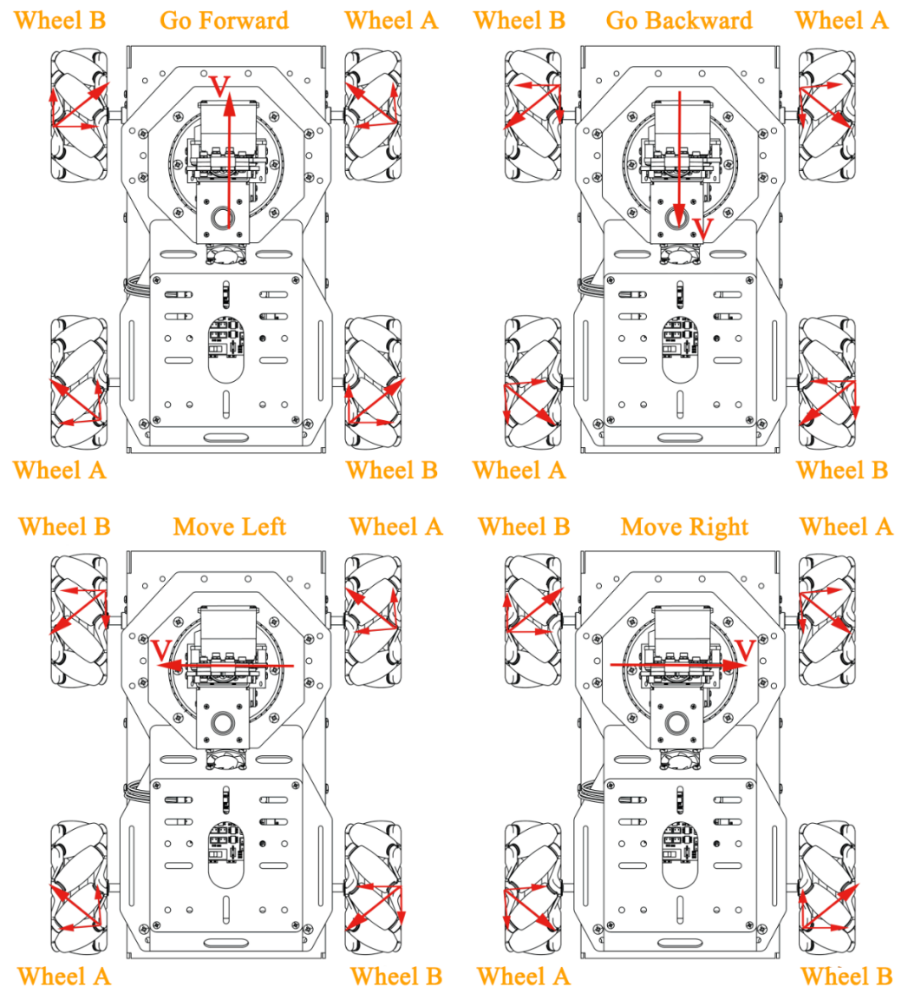

According to the principles of physical kinematics, when forces are equal in magnitude and opposite in direction, they cancel each other out. Any force can be decomposed into two perpendicular vectors. For example, if wheels A and B rotate at the same speed, the rightward force generated by wheel A and the leftward force from wheel B will counteract each other, resulting in forward motion.

Based on Newton's second law (F = ma), if the direction of acceleration is forward, the resultant force will also be directed forward.

### 5.3.2 Program Flowchart

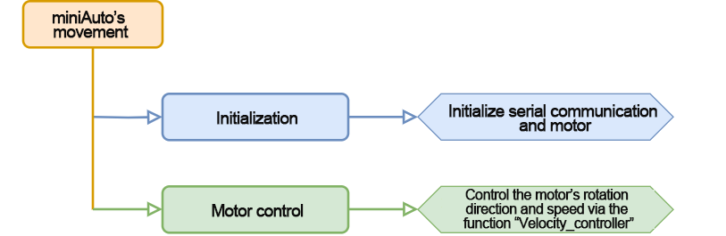

### 5.3.3 Program Download

[left_and_right.ino](../_static/source_code/left_and_right.zip)

:::{Note}

Remove the Bluetooth module before downloading the program. Or the program will fail to download because of the serial port conflict.

:::

(1) Locate and open **"left_and_right/left_and_right.ino"** program file in the same directory of this section.


(2) Connect Arduino to the computer with the Type-B cable .

(3) Click **"Select Board"**, and the software will automatically detect the current Arduino serial port. Next, click to connect.


(4) Click  to download the program into Arduino. Then just wait for it to complete.


### 5.3.4 Project Outcome

After the program is downloaded, miniAuto will execute a series of movements, including moving forward, backward, sideways to the left, and sideways to the right. Each movement will last for 1 second.

### 5.3.5 Program Analysis

[left_and_right.ino](../_static/source_code/left_and_right.zip)

* **Define Pin and Create Object**

(1) Define the motorpwmPin array to store the PWM control pin numbers for the four motors. Similarly, define the motordirectionPin array to store the direction control pin numbers for the four motors.

{lineno-start=18}

```
#include <Arduino.h>

const static uint8_t pwm_min = 50;
const static uint8_t motorpwmPin[4] = { 10, 9, 6, 11};            ///< 控制轮子速度引脚(pins for controlling the motor speed)
const static uint8_t motordirectionPin[4] = { 12, 8, 7, 13};       ///< 控制轮子方向引脚(pins for controlling the motor direction)
```

(2) Declare the following three function prototypes:

`Motor_Init`: for motor initialization

`Velocity_Controller`: for velocity control

`Motors_Set`: for setting motor speeds

{lineno-start=24}

```
void Motor_Init(void);
void Velocity_Controller(uint16_t angle, uint8_t velocity,int8_t rot,bool drift);
void Motors_Set(int8_t Motor_0, int8_t Motor_1, int8_t Motor_2, int8_t Motor_3);
```

* **"setup()" Initialization and Motion Control**

(1) Initialize serial communication. Set the timeout for serial communication data reading to 500ms. Call the `Motor_Init()` function to initialize the motors.

{lineno-start=28}

```
void setup() {
  Serial.begin(9600);
  // 设置串行端口读取数据的超时时间(Set the timeout for reading data from the serial port)
  Serial.setTimeout(500);
  Motor_Init();                     ///< 电机初始化(Initialize the motors)
```

(2) Call the `Velocity_Controller` function to set the motors to move forward at a speed of 100 for 1 second.

{lineno-start=33}

```
  Velocity_Controller(0,100,0,0);  ///< 前进(Move forward)
  delay(1000);
```

(3) Call the `Velocity_Controller` function to set the motors to move backward at a speed of 100 for 1 second.

{lineno-start=35}

```
  Velocity_Controller(180,100,0,0);  ///< 后退(Move backward)
  delay(1000);
```

(4) Call the `Velocity_Controller` function to set the motors to move sideways to the left in place at a rotation speed of 100 for 1 second.

{lineno-start=37}

```
  Velocity_Controller(90,100,0,0);  ///< 左移(Move to the left)
  delay(1000);
```

(5) Call the `Velocity_Controller` function to set the motors to move sideways to the right in place at a rotation speed of 100 for 1 second.

{lineno-start=39}

```
  Velocity_Controller(270,100,0,0); ///< 右移(Move to the right)
  delay(1000); 
```

(6) Call the `Velocity_Controller` function to stop the motors.

{lineno-start=41}

```
  Velocity_Controller(0,0,0,0);     ///< 静止(Stop)
}
```

* **"Motor_Init()" Motor Initialization Function**

Set the direction pins of the motors to output mode. Call the "**Velocity_Controller**" function to stop the motors.

{lineno-start=48}

```
void Motor_Init(void){
  for(uint8_t i = 0; i < 4; i++){
    pinMode(motordirectionPin[i], OUTPUT);
  }
  Velocity_Controller( 0, 0, 0, 0);
}
```

* **"Velocity_Controller()" Velocity Control Function**

(1) Initialize the speed values for the four motors as integers. Set the speed factor to 1. Then, set the "**angle**" to 90° to adjust the robot's direction. Afterward, convert the "**angle**" from degrees to radians.  

{lineno-start=65}

```
void Velocity_Controller(uint16_t angle, uint8_t velocity,int8_t rot,bool drift) {
  int8_t velocity_0, velocity_1, velocity_2, velocity_3;
  float speed = 1;
  angle += 90;
  float rad = angle * PI / 180;
```

(2) Check if the value of "**rot**" is 0. If it is, set the "**speed**" to 1. If not, set the "**speed**" to 0.5.

{lineno-start=70}

```
  if (rot == 0) speed = 1;///< 速度因子(Speed factor)
  else speed = 0.5; 
```

(3) Reduce the speed values.

{lineno-start=72}

```
  velocity /= sqrt(2);
```

(4) Calculate the speed for the four motors based on the "**drift**" value.

{lineno-start=73}

```
  if (drift) {
    velocity_0 = (velocity * sin(rad) - velocity * cos(rad)) * speed;
    velocity_1 = (velocity * sin(rad) + velocity * cos(rad)) * speed;
    velocity_2 = (velocity * sin(rad) - velocity * cos(rad)) * speed - rot * speed * 2;
    velocity_3 = (velocity * sin(rad) + velocity * cos(rad)) * speed + rot * speed * 2;
  } else {
    velocity_0 = (velocity * sin(rad) - velocity * cos(rad)) * speed + rot * speed;
    velocity_1 = (velocity * sin(rad) + velocity * cos(rad)) * speed - rot * speed;
    velocity_2 = (velocity * sin(rad) - velocity * cos(rad)) * speed - rot * speed;
    velocity_3 = (velocity * sin(rad) + velocity * cos(rad)) * speed + rot * speed;
  }
```

(5) Use the calculated motor speed values to set the motor speeds.

{lineno-start=84}

```
  Motors_Set(velocity_0, velocity_1, velocity_2, velocity_3);
}
```

* **"Motors_Set()" Motor Speed Setting Function**

(1) Define arrays to store the PWM values, motor speed values, and motor direction for each motor.

{lineno-start=92}

```
void Motors_Set(int8_t Motor_0, int8_t Motor_1, int8_t Motor_2, int8_t Motor_3) {
  int8_t pwm_set[4];
  int8_t motors[4] = { Motor_0, Motor_1, Motor_2, Motor_3};
  bool direction[4] = { 1, 0, 0, 1};///< 前进 左1 右0(Forward, left 1, right 0)
```

(2) Loop through the four motors and determine the motor direction based on the corresponding motor speed value.

{lineno-start=96}

```
  for(uint8_t i; i < 4; ++i) {
    if(motors[i] < 0) direction[i] = !direction[i];
    else direction[i] = direction[i];

    if(motors[i] == 0) pwm_set[i] = 0;
    else pwm_set[i] = map(abs(motors[i]), 0, 100, pwm_min, 255);

    digitalWrite(motordirectionPin[i], direction[i]); 
    analogWrite(motorpwmPin[i], pwm_set[i]); 
  }
}
```

## 5.4 Oblique Movement 

### 5.4.1 Working Principle

According to the characteristics of Mecanum wheels, when Wheel A remains stationary and Wheel B rotates clockwise, the car moves diagonally forward to the left. When Wheel B rotates counterclockwise, the car moves diagonally backward to the right. Conversely, if Wheel B remains stationary and Wheel A rotates clockwise, the car moves diagonally forward to the right; if Wheel A rotates counterclockwise, the car moves diagonally backward to the left. The force analysis for these diagonal movements is shown below:

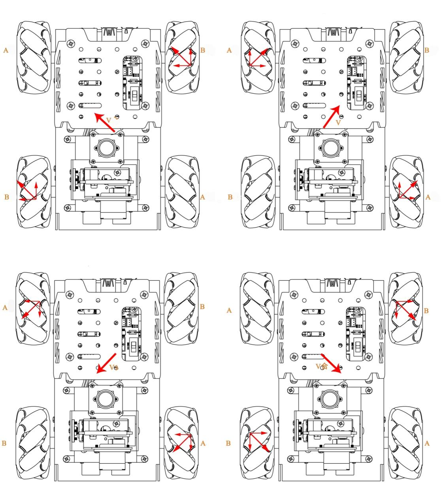

### 5.4.2 Program Flowchart

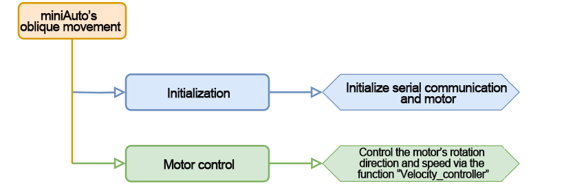

### 5.4.3 Program Download

[slant.ino](../_static/source_code/slant.zip)

:::{Note}

Remove the Bluetooth module before downloading the program. Or the program will fail to download because of the serial port conflict.

:::

(1) Locate and open **"slant.ino"** program file in the same directory of this section.


(2) Connect Arduino to the computer with the Type-B cable .

(3) Click "**Select Board**", and the software will automatically detect the current Arduino serial port. Next, click to connect.

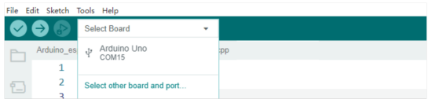

(4) Click  to download the program into Arduino. Then just wait for it to complete.


### 5.4.4 Project Outcome

After downloading the program, power on the robot. It will perform the following sequence of diagonal movements: forward-left for 1 second → backward-right for 1 second → forward-right for 1 second → backward-left for 1 second.

### 5.4.5 Program Analysis

[slant.ino](../_static/source_code/slant.zip)

* **Define Pin and Create Object**

(1) Define the motorpwmPin array to store the PWM control pin numbers for the four motors, and the motordirectionPin array to store their direction control pin numbers.

{lineno-start=18}

```
#include <Arduino.h>

const static uint8_t pwm_min = 50;
const static uint8_t motorpwmPin[4] = { 10, 9, 6, 11};            ///< 控制轮子速度引脚(pins for controlling the motor speed)
const static uint8_t motordirectionPin[4] = { 12, 8, 7, 13};       ///< 控制轮子方向引脚(pins for controlling the motor direction)
```

(2) Declare three function prototypes: Motor_Init for motor initialization, Velocity_Controller for speed control, and Motors_Set for setting motor speeds.

{lineno-start=24}

```
void Motor_Init(void);
void Velocity_Controller(uint16_t angle, uint8_t velocity,int8_t rot,bool drift);
void Motors_Set(int8_t Motor_0, int8_t Motor_1, int8_t Motor_2, int8_t Motor_3);
```

* **"setup()" Initialization and Motion Control**

(1) Initialize serial communication and set the data read timeout to 500 ms. Then, call the `Motor_Init()` function to initialize the motors.

{lineno-start=28}

```
void setup() {
  Serial.begin(9600);
  // 设置串行端口读取数据的超时时间(Set the timeout for reading data from the serial port)
  Serial.setTimeout(500);
  Motor_Init();                     ///< 电机初始化(Initialize the motors)
```

(2) Call the `Velocity_Controller` function to move the robot to the front-left at a speed of 100 for 1 second.

{lineno-start=33}

```
  Velocity_Controller(45,100,0,0);  ///< 左前方移动(Move left forward)
  delay(1000);
```

(3) Call the `Velocity_Controller` function to move the robot to the rear-right at a speed of 100 for 1 second.

{lineno-start=35}

```
  Velocity_Controller(225,100,0,0); ///< 右后方移动(Move right backward)
  delay(1000);
```

(3) Call the `Velocity_Controller` function to move the robot to the front-right at a speed of 100 for 1 second.

{lineno-start=37}

```
  Velocity_Controller(315,100,0,0); ///< 右前方移动(Move right forward)
  delay(1000);
```

(4) Call the `Velocity_Controller` function to move the robot to the rear-left at a speed of 100 for 1 second.

{lineno-start=39}

```
  Velocity_Controller(135,100,0,0); ///< 左后方移动(Move left backward)
  delay(1000);
```

(5) Finally, call the Velocity_Controller function to stop the motors.

{lineno-start=41}

```
  Velocity_Controller(0,0,0,0);     ///< 静止(Stop)    
}
```

* **"Motor_Init()" Motor Initialization Function**

Set the direction pins of the motors to output mode. Call the "**Velocity_Controller**" function to stop the motors.

{lineno-start=48}

```
void Motor_Init(void){
  for(uint8_t i = 0; i < 4; i++){
    pinMode(motordirectionPin[i], OUTPUT);
  }
  Velocity_Controller( 0, 0, 0, 0);
}
```

* **"Velocity_Controller()" Velocity Control Function**

(1) Initialize the speed values for the four motors as integers. Set the speed factor to 1, and set the angle to 90° to correct the robot's direction. Then convert the angle from degrees to radians.  

{lineno-start=65}

```
void Velocity_Controller(uint16_t angle, uint8_t velocity,int8_t rot,bool drift) {
  int8_t velocity_0, velocity_1, velocity_2, velocity_3;
  float speed = 1;
  angle += 90;
  float rad = angle * PI / 180;
```

(2) Check if rot is equal to 0. If it is, set speed to 1; otherwise, set it to 0.5.

{lineno-start=70}

```
  if (rot == 0) speed = 1;///< 速度因子(Speed factor)
  else speed = 0.5; 
```

(3) Apply a reduction to the motor speed values.

{lineno-start=72}

```
  velocity /= sqrt(2);
```

(4) Calculate the speed for each of the four motors based on the value of drift.

{lineno-start=73}

```
  if (drift) {
    velocity_0 = (velocity * sin(rad) - velocity * cos(rad)) * speed;
    velocity_1 = (velocity * sin(rad) + velocity * cos(rad)) * speed;
    velocity_2 = (velocity * sin(rad) - velocity * cos(rad)) * speed - rot * speed * 2;
    velocity_3 = (velocity * sin(rad) + velocity * cos(rad)) * speed + rot * speed * 2;
  } else {
    velocity_0 = (velocity * sin(rad) - velocity * cos(rad)) * speed + rot * speed;
    velocity_1 = (velocity * sin(rad) + velocity * cos(rad)) * speed - rot * speed;
    velocity_2 = (velocity * sin(rad) - velocity * cos(rad)) * speed - rot * speed;
    velocity_3 = (velocity * sin(rad) + velocity * cos(rad)) * speed + rot * speed;
  }
  Motors_Set(velocity_0, velocity_1, velocity_2, velocity_3);
}
```

(5) Use the calculated speed values to control the motors accordingly.

{lineno-start=84}

```
  Motors_Set(velocity_0, velocity_1, velocity_2, velocity_3);
}
```

* **"Motors_Set()" Motor Speed Setting Function**

(1) Define arrays to store the PWM values, motor speed values, and direction settings for each of the four motors.

{lineno-start=92}

```
void Motors_Set(int8_t Motor_0, int8_t Motor_1, int8_t Motor_2, int8_t Motor_3) {
  int8_t pwm_set[4];
  int8_t motors[4] = { Motor_0, Motor_1, Motor_2, Motor_3};
  bool direction[4] = { 1, 0, 0, 1};///< 前进 左1 右0(Forward, left 1, right 0)
```

(2) Use a loop to iterate through all four motors and determine each motor's direction based on its speed value.

{lineno-start=96}

```
  for(uint8_t i; i < 4; ++i) {
    if(motors[i] < 0) direction[i] = !direction[i];
    else direction[i] = direction[i];

    if(motors[i] == 0) pwm_set[i] = 0;
    else pwm_set[i] = map(abs(motors[i]), 0, 100, pwm_min, 255);

    digitalWrite(motordirectionPin[i], direction[i]); 
    analogWrite(motorpwmPin[i], pwm_set[i]); 
  }
}
```

## 5.5 Drifting Movement

### 5.5.1 Working Principle

According to the characteristics of Mecanum wheels, when the front two wheels remain stationary, and the rear wheel A rotates clockwise while rear wheel B rotates counterclockwise, the car will drift clockwise. The force analysis for drifting is shown in the figure below:

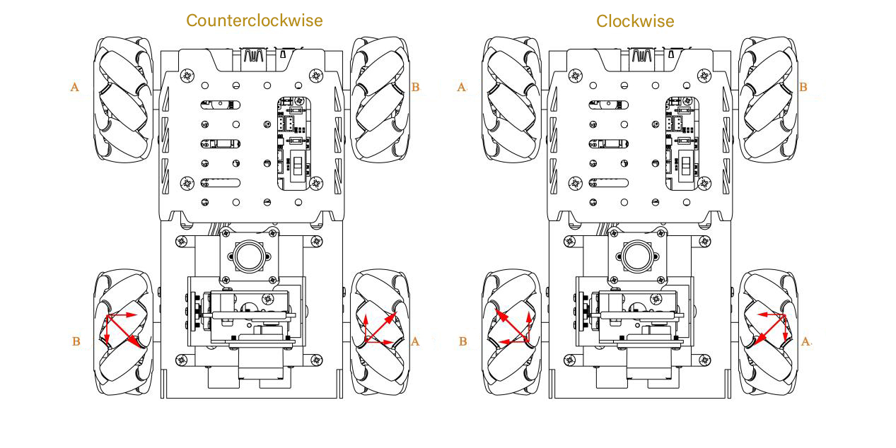

According to physical kinematics, when forces are equal and opposite to each other, they will counteract each other. Any force can be decomposed into two perpendicular vectors. Take counterclockwise drifting as example. Suppose the speed of wheel A and wheel B rotates at the same speed, a upward force decomposed by wheel A and a downward force decomposed by wheel B will counteract each other, which the direction of resultant velocity is to the right. 

Based on Newton's second law (F=ma), if the direction of acceleration is to the right, so the final resultant velocity is also to the right. At this time, if the front wheel does not move, the car will drift.

### 5.5.2 Program Flowchart

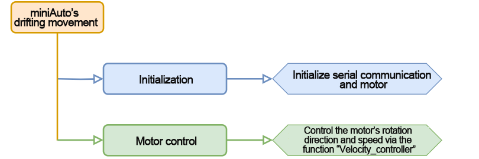

<p id="anchor_5_5_3"></p>

### 5.5.3 Program Download

[drift.ino](../_static/source_code/drift.zip)

:::{Note}

Remove the Bluetooth module before downloading the program. Or the program will fail to download because of the serial port conflict.

:::

(1) Locate and open **"drift/drift.ino"** program file in the same directory of this section.

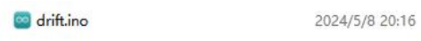

(2) Connect Arduino to the computer with the Type-B cable .

(3) Click **"Select Board"**, and the software will automatically detect the current Arduino serial port. Next, click to connect.

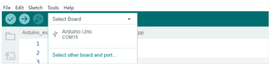

(4) Click  to download the program into Arduino. Then just wait for it to complete.


### 5.5.4 Project Outcome

After the program is downloaded, turn on the miniAuto. It will drift in place.

### 5.5.5 Program Analysis

[drift.ino](../_static/source_code/drift.zip)

* **Define Pin and Create Object**

(1) Define the motorpwmPin array to store the PWM control pin numbers for the four motors, and the motordirectionPin array to store their direction control pin numbers.

{lineno-start=18}

```
#include <Arduino.h>

const static uint8_t pwm_min = 50;
const static uint8_t motorpwmPin[4] = { 10, 9, 6, 11};            ///< 控制轮子速度引脚(pins for controlling the motor speed)
const static uint8_t motordirectionPin[4] = { 12, 8, 7, 13};       ///< 控制轮子方向引脚(pins for controlling the motor direction)
```

(2) Declare three function prototypes: Motor_Init for initializing the motors, Velocity_Controller for controlling motor speed, and Motors_Set for setting individual motor speeds.

{lineno-start=24}

```
void Motor_Init(void);
void Velocity_Controller(uint16_t angle, uint8_t velocity,int8_t rot,bool drift);
void Motors_Set(int8_t Motor_0, int8_t Motor_1, int8_t Motor_2, int8_t Motor_3);
```

* **"setup()" Initialization and Motion Control**

(1) Initialize serial communication and set the data read timeout to 500 ms. Then call the `Motor_Init()` function to initialize the motors.

{lineno-start=28}

```
void setup() {
  Serial.begin(9600);
  // 设置串行端口读取数据的超时时间(Set the timeout for reading data from the serial port)
  Serial.setTimeout(500);
  Motor_Init();                     ///< 电机初始化(Initialize the motors)
```

(2) Call the `Velocity_Controller()` function to make the robot drift at a speed of 100 for 1 second.

{lineno-start=33}

```
  Velocity_Controller(0,0,60,0);  ///< 自转(Spin)
  delay(1000); 
```

Call the `Velocity_Controller()` function again to stop the motors.

{lineno-start=35}

```
  Velocity_Controller(0,0,0,0);     ///< 静止(Stop)
}
```

* **"Motor_Init()" Motor Initialization Function**

Set the motor direction pins to output mode. Then, call the Velocity_Controller() function to stop the motors.

{lineno-start=42}

```
void Motor_Init(void){
  for(uint8_t i = 0; i < 4; i++){
    pinMode(motordirectionPin[i], OUTPUT);
  }
  Velocity_Controller( 0, 0, 0, 0);
}
```

* **"Velocity_Controller()" Velocity Control Function**

(1) Initialize the speed values for all four motors as integers. Set the speed factor to 1, and assign the value 90° to the angle variable to align the robot's direction. Then, convert the angle from degrees to radians.  

{lineno-start=59}

```
void Velocity_Controller(uint16_t angle, uint8_t velocity,int8_t rot,bool drift) {
  int8_t velocity_0, velocity_1, velocity_2, velocity_3;
  float speed = 1;
  angle += 90;
  float rad = angle * PI / 180;
```

(2) Check if the rot value is 0. If so, set the speed to 1; otherwise, set it to 0.5.

{lineno-start=64}

```
  if (rot == 0) speed = 1;///< 速度因子(Speed factor)
  else speed = 0.5; 
```

(3) Scale down the speed values accordingly.

{lineno-start=66}

```
  velocity /= sqrt(2);
```

(4) Calculate the speed of each motor based on the value of drift.

{lineno-start=67}

```
  if (drift) {
    velocity_0 = (velocity * sin(rad) - velocity * cos(rad)) * speed;
    velocity_1 = (velocity * sin(rad) + velocity * cos(rad)) * speed;
    velocity_2 = (velocity * sin(rad) - velocity * cos(rad)) * speed - rot * speed * 2;
    velocity_3 = (velocity * sin(rad) + velocity * cos(rad)) * speed + rot * speed * 2;
  } else {
    velocity_0 = (velocity * sin(rad) - velocity * cos(rad)) * speed + rot * speed;
    velocity_1 = (velocity * sin(rad) + velocity * cos(rad)) * speed - rot * speed;
    velocity_2 = (velocity * sin(rad) - velocity * cos(rad)) * speed - rot * speed;
    velocity_3 = (velocity * sin(rad) + velocity * cos(rad)) * speed + rot * speed;
  }
```

(5) Apply the calculated motor speed values using the Motors_Set function.

{lineno-start=78}

```
  Motors_Set(velocity_0, velocity_1, velocity_2, velocity_3);
}
```

* **"Motors_Set()" Motor Speed Setting Function**

(1) Define arrays to store the PWM values, speed values, and direction settings for each of the four motors.

{lineno-start=86}

```
void Motors_Set(int8_t Motor_0, int8_t Motor_1, int8_t Motor_2, int8_t Motor_3) {
  int8_t pwm_set[4];
  int8_t motors[4] = { Motor_0, Motor_1, Motor_2, Motor_3};
  bool direction[4] = { 1, 0, 0, 1};///< 前进 左1 右0(Forward, left 1, right 0)
```

(2) Iterate through all four motors and determine the rotation direction based on each motor's speed value.

{lineno-start=90}

```
  for(uint8_t i; i < 4; ++i) {
    if(motors[i] < 0) direction[i] = !direction[i];
    else direction[i] = direction[i];

    if(motors[i] == 0) pwm_set[i] = 0;
    else pwm_set[i] = map(abs(motors[i]), 0, 100, pwm_min, 255);

    digitalWrite(motordirectionPin[i], direction[i]); 
    analogWrite(motorpwmPin[i], pwm_set[i]); 
  }
}
```

### 5.5.6 Function Extension

By default, the program controls the robot to drift. In this section, it will be modified to make the robot turn in place. Please follow the steps below:

(1) Set the **drift** parameter to 0 in the `Velocity_Controller()` function.

{lineno-start=33}

```
  Velocity_Controller( 0, 0, 60, 0);
  delay(1000);  
}
```

(2) After making the changes, refer to [5.5.3 Program Download](#anchor_5_5_3) to upload the updated program. Then power on the robot to verify the new behavior.