# 二次开发项目课程

## 5.1 二次开发库文件介绍

为方便程序调用，会用到了一些库文件。其中包含Arduino官方库文件“**Servo、tone**”和我们自定义的库文件“**Ultrasound、FastLED**”。

本节会对课程所用到的自定义库文件及主要程序进行说明（其中FastLED库已封装，本文将不再对它做分析）。

### 1. 超声波库文件（Ultrasound）

Ultrasound是控制发光超声波模块发送、读取信息、设置模块上RGB灯的颜色以及获取测量距离的库函数。在后续的声波测距、声波抓球玩法中需要调用该函数来实现检测距离及控制模块灯颜色变化的功能。

下面就其中几个使用频率较高的函数来进行说明。

- #### 成员函数（Ultrasound::Color）

```c
void Ultrasound::Color(uint8_t r1, uint8_t g1, uint8_t b1, uint8_t r2, uint8_t g2, uint8_t b2)
{
  uint8_t RGB[6]; 
  uint8_t value = RGB_WORK_SIMPLE_MODE;
  
  wireWriteDataArray(ULTRASOUND_I2C_ADDR, RGB_WORK_MODE,&value,1);
  RGB[0] = r1;RGB[1] = g1;RGB[2] = b1;//RGB1
  RGB[3] = r2;RGB[4] = g2;RGB[5] = b2;//RGB2
  wireWriteDataArray(ULTRASOUND_I2C_ADDR, RGB1_R,RGB,6);
}
```

这是一个Ultrasound类的其中一个成员函数，主要是用于控制发光超声波模块上RGB灯的颜色。它接收六个参数，分别是r1、g1、b1和r2、b2、g2，分别代表发光超声波模块上左右两个RGB灯的红绿蓝三色。该函数的相关描述可参考下表：

<table class="docutils" border="1">
<tr>
<td colspan="4" style="text-align: center;"><strong>Ultrasound::Color()</strong></td>
</tr>
<tr>
<td style="text-align: center;">函数描述</td>
<td colspan="3">控制发光超声波的RGB灯颜色</td>
</tr>
<tr>
<td>参数列表</td>
<td>r1、g1、b1、r2、g2、b2</td>
<td>返回值</td>
<td>无</td>
</tr>
<tr>
<td style="text-align: center;">使用说明</td>
<td colspan="3">1.Ultrasound ul;（创建发光超声波对象）<br>2.ul.Color(0,0,255,0,0,255);</td>
</tr>
</table>


在函数中使用wireWriteDataArray来向发光超声波传感器的I2C地址写入数据。它向地址ULTRASOUND_I2C_ADDR写入一个字节的数据，该数据是RGB_WORK_SIMPLE_MODE的值。

然后将前面传入的两种颜色（RGB1和RGB2）的值分别赋给RGB数组的前六个元素。最后再次使用wireWriteDataArray函数，将前面设置的两种颜色的RGB值通过I2C协议发送给超声波传感器。

- #### 成员函数（Ultrasound::GetDistance）

这是一个Ultrasound类的其中一个成员函数，用于从发光超声波模块获取距离数据。

代码使用wireReadDataArray的函数从超声波传感器的I2C地址读取数据。从地址ULTRASOUND_I2C_ADDR的偏移量0处开始，读取2个字节的数据，并将这些数据存储在distance变量中，即获取到超声波模块的距离数据。

```c
u16 Ultrasound::GetDistance()
{
  u16 distance;
  wireReadDataArray(ULTRASOUND_I2C_ADDR, 0,(uint8_t *)&distance,2);
  return distance;
}
```


<table class="docutils" border="1">
<tr>
<td colspan="4" style="text-align: center;"><strong>Ultrasound::GetDistance()</strong></td>
</tr>
<tr>
<td style="text-align: center;">函数描述</td>
<td colspan="3" style="text-align: center;">直接获取发光超声波模块的测量距离</td>
</tr>
<tr>
<td style="text-align: center;">参数列表</td>
<td style="text-align: center;">无</td>
<td style="text-align: center;">返回值</td>
<td style="text-align: center;">返回u16类型的距离测量值</td>
</tr>
<tr>
<td style="text-align: center;">使用说明</td>
<td colspan="3" style="text-align: center;">
1.Ultrasound ul;（创建发光超声波对象）<br>
2.ul.GetDistance(); (返回直接测量的的距离值，有干扰)
</tr>
</table>

- #### 成员函数（Ultrasound::Filter）

Filter一个Ultrasound类的其中一个成员函数，用于在GetDistance函数获取的数据之后对其进行滤波，减少干扰，获得一个更加平滑的平均值。

首先程序定义了滤波器的大小为3，用于存储最近读取的三个超声波测值。声明了一个静态整数数组filter_buf，其大小为FILTER_N + 1（即4）。

从GetDistance读取一个新的测值，并将其存储在filter_buf数组的最后一个位置。当数据累积到一定数量时，将filter_buf数组中的所有数据左移一位（丢弃最低位的数据），并将所有数据累加到filter_sum变量中，便于计算所有存储数据的总和。

最后，函数返回计算得到的平均值。这个平均值是通过将累加的总和除以滤波器的长度来计算的，结果被强制转换为整数类型并返回。


<table class="docutils" border="1">
<colgroup>
<col style="width: 24%" />
<col style="width: 31%" />
<col style="width: 18%" />
<col style="width: 25%" />
</colgroup>
<tbody>
<tr>
<td colspan="4" style="text-align: center;"><strong>Ultrasound::Filter()</strong></td>
</tr>
<tr>
<td style="text-align: center;">函数描述</td>
<td colspan="3" style="text-align: center;">获取滤波后的测量值</td>
</tr>
<tr>
<td style="text-align: center;">参数列表</td>
<td style="text-align: center;">无</td>
<td style="text-align: center;">返回值</td>
<td style="text-align: center;">返回int类型的滤波后的距离测量值</td>
</tr>
<tr>
<td style="text-align: center;">使用说明</td>
<td colspan="3" style="text-align: center;">
Ultrasound ul;（创建发光超声波对象）<br>
ul.Filter();（返回滤波后的数值，去除干扰）
</tr>
</tbody>
</table>


## 5.2 点亮RGB

本节通过读取Arduino扩展板上的板载按键状态，来控制RGB灯的颜色。

### 1. 实现流程图

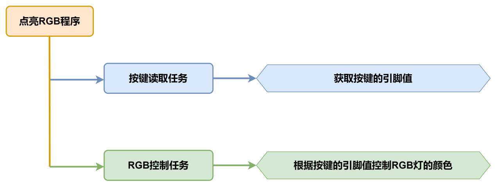

### 2. 板载RGB灯

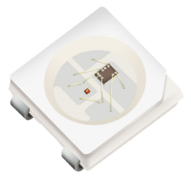

板载RGB灯使用的是RGB LED灯珠，灯珠的RGB三色可单独设置显示亮度，能够实现多彩混合的显示效果。

### 3. 程序下载

:::{Note}

下载程序前需先将蓝牙模块取下，否则会因串口冲突导致程序下载失败。

接入Type-B下载线时请将电池盒开关拨到“OFF”挡，避免下载线误碰到扩展板的电源引脚，容易造成短路。

:::


1)  在本文档同路径下找到“**2.2 点亮RGB程序\\rgb_test\rgb_test.ino**”程序文件。


2)  将Arduino通过UNO数据线（Type-B）连接至电脑。

3)  点击“**选择开发板**”选项，软件会自动检测当前Arduino串口，点击进行连接。


4)  点击，将程序下载至Arduino中，等待下载完成即可。


### 4. 实现效果

打开小车电源后，Arduino扩展板上的RGB彩灯为红色，按下扩展板上的KEY1按键时，RGB彩灯会从红色变为白色，松开按键后则变回红色。

### 5. 程序简要分析

- #### 导入库文件

```c
#include "FastLED.h"
```

导入本玩法所需要的RGB控制库。

5.2 定义引脚及创建对象

1)  定义了一个RGB灯引脚以及按键引脚。

```c
const static uint8_t ledPin = 2;
const static uint8_t keyPin = 3;
```

2)  创建了RGB灯对象，同时还创建了一个用于储存按键状态的变量。

```c
static CRGB rgbs[1];

bool keyState;          // 按键状态检测
```

- #### 初始化设置

1)  在setup()函数中，主要是对相关的硬件设备进行初始化。首先是串口，将其通信的波特率设置为9600。

```c
void setup() {
  Serial.begin(9600);        // 初始化串口通信
```

2)  将按键引脚配置为输入IO，上电后的引脚值默认为低电平。使用FastLED库初始化扩展板上的RGB灯，并将其连接到ledPin引脚。通过调用Rgb_Show(255,255,255)函数设置RGB颜色为白色。

```c
  pinMode(keyPin, INPUT);
  FastLED.addLeds<WS2812, ledPin, GRB>(rgbs, 1);
  Rgb_Show(255,255,255);
}
```

- #### 主程序

在loop()函数中，首先通过analogRead()函数读取按键的引脚值，再判断按键引脚值并控制RGB灯的颜色。如果读取到的按键引脚值为0（低电平，表示按键被按下），则控制RGB灯的颜色为白色。若读取到的引脚值为1（高电平，按键未被按下），则控制RGB灯的颜色为红色。

```c
void loop() {
  keyState = analogRead(keyPin);
  if(keyState) Rgb_Show(255,0,0);
  else Rgb_Show(255,255,255);
  delay(100);
}
```

- #### RGB控制函数

在Rgb_Show()控制函数中，通过传递的三个参数来设置RGB灯的颜色，rValue对应的是红色，gValue对应的是绿色，bValue则对应的是蓝色。R、G、B三种颜色的取值范围是0-255，最后通过FastLED.show()函数显示颜色。

```c
 /**
 * @brief 设置RGB灯的颜色
 * @param rValue;gValue;bValue;
 * @arg 三个入口参数取值分别为:0~255;
 * @retval None
 * @note (255,0,0)红色 (0,255,0)绿色 (0,0,255)蓝色 (255,255,255)白色
 */
void Rgb_Show(uint8_t rValue,uint8_t gValue,uint8_t bValue) {
  rgbs[0].r = rValue;
  rgbs[0].g = gValue;
  rgbs[0].b = bValue;
  FastLED.show();
}
```

### 6. 功能延伸

这里以修改RGB彩灯的颜色为例来进行说明，从原来的红色修改为绿色。具体修改内容可参考下面步骤：

1. 找到主程序中控制RGB颜色的函数Rgb_show()，函数的三个参数分别对应着红色、绿色、蓝色。


```c
void loop() {
  keyState = analogRead(keyPin);
  if(keyState) Rgb_Show(255,0,0);
  else Rgb_Show(255,255,255);
  delay(100);
}
```

2. 将原先红色的值改为0，再将绿色的值改为255，即可将RGB灯的颜色更改为绿色。

```c
void loop() {
  keyState = analogRead(keyPin);
  if(keyState) Rgb_Show(0,255,0);
  else Rgb_Show(255,255,255);
  delay(100);
}
```

关于RGB颜色表，可前往链接进行查询：[<u>https://www.bchrt.com/tools/rgbcolor/</u>](https://www.bchrt.com/tools/rgbcolor/)

### 7. 常见问题解答

问：代码上传失败。

答：请检查您是否有将蓝牙模块连接至小车上，若有请取出蓝牙模块后再进行下载。

## 5.3 音乐播放

本节介绍通过读取Arduino扩展板上的板载按键状态，控制音乐的播放。

### 1. 实现流程图

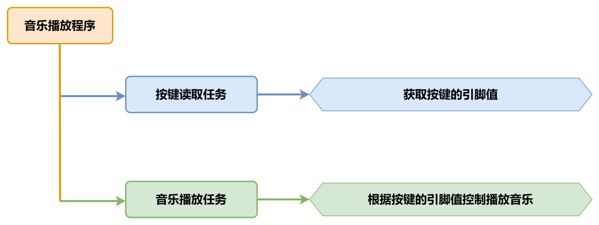

### 2. 板载蜂鸣器


板载蜂鸣器使用的是5V蜂鸣器，通过控制输出PWM信号的频率，即可控制蜂鸣器发出不同声调的声音。

### 3. 程序下载

:::{Note}

下载程序前需先将蓝牙模块取下，否则会因串口冲突导致程序下载失败。

接入Type-B下载线时请将电池盒开关拨到“OFF”挡，避免下载线误碰到扩展板的电源引脚，造成短路。

:::

1)  在本文档同路径下找到“**3.2 音乐播放程序\buzzer_test\buzzer_test.ino**”程序文件。


2)  将Arduino通过UNO数据线（Type-B）连接至电脑。

3)  点击“**选择开发板**”选项，软件会自动检测当前Arduino串口，点击进行连接。


4)  点击，将程序下载至Arduino中，等待下载完成即可。


### 4. 实现效果

打开小车电源后，按下Arduino扩展板上的KEY1按键后，会控制蜂鸣器发出一段音乐。

### 5. 程序简要分析

- #### 导入库文件

```c
#include "tone.h"
```

导入本玩法所需要的tone音调库。

- #### 定义引脚及创建对象

1)  首先对蜂鸣器播放音乐的音调进行了定义。

```c
/* 超级玛丽 */
static int song[98] = {
  NOTE_E4, NOTE_E4, NOTE_E4, NOTE_C4, NOTE_E4, NOTE_G4, NOTE_G3,
  NOTE_C4, NOTE_G3, NOTE_E3, NOTE_A3, NOTE_B3, NOTE_AS3, NOTE_A3, 
  NOTE_G3, NOTE_E4, NOTE_G4, NOTE_A4, NOTE_F4, NOTE_G4, NOTE_E4,
  NOTE_C4, NOTE_D4, NOTE_B3,NOTE_C4, NOTE_G3, NOTE_E3, NOTE_A3,
  NOTE_B3, NOTE_AS3, NOTE_A3, NOTE_G3, NOTE_E4, NOTE_G4, NOTE_A4, 
  NOTE_F4, NOTE_G4, NOTE_E4, NOTE_C4, NOTE_D4, NOTE_B3,
  NOTE_G4, NOTE_FS4, NOTE_E4, NOTE_DS4, NOTE_E4, NOTE_GS3, 
  NOTE_A3, NOTE_C4, NOTE_A3, NOTE_C4, NOTE_D4, NOTE_G4, NOTE_FS4, 
  NOTE_E4, NOTE_DS4, NOTE_E4, NOTE_C5, NOTE_C5, NOTE_C5,
  NOTE_G4, NOTE_FS4, NOTE_E4, NOTE_DS4, NOTE_E4, NOTE_GS3, NOTE_A3,
  NOTE_C4, NOTE_A3, NOTE_C4, NOTE_D4, NOTE_DS4, NOTE_D4, NOTE_C4,
  NOTE_C4, NOTE_C4, NOTE_C4, NOTE_C4, NOTE_D4, NOTE_E4, NOTE_C4, 
  NOTE_A3, NOTE_G3, NOTE_C4, NOTE_C4, NOTE_C4, NOTE_C4, NOTE_D4, NOTE_E4,
  NOTE_C4, NOTE_C4, NOTE_C4, NOTE_C4, NOTE_D4, NOTE_E4, NOTE_C4, NOTE_A3, NOTE_G3
  };
```

2)  然后定义了音乐的节拍，每个音调的节拍对应着这个音调的相对持续时间，我们在程序中以一秒一个节拍作为歌曲播放节奏。


```c
/* 节拍 */
static int noteDurations[98] = {
  8,4,4,8,4,2,2,
  3,3,3,4,4,8,4,8,8,8,4,8,4,3,8,8,3,
  3,3,3,4,4,8,4,8,8,8,4,8,4,3,8,8,2,
  8,8,8,4,4,8,8,4,8,8,3,8,8,8,4,4,4,8,2,
  8,8,8,4,4,8,8,4,8,8,3,3,3,1,
  8,4,4,8,4,8,4,8,2,8,4,4,8,4,1,
  8,4,4,8,4,8,4,8,2
};
```

3. 对蜂鸣器以及按键引脚进行了定义，同时创建了两个变量，keyState用于储存按键的状态，playMusic用作判断是否播放音乐。

```c
const static uint8_t buzzerPin = 3;    
const static uint8_t keyPin = A3;
bool keyState;                             
bool taskStart = 0;
```

- #### 初始化设置

1)  在setup()函数中，主要是对相关的硬件设备进行初始化。首先是串口，将其通信的波特率设置为9600，并设置读取数据超时时间为500ms。

```c
void setup() {
  pinMode(keyPin, INPUT);
  Serial.begin(9600);
  // 设置串行端口读取数据的超时时间
  Serial.setTimeout(500);
```

2)  将按键引脚配置为输入IO，上电后的引脚值默认为低电平。调用play_tune()函数对蜂鸣器的音调、时间、音调长度进行初始化。

```c
  pinMode(keyPin, INPUT);
```

- #### 主程序

在loop()函数中，首先通过analogRead()函数读取按键的引脚值，再判断按键引脚值并控制RGB灯的颜色。如果读取到的按键引脚值为0（低电平，表示按键被按下），则调用tune_task()函数控制蜂鸣器播放音乐。

```c
void loop() {
  keyState = analogRead(keyPin);  
  if (!keyState) taskStart = 1;
  if (taskStart)
  {
    tune_task();    
    taskStart = 0;
  }
}
```

- #### 音乐播放函数

```c
void tune_task(void) {
  for (int thisNote = 0; thisNote <98; thisNote++)
  {
    int noteDuration = 1000/noteDurations[thisNote];
    // 计算每个节拍的时间，以一个节拍一秒为例，四分之一拍就是1000/4毫秒，八分之一拍就是1000/8毫秒
    tone(buzzerPin, song[thisNote],noteDuration);
    int pauseBetweenNotes = noteDuration * 1.10; 
    //每个音符间的停顿间隔，以该音符的130%为佳
    delay(pauseBetweenNotes);
    noTone(buzzerPin);
  }
}
```

循环遍历每一个获取音调和对应的节拍（播放持续时间），首先将节拍换算成对应的播放持续时间；之后将配置信息传至蜂鸣器开始播放。

为了播放的真实效果，每个音调播放完成后需要好有一定时间停顿，我们默认每个音调的停顿间隔=1.3\*播放持续时间。

### 6. 常见问题解答

问：代码上传失败。

答：请检查您是否有将蓝牙模块连接至小车上，若有请取出蓝牙模块后再进行下载。


## 5.4 超声波测距

本节通过发光超声波模块检测障碍物距离，同时控制超声波模块灯的颜色变化。

### 1. 实现流程图

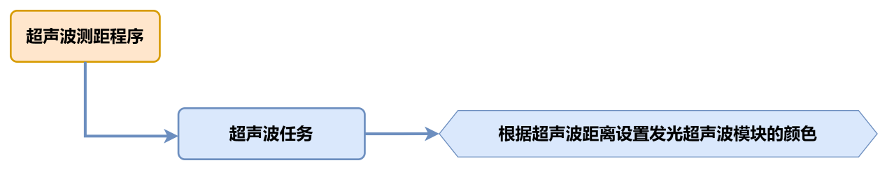

### 2. 超声波传感器


本节课用的是可发光的超声波测距模块，模块采用 IIC 通信接口，能通过 IIC通信进行读取超声波传感器测量的距离。

传感器测距时模块会自动发送 8 个 40khz 的方波，然后检测是否有信号返回； 如果有信号返回，便输出一个高电平，高电平持续的时间就是超声波从发射到返回的时间。

具体公式为：测试距离=(高电平时间\*声速(340M/S))/2。

### 3. 程序下载

:::{Note}

下载程序前需先将蓝牙模块取下，否则会因串口冲突导致程序下载失败。

接入Type-B下载线时请将电池盒开关拨到“OFF”挡，避免下载线误碰到扩展板的电源引脚，造成短路。

:::


1)  找到并打开本节同目录下的“**4.2 超声波测距程序\ultrasonic_test\\ultrasonic_test.ino**”程序文件。

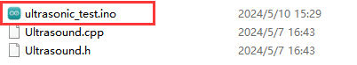

2)  将Arduino通过UNO数据线（Type-B）连接至电脑。点击“**选择开发板**”选项，软件会自动检测当前Arduino串口，点击进行连接。


3)  点击，将程序下载至Arduino中，等待下载完成即可。


### 4. 实现效果

打开小车电源后，小车上的发光超声波模块会根据所测障碍物的距离，改变发光超声波的颜色。

将障碍物正对超声波模块并移动障碍物使其缓慢靠近。

1.  当**距离\>80mm时**，发光超声波模块上RGB灯模式为红色呼吸灯模式；

2.  当**80mm\>距离\>180mm**时，发光超声波模块上RGB灯为红色渐变模式；

3.  当**180mm\>距离\>320mm**时，发光超声波模块上RGB灯为蓝色渐变模式；

4.  当**320mm\>距离\>500mm**时，发光超声波模块上RGB灯为绿色渐变模式；

5.  当**距离\>500mm**时，发光超声波模块上RGB灯为绿色常亮模式；

### 5. 程序简要分析

本玩法程序名为“**ultrasonic_test.ino**”，关于程序的实现逻辑可参考下面流程图：

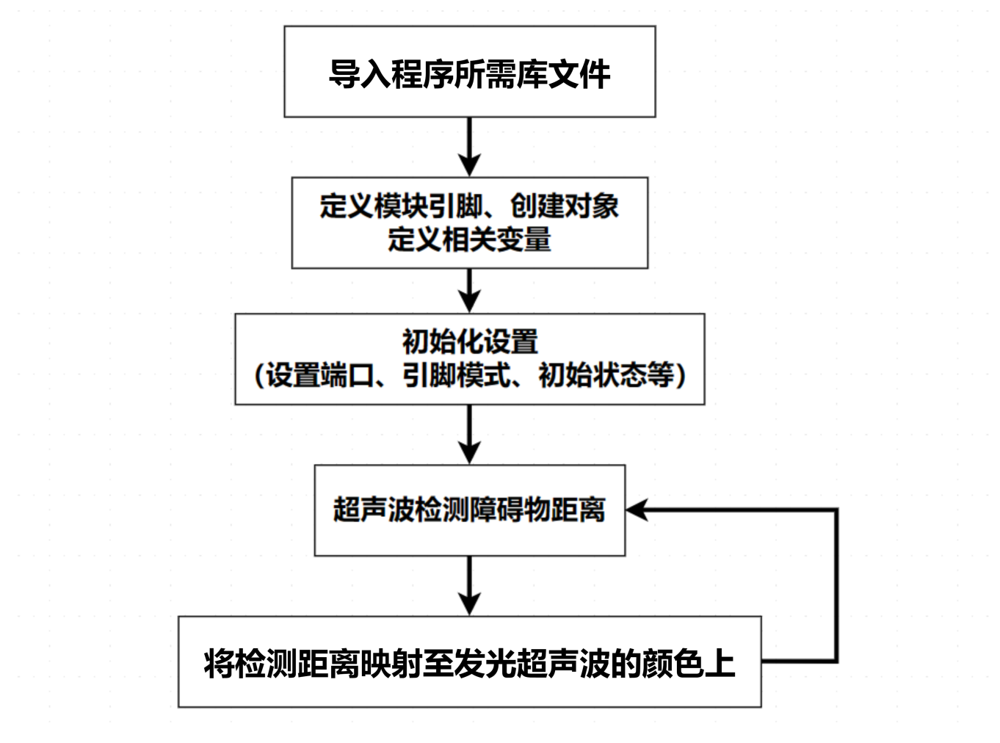

- #### 导入库文件

```c
#include "Ultrasound.h"
```

导入本玩法所需要的控制发光超声波的库文件。

- #### 定义变量及创建对象

首先定义了滤波法数组的容量，以及滤波数据储存变量，接着创建了一个超声波类对象，用于获取距离数据。

```c
#define FILTER_N 3                // 滤波法数组容量

int Filter_Value;
int filter_buf[FILTER_N + 1];

Ultrasound ultrasound;            // 实例化超声波类
```

- #### 初始化设置

在setup()函数中，主要是串口进行初始化，将其通信的波特率设置为9600。

```c
void setup() {
  // put your setup code here, to run once:
  Serial.begin(9600);
}
```

- #### 主函数

在主函数中循环调用超声波任务函数，用于实现“[<u>5.5超声波检测</u>](#_5.5 超声波检测)”中的功能。

```c
void loop() {
  // put your main code here, to run repeatedly:
  ultrasonic_distance();
}
```

- #### 超声波检测

1)  ultrasonic_distance()函数，它是用于实现测距并改变灯光的颜色。


```c
int ultrasonic_distance(){
  uint8_t s;
  uint16_t distance = Filter();// 获得滤波器输出值
  Serial.print("Distance: ");// 获取并且串口打印距离，单位mm
  Serial.print(distance);
  Serial.println(" mm");
```

2. 距离大于0且小于等于80mm时，发光超声波为呼吸灯模式，以0.1s的速度显示红色。


```c
  if (distance > 0 && distance <= 80){
      ultrasound.Breathing(1, 0, 0, 1, 0, 0);// 呼吸灯模式，周期0.1s，颜色红色
  }
```

3. 当距离大于80mm且小于等于180mm时，发光超声波为红色灯光渐变显示，距离越大则颜色越淡。


```c
  else if (distance > 80 && distance <= 180){
      s = map(distance,80,180,0,255);
      ultrasound.Color((255-s), 0, 0, (255-s), 0, 0);// 红色渐变
  }
```

4. 当距离大于180mm且小于320mm时，发光超声波为蓝色灯光渐变显示，距离越大则颜色越蓝。


```c
   else if (distance > 180 && distance <= 320){
      s = map(distance,180,320,0,255);
      ultrasound.Color(0, 0, s, 0, 0, s);// 蓝色渐变
  }
```

5. 当距离大于320mm且小于500mm时，发光超声波为绿色灯光渐变显示，距离越大则颜色越绿。


```c
   else if (distance > 320 && distance <= 500){
      s = map(distance,320,500,0,255);
      ultrasound.Color(0, s, 255-s, 0, s, 255-s);// 绿色渐变
  }
```

6. 当距离大于500mm时，发光超声波的灯光的颜色固定为绿色。

```c
  else if (distance > 500){
      ultrasound.Color(0, 255, 0, 0, 255, 0);// 绿色
  }
```

### 6. 功能延伸

**这里以修改RGB彩灯渐变时的颜色为例来进行说明，将距离大于80且小于180mm的超声波颜色，从原来的渐变的红色修改为黄色**。具体修改内容可参考下面步骤：

1)  找到程序中控制RGB彩灯随距离变化的映射代码。这里是通过map函数设置颜色RGB元素中的R根据s的变化而变化w，map(distance,80,180,0,255)是将障碍物的距离distance映射到R元素上。


```c
  else if (distance > 80 && distance <= 180){
      s = map(distance,80,180,0,255);
      ultrasound.Color((255-s), 0, 0, (255-s), 0, 0);// 红色渐变
  }
```

2. 将原先G元素的值更改为与A元素的值相同，需要注意颜色的颜色元素的范围是0~255。然后重新下载程序。这样当障碍物距离在检测范围内时，RGB灯显示出来的渐变色为黄色。

```c
  else if (distance > 80 && distance <= 180){
      s = map(distance,80,180,0,255);
      ultrasound.Color((255-s), (255-s), 0, (255-s), (255-s), 0);// 黄色渐变
  }
```

关于RGB颜色表，可前往链接进行查询：[<u>https://www.bchrt.com/tools/rgbcolor/</u>](https://www.bchrt.com/tools/rgbcolor/)

### 7. 常见问题解答

问：代码上传后超声波测出的距离一直为0。

答：请检查您是否将4pin线连接至正确的IIC接口。

问：超声波测出的距离有时准确，有时不准确。

答：请使用光滑平整的物品进行测距，同时应避免长时间近距离探测障碍物。

## 5.5 超声波跟随

本节通过发光超声波模块检测障碍物距离，同时操控小车进行前后移动。

### 1. 实现流程图

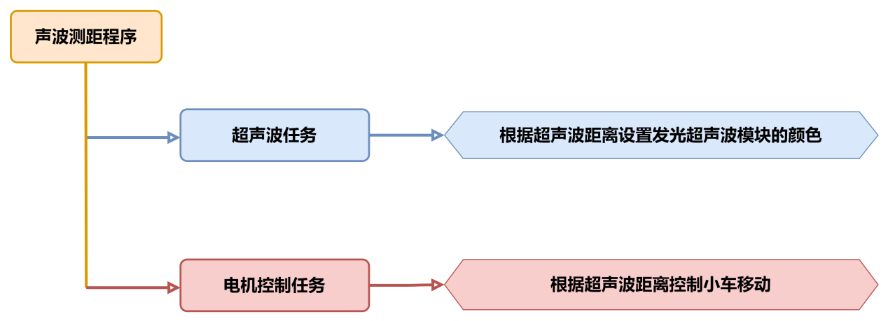

### 2. 超声波传感器


本节课用的是可发光的超声波测距模块，模块采用 IIC 通信接口，能通过 IIC通信进行读取超声波传感器测量的距离。

传感器测距时模块会自动发送 8 个 40khz 的方波，然后检测是否有信号返回； 如果有信号返回，便输出一个高电平，高电平持续的时间就是超声波从发射到返回的时间。

具体公式为：测试距离=(高电平时间\*声速(340M/S))/2。

### 3. 程序下载

:::{Note}

下载程序前需先将蓝牙模块取下，否则会因串口冲突导致程序下载失败。

接入Type-B下载线时请将电池盒开关拨到“OFF”挡，避免下载线误碰到扩展板的电源引脚，造成短路。

:::

1)  找到并打开本节同目录下的“**5.2 超声波跟随程序\ultrasonic_following\\ultrasonic_following.ino**”程序文件。


2)  将Arduino通过UNO数据线（Type-B）连接至电脑。点击“**选择开发板**”选项，软件会自动检测当前Arduino串口，点击进行连接。


3)  点击，将程序下载至Arduino中，等待下载完成即可。


### 4. 实现效果

打开小车电源，小车会根据超声波所测障碍物的距离，改变发光超声波的颜色，并控制小车进行前进或者后退。

将障碍物正对超声波模块并移动障碍物使其缓慢靠近。

- #### 超声波灯光颜色变化效果：

1.  当**距离\>80mm时**，发光超声波模块上RGB灯模式为红色呼吸灯模式；
2.  当8**0mm\>距离\>180mm**时，发光超声波模块上RGB灯为红色渐变模式；
3.  当18**0mm\>距离\>320mm**时，发光超声波模块上RGB灯为蓝色渐变模式；
4.  当32**0mm\>距离\>500mm**时，发光超声波模块上RGB灯为绿色渐变模式；
5.  当**距离\>500mm**时，发光超声波模块上RGB灯为绿色常亮模式；

- #### 小车控制效果：

1.  当**距离\<200mm时**，控制小车向后移动；
2.  当**300mm\>距离\>=200mm**时，控制小车停止移动；
3.  当**700\>距离\>=300mm**时，控制小车向前移动；
4.  当**700mm\>距离**时，控制小车停止移动；

### 5. 程序简要分析

本玩法程序名为“**ultrasonic_following.ino**”，关于程序的实现逻辑可参考下面的流程图：


- #### 导入库文件

```c
#include "Ultrasound.h"
```

导入本玩法所需要的控制发光超声波的库文件。

- #### 定义变量及创建对象

首先创建了一个超声波类，用于获取距离数据，接着创建了pwm_min变量，用于存储pwm的最小映射值，然后创建了一个数组对数字电机引脚进行了定义,最后创建了dis变量，用于储存超声波距离的值。

```c
Ultrasound ultrasound;  //实例化超声波类

const static uint8_t pwm_min = 50;
const static uint8_t motorpwmPin[4] = { 10, 9, 6, 11} ;
const static uint8_t motordirectionPin[4] = { 12, 8, 7, 13};

uint16_t dis;
```

- #### 初始化设置

在setup()函数中，主要是串口进行初始化，将其通信的波特率设置为9600，接着调用了Motor_Init()函数绑定电机并对电机进行初始化。

```c
void setup() {
  Serial.begin(9600);
  Motor_Init();
}
```

- #### 主函数

在主函数中循环调用超声波任务函数，用于获取距离数据以及设置发光超声波的颜色，通过对所测得的数据，进行判断后再对小车进行控制。

```c
void loop() {
  ultrasonic_distance();
  dis = ultrasonic_distance();
  if(dis >=700) Velocity_Controller( 0, 0, 0, 0);
  if(dis >= 300 && dis < 700) Velocity_Controller( 0,50, 0, 0);
  if(dis >= 200 && dis < 300) Velocity_Controller( 0, 0, 0, 0);
  if(dis < 200) Velocity_Controller( 180, 50, 0, 0); 
}
```

- #### 超声波检测

1)  调用loop主函数中的超声波任务函数ultrasonic_distance()，它是用于实现测距并改变灯光的颜色。


```c
/* 超声波距离数据获取 */
uint16_t ultrasonic_distance(){
  uint8_t s;
  uint16_t distance = Filter();         // 获得滤波器输出值
  Serial.print("Distance: ");
  Serial.print(distance);
  Serial.println(" mm"); //获取并且串口打印距离，单位mm
```

2. 距离大于0且小于等于80mm时，发光超声波为呼吸灯模式，以0.1s的速度显示红色。


```c
  if (distance > 0 && distance <= 80){
      ultrasound.Breathing(1, 0, 0, 1, 0, 0);       //呼吸灯模式，周期0.1s，颜色红色
   }
```

3. 当距离大于80mm且小于180mm时，发光超声波为红色灯光渐变显示，距离越大则颜色越淡。


```c
  else if (distance > 80 && distance <= 180){
      s = map(distance,80,180,0,255);
      ultrasound.Color((255-s), 0, 0, (255-s), 0, 0); //红色渐变
   }
```

4. 当距离大于180mm且小于320mm时，发光超声波为蓝色灯光渐变显示，距离越大则颜色越蓝。


```c
   else if (distance > 180 && distance <= 320){
      s = map(distance,180,320,0,255);
      ultrasound.Color(0, 0, s, 0, 0, s);            //蓝色渐变
   }
```

5. 当距离大于320mm且小于500mm时，发光超声波为绿色灯光渐变显示，距离越大则颜色越绿。


```c
   else if (distance > 320 && distance <= 500){
      s = map(distance,320,500,0,255);
      ultrasound.Color(0, s, 255-s, 0, s, 255-s);            //绿色渐变
   }
```

6. 当距离大于500mm时，发光超声波的灯光的颜色固定为绿色。

```c
  else if (distance > 500){
      ultrasound.Color(0, 255, 0, 0, 255, 0);        //绿色
   }
```

- #### 速度控制函数

在速度控制函数中，根据麦克纳姆轮的运动学分析进行计算各个电机的控制数值，angle参数用于设置小车的运动方向（车头的方向为0度，逆时针为正方向），velocity参数用于控制小车的速度，rot参数用于控制小车的自转方向（大于0为逆时针旋转，小于0为顺时针旋转），drift参数用于控制小车是否开启漂移功能。

```c
/**
 * @brief 速度控制函数
 * @param angle   用于控制小车的运动方向，小车以车头为0度方向，逆时针为正方向。
 *                取值为0~359
 * @param velocity   用于控制小车速度，取值为0~100。
 * @param rot     用于控制小车的自转速度，取值为-100~100，若大于0小车有一个逆
 *                 时针的自转速度，若小于0则有一个顺时针的自转速度。
 * @param drift   用于决定小车是否开启漂移功能，取值为0或1，若为0则开启，反之关闭。
 * @retval None
 */
void Velocity_Controller(uint16_t angle, uint8_t velocity,int8_t rot,bool drift) {
  int8_t velocity_0, velocity_1, velocity_2, velocity_3;
  float speed = 1;
  angle += 90;
  float rad = angle * PI / 180;
  if (rot == 0) speed = 1;// 速度因子
  else speed = 0.5; 
  velocity /= sqrt(2);
  if (drift) {
    velocity_0 = (velocity * sin(rad) - velocity * cos(rad)) * speed;
    velocity_1 = (velocity * sin(rad) + velocity * cos(rad)) * speed;
    velocity_2 = (velocity * sin(rad) - velocity * cos(rad)) * speed - rot * speed * 2;
    velocity_3 = (velocity * sin(rad) + velocity * cos(rad)) * speed + rot * speed * 2;
  } else {
    velocity_0 = (velocity * sin(rad) - velocity * cos(rad)) * speed + rot * speed;
    velocity_1 = (velocity * sin(rad) + velocity * cos(rad)) * speed - rot * speed;
    velocity_2 = (velocity * sin(rad) - velocity * cos(rad)) * speed - rot * speed;
    velocity_3 = (velocity * sin(rad) + velocity * cos(rad)) * speed + rot * speed;
  }
  Motors_Set(velocity_0, velocity_1, velocity_2, velocity_3);
}
```

- #### 电机控制函数

通过速度控制函数中计算所得的各个电机的控制数值，对各个电机进行pwm控制。motors数组用于将各个电机的速度值映射为pwm值，pwm_set数组用于控制给各个电机输出的pwm值。

```c
/**
 * @brief PWM与轮子转向设置函数
 * @param Motor_x   作为PWM与电机转向的控制数值。根据麦克纳姆轮的运动学分析求得。
 * @retval None
 */
void Motors_Set(int8_t Motor_0, int8_t Motor_1, int8_t Motor_2, int8_t Motor_3) {
  int8_t pwm_set[4];
  int8_t motors[4] = { Motor_0, Motor_1, Motor_2, Motor_3};
  bool direction[4] = { 1, 0, 0, 1};// 前进 左1 右0
  for(uint8_t i; i < 4; ++i) {
    if(motors[i] < 0) direction[i] = !direction[i];
    else direction[i] = direction[i];

    if(motors[i] == 0) pwm_set[i] = 0;
    else pwm_set[i] = map(abs(motors[i]), 0, 100, pwm_min, 255);

    digitalWrite(motordirectionPin[i], direction[i]); 
    analogWrite(motorpwmPin[i], pwm_set[i]); 
  }
}
```


### 6. 常见问题解答

问：代码上传后超声波测出的距离一直为0。

答：请检查您是否将4pin线连接至正确的IIC接口。

问：超声波测出的距离有时准确，有时不准确。

答：请使用光滑平整的物品进行测距，同时应避免长时间近距离探测障碍物。

## 5.6 超声波避障

本节通过发光超声波模块检测障碍物距离，同时操控小车向右转向进行避障。

### 1. 实现流程图

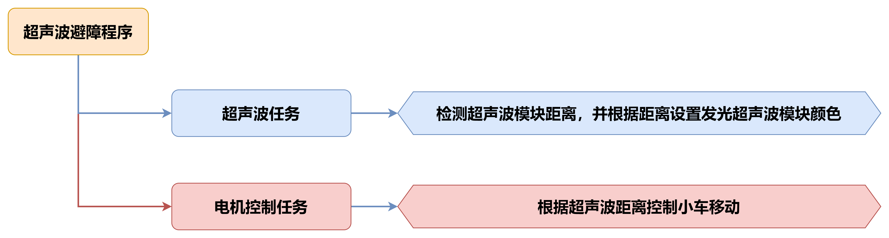

### 2. 超声波传感器

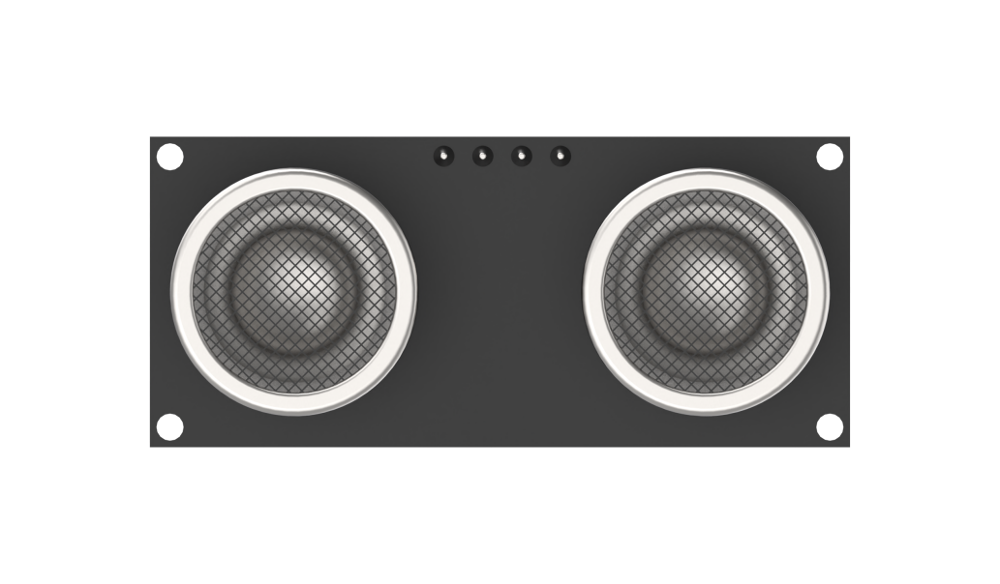

本节课用的是可发光的超声波测距模块，模块采用 IIC 通信接口，能通过 IIC通信进行读取超声波传感器测量的距离。

传感器测距时模块会自动发送 8 个 40khz 的方波，然后检测是否有信号返回； 如果有信号返回，便输出一个高电平，高电平持续的时间就是超声波从发射到返回的时间。

具体公式为：测试距离=(高电平时间\*声速(340M/S))/2。

### 3. 程序下载

:::{Note}

下载程序前需先将蓝牙模块取下，否则会因串口冲突导致程序下载失败。

接入Type-B下载线时请将电池盒开关拨到“OFF”挡，避免下载线误碰到扩展板的电源引脚，造成短路。

:::

1)  找到并打开本节同目录下的“**6.2 超声波避障程序\ultrasonic_avoid\\ultrasonic_avoid.ino**”程序文件。

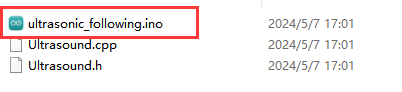

2)  将Arduino通过UNO数据线（Type-B）连接至电脑。点击“**选择开发板**”选项，软件会自动检测当前Arduino串口，点击进行连接。


3)  点击，将程序下载至Arduino中，等待下载完成即可。


### 4. 实现效果

打开小车电源，检测到板载按键被按下后，小车会以100的速度向前移动，同时小车会根据超声波所测障碍物的距离，改变发光超声波的颜色，并控制小车进行转向。

将障碍物正对超声波模块并移动障碍物使其缓慢靠近。

- #### 超声波灯光颜色变化效果：

1.  当**距离\>80mm时**，发光超声波模块上RGB灯模式为红色呼吸灯模式；
2.  当8**0mm\>距离\>180mm**时，发光超声波模块上RGB灯为红色渐变模式；
3.  当18**0mm\>距离\>320mm**时，发光超声波模块上RGB灯为蓝色渐变模式；
4.  当32**0mm\>距离\>500mm**时，发光超声波模块上RGB灯为绿色渐变模式；
5.  当**距离\>500mm**时，发光超声波模块上RGB灯为绿色常亮模式；

- #### 小车控制效果：

1.  当**距离\>=300mm时**，控制小车向前移动；
2.  当**距离\<300mm时**，控制小车右进行转向；

### 5. 程序简要分析

本玩法程序名为“**ultrasonic_avoid.ino**”，关于程序的实现逻辑可参考下面的流程图：


- #### 导入库文件

```c
#include "Ultrasound.h"
```

导入本玩法所需要的控制发光超声波的库文件。

- #### 定义变量及创建对象

首先创建了一个超声波类，用于获取距离数据，接着创建了pwm_min变量，用于存储pwm的最小映射值，然后创建了一个数组对数字电机引脚进行了定义,最后创建了dis变量，用于储存超声波距离的值。

```c
Ultrasound ultrasound;  // 实例化超声波类

const static uint8_t keyPin = 3;
const static uint8_t pwm_min = 50;
const static uint8_t motorpwmPin[4] = { 10, 9, 6, 11} ;
const static uint8_t motordirectionPin[4] = { 12, 8, 7, 13};
```

- #### 初始化设置

在setup()函数中，主要是串口进行初始化，将其通信的波特率设置为9600，接着调用了Motor_Init()函数绑定电机并对电机进行初始化。

```c
void setup() {
  Serial.begin(9600);
  pinMode(keyPin, INPUT);
  Motor_Init();
}
```

- #### 主函数

在主函数中按键被按下后，进入到超声波避障玩法功能中，循环调用超声波任务函数，用于获取距离数据以及设置发光超声波的颜色，通过对所测得的数据，进行判断后再对小车进行控制。

```c
void loop() {
  keyState = analogRead(keyPin);
  if(!keyState) taskStart = 1;
  if(taskStart) {
    ultrasonic_distance();
    dis = ultrasonic_distance();
    Velocity_Controller( 0, 100, 0, 0);
    while(dis < 300) {
      dis = ultrasonic_distance();
      Velocity_Controller( 0, 0, -100, 0);
    }  
  }
}
```

- #### 超声波检测

1. 调用loop主函数中的超声波任务函数ultrasonic_distance()，它是用于实现测距并改变灯光的颜色。


```c
uint16_t ultrasonic_distance(){
  uint8_t s;
  uint16_t distance = Filter();                                               // 获得滤波器输出值
  Serial.print("Distance: ");
  Serial.print(distance);
  Serial.println(" mm"); // 获取并且串口打印距离，单位mm
```

2. 距离大于0且小于等于80mm时，发光超声波为呼吸灯模式，以0.1s的速度显示红色。


```c
  if (distance > 0 && distance <= 80){
      ultrasound.Breathing(1, 0, 0, 1, 0, 0);                                 // 呼吸灯模式，周期0.1s，颜色红色
   }
```

3. 当距离大于80mm且小于180mm时，发光超声波为红色灯光渐变显示，距离越大则颜色越淡。


```c
  else if (distance > 80 && distance <= 180){
      s = map(distance,80,180,0,255);
      ultrasound.Color((255-s), 0, 0, (255-s), 0, 0);                         // 红色渐变
   }
```

4. 当距离大于180mm且小于320mm时，发光超声波为蓝色灯光渐变显示，距离越大则颜色越蓝。


```c
   else if (distance > 180 && distance <= 320){
      s = map(distance,180,320,0,255);
      ultrasound.Color(0, 0, s, 0, 0, s);                                     // 蓝色渐变
   }
```

5. 当距离大于320mm且小于500mm时，发光超声波为绿色灯光渐变显示，距离越大则颜色越绿。


```c
   else if (distance > 320 && distance <= 500){
      s = map(distance,320,500,0,255);
      ultrasound.Color(0, s, 255-s, 0, s, 255-s);                             // 绿色渐变
   }
```

6. 当距离大于500mm时，发光超声波的灯光的颜色固定为绿色。

```c
  else if (distance > 500){
      ultrasound.Color(0, 255, 0, 0, 255, 0);                                 // 绿色
   }
```

- #### 速度控制函数

在速度控制函数中，根据麦克纳姆轮的运动学分析进行计算各个电机的控制数值，angle参数用于设置小车的运动方向（车头的方向为0度，逆时针为正方向），velocity参数用于控制小车的速度，rot参数用于控制小车的自转方向（大于0为逆时针旋转，小于0为顺时针旋转），drift参数用于控制小车是否开启漂移功能。

```c
/**
 * @brief 速度控制函数
 * @param angle   用于控制小车的运动方向，小车以车头为0度方向，逆时针为正方向。
 *                取值为0~359
 * @param velocity   用于控制小车速度，取值为0~100。
 * @param rot     用于控制小车的自转速度，取值为-100~100，若大于0小车有一个逆
 *                 时针的自转速度，若小于0则有一个顺时针的自转速度。
 * @param drift   用于决定小车是否开启漂移功能，取值为0或1，若为0则开启，反之关闭。
 * @retval None
 */
void Velocity_Controller(uint16_t angle, uint8_t velocity,int8_t rot,bool drift) {
  int8_t velocity_0, velocity_1, velocity_2, velocity_3;
  float speed = 1;
  angle += 90;
  float rad = angle * PI / 180;
  if (rot == 0) speed = 1;// 速度因子
  else speed = 0.5; 
  velocity /= sqrt(2);
  if (drift) {
    velocity_0 = (velocity * sin(rad) - velocity * cos(rad)) * speed;
    velocity_1 = (velocity * sin(rad) + velocity * cos(rad)) * speed;
    velocity_2 = (velocity * sin(rad) - velocity * cos(rad)) * speed - rot * speed * 2;
    velocity_3 = (velocity * sin(rad) + velocity * cos(rad)) * speed + rot * speed * 2;
  } else {
    velocity_0 = (velocity * sin(rad) - velocity * cos(rad)) * speed + rot * speed;
    velocity_1 = (velocity * sin(rad) + velocity * cos(rad)) * speed - rot * speed;
    velocity_2 = (velocity * sin(rad) - velocity * cos(rad)) * speed - rot * speed;
    velocity_3 = (velocity * sin(rad) + velocity * cos(rad)) * speed + rot * speed;
  }
  Motors_Set(velocity_0, velocity_1, velocity_2, velocity_3);
}
```

- #### 电机控制函数

通过速度控制函数中计算所得的各个电机的控制数值，对各个电机进行pwm控制。motors数组用于将各个电机的速度值映射为pwm值，pwm_set数组用于控制给各个电机输出的pwm值。

```c
/**
 * @brief PWM与轮子转向设置函数
 * @param Motor_x   作为PWM与电机转向的控制数值。根据麦克纳姆轮的运动学分析求得。
 * @retval None
 */
void Motors_Set(int8_t Motor_0, int8_t Motor_1, int8_t Motor_2, int8_t Motor_3) {
  int8_t pwm_set[4];
  int8_t motors[4] = { Motor_0, Motor_1, Motor_2, Motor_3};
  bool direction[4] = { 1, 0, 0, 1};// 前进 左1 右0
  for(uint8_t i; i < 4; ++i) {
    if(motors[i] < 0) direction[i] = !direction[i];
    else direction[i] = direction[i];

    if(motors[i] == 0) pwm_set[i] = 0;
    else pwm_set[i] = map(abs(motors[i]), 0, 100, pwm_min, 255);

    digitalWrite(motordirectionPin[i], direction[i]); 
    analogWrite(motorpwmPin[i], pwm_set[i]); 
  }
}
```

### 6. 功能延伸

这里以修改小车转向的方向为例来进行说明，将遇到障碍物向右转，修改为向左转。具体修改内容可参考下面步骤：

1)  找到程序中控制小车转向的代码。这里是通过Velocity_Controller()函数来控制小车以100的速度顺时针向右旋转（小于0为顺时针旋转，大于0则为逆时针旋转）。


```c
void loop() {
  keyState = analogRead(keyPin);
  if(!keyState) taskStart = 1;
  if(taskStart) {
    ultrasonic_distance();
    dis = ultrasonic_distance();
    Velocity_Controller( 0, 100, 0, 0);
    while(dis < 300) {
      dis = ultrasonic_distance();
      Velocity_Controller( 0, 0, -100, 0);
    }  
  }
}
```

2. 将原先-100的值更改为100，此时小车就会以100的速度逆时针旋向左旋转了。

```c
void loop() {
  keyState = analogRead(keyPin);
  if(!keyState) taskStart = 1;
  if(taskStart) {
    ultrasonic_distance();
    dis = ultrasonic_distance();
    Velocity_Controller( 0, 100, 0, 0);
    while(dis < 300) {
      dis = ultrasonic_distance();
      Velocity_Controller( 0, 0, 100, 0);
    }  
  }
}
```

### 7. 常见问题解答

问：代码上传后超声波测出的距离一直为0。

答：请检查您是否将4pin线连接至正确的IIC接口。

问：超声波测出的距离有时准确，有时不准确。

答：请使用光滑平整的物品进行测距，同时应避免长时间近距离探测障碍物。

## 5.7 智能巡线

本节通过四路巡线传感器识别黑色的线路，再控制小车跟随线路移动。

### 1. 实现流程图

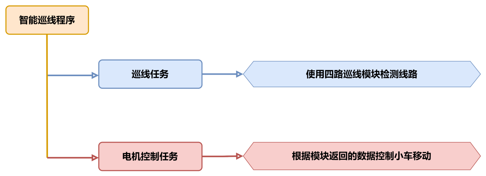

### 2. 四路巡线传感器

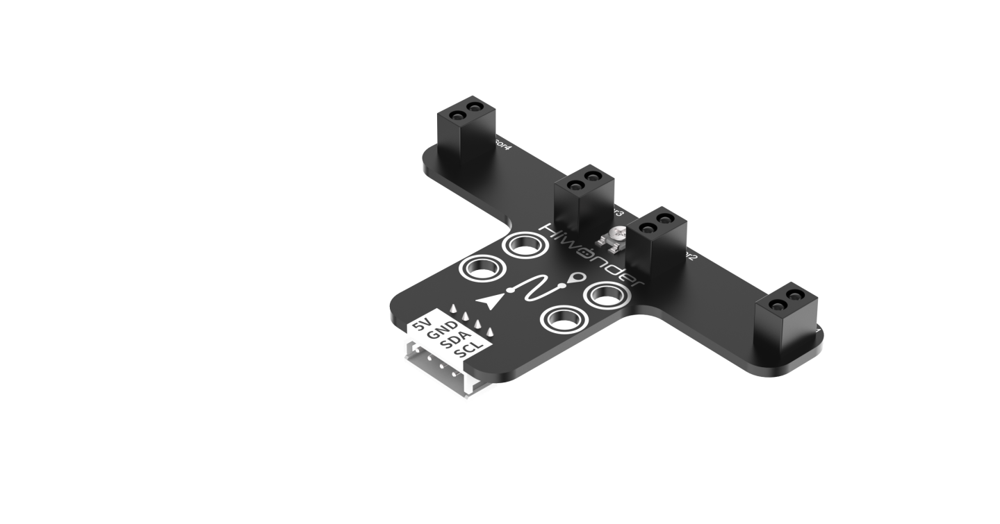

本节课用的是四路巡线模块，模块采用 IIC 通信接口，能通过 IIC通信进行读取传感器探头上的数据。

传感器有四个探头，每个探头都有一个红外发射器和一个红外接收器，白色对红外反射强，黑色对红外反射弱，由此可以判断是否识别到路线。

### 3. 程序下载

:::{Note}

下载程序前需先将蓝牙模块取下，否则会因串口冲突导致程序下载失败。

接入Type-B下载线时请将电池盒开关拨到“OFF”挡，避免下载线误碰到扩展板的电源引脚，造成短路。

:::

1)  找到并打开本节同目录下的“**7.2 智能巡线程序\tracking_test\\tracking_test.ino**”程序文件。


2)  将Arduino通过UNO数据线（Type-B）连接至电脑。点击“**选择开发板**”选项，软件会自动检测当前Arduino串口，点击进行连接。


3)  点击，将程序下载至Arduino中，等待下载完成即可。


### 4. 实现效果

先将小车放置在黑色线路上，打开小车电源，检测到板载按键被按下后，小车会进入到巡线程序中。当小车识别到黑色线时，会跟随黑线进行移动，若未识别到黑线则会进行后退，直到重新识别到黑线。

:::{Note}

在开始巡线程序前，请先将小车放置在黑线上，否则小车会一直后退

:::

### 5. 程序简要分析

本玩法程序名为“**tracking_test.ino**”，关于程序的实现逻辑可参考下面的流程图：

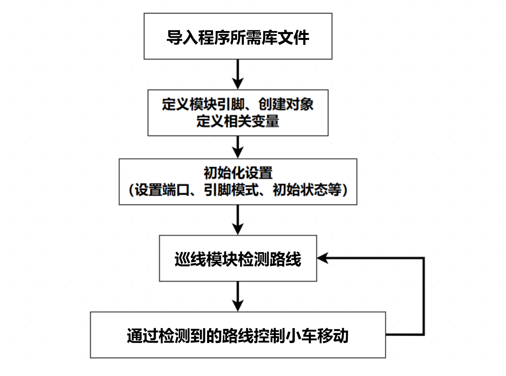

- #### 导入库文件

```c
#include <Wire.h>
#include "FastLED.h"
```

导入本玩法所需要的IIC通信、RGB灯库文件。

- #### 定义变量及创建对象

1)  首先定义了四路巡线传感器的IIC通讯地址，接着定义了板载RGB灯引脚、板载按键引脚、以及电机的引脚。


```c
/* 巡线传感器的iic地址 */
#define LINE_FOLLOWER_I2C_ADDR 0x78 

const static uint8_t ledPin = 2;
const static uint8_t keyPin = 3;
const static uint8_t pwm_min = 50;
const static uint8_t motorpwmPin[4] = { 10, 9, 6, 11 };
const static uint8_t motordirectionPin[4] = { 12, 8, 7, 13 };
const static uint8_t TRACKING = 4;
```

2. 创建了RGB灯控制对象，modestate变量用于设置小车的执行模式，本程序用的是巡线模式。

```c
static CRGB rgbs[1];
static uint8_t modestate = TRACKING;
```

- #### 初始化设置

1)  在setup()函数中，主要是串口进行初始化，将其通信的波特率设置为9600，接着将按键引脚配置为输入模式，使用FastLED库初始化扩展板上的RGB灯，并将其连接到ledPin引脚。通过Rgb_Show(255,255,255)设置RGB灯的颜色为白色。


```c
void setup() {
  /* 配置通信 */
  Serial.begin(9600);

  pinMode(keyPin, INPUT);
  FastLED.addLeds<WS2812, ledPin, GRB>(rgbs, 1);
  Rgb_Show(255, 255, 255);
```

2. 通过Wire.begin()初始化IIC通讯，调用Motor_Init()绑定并初始化电机引脚。

```c
  Wire.begin();
  Motor_Init();
}
```

- #### 主函数

在主函数中检测到按键被按下后，将循环调用Sensor_Receive()函数获取四路巡线传感器的值，进行判断后再对小车进行控制。接着调用Task_Dispatcher()函数执行巡线追踪任务。

```c
void loop() {
  keyState = analogRead(keyPin);
  if (!keyState) taskStart = 1;
  if (taskStart) {
    Sensor_Receive();
    Task_Dispatcher();
  }
}
```

- #### 获取传感器数据

通过WireReadDataByte()函数向传感器获取当前的路线数据，rec_data数组第0-3位对应的是四路巡线传感器上Sensor1-4探头的值。若获取到的值为0表示未识别到黑线，获取到的值为1则表示识别到黑线，最后将值保存在数组rec_data中。

```c
/* 获取传感器数据 */
void Sensor_Receive(void) {
  WireReadDataByte(1, data);
  rec_data[0] = data & 0x01;
  rec_data[1] = (data >> 1) & 0x01;
  rec_data[2] = (data >> 2) & 0x01;
  rec_data[3] = (data >> 3) & 0x01;
}
```

- #### 任务调度函数

在任务调度函数中，将会执行设置好的对应任务，通过modestate变量的值来执行相应的任务。

```c
/* 任务调度 */
void Task_Dispatcher() {
  switch (modestate) {
    case TRACKING:
      Tracking_Line_Task();
      break;
  }
}
```

- #### 巡线追踪任务

1)  首先调用Rgb_Show(255,0,0)函数将板载RGB设置为红色，对接收到的传感器数据进行判断，若Sensor2、Sensor3探头同时识别到黑线，则控制小车向前直行。


```c
void Tracking_Line_Task(void) {
  Rgb_Show(255, 0, 0);
  if (rec_data[1] == 1 && rec_data[2] == 1) {
    Velocity_Controller(0, 80, 0, 0);
  }
```

2. 如果Sensor2探头识别到黑线而Sensor3探头未识别到黑线，此时将控制小车向左偏65°前进。若Sensor3识别到黑线，而Sensor2未识别到，则向右偏65°进行移动。


```c
  if (rec_data[1] == 1 && rec_data[2] == 0) {
    Velocity_Controller(0, 80, 65, 0);
  }
  if (rec_data[1] == 0 && rec_data[2] == 1) {
    Velocity_Controller(0, 80, -65, 0);
  }
```

3. 当Sensor2和Sensor3都未识别到黑线时，控制小车进行后退。

```c
  while (rec_data[1] == 0 && rec_data[2] == 0) {
    Sensor_Receive();
    Velocity_Controller(0, 0, 0, 0);
  }
}
```


- #### 速度控制函数

在速度控制函数中，根据麦克纳姆轮的运动学分析进行计算各个电机的控制数值，angle参数用于设置小车的运动方向（车头的方向为0度，逆时针为正方向），velocity参数用于控制小车的速度，rot参数用于控制小车的自转方向（大于0为逆时针旋转，小于0为顺时针旋转），drift参数用于控制小车是否开启漂移功能。

```c
/**
 * @brief 速度控制函数
 * @param angle   用于控制小车的运动方向，小车以车头为0度方向，逆时针为正方向。
 *                取值为0~359
 * @param velocity   用于控制小车速度，取值为0~100。
 * @param rot     用于控制小车的自转速度，取值为-100~100，若大于0小车有一个逆
 *                 时针的自转速度，若小于0则有一个顺时针的自转速度。
 * @param drift   用于决定小车是否开启漂移功能，取值为0或1，若为0则开启，反之关闭。
 * @retval None
 */
void Velocity_Controller(uint16_t angle, uint8_t velocity, int8_t rot, bool drift) {
  int8_t velocity_0, velocity_1, velocity_2, velocity_3;
  float speed = 1;
  angle += 90;
  float rad = angle * PI / 180;
  if (rot == 0) speed = 1;  // 速度因子
  else speed = 0.5;
  velocity /= sqrt(2);
  if (drift) {
    velocity_0 = (velocity * sin(rad) - velocity * cos(rad)) * speed;
    velocity_1 = (velocity * sin(rad) + velocity * cos(rad)) * speed;
    velocity_2 = (velocity * sin(rad) - velocity * cos(rad)) * speed - rot * speed * 2;
    velocity_3 = (velocity * sin(rad) + velocity * cos(rad)) * speed + rot * speed * 2;
  } else {
    velocity_0 = (velocity * sin(rad) - velocity * cos(rad)) * speed + rot * speed;
    velocity_1 = (velocity * sin(rad) + velocity * cos(rad)) * speed - rot * speed;
    velocity_2 = (velocity * sin(rad) - velocity * cos(rad)) * speed - rot * speed;
    velocity_3 = (velocity * sin(rad) + velocity * cos(rad)) * speed + rot * speed;
  }
  Motors_Set(velocity_0, velocity_1, velocity_2, velocity_3);
}
```

- #### 电机控制函数

通过速度控制函数中计算所得的各个电机的控制数值，对各个电机进行pwm控制。motors数组用于将各个电机的速度值映射为pwm值，pwm_set数组用于控制给各个电机输出的pwm值。

```c
/**
 * @brief PWM与轮子转向设置函数
 * @param Motor_x   作为PWM与电机转向的控制数值。根据麦克纳姆轮的运动学分析求得。
 * @retval None
 */
void Motors_Set(int8_t Motor_0, int8_t Motor_1, int8_t Motor_2, int8_t Motor_3) {
  int8_t pwm_set[4];
  int8_t motors[4] = { Motor_0, Motor_1, Motor_2, Motor_3 };
  bool direction[4] = { 1, 0, 0, 1 };  // 前进 左1 右0
  for (uint8_t i; i < 4; ++i) {
    if (motors[i] < 0) direction[i] = !direction[i];
    else direction[i] = direction[i];

    if (motors[i] == 0) pwm_set[i] = 0;
    else pwm_set[i] = map(abs(motors[i]), 0, 100, pwm_min, 255);

    digitalWrite(motordirectionPin[i], direction[i]);
    analogWrite(motorpwmPin[i], pwm_set[i]);
  }
}
```

### 6. 功能延伸

如果巡线传感器识别不到黑色线路，那么就需要对巡线传感器的电位器进行调节，巡线传感器上的旋钮顺时针扭动会增加识别的距离，逆时针扭动则会缩短识别的距离。

需要将巡线传感器调节至识别到黑线，传感器上的LED灯会熄灭，识别不到黑线会亮起为止。

这里我们将旋钮逆时针扭动，缩短识别的距离，调节好之后就可以正常进行巡线了。

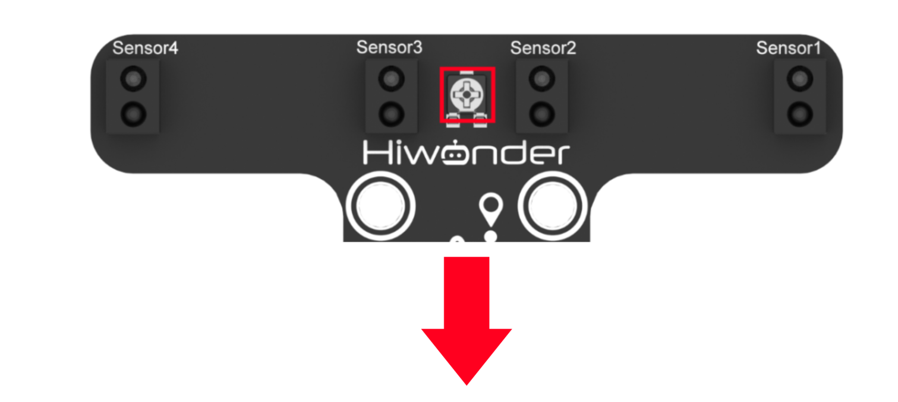

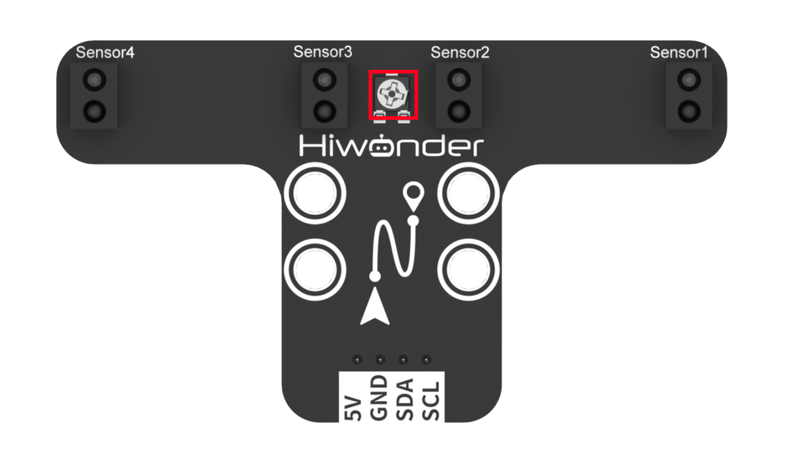

### 7. 常见问题解答

问：代码上传后小车一直进行后退。

答：请在运行代码前先将小车放置在黑线上方。

问：四路巡线传感器的识别不准确。

答：请将四路巡线传感器上的电位器调整至合适位置。

## 5.8 行人检测

本节通过四路巡线传感器识别黑色的线路，控制小车跟随线路移动，若在巡线中超声波检测到有行人在线路上，则控制小车进行规避。

### 1. 实现流程图


### 2. 模块介绍

- #### 四路巡线模块

四路巡线模块采用 IIC 通信接口，能通过 IIC通信进行读取传感器探头上的数据；

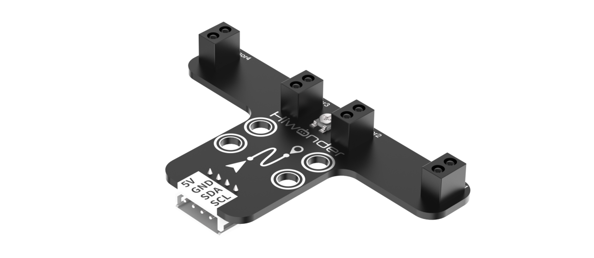

该模块有四个探头，每个探头都有一个红外发射器和一个红外接收器，白色对红外反射强，黑色对红外反射弱，由此可以判断是否识别到路线。

- #### 超声波模块

超声波模块采用 IIC 通信接口，能通过 IIC通信进行读取超声波传感器测量的距离。 同时超声波探头位置集成两个 RGB 灯，不仅能调节灯光亮度，还可以通过对红(R)、 绿(G)、蓝(B)三个颜色通道的变化以及它们相互之间的叠加，实现多彩颜色变化。


测距时模块会自动发送 8 个 40khz 的方波，然后检测是否有信号返回；如果有信号返回，便输出一个高电平，高电平持续的时间就是超声波从发射到返回的时间。

### 3. 程序下载

:::{Note}

下载程序前需先将蓝牙模块取下，否则会因串口冲突导致程序下载失败。

接入Type-B下载线时请将电池盒开关拨到“OFF”挡，避免下载线误碰到扩展板的电源引脚，造成短路。

:::

1)  找到并打开本节同目录下的“**8.2 行人检测程序\tracking_avoid\\tracking_avoid.ino**”程序文件。

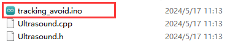


2. 将Arduino通过UNO数据线（Type-B）连接至电脑。点击“**选择开发板**”选项，软件会自动检测当前Arduino串口，点击进行连接。


3. 点击，将程序下载至Arduino中，等待下载完成即可。


### 4. 实现效果

先将小车放置在黑色线路上，按键被按下后，小车会进入到巡线程序中。

:::{Note}

在开始巡线程序前，请先将小车放置在黑线上，否则小车会一直后退

:::

当小车识别到黑色线时，会跟随黑线进行移动，若未识别到黑线则会进行后退，直到重新识别到黑线。在巡线的过程中如果超声波检测到前方有行人，则控制小车停止运行。

### 5. 程序简要分析

本玩法程序名为“**tracking_avoid.ino**”，关于程序的实现逻辑可参考下面的流程图：


- #### 导入库文件

```c
#include <Wire.h>
#include "Ultrasound.h"
#include "FastLED.h"
```

导入本玩法所需要的IIC通信、RGB灯、发光超声波库文件。

- #### 定义变量及创建对象

1. 首先定义了四路巡线传感器的IIC通讯地址，以及滤波算法的容量大小，接着创建了一个超声波对象。


```c
#define LINE_FOLLOWER_I2C_ADDR 0x78/* 寻线传感器的iic地址 */ 
#define FILTER_N 3                //递推平均滤波法

Ultrasound ultrasound;  //实例化超声波类
```

2. 定义了板载RGB灯引脚、板载按键引脚、以及电机的引脚，TRACKING变量用于表示巡线模式，AVOID是检测到行人所需进入的模式。


```c
const static uint8_t ledPin = 2;
const static uint8_t keyPin = 3;
const static uint8_t buzzerPin = 3;
const static uint8_t pwm_min = 10;
const static uint8_t motorpwmPin[4] = { 10, 9, 6, 11} ;
const static uint8_t motordirectionPin[4] = { 12, 8, 7, 13};
const static uint8_t TRACKING = 4;
const static uint8_t AVOID = 6;
```

3. 创建了RGB灯控制对象，modestate变量用于设置小车的执行模式，默认为巡线模式。

```c
static CRGB rgbs[1];
static uint8_t modestate = TRACKING;
```

- #### 初始化设置

1)  在setup()函数中，主要是串口进行初始化，将其通信的波特率设置为9600，接着将按键引脚配置为输入模式，使用FastLED库初始化扩展板上的RGB灯，并将其连接到ledPin引脚。通过Rgb_Show(255,255,255)设置RGB灯的颜色为白色。


```c
void setup(){
  /* 配置通信 */
  Serial.begin(9600);

  pinMode(keyPin, INPUT);
  FastLED.addLeds<WS2812, ledPin, GRB>(rgbs, 1);
  Rgb_Show(10,10,10);
```

2. 通过Wire.begin()初始化IIC通讯，调用Motor_Init()绑定并初始化电机引脚。

```c
  Wire.begin();
  Motor_Init();
}
```

- #### 主函数

在主函数中检测到按键被按下后，将循环调用Sensor_Receive()函数获取四路巡线传感器的值，用于检测黑线。再通过ultrasonic_distance()函数获取超声波的距离，用于检测是否有识别到行人。最后进行判断对小车进行控制。接着调用Task_Dispatcher()函数执行相应任务。

```c
void loop(){
  keyState = analogRead(keyPin);
  if(!keyState) taskStart = 1;
  if(taskStart) {
    Sensor_Receive();
    ultrasonic_distance();
    dis = ultrasonic_distance();
    Task_Dispatcher();
  }
}
```

- #### 获取传感器数据

通过WireReadDataByte()函数向传感器获取当前的路线数据，rec_data数组第0-3位对应的是四路巡线传感器上Sensor1-4探头的值。若获取到的值为0表示未识别到黑线，获取到的值为1则表示识别到黑线，最后将值保存在数组rec_data中。

```c
/* 获取传感器数据 */
void Sensor_Receive(void){
  WireReadDataByte(1,data);
  rec_data[0] = data & 0x01;
  rec_data[1] = (data>>1) & 0x01;
  rec_data[2] = (data>>2) & 0x01;
  rec_data[3] = (data>>3) & 0x01;
}
```

- #### 任务调度函数

在任务调度函数中，将会执行设置好的对应任务，通过modestate变量的值来执行相应的任务，默认处在巡线模式中。若超声波检测到行人则进入到行人检测任务中，直到未识别到行人才重新进入巡线模式。

```c
/* 任务调度 */
void Task_Dispatcher(){
	switch(modestate){
		case TRACKING:
			Tracking_Line_Task();
			break;
		case AVOID:
			Avoid_Task();
			break;
	}
}
```

- #### 巡线追踪任务

1)  首先调用Rgb_Show(255,0,0)函数将板载RGB设置为红色，对接收到的传感器数据进行判断，若Sensor2、Sensor3探头同时识别到黑线，则控制小车向前直行。


```c
void Tracking_Line_Task(void){
  Rgb_Show(10,0,0);   
  if(rec_data[1] == 1 && rec_data[2] == 1){
    Velocity_Controller(0, 50, 0, 0);
  }
```

2. 如果Sensor2探头识别到黑线而Sensor3探头未识别到黑线，此时将控制小车向左偏65°前进。若Sensor3识别到黑线，而Sensor2未识别到，则向右偏65°进行移动。


```c
  if(rec_data[1] == 1 && rec_data[2] == 0){
    Velocity_Controller(0, 50, 35, 0);
  }
 if(rec_data[1] == 0 && rec_data[2] == 1){
    Velocity_Controller(0, 50, -35, 0);
  }
```

3. 当Sensor2和Sensor3都未识别到黑线时，控制小车进行后退。

```c
  while(rec_data[1] == 0 && rec_data[2] == 0){
    Sensor_Receive();
    Velocity_Controller(180, 50, 0, 0);
  }
  if(dis <= 200){
    modestate = AVOID;
  }
}
```

- #### 行人检测任务

当检测到行人后，首先通过Velocity_Controller(0, 0, 0, 0)函数控制小车停止运行，调用Rgb_Show(0,255,0)使扩展板上的RGB灯亮绿色，再通过tone(buzzerPin, 1000)使蜂鸣器以1000Hz的频率进行鸣响。等待行人离开后，切换回巡线追踪模式，同时关闭蜂鸣器鸣响。

```c
/* 行人检测任务 */
void Avoid_Task(void){
  Velocity_Controller(0, 0, 0, 0);
  Rgb_Show(0,10,0);
  tone(buzzerPin, 1000);
  if(dis > 400) {
    modestate = TRACKING;
    noTone(buzzerPin);
  }
}
```

- #### 速度控制函数

在速度控制函数中，根据麦克纳姆轮的运动学分析进行计算各个电机的控制数值，angle参数用于设置小车的运动方向（车头的方向为0度，逆时针为正方向），velocity参数用于控制小车的速度，rot参数用于控制小车的自转方向（大于0为逆时针旋转，小于0为顺时针旋转），drift参数用于控制小车是否开启漂移功能。

```c
/**
 * @brief 速度控制函数
 * @param angle   用于控制小车的运动方向，小车以车头为0度方向，逆时针为正方向。
 *                取值为0~359
 * @param velocity   用于控制小车速度，取值为0~100。
 * @param rot     用于控制小车的自转速度，取值为-100~100，若大于0小车有一个逆
 *                 时针的自转速度，若小于0则有一个顺时针的自转速度。
 * @param drift   用于决定小车是否开启漂移功能，取值为0或1，若为0则开启，反之关闭。
 * @retval None
 */
void Velocity_Controller(uint16_t angle, uint8_t velocity,int8_t rot,bool drift) {
  int8_t velocity_0, velocity_1, velocity_2, velocity_3;
  float speed = 1;
  angle += 90;
  float rad = angle * PI / 180;
  if (rot == 0) speed = 1;///< 速度因子
  else speed = 0.5; 
  velocity /= sqrt(2);
  if (drift) {
    velocity_0 = (velocity * sin(rad) - velocity * cos(rad)) * speed;
    velocity_1 = (velocity * sin(rad) + velocity * cos(rad)) * speed;
    velocity_2 = (velocity * sin(rad) - velocity * cos(rad)) * speed - rot * speed * 2;
    velocity_3 = (velocity * sin(rad) + velocity * cos(rad)) * speed + rot * speed * 2;
  } else {
    velocity_0 = (velocity * sin(rad) - velocity * cos(rad)) * speed + rot * speed;
    velocity_1 = (velocity * sin(rad) + velocity * cos(rad)) * speed - rot * speed;
    velocity_2 = (velocity * sin(rad) - velocity * cos(rad)) * speed - rot * speed;
    velocity_3 = (velocity * sin(rad) + velocity * cos(rad)) * speed + rot * speed;
  }
  Motors_Set(velocity_0, velocity_1, velocity_2, velocity_3);
}
```

- #### 电机控制函数

通过速度控制函数中计算所得的各个电机的控制数值，对各个电机进行pwm控制。motors数组用于将各个电机的速度值映射为pwm值，pwm_set数组用于控制给各个电机输出的pwm值。

```c
/**
 * @brief PWM与轮子转向设置函数
 * @param Motor_x   作为PWM与电机转向的控制数值。根据麦克纳姆轮的运动学分析求得。
 * @retval None
 */
void Motors_Set(int8_t Motor_0, int8_t Motor_1, int8_t Motor_2, int8_t Motor_3) {
  int8_t pwm_set[4];
  int8_t motors[4] = { Motor_0, Motor_1, Motor_2, Motor_3};
  bool direction[4] = { 1, 0, 0, 1};///< 前进 左1 右0
  for(uint8_t i; i < 4; ++i) {
    if(motors[i] < 0) direction[i] = !direction[i];
    else direction[i] = direction[i];

    if(motors[i] == 0) pwm_set[i] = 0;
    else pwm_set[i] = map(abs(motors[i]), 0, 100, pwm_min, 255);

    digitalWrite(motordirectionPin[i], direction[i]); 
    analogWrite(motorpwmPin[i], pwm_set[i]); 
  }
}
```

### 6. 常见问题解答

问：代码上传后小车一直进行后退。

答：请在运行代码前先将小车放置在黑线上方。

问：四路巡线传感器的识别不准确。

答：请将四路巡线传感器上的电位器调整至合适位置。

## 5.9 十字路口判断

本节通过四路巡线传感器识别黑色的线路，再控制小车跟随线路移动，若遇到十字路口则控制小车停止运行。

### 1. 实现流程图


### 2. 四路巡线传感器


本节课用的是四路巡线模块，模块采用 IIC 通信接口，能通过 IIC通信进行读取传感器探头上的数据。

传感器有四个探头，每个探头都有一个红外发射器和一个红外接收器，白色对红外反射强，黑色对红外反射弱，由此可以判断是否识别到路线。

<p id="program-download7"></p>

### 3. 程序下载

:::{Note}

下载程序前需先将蓝牙模块取下，否则会因串口冲突导致程序下载失败。

接入Type-B下载线时请将电池盒开关拨到“OFF”挡，避免下载线误碰到扩展板的电源引脚，造成短路。

:::


1)  找到并打开本节同目录下的“**9.2 十字路口判断程序\tracking_crossroads\\tracking_crossroads.ino**”程序文件。


2)  将Arduino通过UNO数据线（Type-B）连接至电脑。

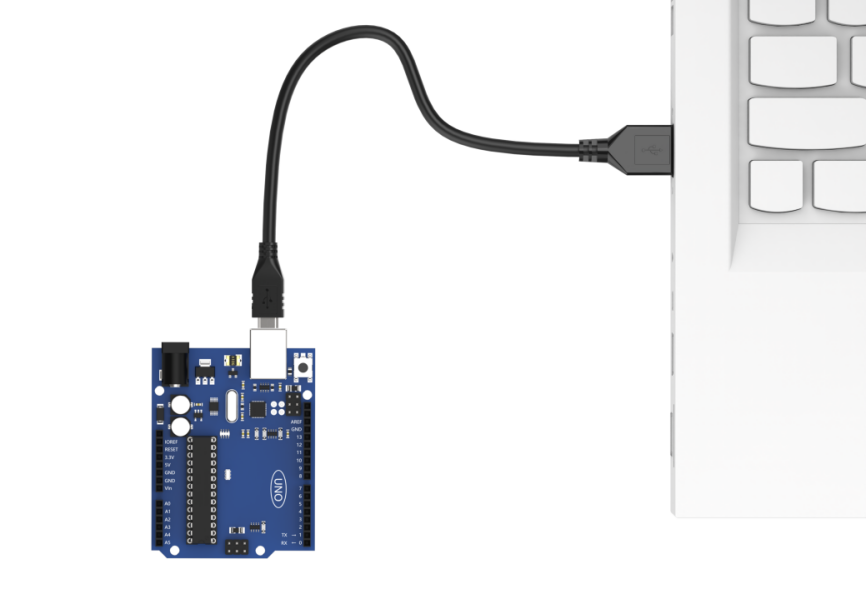

3)  点击“**选择开发板**”选项，软件会自动检测当前Arduino串口，点击进行连接。


4)  点击，将程序下载至Arduino中，等待下载完成即可。


### 4. 实现效果

先将小车放置在黑色线路上，打开小车电源，检测到板载按键被按下后，小车会进入到巡线程序中。当小车识别到黑色线时，会跟随黑线进行移动，若未识别到黑线则会进行后退，直到重新识别到黑线。**（注意：在开始巡线程序前，请先将小车放置在黑线上，否则小车会一直后退）**

### 5. 程序简要分析

本玩法程序名为“**tracking_crossroads.ino**”，关于程序的实现逻辑可参考下面的流程图：


- #### 导入库文件

```c
#include <Wire.h>
#include "FastLED.h"
```

导入本玩法所需要的IIC通信、RGB灯库文件。

- #### 定义变量及创建对象

1)  首先定义了四路巡线传感器的IIC通讯地址，接着定义了板载RGB灯引脚、板载按键引脚、以及电机的引脚。


```c
#define LINE_FOLLOWER_I2C_ADDR 0x78 /* 巡线传感器的iic地址 */

const static uint8_t ledPin = 2;
const static uint8_t keyPin = 3;
const static uint8_t pwm_min = 50;
const static uint8_t motorpwmPin[4] = { 10, 9, 6, 11 };
const static uint8_t motordirectionPin[4] = { 12, 8, 7, 13 };
const static uint8_t TRACKING = 4;
const static uint8_t INTERSECTION_DETECTION = 5;
```

2. 创建了RGB灯控制对象，modestate变量用于设置小车的执行模式，默认为巡线模式。

```c
static CRGB rgbs[1];
static uint8_t modestate = TRACKING;
```

- #### 初始化设置

1)  在setup()函数中，主要是串口进行初始化，将其通信的波特率设置为9600，接着将按键引脚配置为输入模式，使用FastLED库初始化扩展板上的RGB灯，并将其连接到ledPin引脚。通过Rgb_Show(255,255,255)设置RGB灯的颜色为白色。


```c
void setup() {
  /* 配置通信 */
  Serial.begin(9600);

  pinMode(keyPin, INPUT);
  FastLED.addLeds<WS2812, ledPin, GRB>(rgbs, 1);
  Rgb_Show(255, 255, 255);

  Wire.begin();
  Motor_Init();
}
```

2. 通过Wire.begin()初始化IIC通讯，调用Motor_Init()绑定并初始化电机引脚。

```c
  Wire.begin();
  Motor_Init();
```

- #### 主函数

在主函数中检测到按键被按下后，将循环调用Sensor_Receive()函数获取四路巡线传感器的值，进行判断后再对小车进行控制。接着调用Task_Dispatcher()函数执行任务调度执行相应的模式。

```c
void loop() {
  keyState = analogRead(keyPin);
  if (!keyState) taskStart = 1;
  if (taskStart) {
    Sensor_Receive();
    Task_Dispatcher();
  }
}
```

- #### 获取传感器数据

通过WireReadDataByte()函数向传感器获取当前的路线数据，rec_data数组第0-3位对应的是四路巡线传感器上Sensor1-4探头的值。若获取到的值为0表示未识别到黑线，获取到的值为1则表示识别到黑线，最后将值保存在数组rec_data中。

```c
/* 获取传感器数据 */
void Sensor_Receive(void) {
  WireReadDataByte(1, data);
  rec_data[0] = data & 0x01;
  rec_data[1] = (data >> 1) & 0x01;
  rec_data[2] = (data >> 2) & 0x01;
  rec_data[3] = (data >> 3) & 0x01;
}
```

- #### 任务调度函数

在任务调度函数中，将会执行设置好的对应任务，通过modestate变量的值来执行相应的任务，默认处在巡线模式中。若识别到十字路口则进入到十字路口检测任务中。

```c
/* 任务调度 */
void Task_Dispatcher() {
  switch (modestate) {
    case TRACKING:
      Tracking_Line_Task();
      break;
    case INTERSECTION_DETECTION:
			Intersection_Detection_Task();
			break;
  }
}
```

- #### 巡线追踪任务

1)  首先调用Rgb_Show(255,0,0)函数将板载RGB设置为红色，对接收到的传感器数据进行判断，若Sensor2、Sensor3探头同时识别到黑线，则控制小车向前直行。


```c
void Tracking_Line_Task(void) {
  Rgb_Show(255, 0, 0);
  if (rec_data[1] == 1 && rec_data[2] == 1) {
    Velocity_Controller(0, 80, 0, 0);
  }
```

2. 如果Sensor2探头识别到黑线而Sensor3探头未识别到黑线，此时将控制小车向左偏65°前进。若Sensor3识别到黑线，而Sensor2未识别到，则向右偏65°进行移动。


```c
  if (rec_data[1] == 1 && rec_data[2] == 0) {
    Velocity_Controller(0, 80, 65, 0);
  }
  if (rec_data[1] == 0 && rec_data[2] == 1) {
    Velocity_Controller(0, 80, -65, 0);
  }
```

3. 当Sensor2和Sensor3都未识别到黑线时，控制小车进行后退。


```c
  while (rec_data[1] == 0 && rec_data[2] == 0) {
    Sensor_Receive();
    Velocity_Controller(0, 0, 0, 0);
  }
```

4. 若Sensor0和Sensor3都识别到到黑线时，则表示当前处于十字路口，进入到十字路口检测任务。

```c
  if(rec_data[0] == 1 && rec_data[3] == 1){     //0没识别到黑线 1识别到黑线
    modestate = INTERSECTION_DETECTION;    
  }
```

- #### 速度控制函数

在速度控制函数中，根据麦克纳姆轮的运动学分析进行计算各个电机的控制数值，angle参数用于设置小车的运动方向（车头的方向为0度，逆时针为正方向），velocity参数用于控制小车的速度，rot参数用于控制小车的自转方向（大于0为逆时针旋转，小于0为顺时针旋转），drift参数用于控制小车是否开启漂移功能。

```c
/**
 * @brief 速度控制函数
 * @param angle   用于控制小车的运动方向，小车以车头为0度方向，逆时针为正方向。
 *                取值为0~359
 * @param velocity   用于控制小车速度，取值为0~100。
 * @param rot     用于控制小车的自转速度，取值为-100~100，若大于0小车有一个逆
 *                 时针的自转速度，若小于0则有一个顺时针的自转速度。
 * @param drift   用于决定小车是否开启漂移功能，取值为0或1，若为0则开启，反之关闭。
 * @retval None
 */
void Velocity_Controller(uint16_t angle, uint8_t velocity, int8_t rot, bool drift) {
  int8_t velocity_0, velocity_1, velocity_2, velocity_3;
  float speed = 1;
  angle += 90;
  float rad = angle * PI / 180;
  if (rot == 0) speed = 1;  // 速度因子
  else speed = 0.5;
  velocity /= sqrt(2);
  if (drift) {
    velocity_0 = (velocity * sin(rad) - velocity * cos(rad)) * speed;
    velocity_1 = (velocity * sin(rad) + velocity * cos(rad)) * speed;
    velocity_2 = (velocity * sin(rad) - velocity * cos(rad)) * speed - rot * speed * 2;
    velocity_3 = (velocity * sin(rad) + velocity * cos(rad)) * speed + rot * speed * 2;
  } else {
    velocity_0 = (velocity * sin(rad) - velocity * cos(rad)) * speed + rot * speed;
    velocity_1 = (velocity * sin(rad) + velocity * cos(rad)) * speed - rot * speed;
    velocity_2 = (velocity * sin(rad) - velocity * cos(rad)) * speed - rot * speed;
    velocity_3 = (velocity * sin(rad) + velocity * cos(rad)) * speed + rot * speed;
  }
  Motors_Set(velocity_0, velocity_1, velocity_2, velocity_3);
}
```

- #### 电机控制函数

通过速度控制函数中计算所得的各个电机的控制数值，对各个电机进行pwm控制。motors数组用于将各个电机的速度值映射为pwm值，pwm_set数组用于控制给各个电机输出的pwm值。

```c
/**
 * @brief PWM与轮子转向设置函数
 * @param Motor_x   作为PWM与电机转向的控制数值。根据麦克纳姆轮的运动学分析求得。
 * @retval None
 */
void Motors_Set(int8_t Motor_0, int8_t Motor_1, int8_t Motor_2, int8_t Motor_3) {
  int8_t pwm_set[4];
  int8_t motors[4] = { Motor_0, Motor_1, Motor_2, Motor_3 };
  bool direction[4] = { 1, 0, 0, 1 };  // 前进 左1 右0
  for (uint8_t i; i < 4; ++i) {
    if (motors[i] < 0) direction[i] = !direction[i];
    else direction[i] = direction[i];

    if (motors[i] == 0) pwm_set[i] = 0;
    else pwm_set[i] = map(abs(motors[i]), 0, 100, pwm_min, 255);

    digitalWrite(motordirectionPin[i], direction[i]);
    analogWrite(motorpwmPin[i], pwm_set[i]);
  }
}
```

### 6. 功能延伸

这里以修改检测到十字路口后，控制小车向左转为例。

找到代码中的十字路口检测任务函数，将原来的识别到十字路口停止2秒钟，修改为向左转0.5秒。

```c
/* 十字路口检测任务 */
void Intersection_Detection_Task(void){
  Rgb_Show(0,0,255);
  Velocity_Controller(0, 0, 65, 0);
  delay(2000);
  modestate = TRACKING;    
}
```

修改完成后，参照“[3. 程序下载](#program-download7)”重新下载程序即可。

### 7. 常见问题解答

问：代码上传后小车一直进行后退。

答：请在运行代码前先将小车放置在黑线上方。

问：四路巡线传感器的识别不准确。

答：请将四路巡线传感器上的电位器调整至合适位置。
