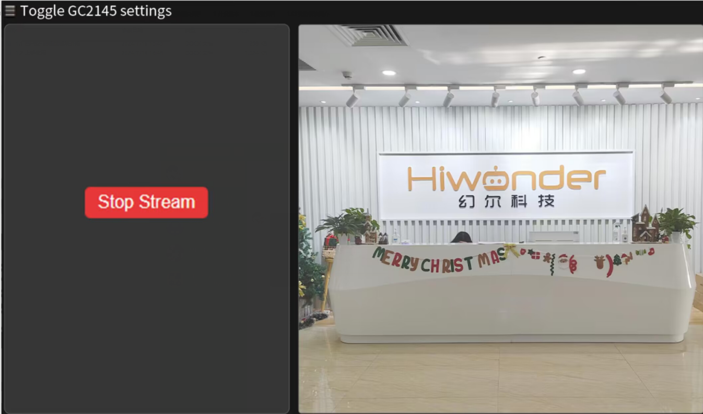
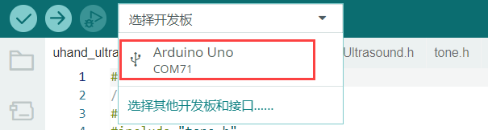

# AI视觉项目课程

## 6.1 ESP32-S3视觉模块介绍

### 1. ESP32-S3视觉模块简介 

ESP32S3视觉模块是一款小尺寸的摄像头模组，该模块可以作为最小系统独立工作。ESP32S3视觉模块是物联网应用的理想解决方案，可广泛应用于如全屋智联、工业控制和智慧农业等等物联网场景，实现方案的快速开发，为用户提供高可靠的连接方式，方便与各种硬件终端设备结合应用。

- #### 接口说明


| **接口名称** |           **接口说明**           |
|:------------:|:--------------------------------:|
|   USB串口    |        串口通信、固件烧录        |
|  自定义按钮  | 可在代码中对该按键事件进行自定义 |
|   IIC接口    |   二次开发接口，与主控进行连接   |

- #### 图像坐标系

我们将模块图像坐标系值得注意的特殊之处在此简要介绍，请用户注意：

1.  原点并不在屏幕的正中央，而在屏幕的左上角

2.  Y轴的方向与常见的平面直角坐标系Y轴方向相反

- ##### 图像回传模式


:::{Note}

图像回传模式采取该分辨率（320\*240），是出于适配我司手机APP端获取图像数据接口的需要

:::

- ##### 人脸识别模式


:::{Note}

为了确保图像的流畅性，人脸识别模式采取的该分辨率（240\*240）为我司的测试后的取值。

:::

- ##### 视觉巡线/颜色识别模式


:::{Note}

为了确保图像的流畅性，视觉巡线/颜色识别模式采取的该分辨率（160\*140）为我司的测试后取值。

:::

- #### 参数说明


| **参数名称** |              **规格**              |
|:------------:|:----------------------------------:|
|     尺寸     |            59\*43\*17.5            |
|   供电范围   |             4.75~5.25V             |
|  SPI Flash   |            最大支持16MB            |
|     RAM      |      内部512KB+外部16MB PSRAM      |
|     蓝牙     | 支持 Bluetooth 5 和 Bluetooth Mesh |
|     WiFi     |            802.11 b/g/n            |
|   支持接口   |             UART、I2C              |
|   串口速率   |           默认支持115200           |
| 图像输出格式 | JPEG（仅OV2640支持）BMP，GRAYSCALE |
|   频谱范围   |            2412~2484MHz            |
|   天线形式   |            板载PCB天线             |

:::{Note}

产品规格参数为理论值，仅供参考，请以实际效果为准。

:::

### 2. 注意事项

1)  请保证模块输入电源至少5V 2A,否则图片会有几率出现水纹。

2)  **出厂已含有默认固件，该固件为图像回传功能，不另外提供下载，如需重烧其他固件请谨慎操作。**

## 6.2 视觉模块库文件及寄存器介绍

本节对ESP32-S3视觉模块的驱动库进行分析，这个库是用来获取ESP32-S3视觉模块识别到的人脸数据或颜色数据的，该库包含hw_esp32S3cam_ctl.h和hw_esp32S3cam_ctl.cpp这2个文件。

### 1.库文件打开路径

1)  在“**1.教程资料\5.AI视觉玩法课程**”路径下打开任意程序，这里我们以“5.4 颜色识别”为例。


2)  在打开的程序中，选择“**hw_esp32cam_ctl.cpp**”。


### 2.库文件说明

- #### 成员函数 (HW_ESP32S3CAM::Init)

```c
void HW_ESP32S3CAM::Init()
{
    Wire.setClock(100000);
    Wire.begin();
}
```

该函数用于初始化IIC总线的配置，从而可以在后面通过总线与S3视觉模块进行指令下达和数据接收。

- #### 底层函数 (Wire_Write_Data_Array)

```c
static bool Wire_Write_Data_Array(uint8_t addr, uint8_t reg, uint8_t *val, uint16_t len)
{
   uint16_t i;
    Wire.beginTransmission(addr);
    Wire.write(reg);
    for(i = 0; i < len; i++) 
    {
        Wire.write(val[i]);
    }
    if( Wire.endTransmission() != 0 ) 
    {
        return false;
    }
    return true;
}
```


<table class="docutils" border="1">
<tr>
<td colspan="4" style="text-align: center;"><strong>Wire_Write_Data_Array()</strong></td>
</tr>
<tr>
<td style="text-align: center;">函数描述</td>
<td colspan="3" style="text-align: center;">通过IIC总线向esp32-S3视觉模块寄存器发送数据</td>
</tr>
<tr>
<td style="text-align: center;">参数列表</td>
<td style="text-align: center;">Addr，reg，*val，len</td>
<td style="text-align: center;">返回值</td>
<td style="text-align: center;"><p>False:写入失败</p>
<p>True：写入成功</p></td>
</tr>
<tr>
<td style="text-align: center;">使用说明</td>
<td colspan="3" style="text-align: center;">
1.使用本函数前请先调用HW_ESP32S3CAM::Init<br>
2.在之后的开发中，并没有使用到本函数，此处读者可以仅做简单了解即可</td>
</tr>
</table>


参数及含义：

1.  **addr**：esp32-S3视觉模块设备地址（0x53）

2.  **reg**：向esp32-S3视觉模块写入的目标内存地址

3.  **\*val**:需要发送的数据地址

4.  **len**：需要发送的字长

arduino主设备首先通过IIC发送设备地址，再向esp32-S3视觉模块发送目标内存的地址，再根据字长按字节发送数据。之后通过endTransmission()检测数据是否发送成功，若返回值为0，表示数据发送成功，否则表示发送失败。

- #### 底层函数 (Wire_Write_Byte)

```c
static bool Wire_Write_Byte(uint8_t val)
{
    Wire.beginTransmission(ESP32S3_ADDR);
    Wire.write(val);
    if( Wire.endTransmission() != 0 ) {
        return false;
    }
    return true;
}
```


<table class="docutils" border="1">
<colgroup>
<col style="width: 24%" />
<col style="width: 31%" />
<col style="width: 18%" />
<col style="width: 25%" />
</colgroup>
<tbody>
<tr>
<td colspan="4" style="text-align: center;"><strong>Wire_Write_Byte()</strong></td>
</tr>
<tr>
<td style="text-align: center;">函数描述</td>
<td colspan="3" style="text-align: center;">在读取esp32-S3视觉模块数据前，确认读取的数据寄存器地址</td>
</tr>
<tr>
<td style="text-align: center;">参数列表</td>
<td style="text-align: left;">*val</td>
<td style="text-align: center;">返回值</td>
<td style="text-align: center;"><p>False:传输失败</p>
<p>True：传输成功</p></td>
</tr>
<tr>
<td style="text-align: center;">使用说明</td>
<td colspan="3" style="text-align: center;">
1.使用本函数前请先调用HW_ESP32S3CAM::Init<br>2.在数据传输/写入时，其实也需要向从机确认写入的数据寄存器地址，在Wire_Write_Data_Array内也有本函数相同的实现语句
</td>
</tr>
</tbody>
</table>

参数及含义：

**\*val**：发送的数据内容

arduino主设备直接向esp32-S3视觉模块发送设备地址，再将1字节的数据内容发送给esp32-S3视觉模块。之后通过endTransmission()检测数据是否发送成功，若返回值为0，表示数据发送成功，否则表示发送失败。

- #### 底层函数 (Wire_Read_Data_Array)

```c
static int Wire_Read_Data_Array(uint8_t reg, 
                                uint8_t *val, 
                                uint16_t len)
{
    uint16_t i = 0;
    
    /* Indicate which register we want to read from */
    if (!Wire_Write_Byte(reg)) {
        return -1;
    }
    
    /* Read block data */
    Wire.requestFrom(ESP32S3_ADDR, len);
    while (Wire.available()) {
        if (i >= len) {
            return -1;
        }
        val[i] = Wire.read();
        i++;
    }   
    return i;
}
```


<table class="docutils" border="1">
<tr>
<td colspan="4" style="text-align: center;"><strong>Wire_Read_Data_Array()</strong></td>
</tr>
<tr>
<td style="text-align: center;">函数描述</td>
<td colspan="3" style="text-align: center;">通过IIC总线，从esp32-S3视觉模块读取多字节的数据</td>
</tr>
<tr>
<td style="text-align: center;">参数列表</td>
<td style="text-align: center;">reg，*val，len</td>
<td style="text-align: center;">返回值</td>
<td style="text-align: center;"><p>-1：读取失败</p>
<p>Other：成功读取到的数据长度</p></td>
</tr>
<tr>
<td style="text-align: center;">使用说明</td>
<td colspan="3" style="text-align: center;">
<p>1.使用本函数前请先调用HW_ESP32S3CAM::Init</p>
<p>2.使用本函数前请先调用Wire_Write_Byte确定读取寄存器地址</p></td>
</tr>
</table>


参数及含义：

1.  **reg**：esp32-S3视觉模块中需要读取的数据地址

2.  **\*val**：arduino主设备中用于存放数据的地址

3.  **len**：需要读取的字长

arduino主设备首先向esp32-S3视觉模块发送需要读取的数据地址，若无应答返回-1，表示esp32-S3视觉模块建立连接失败。之后，向esp32-S3视觉模块设备发送字长，通过while循环以及i的变量按字节读取数据，并存放在val\[\]数组中。若读取过程中，实际读取的字长超过了需要读取的字长，则返回-1，表示读取失败。最后，在读取成功后返回i，即实际读取到的字长（**i可能小于len**）

- #### 成员函数 (HW_ESP32S3CAM::Facedetection_Data_Receive)

```c
uint16_t HW_ESP32S3CAM::Linepatrol_Data_Receive(uint8_t reg, uint8_t *buf, uint16_t buf_len)
{
    return Wire_Read_Data_Array(reg, buf, buf_len);
}
```

<table class="docutils" border="1" style="text-align: center;">
    <thead><tr><th colspan="4" style="text-align: center;">HW_ESP32S3CAM::Facedetection_Data_Receive()</th></tr></thead>
    <tbody>
    	<tr><td>函数描述</td><td colspan="3">读取esp32-S3视觉模块检测人脸的结果</td></tr>
        <tr><td>参数列表</td><td>Reg，buf，buf_len</td><td>返回值</td><td>无</td></tr>
        <tr><td>使用说明</td><td colspan="3">本质上是对Wire_Read_Data_Array直接调用进行的一层封装，具体参数的物理含义与Wire_Read_Data_Array一致</td></tr>
    </tbody>
</table>

1)  颜色识别与视觉巡线功能实现时，函数内部的实现方式与人脸识别高度一致，此处不再赘述，读者可自行翻阅源代码，并结合下文“设备主从通讯原理”，学习视觉模块各功能寄存器内各个地址内存储的信息的物理含义。

### 3. 设备主从通讯原理(模块IIC寄存器)

**ESP32S3视觉模块 I2C从机数据地址 ：0x53**

注意：因寄存器的篇幅内容较长，可在“2.2 寄存器说明”文档内查看。

## 6.3 图像回传

本节通过连接ESP32-S3视觉模块产生的热点，登录固定网址查看摄像头实时回传画面。

:::{Note}

出厂时已烧录了图像回传的固件，若后续下载了其他玩法的固件，则需重新烧录图像回传固件才可以使用本功能。固件下载可查看本文档中的 [<u>固件烧录</u>](#bookmark1)。

:::


### 1. 设备连接

1)  使用Type-C线连接视觉模块到电脑。(在设备管理器中检查端口是否连接正常)


:::{Note}

若您不能在端口中找到设备，可能是因为电脑没有装配驱动程序，您可以在“2.软件工具&&程序合辑\ch34x驱动（windows环境）”路径找到安装包，自行安装下载。

:::


2)  连接找到模块产生的热点：HW_ESP32S3CAM。


:::{Note}

上述连接操作为AP直连模式下进行，视觉模块亦可支持STA局域网模式下连接，关于模式相关说明和操作步骤参考“4.拓展学习资料”。

:::

### 2. 图像回传实现

在浏览器网址栏（手机、PC端浏览器皆可，我们以PC端为例子）中输入“192.168.5.1”后回车，在打开的页面里，点击按钮，即可进入到摄像头回传界面。



<p id="bookmark1"></p>

### 3. 图像回传固件烧录（选看）

1)  将ESP32-S3视觉模块连接电脑。

2)  双击并打开“**2.软件工具\1.固件烧录工具\flash_download_tool_3.9.7**”下的“**flash_download_tool_3.9.7.exe**”文件。


3)  稍等片刻，在打开的界面中，按下图进行配置。


4)  在烧录界面中，先再点击“”选择固件(“**5.3 图像回传\5.3.2 图像回传固件\image_transmit.bin**”)。


5)  根据下图所框内容选择如下配置（端口号以实际情况为准，切勿选择COM1，否则会烧录不成功）。


6)  点击“**ERASE**”，对已有固件进行擦除（**一定要进行此操作**），再点击“**START**”，开始烧录。


7)  稍等片刻，会出现完成的提示，断开数据线。


:::{Note}

烧录完成后，需要重启模块。

:::


## 6.4 颜色识别

本节讲解小车通过搭载的ESP32-S3视觉模块，实现识别红、蓝物块，同时控制RGB灯颜色、蜂鸣器鸣响及小车移动。

### 1. 实现流程图


### 2. ESP32-S3视觉模块


这是一款集成了ESP32芯片和摄像头模块的开发板，模块插入载板后，采用 IIC 通信接口，能通过 IIC通信进行读取颜色、人脸数据。

ESP32-S3视觉模块板载了OV2640摄像头模块，通过串行接口将采集的图像数据传输给ESP32芯片，后者可处理图像并通过IIC通信传输至其他设备。

### 3. 程序下载

- #### ESP32-S3视觉模块程序下载

1)  将Type-C数据线连接ESP32-S3与电脑。

2)  双击并打开“**2.软件工具\1.固件&烧录工具\flash_download_tool_3.9.7**”下的“**flash_download_tool_3.9.7.exe**”文件。


3)  在打开的界面中，按下图进行配置。


4)  在烧录界面中，先再点击“”选择固件(“**4.2 颜色识别固件&烧录工具\color_detection.bin**”)再根据下图所框内容选择如下配置。


5)  选择端口号（端口号以实际情况为准，切勿选择COM1，否则会烧录不成功）。

6)  先点击“**ERASE**”，对底层固件进行擦除（**一定要进行此操作**），再点击“**START**”，开始烧录。


7)  稍等片刻，会出现完成的提示。


8)  烧录完成后断开Type-C数据线即可。

<p id="bookmark2"></p>

- #### Arduino UNO程序下载

:::{Note}

下载程序前需先将蓝牙模块取下，否则会因串口冲突导致程序下载失败。

接入Type-B下载线时请将电池盒开关拨到“OFF”挡，避免下载线误碰到扩展板的电源引脚，造成短路。

:::

1)  找到并打开本节同目录下的“**color_discrimination.ino**”程序文件。


2)  将Arduino通过UNO数据线（Type-B）连接至电脑。

3)  点击“**选择开发板**”选项，软件会自动检测当前Arduino串口，点击进行连接。


4)  点击，将程序下载至Arduino中，等待下载完成即可。


### 4. 实现效果

1.  小车识别到红色则扩展板上的RGB亮红灯，同时蜂鸣器鸣响1声，小车前后晃动。

2.  当识别到蓝色时，扩展板上的RGB亮蓝灯，同时蜂鸣器鸣响2声，小车左右晃动。

3.  当未识别到设定的红、蓝色时，扩展板上的RGB亮白灯。

### 5. 程序简要分析

本玩法程序名为“**color_discrimination.ino**”，关于程序的实现逻辑可参考下面的流程图：


- #### 导入库文件

导入玩法所需的RGB控制库、ESP32S3视觉模块的通信库文件。

```c
#include <Arduino.h>
#include "FastLED.h"
#include "hw_esp32s3cam_ctl.h"
```

- #### 定义引脚及创建对象

1)  首先定义了用于一个RGB灯引脚和一个蜂鸣器引脚。

```c
const static uint8_t ledPin = 2;
const static uint8_t buzzerPin = 3;
```

2)  然后创建了RGB灯对象用于控制RGB灯的颜色；ESP32S3视觉模块对象用于与ESP32S3视觉模块进行通讯。

```c
static CRGB rgbs[1];
HW_ESP32S3CAM hw_cam;                              // 实例化ESP32-Cam摄像头类
```

- #### 初始化设置

1)  在setup()函数中，主要是对相关的硬件设备进行初始化。首先是串口，将其通信的波特率设置为9600以及读取数据超时时间为500ms。

```c
void setup() {
  // put your setup code here, to run once:
  Serial.begin(9600);
  Serial.setTimeout(500);       // 设置串行端口读取数据的超时时间
```

2)  初始化与ESP32-S3视觉模块的通信接口并设置ESP32-S3视觉模块的补光灯亮度为0（在0到255的范围内）。


```c
  hw_cam.Init(); //初始化与ESP32Cam通讯接口
```

3. 使用FastLED库初始化扩展板上的RGB灯，并连接到ledPin引脚。通过Rgb_Show(255,255,255)设置颜色为白色并显示设置的颜色。


```c
  FastLED.addLeds<WS2812, ledPin, RGB>(rgbs, 1);
  Rgb_Show(255,255,255);
```

4. 设置蜂鸣器的引脚为输出模式，控制蜂鸣器短鸣一声后停止。

```c
  pinMode(buzzerPin,OUTPUT);
  tone(buzzerPin, 1200);                                          // 输出音调信号的函数,频率为1200
  delay(100);
  noTone(buzzerPin);
```

- #### 主函数

初始化完成后，进入loop主函数，通过循环调用hw_cam.Colordetection_Data_Receive()函数获取ESP32S3视觉模块识别到的颜色。

hw_cam.Colordetection_Data_Receive()函数会访问颜色识别寄存器中的0xc5的地址空间，在这里存储7个1字节长的数据，前5个数据有效，分别对应红-黄-绿-蓝-黑五种颜色的ID（从0到4）。

如果模块识别到了某种颜色，记录对应颜色ID的数据取值等于该种颜色的ID，否则取值为255。

所以我们只需要检查数组各个元素的取值，若数组头元素返回的值为1则表示识别到红色，控制RGB亮红灯；若数组第四个元素返回的值为3则表示识别到蓝色，控制RGB亮蓝灯。若未识别到红色、蓝色则控制RGB亮白灯。

```c
void loop() {
  // put your main code here, to run repeatedly:
  hw_cam.Colordetection_Data_Receive(ALL_COLOR_INDEX_REG, cam_buffer, sizeof(cam_buffer));
  delay(10);
  if(cam_buffer[0] == 0) Rgb_Show(0,10,0);    // red
  else if(cam_buffer[3] == 3) Rgb_Show(0,0,10); // blue

}
```


- #### ESP32S3视觉模块通讯函数

通过WireReadDataArray()函数向ESP32S3视觉模块发送获取颜色数据的指令并转存到指定的存储空间（数组）中。

```c
uint16_t HW_ESP32S3CAM::Colordetection_Data_Receive(uint8_t reg, uint8_t *buf, uint16_t buf_len)
{
    return Wire_Read_Data_Array(reg, buf, buf_len);
}
```


### 6. 功能延伸

这里以增加ESP32-S3视觉模块识别到的颜色为例来进行说明，增加一个识别绿色并将RGB灯的颜色显示为绿色为例。找到程序中的颜色识别逻辑代码，多增加一个条件，“cam_buffer\[2\] == 2”是识别到了绿色，“Rgb_Show(10,0,0)”是用于显示绿色。

```c
void loop() {
  // put your main code here, to run repeatedly:
  hw_cam.Colordetection_Data_Receive(ALL_COLOR_INDEX_REG, cam_buffer, sizeof(cam_buffer));
  delay(10);
  if(cam_buffer[0] == 0) Rgb_Show(0,10,0);    // red
  else if(cam_buffer[3] == 3) Rgb_Show(0,0,10); // blue
  else if(cam_buffer[2] == 2) Rgb_Show(10,0,0); // green
}
```


修改完毕后参照“[<u>Arduino UNO程序下载</u>](#bookmark2)”重新下载程序即可。

### 7. 常见问题解答

问：摄像头识别到的颜色不准确或误识别。

答：请尽量减少背景杂色，可以使用单色背景或背景较为简单的环境。

## 6.5 颜色追踪

本节通过小车搭载ESP32-S3视觉模块，实现追踪红色小球，同时小车跟随小球移动方向原地转动。

### 1. 实现流程图


### 2. ESP32-S3视觉模块


这是一款集成了ESP32芯片和摄像头模块的开发板，模块插入载板后，采用 IIC 通信接口，能通过 IIC通信进行读取颜色、人脸数据。

ESP32-S3视觉模块板载了摄像头模块，通过串行接口将采集的图像数据传输给ESP32芯片，后者可处理图像并通过IIC通信传输至其他设备。

### 3. 程序下载

- #### ESP32-S3视觉模块程序下载

1)  将Type-C数据线连接ESP32-S3与电脑。

2)  双击并打开“**2.软件工具\1.固件&烧录工具\flash_download_tool_3.9.7**”下的“**flash_download_tool_3.9.7.exe**”文件。


3)  在打开的界面中，按下图进行配置。


4)  在烧录界面中，先再点击“”选择固件(“**5.2 颜色追踪固件&烧录工具color_detection.bin”**)再根据下图所框内容选择如下配置。


5)  选择端口号（端口号以实际情况为准，切勿选择COM1，否则会烧录不成功）。

6)  先点击“**ERASE**”，对底层固件进行擦除（**一定要进行此操作**），再点击“**START**”，开始烧录。


7)  稍等片刻，会出现完成的提示。


8)  烧录完成后断开Type-C数据线即可。

<p id="bookmark3"></p>

- #### Arduino UNO程序下载

:::{Note}

下载程序前需先将蓝牙模块取下，否则会因串口冲突导致程序下载失败。

接入Type-B下载线时请将电池盒开关拨到“OFF”挡，避免下载线误碰到扩展板的电源引脚，造成短路。

:::

1)  找到并打开本节同目录下的“**color_tracking.ino**”程序文件。


2)  将Arduino通过UNO数据线（Type-B）连接至电脑。

3)  点击左侧的库管理，导入PID库文件（**如果已安装，可跳过此步骤**）。


4)  点击“**选择开发板**”选项，软件会自动检测当前Arduino串口，点击进行连接。



5)  点击，将程序下载至Arduino中，等待下载完成即可。


### 4. 实现效果

打开机器人电源后，蜂鸣器滴一声同时扩展板上的RGB灯亮白色。当我们将红色小球放在ESP32-S3视觉模块摄像头前移动时，小车会跟随小球移动。

### 5. 程序简要分析

本玩法程序名为“**color_tracking.ino**”，关于程序的实现逻辑可参考下面的流程图：


- #### 导入库文件

导入玩法所需的定时器、追踪动作、电机和ESP-S3视觉模块通信头文件。

```c
#include "MultiTimer.h"
#include "Motor.h"
#include "hw_esp32s3cam_ctl.h"
#include "track_processing.h"
```

- #### 定义引脚及创建对象

首先定义了两个定时器（目前只用到了定时器1），一个视觉模块的对象实例，以及定义了两个用于控制机体运动速度、运动角度的变量、一个用于存放视觉模块视觉巡线功能寄存器的数组。

```c
Timers timer1;
Timers timer2;

HW_ESP32S3CAM hw_cam;

uint8_t set_angle,set_speed;
static uint8_t buffer[COLOR_DETECTION_REG_COUNT];
```


- #### 初始化设置

1)  在setup()函数中，主要是对相关的硬件设备进行初始化。首先是串口，将其通信的波特率设置为115200。

```c
void setup() {
  Serial.begin(115200);
```


2)  对各个模块进行初始化操作，定时器timer1开始以20ms的时间单次计时。

3. ticksFuncSet(ticksGetFunc)：将系统预设的获取当前系统时间的函数ticksGetFunc绑定到platFormTicksFunction函数中，后续我们将以调用platFormTicksFunction函数的方式获取当前系统时间。

4. Motors_Initialize()：初始化电机

5. hw_cam.Init()：初始化ESP32-S3视觉模块

6. Controller_Init()：初始化机体运动控制参数的运算单元

7. timerStart(&timer1, 20, timerPIDCalculateCallBack, "20ms cycle PID calculate")：定时器1开始工作，20us后触发并调用回调函数timerPIDCalculateCallBack，将"20ms cycle PID calculate"作为参数传入回调函数。


```c
  ticksFuncSet(ticksGetFunc);
  Motors_Initialize();
  hw_cam.Init();
  Controller_Init();
  timerStart(&timer1, 20, timerPIDCalculateCallBack, "20ms cycle PID calculate");
```

- #### 循环调用子函数

初始化完成后，进入loop主函数，依次循环调用“**timersTaskRunning**”函数，遍历处理定时器列表中各个已经到达触发时间的定时器并执行中断函数；

调用Velocity_Controller(set_angle, set_speed, 0, SIMULATE_PWM_CONTROL)函数控制机体运动速度。

```c
void loop() {
  timersTaskRunning();
  Velocity_Controller(set_angle, set_speed, 0, SIMULATE_PWM_CONTROL);
}
```


- #### 定时器回调函数timerPIDCalculateCallBack

该函数用于判断小车是否检查到目标颜色位置（通过Linepatrol_Data_Receive函数读取视觉模块视觉巡线功能寄存器数据），进而对小车姿态进行控制。

如果检测到目标颜色，小车根据颜色中心位置与设定的目标跟踪点位置偏差进行调整自身姿态（运动角度），使得目标中心位置点落于设定目标跟踪点位置。

最后开始定时器下一个周期的计时（定时器默认单次工作，通过嵌套调用timerStart的方法可以实现定时器的循环工作）。

```c
/* 每20ms进行位置坐标计算 */
void timerPIDCalculateCallBack(Timers *ptimer, const void *userdata)
{
  hw_cam.Linepatrol_Data_Receive(FIRST_COLOR_INFO_REG, buffer, sizeof(buffer));
  // printf("[%08ld] Timer:%p callback-> %s.\r\n", platformTicksGetFunc(), ptimer, (char*)userdata);
  Position_Controller( buffer[5], buffer[6], IMAGE_WIDTH / 2, IMAGE_LENGTH/2, &set_angle, &set_speed);
  timerStart(ptimer, 20000, timerPIDCalculateCallBack, userdata);
}
```


- #### 定时器监视函数timersTaskRunning

定时器列表默认以链表的结构进行设计，我们只需要通过两个指针（pTimerList、entry），就可以实现对定时器列表的遍历和增删成员操作。

可以看到，每一个定时器到达触发时间后，定时器列表就会将其视作失效，从列表中移除，因此，如果想要某个定时器反复工作，需要（在回调函数中）嵌套/多次 调用timerStart函数。

```c
int timersTaskRunning(void)
{
  //将定时器列表pTimerList（注：定时器列表内各个定时器按下一次触发时间的早晚顺序排布）的地址赋给entry   
  Timers *entry = pTimerList;
  //遍历访问定时器列表的每一个定时器
  for (; entry; entry = entry->next)
  {
    /*如果当前定时器的下一次触发时间晚于当前系统时间（排在后面的定时器
      自然也还没到下一次被触发的时间），则退出函数，结束遍历*/
    if (platFormTicksFunction() < entry->deadline)
    {
      return (int)(entry->deadline - platFormTicksFunction());
    }

    //如果当前定时器到点被触发，则先将该定时器从定时器列表中移除，再执行当前定时器的触发回调函数
    pTimerList = entry->next;
    if(entry->timersCallBack)
    {
      entry->timersCallBack(entry, entry->userdata);
    }
  }
  return 1;
}
```


- #### 电机初始化函数

该函数用来初始化电机引脚，通过在for循环来调用pinMode函数将电机IO口工作模式设置为输出模式。并通过调用Velocity_Controller函数来设置小车为静止状态。

```c
void Motors_Initialize(void)
{
  for(uint8_t i = 0; i < 4; i++)
  {
    pinMode(motordirectionPin[i], OUTPUT);
    pinMode(motorpwmPin[i], OUTPUT);
  }
  Velocity_Controller( 0, 0, 0, SIMULATE_PWM_CONTROL);
}
```


- #### 机体速度控制函数

该函数用于设置小车各轮速度，通过对小车麦克纳姆轮进行运动学分析来解算出各个轮子的速度，进而将解算后的速度变量作为Motors_Set函数的入口参数来设置电机转速对整体车身运动进行调整，运动学分析请参考相关资料进行学习。

```c
void Velocity_Controller(uint16_t angle, uint8_t velocity,int8_t rot, uint8_t mode)
{
  int16_t velocity_0, velocity_1, velocity_2, velocity_3;
  /* 速度因子 */
  float speed = 1;                                               
  /* 设定初始方向 */
  angle += 90;                                                 
  float rad = angle * PI / 180;
  if (rot == 0) speed = 1;
  else speed = 0.5; 
  velocity *= invSqrt(2);
  velocity_0 = (velocity * sin(rad) - velocity * cos(rad)) * speed + rot * speed;
  velocity_1 = (velocity * sin(rad) + velocity * cos(rad)) * speed - rot * speed;
  velocity_2 = (velocity * sin(rad) - velocity * cos(rad)) * speed - rot * speed;
  velocity_3 = (velocity * sin(rad) + velocity * cos(rad)) * speed + rot * speed;
  switch (mode)
  {
  case PWM_CONTROL:
    Motors_Set(velocity_0, velocity_1, velocity_2, velocity_3);
    break;

  case SIMULATE_PWM_CONTROL:
    _Motors_Set(velocity_0, velocity_1, velocity_2, velocity_3);
    break; 

  default:
    break;
  }
}
```


- #### 电机设置函数

该函数根据传入参数的值来调整小车各个轮子的转速以及方向。在for循环中，首先根据解算后的结果对小车的转向进行调整，其次通过map函数将解算数值从0~100映射到pwm_min~255的范围，最后通过digitalWrite和analogWrite函数设置电机转向和转速。

```c
/* 软件模拟PWM输出 */
static void _Motors_Set(int16_t Motor_0, int16_t Motor_1, int16_t Motor_2, int16_t Motor_3)
{
  int8_t pwm_set[4];
  int8_t motors[4] = { Motor_0, Motor_1, Motor_2, Motor_3};
  bool direction[4] = { 1, 0, 0, 1};///< 前进 左1 右0
  for(uint8_t i; i < 4; ++i) {
    if(motors[i] < 0) direction[i] = !direction[i];
    else direction[i] = direction[i];

    if(motors[i] == 0) pwm_set[i] = 0;
    else pwm_set[i] = abs(motors[i]);

    digitalWrite(motordirectionPin[i], direction[i]); 
    PWM_Out(motorpwmPin[i], pwm_set[i]);
  }
}
```


### 6. 功能延伸

**这里以修改ESP32-S3视觉模块识别到的颜色为例来进行说明，将原来追踪红色更改为其他颜色，这里修改为蓝色**。找到代码中获取视觉模块信息的Linepatrol_Data_Receive()函数。

```c
/* 每20ms进行位置坐标计算 */
void timerPIDCalculateCallBack(Timers *ptimer, const void *userdata)
{
  hw_cam.Linepatrol_Data_Receive(FIRST_COLOR_INFO_REG, buffer, sizeof(buffer));

  Position_Controller( buffer[5], buffer[6], IMAGE_WIDTH / 2, IMAGE_LENGTH/2, &set_angle, &set_speed);
  timerStart(ptimer, 20000, timerPIDCalculateCallBack, userdata);
}
```


根据宏定义寄存器，将第一个参数修改为蓝色所对应的寄存器。

```c
/*color detection data reg*/
#define FIRST_COLOR_INFO_REG 0xC0
#define SECOND_COLOR_INFO_REG 0xC1
#define THIRD_COLOR_INFO_REG 0xC2
#define FOURTH_COLOR_INFO_REG 0xC3
#define FIFTH_COLOR_INFO_REG 0xC4
#define ALL_COLOR_INDEX_REG 0xC5
```

```c
/* 每20ms进行位置坐标计算 */
void timerPIDCalculateCallBack(Timers *ptimer, const void *userdata)
{
  hw_cam.Linepatrol_Data_Receive(THIRD_COLOR_INFO_REG, buffer, sizeof(buffer));

  Position_Controller( buffer[5], buffer[6], IMAGE_WIDTH / 2, IMAGE_LENGTH/2, &set_angle, &set_speed);
  timerStart(ptimer, 20000, timerPIDCalculateCallBack, userdata);
}
```


修改完成后，参照“[<u>Arduino UNO程序下载</u>](#bookmark3)”重新下载程序，即可实现追踪蓝色。

### 7. 常见问题解答

问：摄像头识别到的颜色不准确或误识别。

答：请尽量减少背景杂色，可以使用单色背景或背景较为简单的环境。

## 6.6 视觉巡线

本节通过小车搭载ESP32-S3视觉模块，实现识别红色的宽线，随线段进行移动。

### 1. 实现流程


### 2. ESP32-S3视觉模块


这是一款集成了ESP32芯片和摄像头模块的开发板，模块插入载板后，采用 IIC 通信接口，能通过 IIC通信进行读取颜色、人脸数据。

ESP32-S3视觉模块板载了摄像头模块，通过串行接口将采集的图像数据传输给ESP32芯片，后者可处理图像并通过IIC通信传输至其他设备。

### 3. 程序下载

- #### ESP32-S3视觉模块程序下载

1)  将Type-C数据线连接ESP32-S3与电脑。

2)  双击并打开“**2.软件工具\1.固件&烧录工具\flash_download_tool_3.9.7**”下的“**flash_download_tool_3.9.7.exe**”文件。


3)  在打开的界面中，按下图进行配置。


4)  在烧录界面中，先再点击“”选择固件(“**6.2 视觉巡线固件&烧录工具\line_patrol.bin**”)再根据下图所框内容选择如下配置。


5)  选择端口号（端口号以实际情况为准，切勿选择COM1，否则会烧录不成功）。

6)  先点击“**ERASE**”，对底层固件进行擦除（**一定要进行此操作**），再点击“**START**”，开始烧录。


7)  稍等片刻，会出现完成的提示。


8)  烧录完成后断开Type-C数据线即可。

<p id="bookmark4"></p>

- #### Arduino UNO程序下载

:::{Note}

下载程序前需先将蓝牙模块取下，否则会因串口冲突导致程序下载失败。

接入Type-B下载线时请将电池盒开关拨到“OFF”挡，避免下载线误碰到扩展板的电源引脚，造成短路。

:::

1)  找到并打开本节同目录下的“**line_tracking.ino**”程序文件。


2)  将Arduino通过UNO数据线（Type-B）连接至电脑。

3)  点击左侧的库管理，导入PID库文件（**如果已安装，可跳过此步骤**）。


4)  点击“**选择开发板**”选项，软件会自动检测当前Arduino串口，点击进行连接。


5)  点击，将程序下载至Arduino中，等待下载完成即可。


### 4. 实现效果

打开小车电源后，小车将会对红色线条进行巡线移动。

### 5. 程序简要分析

本玩法程序名为“**line_patrol.ino**”，关于程序的实现逻辑可参考下面的流程图：


- #### 导入库文件

导入玩法所需的定时器、追踪动作、电机和ESP-S3视觉模块通信头文件。

请注意，本小节例程使用的追踪动作库文件与上一小节“颜色追踪”的例程中使用的同名库文件，在函数实现方法上有所不同，请勿混用。

```c
#include "MultiTimer.h"
#include "Motor.h"
#include "hw_esp32s3cam_ctl.h"
#include "Tracking_Calculation.h"
```


- #### 定义引脚及创建对象

首先定义了定时器对象，舵机、视觉模块的对象实例，以及定将巡线颜色设置为红色，需要搬运的颜色为绿色物块，接着定义了坐标点变量和用于控制机体运动线速度、运动角速度、运动角度的变量。

```c
 /* 红色：0 黄色：1 绿色：2 蓝色：3 黑色：4 */
const static uint8_t tracking_color = 0;
const static uint8_t target_point = 80;

static uint16_t set_angle = 0;
static int8_t set_rot = 0;
static int8_t set_speed = 0;

static uint8_t time_count = 0;
```


定义了丢线校准变量用于记录色块位置，以便在丢线时做判断处理，以及巡线坐标变量用于存储线路的坐标值。

```c
static uint8_t first_calibration_data;
static uint8_t second_calibration_data;
static uint8_t first_block_data[LINE_PATROL_REG_COUNT];
static uint8_t second_block_data[LINE_PATROL_REG_COUNT];
```


- #### 初始化设置

1. 在setup()函数中，主要是对相关的硬件设备进行初始化。首先是串口，将其通信的波特率设置为115200。

```c
void setup() {
  Serial.begin(115200);
```


2. 对各个模块进行初始化操作，定时器timer1开始以20ms的时间单次计时。

3. ticksFuncSet(ticksGetFunc)：将系统预设的获取当前系统时间的函数ticksGetFunc绑定到platFormTicksFunction函数中，后续我们将以调用platFormTicksFunction函数的方式获取当前系统时间。

4. Motors_Initialize()：初始化电机

5. hw_cam.Init()：初始化ESP32-S3视觉模块

6. Controller_Init()：初始化机体运动控制参数的运算单元

7. timerStart(&timer1, 60000, timerPIDCalculateCallBack, "60ms cycle PID calculate")：定时器1开始工作，60ms后触发并调用回调函数timerPIDCalculateCallBack，将"60ms cycle PID calculate"作为参数传入回调函数。


```c
  ticksFuncSet(ticksGetFunc);
  Motors_Initialize();
  hw_cam.Init();
  Calculation_Init();
  timerStart(&timer1, 60000, timerPIDCalculateCallBack, "60ms cycle PID calculate");
```


- #### 循环调用子函数

初始化完成后，进入loop主函数，依次循环调用“**timersTaskRunning**”函数，遍历处理定时器列表中各个已经到达触发时间的定时器并执行中断函数；

随后，调用Velocity_Controller(set_angle, set_speed, set_rot, SIMULATE_PWM_CONTROL)函数控制机体运动速度。

```c
void loop() {
  timersTaskRunning();
  Velocity_Controller(set_angle, set_speed, set_rot, SIMULATE_PWM_CONTROL);
}
```


- #### 定时器回调函数timerPIDCalculateCallBack

1. 该函数用于判断小车是否检查到目标颜色位置（通过Linepatrol_Data_Receive函数读取视觉模块视觉巡线功能寄存器数据），再对x轴的偏移量进行计算。

```c
/* 每20ms进行位置坐标计算 */
void timerPIDCalculateCallBack(Timers *ptimer, const void *userdata)
{
  int bias_average;
  /* 寻线坐标参数获取 */
  hw_cam.Linepatrol_Data_Receive(LINE_PATROL_THIRD_COLOR_REG1, first_block_data, sizeof(first_block_data));
  hw_cam.Linepatrol_Data_Receive(LINE_PATROL_THIRD_COLOR_REG2, second_block_data, sizeof(second_block_data));

  
  bias_average = (first_block_data[1] + second_block_data[1]) / 2;
```

2. 对识别到的颜色进行判断，如果若只识别到线路，那么就进行巡线，将巡线的坐标保存到变量内。

```c
  if(first_block_data[0] == tracking_color && second_block_data[0] == tracking_color) 
  {
    set_speed = 50;
    Position_Control(&bias_average, &set_rot, &target_point);
    timerStart(ptimer, 60000, timerPIDCalculateCallBack, userdata);
    first_calibration_data = first_block_data[1];     /* 记录色块位置，丢线时做判断处理 */
    second_calibration_data = second_block_data[1];
  }
```

3. 若当前处于搬运状态下，会使小车偏离线路，此时就需要进行位置矫正，使小车回到线路上。

```c
  else if(first_block_data[0] != tracking_color || second_block_data[0] != tracking_color)
  {
    first_calibration_data = first_block_data[1];
    second_calibration_data = second_block_data[1];
    set_speed = 0;
    set_rot = 0;
    timerStop(ptimer);
    timerStart(&timer2, 100000, timerPositionCalibrationCallBack, "60ms cycle position calibration");
  }
}
```

- #### 定时器监视函数timersTaskRunning

定时器列表默认以链表的结构进行设计，我们只需要通过两个指针（pTimerList、entry），就可以实现对定时器列表的遍历和增删成员操作。

可以看到，每一个定时器到达触发时间后，定时器列表就会将其视作失效，从列表中移除，因此，如果想要某个定时器反复工作，需要（在回调函数中）嵌套/多次 调用timerStart函数。

```c
int timersTaskRunning(void)
{
  Timers *entry = pTimerList;
  for (; entry; entry = entry->next)
  {
    if (platFormTicksFunction() < entry->deadline)
    {
      return (int)(entry->deadline - platFormTicksFunction());
    }
    pTimerList = entry->next;
    if(entry->timersCallBack)
    {
      entry->timersCallBack(entry, entry->userdata);
    }
  }
  return 1;
}
```

- #### 丢线回调函数timerPositionCalibrationCallBack

1. 通过Linepatrol_Data_Receive函数获取视觉模块识别到的颜色信息。

```c
/* 丢线处理定时器回调 */
void timerPositionCalibrationCallBack(Timers *ptimer, const void *userdata)
{
  hw_cam.Linepatrol_Data_Receive(LINE_PATROL_THIRD_COLOR_REG1, first_block_data, sizeof(first_block_data));
  hw_cam.Linepatrol_Data_Receive(LINE_PATROL_THIRD_COLOR_REG2, second_block_data, sizeof(second_block_data));
```

2. 若识别到红色，那么就重新启动定时器timer1,继续进行巡线。

```c
  if(first_block_data[0] == tracking_color && second_block_data[0] == tracking_color)
  {
    timerStop(ptimer);
    timerStart(&timer1, 60000, timerPIDCalculateCallBack, userdata);
  }
```

3. 否则就执行丢线任务，对保存的色块位置进行判断，从而设置相应的线速度、角速度、运动角度，最后再重新启动丢线任务，直到重新识别到线路。

```c
  else
  {
    if(first_calibration_data >= 80 || second_calibration_data >= 80)
    {
      set_angle = 0;
      set_speed = 40;
      set_rot = -15;
    }
    else if(first_calibration_data < 80 || second_calibration_data < 80)
    {
      set_angle = 0;
      set_speed = 40;
      set_rot = 15;
    }
    timerStart(ptimer, 100000, timerPositionCalibrationCallBack, userdata);
  }
}
```

- #### 电机初始化函数

该函数用来初始化电机引脚，通过在for循环来调用pinMode函数将电机IO口工作模式设置为输出模式。并通过调用Velocity_Controller函数来设置小车为静止状态。

```c
void Motors_Initialize(void)
{
  for(uint8_t i = 0; i < 4; i++)
  {
    pinMode(motordirectionPin[i], OUTPUT);
    pinMode(motorpwmPin[i], OUTPUT);
  }
  Velocity_Controller( 0, 0, 0, SIMULATE_PWM_CONTROL);
}
```

- #### 机体速度控制函数

该函数用于设置小车各轮速度，通过对小车麦克纳姆轮进行运动学分析来解算出各个轮子的速度，进而将解算后的速度变量作为Motors_Set函数的入口参数来设置电机转速对整体车身运动进行调整，运动学分析请参考相关资料进行学习。

```c
void Velocity_Controller(uint16_t angle, uint8_t velocity,int8_t rot, uint8_t mode)
{
  int16_t velocity_0, velocity_1, velocity_2, velocity_3;
  /* 速度因子 */
  float speed = 1;                                               
  /* 设定初始方向 */
  angle += 90;                                                 
  float rad = angle * PI / 180;
  if (rot == 0) speed = 1;
  else speed = 0.5; 
  velocity *= invSqrt(2);
  velocity_0 = (velocity * sin(rad) - velocity * cos(rad)) * speed + rot * speed;
  velocity_1 = (velocity * sin(rad) + velocity * cos(rad)) * speed - rot * speed;
  velocity_2 = (velocity * sin(rad) - velocity * cos(rad)) * speed - rot * speed;
  velocity_3 = (velocity * sin(rad) + velocity * cos(rad)) * speed + rot * speed;
  switch (mode)
  {
  case PWM_CONTROL:
    Motors_Set(velocity_0, velocity_1, velocity_2, velocity_3);
    break;

  case SIMULATE_PWM_CONTROL:
    _Motors_Set(velocity_0, velocity_1, velocity_2, velocity_3);
    break; 

  default:
    break;
  }
}
```

- #### 电机设置函数

该函数根据传入参数的值来调整小车各个轮子的转速以及方向。在for循环中，首先根据解算后的结果对小车的转向进行调整，其次通过map函数将解算数值从0~100映射到pwm_min~255的范围，最后通过digitalWrite和analogWrite函数设置电机转向和转速。

```c
/* TImer1定时器PWM输出 */
static void Motors_Set(int16_t Motor_0, int16_t Motor_1, int16_t Motor_2, int16_t Motor_3)
{
  int16_t pwm_set[4];
  int16_t motors[4] = { Motor_0, Motor_1, Motor_2, Motor_3};
  /* 前进 左边轮子需置1 右边轮子需置0 */
  bool direction[4] = { 1, 0, 0, 1};                            
  for(uint8_t i; i < 4; ++i)
  {
    if(motors[i] < 0) direction[i] = !direction[i];
    else direction[i] = direction[i];

    if(motors[i] == 0) pwm_set[i] = 0;
    else pwm_set[i] = map(abs(motors[i]), 0, 100, 0, 255);

    digitalWrite(motordirectionPin[i], direction[i]); 
    analogWrite(motorpwmPin[i], pwm_set[i]); 
  }
}
```


### 6. 功能延伸

**这里以修改巡线的颜色为例来进行说明，将原先识别红色线路，修改为识别蓝色线路**。在程序中找到存储线路颜色ID的变量，将原先的0(红色)修改为3(蓝色)，

```c
 /* 红色：0 黄色：1 绿色：2 蓝色：3 黑色：4 */
const static uint8_t tracking_color = 3;
const static uint8_t target_point = 80;
```

再将位置计算回调函数中的坐标获取函数的参数修改为LINE_PATROL_THIRD_COLOR_REG1和LINE_PATROL_THIRD_COLOR_REG2，也就是蓝色线路的寄存器。

```c
/* 每20ms进行位置坐标计算 */
void timerPIDCalculateCallBack(Timers *ptimer, const void *userdata)
{
  int bias_average;
  /* 寻线坐标参数获取 */
  hw_cam.Linepatrol_Data_Receive(LINE_PATROL_THIRD_COLOR_REG1, first_block_data, sizeof(first_block_data));
  hw_cam.Linepatrol_Data_Receive(LINE_PATROL_THIRD_COLOR_REG2, second_block_data, sizeof(second_block_data));
```

同时在丢线处理函数内也需要进行相应的更改。

```c
/* 丢线处理定时器回调 */
void timerPositionCalibrationCallBack(Timers *ptimer, const void *userdata)
{
  hw_cam.Linepatrol_Data_Receive(LINE_PATROL_THIRD_COLOR_REG1, first_block_data, sizeof(first_block_data));
  hw_cam.Linepatrol_Data_Receive(LINE_PATROL_THIRD_COLOR_REG2, second_block_data, sizeof(second_block_data));
```


最后参照“[<u>Arduino UNO程序下载</u>](#bookmark4)”重新下载程序，即可实现对红色线路的巡线追踪。

### 7. 常见问题解答

问：摄像头识别到的颜色不准确或误识别。

答：请尽量减少背景杂色，可以使用单色背景或背景较为简单的环境。

## 6.7 人脸识别

本节通过ESP32-S3视觉模块识别人脸，识别到人脸后小车晃动一下并亮绿灯表示打招呼。

### 1. 实现流程图


### 2. ESP32-S3视觉模块


这是一款集成了ESP32芯片和摄像头模块的开发板，模块插入载板后，采用 IIC 通信接口，能通过 IIC通信进行读取颜色、人脸数据。

ESP32-S3视觉模块板载了摄像头模块，通过串行接口将采集的图像数据传输给ESP32芯片，后者可处理图像并通过IIC通信传输至其他设备。

### 3. 程序下载

- #### ESP32-S3视觉模块人脸识别固件烧录

1)  将Type-C数据线连接ESP32-S3与电脑。

2)  双击并打开“**2.软件工具\1.固件&烧录工具\flash_download_tool_3.9.7**”下的“**flash_download_tool_3.9.7.exe**”文件。


3)  在打开的界面中，按下图进行配置。


4)  在烧录界面中，先再点击“”选择固件(“**7.2 人脸识别固件&烧录工具face_detection.bin**”)再根据下图所框内容选择如下配置。


5)  选择端口号（端口号以实际情况为准，切勿选择COM1，否则会烧录不成功）。

6)  先点击“**ERASE**”，对底层固件进行擦除（**一定要进行此操作**），再点击“**START**”，开始烧录。


7)  稍等片刻，会出现完成的提示。


8)  烧录完成后断开Type-C数据线即可。

- #### Arduino UNO程序下载

:::{Note}

下载程序前需先将蓝牙模块取下，否则会因串口冲突导致程序下载失败。

接入Type-B下载线时请将电池盒开关拨到“OFF”挡，避免下载线误碰到扩展板的电源引脚，造成短路。

:::

1)  找到并打开本节同目录下的“**esp32_face_recognition.ino**”程序文件。

2)  将Arduino通过UNO数据线（Type-B）连接至电脑。

3)  点击“**选择开发板**”选项，软件会自动检测当前Arduino串口，点击进行连接。


4)  点击，将程序下载至Arduino中，等待下载完成即可。


### 4. 实现效果

打开小车电源后，扩展板上的RGB灯亮白色。当识别到人脸后，小车超声波和扩展板RGB亮绿色且车身晃动一下表示打招呼。

### 5. 程序简要分析

本玩法程序名为“**esp32_face_recognition.ino**”，关于程序的实现逻辑可参考下面的流程图：


- #### 导入库文件

导入玩法所需的Arduino、RGB、超声波和ESP-S3视觉模块通信头文件。

```c
#include "FastLED.h"
#include "Ultrasound.h"
#include "hw_esp32s3cam_ctl.h"
```

- #### 定义引脚及创建对象

1)  首先定义了用于连接硬件的Arduino引脚，从上到下依次为RGB引脚、蜂鸣器引脚、电机控制引脚。

```c
const static uint8_t ledPin = 2;
const static uint8_t buzzerPin = 3;
const static uint8_t motorpwmPin[4] = { 10, 9, 6, 11} ;
const static uint8_t motordirectionPin[4] = { 12, 8, 7, 13};
```

2)  然后定义了用于执行流程任务过程中需要的变量和常量，从上到下依次为PWM限幅常量、每个元素类型为CRGB的RGB灯静态数组、非阻塞延时函数记录变量、人脸检测开关和当前人脸检测结果。

```c
const static uint8_t pwm_min = 50;
static CRGB rgbs[1];
uint32_t previousTime = 0;
bool faceDetected = false;
bool detectionValue = false;
```

3)  接着实例化了ESP32-S3视觉模块摄像头类和超声波类。

```c
HW_ESP32S3CAM hw_cam;                              ///< 实例化ESP32-Cam摄像头类
Ultrasound ultrasound;                           ///< 实例化超声波类
```

4)  最后声明了电机初始化函数、人脸检测任务函数、非延时阻塞函数、速度控制函数和电机控制函数。

```c
void Motor_Init(void);
void Facedetect_Task(void);
bool Check_Delay(uint32_t interval);
void Rgb_Show(uint8_t rValue,uint8_t gValue,uint8_t bValue);
void Velocity_Controller(uint16_t angle, uint8_t velocity,int8_t rot);
void Motors_Set(int8_t Motor_0, int8_t Motor_1, int8_t Motor_2, int8_t Motor_3);
```

5.3 初始化设置

1)  在setup()函数中，主要是对相关的硬件设备进行初始化。首先是串口，将其通信的波特率设置为9600以及读取数据超时时间为500ms。

```c
void setup() {
  Serial.begin(9600);
  Serial.setTimeout(500);                        ///< 设置串行端口读取数据的超时时间
```

2)  使用FastLED库初始化扩展板上的RGB灯，并连接到ledPin引脚。通过调用**Rgb_Show**和**ultrasound.Color**函数设置灯的颜色为白色。

```c
  Rgb_Show(10,10,10);
  ultrasound.Color( 10, 10, 10, 10, 10, 10);
  hw_cam.Init();                                ///< 初始化与ESP32Cam通讯接口
```

3)  初始化与ESP32-S3视觉模块的通信接口

```c
  hw_cam.Init();                                ///< 初始化与ESP32Cam通讯接口
```

4)  通过**Motor_Init**函数初始化电机工作引脚。


```c
  Motor_Init();
```

5. 设置蜂鸣器的引脚为输出模式，控制蜂鸣器短鸣一声后停止。

```c
  pinMode(buzzerPin,OUTPUT);
  tone(buzzerPin, 1200);                         ///< 输出音调信号的函数,频率为1200
  delay(100);
  noTone(buzzerPin);
```

- #### 循环调用子函数

初始化完成后，进入loop主函数，依次循环调用“**Facedetect_Task**”函数，识别到人脸后小车晃动一下并亮绿灯表示打招呼。

```c
void loop() {
  if (Check_Delay(10)) Facedetect_Task();
}
```

- #### 非延时阻塞函数

在本程序中该函数与delay(ms)函数作用相同。使用 millis() 函数获取当前的时间戳赋值给currentTime，并计算当前时间戳和上次记录的时间戳差值，若差值大于所设置的时间，将currentTime赋值给previousTime，并返回ture，反之返回false，借此达到延时的效果，且不影响其他任务。

```c
 /**
 * @brief 非阻塞延时函数
 * @param interval 用于设置需要延时的时间
 * @retval None
 * @note 
 */
bool Check_Delay(uint32_t interval) {
  uint32_t currentTime = millis();
  if (currentTime - previousTime >= interval) {
    previousTime = currentTime;
    return true;
  }
  return false;
}
```

- #### 任务函数Facedetect_Task

该函数用于检测到人脸后小车执行一次响应行为，检测到人脸时，小车左右摇摆一下且RGB灯由白灯转成绿灯且将人脸检测开关打开，若没有检测到人脸时，小车RGB灯由绿灯转为白灯且将人脸检测开关关闭。

```c
 /* 人脸识别函数 */
void Facedetect_Task(void)
{

  hw_cam.Facedetection_Data_Receive(FACE_DETECTION_CENTER_REG, cam_buffer, sizeof(cam_buffer));
  if (cam_buffer[0] != 0 || cam_buffer[1] != 0)
  {
    faceDetected = true;
  }
  else
  {
    faceDetected = false;
  }
  if (faceDetected == true)
  {
    Rgb_Show(10,0,0);  
    ultrasound.Color( 0, 10, 0, 0, 10, 0);
    Velocity_Controller(0, 0, 50); 
    delay(500);
    Velocity_Controller( 0, 0, -50);   
    delay(500); 
    Velocity_Controller( 0, 0, 0);
    faceDetected = false;                       ///< 设置标志为true，表示已经检测到人脸
  }
  else
  {
    Rgb_Show(10,10,10);  
    ultrasound.Color( 10, 10, 10, 10, 10, 10);
  }
  Serial.print(cam_buffer[0]);Serial.print(",");Serial.println(cam_buffer[1]);

}
```

- #### RGB灯设置函数

该函数用于设置扩展板上的RGB灯颜色。通过写入rValue、gValue和bValue至rgbs数组内，最后通过调用FastLED.show()函数来达到设置RGB灯颜色的效果。

```c
 /**
 * @brief 设置RGB灯的颜色
 * @param rValue 取值范围[0,255]
 * @param gValue 取值范围[0,255]
 * @param bValue 取值范围[0,255]
 * @retval None
 * @note (255,0,0)绿色 (0,255,0)红色 (0,0,255)蓝色 (255,255,255)白色
 */
void Rgb_Show(uint8_t rValue,uint8_t gValue,uint8_t bValue) {
  rgbs[0].r = rValue;
  rgbs[0].g = gValue;
  rgbs[0].b = bValue;
  FastLED.show();
}
```

- #### 电机初始化函数

该函数用来初始化电机引脚，通过在for循环来调用pinMode函数将电机IO口工作模式设置为输出模式。并通过调用Velocity_Controller函数来设置小车为静止状态。

```c
 /* 电机初始化函数 */
void Motor_Init(void){
  for(uint8_t i = 0; i < 4; i++){
    pinMode(motordirectionPin[i], OUTPUT);
  }
  Velocity_Controller( 0, 0, 0);
}
```

- #### 速度控制函数

该函数用于设置小车各轮速度，通过对小车麦克纳姆轮进行运动学分析来解算出各个轮子的速度，进而将解算后的速度变量作为Motors_Set函数的入口参数来设置电机转速对整体车身运动进行调整，运动学分析请参考相关资料进行学习。

```c
/**
 * @brief 速度控制函数
 * @param angle   用于控制小车的运动方向，小车以车头为0度方向，逆时针为正方向。
 *                取值范围[0,269]
 * @param velocity   用于控制小车速度，取值为0~100。
 * @param rot     用于控制小车的自转速度，取值为-100~100，若大于0小车有一个逆
 *                 时针的自转速度，若小于0则有一个顺时针的自转速度。
 * @retval None
 */
void Velocity_Controller(uint16_t angle, uint8_t velocity,int8_t rot) {
  int8_t velocity_0, velocity_1, velocity_2, velocity_3;
  float speed = 1;                               ///< 速度因子
  angle += 90;                                   ///< 设定初始方向
  float rad = angle * PI / 180;
  if (rot == 0) speed = 1;
  else speed = 0.5; 
  velocity /= sqrt(2);
  velocity_0 = (velocity * sin(rad) - velocity * cos(rad)) * speed + rot * speed;
  velocity_1 = (velocity * sin(rad) + velocity * cos(rad)) * speed - rot * speed;
  velocity_2 = (velocity * sin(rad) - velocity * cos(rad)) * speed - rot * speed;
  velocity_3 = (velocity * sin(rad) + velocity * cos(rad)) * speed + rot * speed;
  Motors_Set(velocity_0, velocity_1, velocity_2, velocity_3);
}
```

- #### 电机设置函数

该函数根据传入参数的值来调整小车各个轮子的转速以及方向。在for循环中，首先根据解算后的结果对小车的转向进行调整，其次通过map函数将解算数值从0~100映射到pwm_min~255的范围，最后通过digitalWrite和analogWrite函数设置电机转向和转速。

```c
/**
 * @brief PWM与轮子转向设置函数
 * @param Motor_x   作为PWM与电机转向的控制数值。根据麦克纳姆轮的运动学分析求得。
 * @retval None
 */
void Motors_Set(int8_t Motor_0, int8_t Motor_1, int8_t Motor_2, int8_t Motor_3) {
  int8_t pwm_set[4];
  int8_t motors[4] = { Motor_0, Motor_1, Motor_2, Motor_3};
  bool direction[4] = { 1, 0, 0, 1};///< 前进 左1 右0
  for(uint8_t i; i < 4; ++i) {
    if(motors[i] < 0) direction[i] = !direction[i];
    else direction[i] = direction[i];

    if(motors[i] == 0) pwm_set[i] = 0;
    else pwm_set[i] = map(abs(motors[i]), 0, 100, pwm_min, 255);

    digitalWrite(motordirectionPin[i], direction[i]); 
    analogWrite(motorpwmPin[i], pwm_set[i]); 
  }
}
```

