# 6. Secondary Development Lesson

## 6.1 Secondary Development Library File Introduction

During development, you can simplify programming by using various library files, including official Arduino libraries like **Servo** and **Tone**, as well as custom libraries such as **Ultrasound** and **FastLED**.  

This section focuses on explaining the custom libraries and the main programs that will be used. The **FastLED** library has already been pre-packaged and will not be covered in detail here.

###  6.1.1 Ultrasound Library File (Ultrasound)

The **"Ultrasound"** library is used to manage the transmission and reception of signals from the glowing ultrasonic module. It allows you to set the color of the onboard RGB LEDs and retrieve measured distance data.  

In later applications—such as ultrasonic ranging and ball-grabbing games—this library helps detect distances and control LED color changes based on those measurements.

Below are some commonly used functions in the **"Ultrasound"** library:

* **Member Function (Ultrasound:: Color)**

{lineno-start=79}

```
void Ultrasound::Color(uint8_t r1, uint8_t g1, uint8_t b1, uint8_t r2, uint8_t g2, uint8_t b2)
{
  uint8_t RGB[6]; 
  uint8_t value = RGB_WORK_SIMPLE_MODE;
  
  wireWriteDataArray(ULTRASOUND_I2C_ADDR, RGB_WORK_MODE,&value,1);
  RGB[0] = r1;RGB[1] = g1;RGB[2] = b1;//RGB1
  RGB[3] = r2;RGB[4] = g2;RGB[5] = b2;//RGB2
  wireWriteDataArray(ULTRASOUND_I2C_ADDR, RGB1_R,RGB,6);
}
```

The `Ultrasound::Color` function is a member of the `Ultrasound` library, primarily used to control the RGB LED colors on the ultrasonic module. It accepts six parameters: **r1, g1, b1, r2, g2,** and **b2**, which correspond to the red, green, and blue values for the RGB LEDs on the left and right sides of the module, respectively. For more details on the function, please refer to the table below.

<table  class="docutils-nobg"  border="1">
<colgroup>
<col  />
<col  />
<col  />
<col  />
</colgroup>
<tbody>
<tr>
<td colspan="4" >Ultrasound::Color()</td>
</tr>
<tr>
<td >Function Description</td>
<td colspan="3" >To control the color of the RGB lights on the ultrasonic module.</td>
</tr>
<tr>
<td >Parameters</td>
<td >r1, g1, b1, r2, b2, and g2</td>
<td >Return Value</td>
<td >None</td>
</tr>
<tr>
<td >Usage Instructions</td>
<td colspan="3" ><ol type="1">
<li><p>Ultrasound ul; (create an ultrasound object)</p>
<p>2) ul.Color(0,0,255,0,0,255);</p></li>
</ol></td>
</tr>
</tbody>
</table>

Use the `wireWriteDataArray` function to write data to the I2C address of the ultrasonic sensor. Specifically, it writes a single-byte value, `RGB_WORK_SIMPLE_MODE`, to the address `ULTRASOUND_I2C_ADDR`. Then, it assigns the RGB values of the two colors (**RGB1** and **RGB2**) to the first six elements of the RGB array. Finally, the `wireWriteDataArray` function is used again to transmit the RGB values to the ultrasonic sensor via the I2C protocol.

* **Member Function (Ultrasound::GetDistance)**

The `Ultrasound::GetDistance` is a member function of the `Ultrasound` class, designed to obtain distance data from the ultrasonic sensor.

This function utilizes `wireReadDataArray` to read data from the I2C address of the ultrasonic sensor. It reads 2 bytes of data starting from offset 0 of the address `ULTRASOUND_I2C_ADDR`, and stores the data in the `distance` variable to retrieve the measured distance.

{lineno-start=91}

```
u16 Ultrasound::GetDistance()
{
  u16 distance;
  wireReadDataArray(ULTRASOUND_I2C_ADDR, 0,(uint8_t *)&distance,2);
  return distance;
}
```

<table  class="docutils-nobg"  border="1">
<colgroup>
<col  />
<col  />
<col  />
<col  />
</colgroup>
<tbody>
<tr>
<td colspan="4" >Ultrasound::GetDistance()</td>
</tr>
<tr>
<td >Function Description</td>
<td colspan="3" >To obtain directly the measurement distance from the ultrasonic sensor.</td>
</tr>
<tr>
<td >Parameters</td>
<td >None</td>
<td >Return Value</td>
<td >Return the distance measurement value as u16 type.</td>
</tr>
<tr>
<td >Usage Instructions</td>
<td colspan="3" >
<p>(1) Ultrasound ul; (create an ultrasound object)</p>
<p>(2) ul.GetDistance(); (return to the directly measured distance value, which may be affected by interference)</p>
</ol></td>
</tr>
</tbody>
</table>

## 6.2 RGB Control

In this lesson, you'll learn how to read the status of the onboard buttons on the Arduino expansion board to control the color of the RGB LED.

### 6.2.1 Program Flowchart

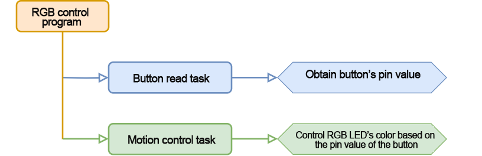

### 6.2.2 Onboard RGB LED 

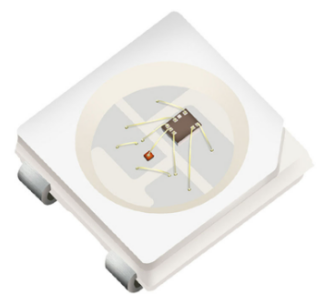

The three colors of the onboard RGB LED—red, green, and blue—can be individually controlled, allowing the LED to produce a variety of colorful display effects.

### 6.2.3 Program Download

[rgb_test](../_static/source_code/rgb_test.zip)

:::{Note}

- Please remove the Bluetooth module before downloading the program. If not removed, a serial interface conflict may occur, causing the download to fail.

- When connecting the Type-B download cable, make sure the battery box switch is set to **"OFF."** This helps prevent accidental contact between the download cable and the expansion board's power pin, which could result in a short circuit.

:::

(1) Locate and open "**rgb_test.ino**" program file in the same dictionary as this section.

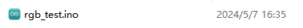

(2) Connect the Arduino to the computer with the Type-B cable.

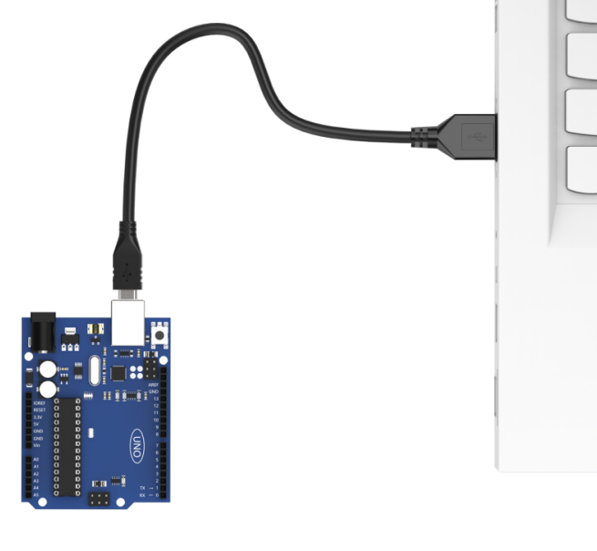

(3) Click the **"Select Board"**, and the software will automatically detect current Arduino serial interface. Then click to connect.

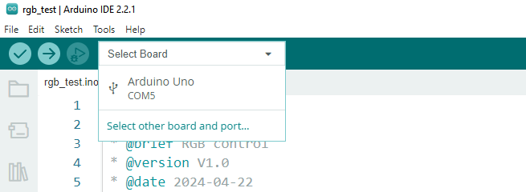

(4) Click  to download the program to the Arduino, and then wait for the download to complete.


### 6.2.4 Program Outcome

After powering on the robot, the RGB LED on the Arduino expansion board will light up red. When the KEY1 button is pressed, the LED remains red; when the button is released, it returns to red.

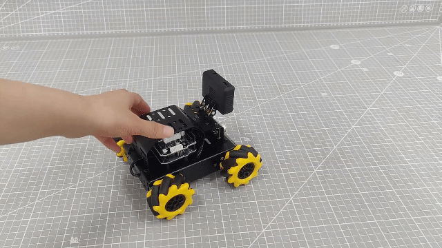

### 6.2.5 Program Analysis

[rgb_test](../_static/source_code/rgb_test.zip)

* **Import Library File**

{lineno-start=11}

```
#include "FastLED.h"
```

Import the required RGB control library for the game.

* **Define Pin and Create Objects**

(1) Define the pins for the RGB LED and the button.

{lineno-start=13}

```
const static uint8_t ledPin = 2;
const static uint8_t keyPin = 3;

static CRGB rgbs[1];
```

(2) Create an RGB LED object and a variable to store the button status.

{lineno-start=16}

```
static CRGB rgbs[1];

bool keyState;          ///< 按键状态检测(Detect button status)
```

* **Initial Settings**

(1) In the `setup()` function, initialize the necessary hardware components. Start by setting up the serial port with a baud rate of 9600 for communication.

{lineno-start=22}

```
void setup() {
  Serial.begin(9600);        // 初始化串口通信(Initialize serial communication)
```

(2) Configure the button pin as an input. By default, its voltage level will be low when the system is powered on. Then, initialize the RGB LED on the expansion board using the **FastLED** library. Connect the LED to the designated ledPin, and use the Rgb_Show(255, 255, 255) function to set its initial color to white.

{lineno-start=25}

```
  pinMode(keyPin, INPUT);
  FastLED.addLeds<WS2812, ledPin, GRB>(rgbs, 1);
  Rgb_Show(255,255,255);

}
```

* **Main Function**

In the `loop()` function, use the `analogRead()` function to read the current value of the button pin. Based on the reading, control the color of the RGB LED:

If the button pin value is **0** (low voltage level, indicating the button is pressed), set the RGB LED color to **white**.

If the button pin value is **1** (high voltage level, indicating the button is released), set the RGB LED color to **red**.

{lineno-start=31}

```
void loop() {
  keyState = analogRead(keyPin);
  if(keyState) Rgb_Show(255,0,0);
  else Rgb_Show(255,255,255);
  delay(100);
}
```

* **RGB Control Function**

In the `Rgb_Show()` control function, the color of the RGB LED is set by passing three parameters: rValue for red, gValue for green, and bValue for blue. Each value can range from 0 to 255. After setting the desired values, call the `FastLED.show()` function to display the corresponding color on the LED.

{lineno-start=38}

```
 /**
 * @brief 设置RGB灯的颜色(Set the color of the RGB light)
 * @param rValue;gValue;bValue;
 * @arg 三个入口参数取值分别为:0~255;(Three input parameters are respectively: 0~255;)
 * @retval None
 * @note (255,0,0)红色 (0,255,0)绿色 (0,0,255)蓝色 (255,255,255)白色((255,0,0) red; (0,255,0) green; (0,0,255) blue; (255,255,255) white)
 */
void Rgb_Show(uint8_t rValue,uint8_t gValue,uint8_t bValue) {
  rgbs[0].r = rValue;
  rgbs[0].g = gValue;
  rgbs[0].b = bValue;
  FastLED.show();
}
```

### 6.2.6 Function Extension

Follow the steps below to modify the RGB LED color in your program:

(1) Locate the `Rgb_Show()` function in the main program. This function controls the RGB color using three parameters, which correspond to red, green, and blue values respectively.

{lineno-start=31}

```
void loop() {
  keyState = analogRead(keyPin);
  if(keyState) Rgb_Show(255,0,0);
  else Rgb_Show(255,255,255);
  delay(100);
}
```

(2) To change the color to green, set the red value to **0** and the green value to **255**. The blue value can remain **0**.

{lineno-start=31}

```
void loop() {
  keyState = analogRead(keyPin);
  if(keyState) Rgb_Show(0,255,0);
  else Rgb_Show(255,255,255);
  delay(100);
}
```

For a detailed RGB color reference, you can visit:  https://www.bchrt.com/tools/rgbcolor/.

### 6.2.7 FAQ

**Q: The code fails to upload. What should I do?**  

**A:** Please check whether the Bluetooth module is connected to the robot. If it is, remove the Bluetooth module before uploading the code, as it may interfere with the serial communication.

## 6.3 Play Music

In this lesson, you'll learn how to use the onboard buttons on the Arduino expansion board to control the buzzer and play music.

### 6.3.1 Program Flowchart

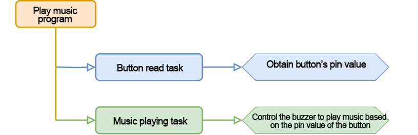

### 6.3.2 Onboard Buzzer Overview

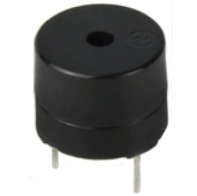

The onboard buzzer is a 5V passive buzzer, capable of producing different tones by varying the frequency of the output PWM signal. By programming specific frequencies and durations, we can make the buzzer play simple melodies.

### 6.3.3 Program Download

[buzzer_test](../_static/source_code/buzzer_test.zip)

:::{Notes}

- Be sure to **remove the Bluetooth module** before uploading the program. If it's connected, the upload will fail due to a conflict on the serial interface.

- **Turn the battery box switch to "OFF"** before connecting the Type-B USB cable. This helps prevent accidental short circuits if the cable touches the power pins on the expansion board.

  :::

(1) Locate and open the buzzer_test program file (found in the same directory as this lesson).


(2) Connect your Arduino board to the computer using a Type-B USB cable.


(3) In the Arduino IDE, click "**Select Board**". The software will automatically detect the connected Arduino board and its serial port. Click to confirm the connection.

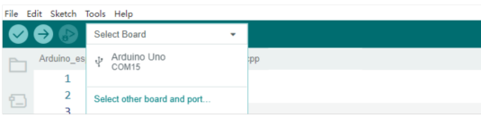

(4) Click  to compile and upload the program to the board. Wait for the upload to complete successfully.


### 6.3.4 Program Outcome

Once the robot is powered on, **pressing the KEY1 button** on the expansion board will trigger the buzzer to play a predefined melody.

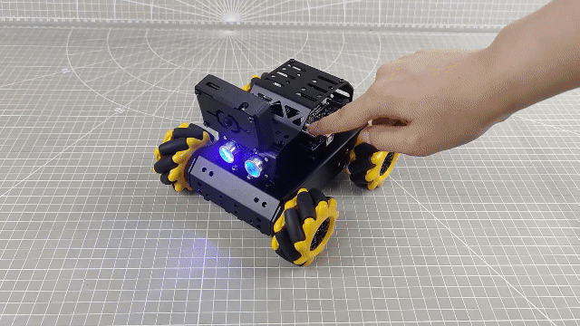

### 6.3.5 Code Analysis

[buzzer_test](../_static/source_code/buzzer_test.zip)

* **Import Required Libraries**

{lineno-start=11}

```
#include "tone.h"
```

Begin by importing the tone library used for controlling the buzzer.

* **Define Pins and Variables**

(1) Define the buzzer pin and button pin.

{lineno-start=14}

```
static int song[98] = {
  NOTE_E4, NOTE_E4, NOTE_E4, NOTE_C4, NOTE_E4, NOTE_G4, NOTE_G3,
  NOTE_C4, NOTE_G3, NOTE_E3, NOTE_A3, NOTE_B3, NOTE_AS3, NOTE_A3, NOTE_G3, NOTE_E4, NOTE_G4, NOTE_A4, NOTE_F4, NOTE_G4, NOTE_E4, NOTE_C4, NOTE_D4, NOTE_B3,
  NOTE_C4, NOTE_G3, NOTE_E3, NOTE_A3, NOTE_B3, NOTE_AS3, NOTE_A3, NOTE_G3, NOTE_E4, NOTE_G4, NOTE_A4, NOTE_F4, NOTE_G4, NOTE_E4, NOTE_C4, NOTE_D4, NOTE_B3,
  NOTE_G4, NOTE_FS4, NOTE_E4, NOTE_DS4, NOTE_E4, NOTE_GS3, NOTE_A3, NOTE_C4, NOTE_A3, NOTE_C4, NOTE_D4, NOTE_G4, NOTE_FS4, NOTE_E4, NOTE_DS4, NOTE_E4, NOTE_C5, NOTE_C5, NOTE_C5,
  NOTE_G4, NOTE_FS4, NOTE_E4, NOTE_DS4, NOTE_E4, NOTE_GS3, NOTE_A3, NOTE_C4, NOTE_A3, NOTE_C4, NOTE_D4, NOTE_DS4, NOTE_D4, NOTE_C4,
  NOTE_C4, NOTE_C4, NOTE_C4, NOTE_C4, NOTE_D4, NOTE_E4, NOTE_C4, NOTE_A3, NOTE_G3, NOTE_C4, NOTE_C4, NOTE_C4, NOTE_C4, NOTE_D4, NOTE_E4,
  NOTE_C4, NOTE_C4, NOTE_C4, NOTE_C4, NOTE_D4, NOTE_E4, NOTE_C4, NOTE_A3, NOTE_G3
  };
```

(2) Create variables:

keyState – stores the button's current state.

playMusic – controls whether the music should play.

{lineno-start=25}

```
static int noteDurations[98] = {
  8,4,4,8,4,2,2,
  3,3,3,4,4,8,4,8,8,8,4,8,4,3,8,8,3,
  3,3,3,4,4,8,4,8,8,8,4,8,4,3,8,8,2,
  8,8,8,4,4,8,8,4,8,8,3,8,8,8,4,4,4,8,2,
  8,8,8,4,4,8,8,4,8,8,3,3,3,1,
  8,4,4,8,4,8,4,8,2,8,4,4,8,4,1,
  8,4,4,8,4,8,4,8,2
};
```

(3) Define the melody and rhythm:

The rhythm determines the duration of each note. In this case, a tempo of one beat per second is used.

{lineno-start=36}

```
const static uint8_t buzzerPin = 3;    ///< 按键状态检测(detect button status)
const static uint8_t keyPin = A3;
bool keyState;                              ///< 按键状态检测(detect button status)
bool taskStart = 0;
```

* **Initial Settings**

Within the `setup()` function:

**(1) Initialize hardware:** Set up the serial port with a baud rate of 9600 and a timeout of 500ms for reading data.

{lineno-start=40}

```
void setup() {
  pinMode(keyPin, INPUT);
  Serial.begin(9600);
  // 设置串行端口读取数据的超时时间(Set the timeout for serial port data reading)
  Serial.setTimeout(500);
}
```

**(2) Configure pins:** Set the button pin as an input. By default, its value is low when powered on.

{lineno-start=41}

```
  pinMode(keyPin, INPUT);
```

**(3) Initialize buzzer:** Call the `play_tune()` function to set up the tone and timing for the melody.

* **Main Loop**

In the `loop()` function, use the `analogRead()` function to read the value of the button pin. Based on the button's state, control the color of the RGB LED. If the value read is 0 (indicating a low voltage level, meaning the button is pressed), call the `tune_task()` function to trigger the buzzer to play music.

{lineno-start=47}

```
void loop() {
  keyState = analogRead(keyPin);  //检测按键状态(detect button status)
  if (!keyState) taskStart = 1;
  if (taskStart)
  {
    tune_task();    // 播放音乐(Play music)
    taskStart = 0;
  }
}
```

* **Music Playback Logic**

{lineno-start=58}

```
void tune_task(void) {
  for (int thisNote = 0; thisNote <98; thisNote++)
  {
    int noteDuration = 1000/noteDurations[thisNote];// 计算每个节拍的时间，以一个节拍一秒为例，四分之一拍就是1000/4毫秒，八分之一拍就是1000/8毫秒(Calculate the time for each beat, assuming one beat per second, a quarter note is 1000/4 milliseconds, and an eighth note is 1000/8 milliseconds)
    tone(buzzerPin, song[thisNote],noteDuration);
    int pauseBetweenNotes = noteDuration * 1.10; //每个音符间的停顿间隔，以该音符的130%为佳(The pause interval between each note, 130% of the duration of this note is recommended)
    delay(pauseBetweenNotes);
    noTone(buzzerPin);
  }
}
```

The program loops through each note and its corresponding rhythm, converting the rhythm into the appropriate play duration. This information is then sent to the buzzer to produce the sound.

To create a more realistic musical effect, a short pause is added after each note. By default, this pause is set to **1.3 times** the note's play duration.

### 6.3.6 FAQ

**Q: The program fails to upload. What should I do?**  

**A:** Please check whether the Bluetooth module is still connected to the robot. If it is, **remove the Bluetooth module** before attempting to upload the program again.

## 6.4 Ultrasonic Ranging

In this lesson, you'll learn how to use a glowing ultrasonic sensor to detect the distance of nearby obstacles. You'll also control the color of the sensor's built-in RGB LED based on the measured distance.

### 6.4.1 Program Flowchart

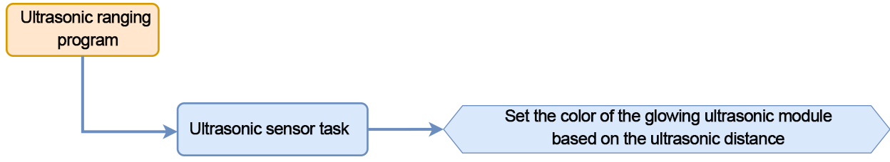

### 6.4.2 Ultrasonic Sensor Overview

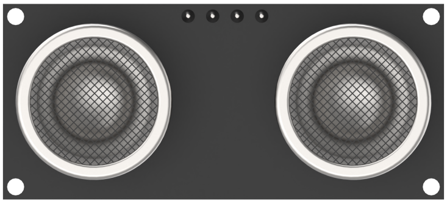

This lesson uses a glowing ultrasonic ranging module that communicates via the I2C interface. It reads distance values using ultrasonic pulses and displays visual feedback through an RGB LED.

* **Working Principle**

The ultrasonic sensor will automatically transmit 8 square waves at 40khz during ranging, and then detect whether there is a signal return. If there is a signal return, it outputs a high voltage level, whose continuing time is the time of the ultrasonic from transmitting to returning.

**Formula:**  

Measurement distance = (High-level time × Sound speed (340 m/s)) / 2

* **Schematic Description**

The sensor is powered by a CS100 chip.

Pins TP and TN emit 8 square waves at 40 kHz.

Pins RP and RN receive the echo.

The chip calculates distance using the formula above.

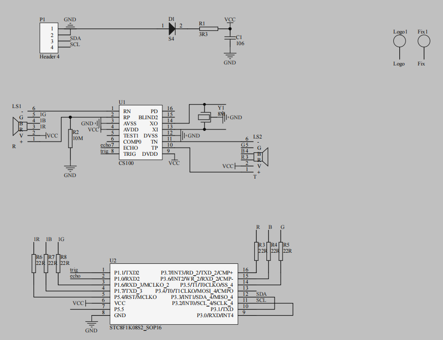

**Specifications:**

**Supply Voltage:** 5V

**Operating Current:** 2mA

**Effective Ranging Distance:** 2 cm – 400 cm

### 6.4.3 Uploading the Program 

:::{Note}

* Remove the Bluetooth module  before uploading the program. Otherwise, the upload may fail due to serial port conflicts.

- **Turn off the battery box** before connecting the Type-B USB cable. This prevents accidental contact with the power pins, which could cause a short circuit.

  :::

(1) Locate and open the ultrasonic_test program file (found in the same directory as this tutorial).

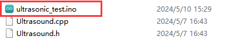

(2) Connect the Arduino board to your computer using a Type-B USB cable.


(3) Click **"Select Board"** in the IDE. The software will automatically detect the connected Arduino and its port. Click to confirm.

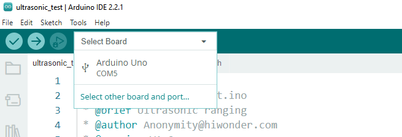

(3) Click  to compile and upload the program. Wait for the upload to complete.


### 6.4.4 Program Outcome

When powered on, the ultrasonic module will measure the distance to an obstacle and change the RGB LED color accordingly.

Place an object directly in front of the ultrasonic sensor and move it slowly toward the sensor. The RGB LED behavior changes as follows:

**Distance \< 80 mm** → Red breathing light

**80 mm – 180 mm** → Red gradient (brighter as distance increases)

**180 mm – 320 mm** → Blue gradient (brighter as distance increases)

**320 mm – 500 mm** → Green gradient (brighter as distance increases)

**\> 500 mm** → Solid green light

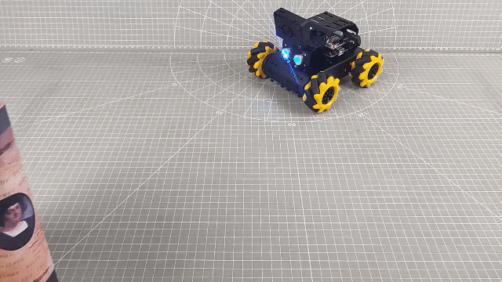

### 6.4.5 Program Analysis

The source code is located in the ultrasonic_test.ino file. Refer to the flowchart above for an overview of the program logic.

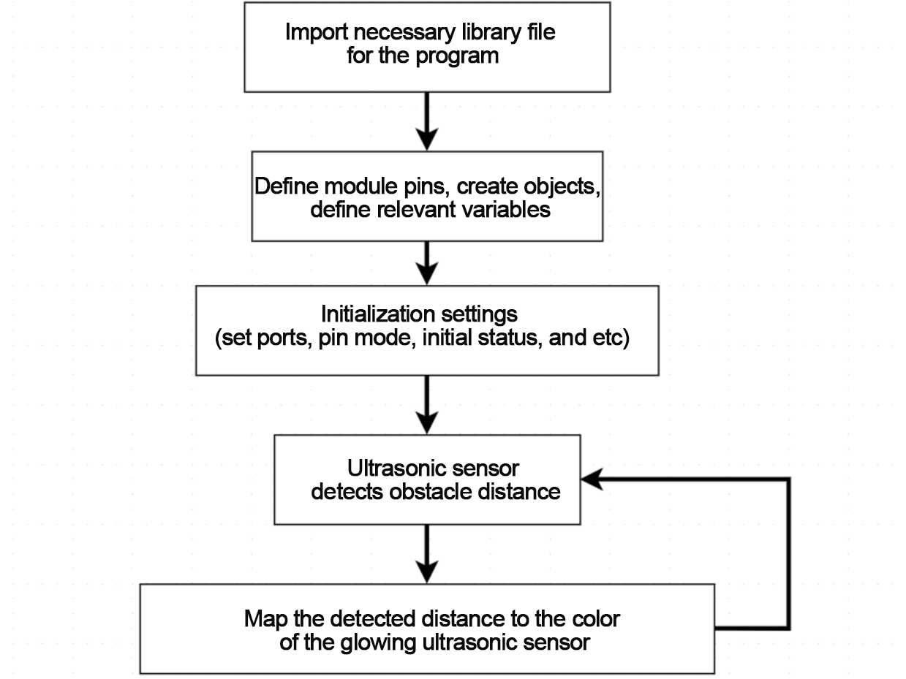

* **Importing the Required Library**

{lineno-start=12}

```
#include "Ultrasound.h"
```

Start by importing the necessary library for controlling the glowing ultrasonic sensor.

* **Pin Definition and Object Creation**

Define the size of the filter array and a variable to store the filtered distance.

Create an object of the ultrasonic sensor class to fetch distance readings.

{lineno-start=14}

```
#define FILTER_N 3                ///< 滤波法数组容量(Filter array capacity)

int Filter_Value;
int filter_buf[FILTER_N + 1];

Ultrasound ultrasound;            ///< 实例化超声波类(Instantiate the ultrasound class)
```

* **Initial Setup**

In the `setup()` function:

Initialize the serial port at a baud rate of 9600.

Set up necessary hardware configurations.

{lineno-start=24}

```
void setup() {
  // put your setup code here, to run once:
  Serial.begin(9600);
}
```

* **Main Function**

In the `loop()` function:

Continuously call the ultrasonic task function to perform real-time distance detection and update LED colors accordingly.

{lineno-start=}

```
void loop() {
  // put your main code here, to run repeatedly:
  ultrasonic_distance();
}
```

* **Ultrasonic Detection Logic**

(1) The `ultrasonic_distance()` function measures the distance and changes the LED color.

{lineno-start=46}

```
int ultrasonic_distance(){
  uint8_t s;
  uint16_t distance = Filter();///< 获得滤波器输出值(Get the output value of the filter)
  Serial.print("Distance: ");///< 获取并且串口打印距离，单位mm(Get and print the distance via serial port, unit: mm)
  Serial.print(distance);
  Serial.println(" mm");
```

(2) \< 80 mm → Red breathing mode, updates every 0.1 seconds.

{lineno-start=53}

```
  if (distance > 0 && distance <= 80){
      ultrasound.Breathing(1, 0, 0, 1, 0, 0);///< 呼吸灯模式，周期0.1s，颜色红色(Red breathing light mode, in 0.1s)
  }
```

(3) 80–180 mm → Red gradient, color becomes lighter as distance increases.

{lineno-start=57}

```
  else if (distance > 80 && distance <= 180){
      s = map(distance,80,180,0,255);
      ultrasound.Color((255-s), 0, 0, (255-s), 0, 0);///< 红色渐变(Red gradient)
  }
```

(4) 180–320 mm → Blue gradient, color becomes bluer as distance increases.

{lineno-start=62}

```
   else if (distance > 180 && distance <= 320){
      s = map(distance,180,320,0,255);
      ultrasound.Color(0, 0, s, 0, 0, s);///< 蓝色渐变(Blue gradient)
  }
```

(5) 320–500 mm → Green gradient, color becomes greener as distance increases.

{lineno-start=67}

```
   else if (distance > 320 && distance <= 500){
      s = map(distance,320,500,0,255);
      ultrasound.Color(0, s, 255-s, 0, s, 255-s);///< 绿色渐变(Green gradient)
  }
```

(6) \> 500 mm → Solid green light.

{lineno-start=71}

```
  else if (distance > 500){
      ultrasound.Color(0, 255, 0, 0, 255, 0);///< 绿色(Green)
  }
```

### 6.4.6 Function Extension

How to modify the color gradient of an RGB LED in the distance between 80 and 180mm from red to yellow?

Please refer to the following steps:

(1) Find mapping instructions in the program for controlling the RGB lights to change with the change of the distance. Set R in RGB elements to change as the change of "**s**" by "**map**" function. `map (distance, 80, 180, 0, 255)` maps the obstacle distance to the R element.

{lineno-start=59}

```
      ultrasound.Color((255-s), 0, 0, (255-s), 0, 0);///< 红色渐变(Red gradient)
```

(2) Change the value of the G element to be the same as the value of the A element. Note that the range of color elements is 0 to 255. Next, download the program again. The closer the obstacle is, the more the proportion of red and the less proportion of green. The RGB light displays yellow.

{lineno-start=59}

```
      ultrasound.Color((255-s), (255-s), 0, (255-s), (255-s), 0);
```

For more detailed information about the RGB color table, please access: <https://www.bchrt.com/tools/rgbcolor/>.

### 6.4.7 FAQ

**Q1:** After uploading the code, the sensor always reads 0.  

**A:** Please ensure that the 4-pin cable is properly connected to the I2C interface.

**Q2:** The distance readings are inconsistent.  

**A:** Use a smooth, flat object for accurate measurement, and avoid keeping an object too close to the sensor for long periods.

## 6.5 Ultrasonic Following

In this section, you'll learn how to use a glowing ultrasonic module to detect obstacle distances and control a robot car to follow the movement of an object.

### 6.5.1 Program Flowchart

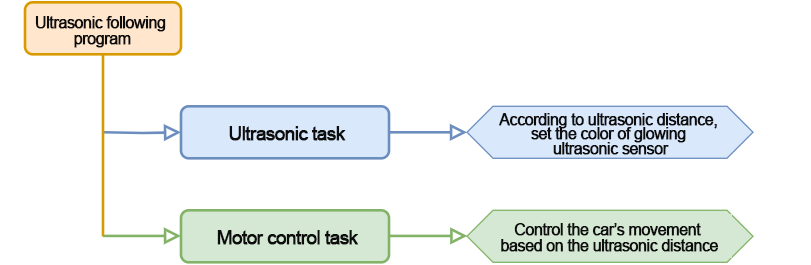

### 6.5.2 Ultrasonic Sensor Overview

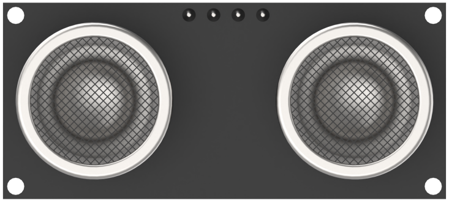

This project uses a glowing ultrasonic ranging module with an I2C interface. It reads distance measurements and provides visual feedback through its RGB LED.

* **Working Principle**

The ultrasonic sensor automatically emits 8 square waves at 40 kHz during each measurement cycle. It then detects whether a signal returns. If a return signal is detected, the sensor outputs a high voltage signal. The duration of this high signal represents the round-trip time of the ultrasonic wave.

**Formula:**  

Measurement Distance = (High-Level Time × Speed of Sound (340 m/s)) ÷ 2

* **Schematic Diagram**

The sensor is driven by the CS100 chip. The TP and TN pins transmit 8 square waves at 40 kHz, while RP and RN receive the echo signal. The distance is then calculated using the formula above.

* **Specifications:**

Supply Voltage: 5V

Operating Current: 2mA

Effective Range: 20 mm – 4000 mm


### 6.5.3 Program Download 

:::{Note}
- Remove the Bluetooth module before uploading the program to avoid serial port conflicts.

- Turn off the battery box before connecting the Type-B USB cable to avoid accidental short circuits.
:::

(1) Locate and open the ultrasonic_following program file (found in the same folder as this tutorial).

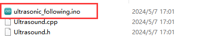

(2) Connect your Arduino board to your computer using a Type-B USB cable.


(3) In the Arduino IDE, click **"Select Board."** The IDE will automatically detect the connected Arduino and port.

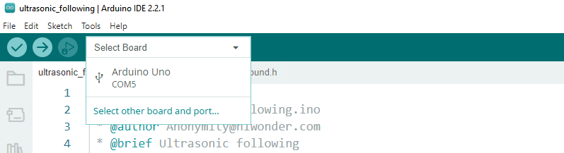

(4) Click  to compile and upload the code. Wait for the process to complete.


### 6.5.4 Program Outcome

Once powered on, the **miniAuto** robot will:

① Display different RGB light colors on the ultrasonic sensor based on the measured distance.

② Move forward, backward, or stop, depending on how far the object is from the sensor.

**Try it out:**  

Place an object in front of the sensor and slowly move it closer. You'll see the following behaviors:

(1) RGB LED Behavior

Distance \< 80 mm → Red breathing light

80–180 mm → Red gradient (increasing brightness)

180–320 mm → Blue gradient (increasing brightness)

320–500 mm → Green gradient (increasing brightness)

500 mm → Solid green light

(2) The car control effect:

Distance \< 200 mm → Car moves backward

200–300 mm → Car stops

300–700 mm → Car moves forward

700 mm → Car stops again

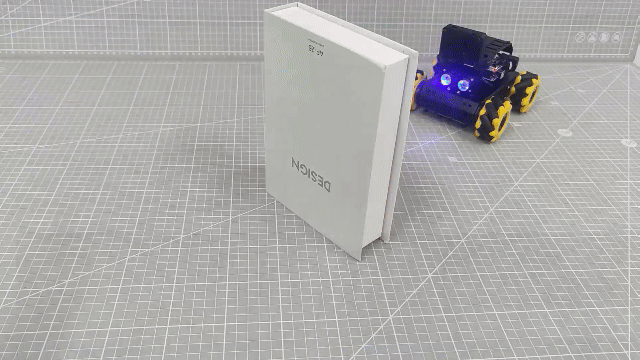

### 6.5.5 Program Analysis

The code is located in ultrasonic_following.ino. Use the flowchart above to follow the program logic.

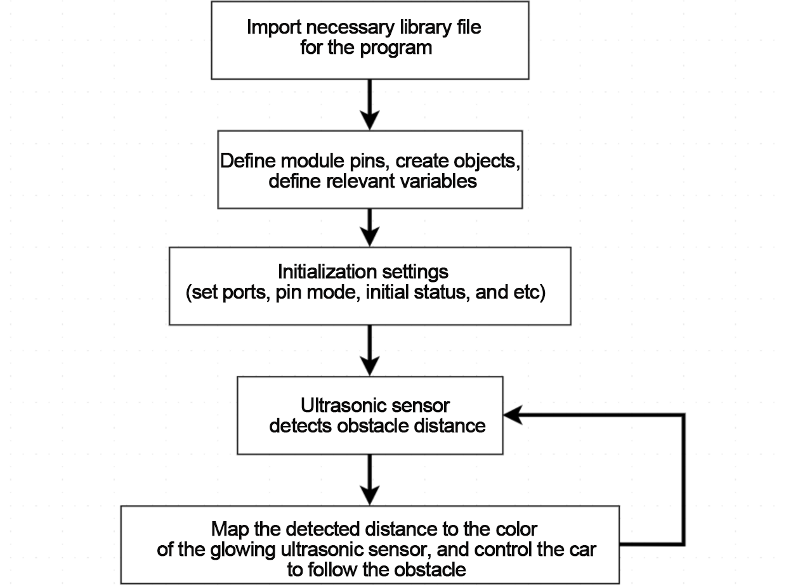

* **Import Library File**

{lineno-start=12}

```
#include "Ultrasound.h"
```

First, import the necessary library to control the glowing ultrasonic sensor.

* **Define Pin and Create Objects**

Define a variable pwm_min for minimum PWM mapping.

Create an ultrasonic sensor object to retrieve distance data.

Set up a digital motor pin array and a dis variable to store measured distance.

{lineno-start=19}

```
Ultrasound ultrasound;  //实例化超声波类(Instantiate the ultrasound class)

const static uint8_t pwm_min = 50;
const static uint8_t motorpwmPin[4] = { 10, 9, 6, 11} ;
const static uint8_t motordirectionPin[4] = { 12, 8, 7, 13};

uint16_t dis;
```

* **Setup Function**

In `setup()`:

Initialize the serial port (baud rate: 9600).

Call `Motor_Init()` to initialize the motors.

{lineno-start=33}

```
void setup() {
  Serial.begin(9600);
  Motor_Init();
}
```

* **Main Function**

In the `loop()` function:

Continuously call the `ultrasonic_distance()` function to read the sensor value and update the RGB LED color.

Use the measured distance to control robot movement in real time.

{lineno-start=38}

```
void loop() {
  ultrasonic_distance();
  dis = ultrasonic_distance();
  if(dis >=700) Velocity_Controller( 0, 0, 0, 0);
  if(dis >= 300 && dis < 700) Velocity_Controller( 0,50, 0, 0);
  if(dis >= 200 && dis < 300) Velocity_Controller( 0, 0, 0, 0);
  if(dis < 200) Velocity_Controller( 180, 50, 0, 0); 
}
```

* **Ultrasonic Detection**

Call the `ultrasonic_distance()` function within the main `loop()` function. This function continuously measures the distance and updates the RGB LED color on the ultrasonic sensor accordingly.

{lineno-start=65}

```
/* 超声波距离数据获取(Obtain ultrasonic distance data) */
uint16_t ultrasonic_distance(){
  uint8_t s;
  uint16_t distance = Filter();         // 获得滤波器输出值(Get the output value of the filter)
  Serial.print("Distance: ");Serial.print(distance);Serial.println(" mm"); //获取并且串口打印距离，单位mm(Get and print the distance via serial port, unit: mm)

```

(1) Distance: 0–80 mm 

The RGB LED enters **red breathing mode**, pulsing red light at a 0.1-second interval.

{lineno-start=71}

```
  if (distance > 0 && distance <= 80){
      ultrasound.Breathing(1, 0, 0, 1, 0, 0);       //呼吸灯模式，周期0.1s，颜色红色(Red breathing light mode, in 0.1s)
   }
```

(2) Distance: 80–180 mm  

The LED displays a **red gradient**. The red color becomes progressively lighter as the distance increases.

{lineno-start=75}

```
  else if (distance > 80 && distance <= 180){
      s = map(distance,80,180,0,255);
      ultrasound.Color((255-s), 0, 0, (255-s), 0, 0); //红色渐变(Red gradient)
   }
```

(3) Distance: 180–320 mm  

The LED displays a **blue gradient**, with the blue intensity increasing as the object moves farther.

{lineno-start=80}

```
   else if (distance > 180 && distance <= 320){
      s = map(distance,180,320,0,255);
      ultrasound.Color(0, 0, s, 0, 0, s);            //蓝色渐变(Blue gradient)
   }
```

(4) Distance: 320–500 mm  

The LED displays a **green gradient**, becoming brighter with increasing distance.

{lineno-start=85}

```
   else if (distance > 320 && distance <= 500){
      s = map(distance,320,500,0,255);
      ultrasound.Color(0, s, 255-s, 0, s, 255-s);            //绿色渐变(Green gradient)
   }
```

(5) Distance: Greater than 500 mm  

The LED remains in a **steady green mode**, indicating the object is far away.

{lineno-start=89}

```
  else if (distance > 500){
      ultrasound.Color(0, 255, 0, 0, 255, 0);        //绿色(Green)
   }
```

* **Velocity Control Function**

In the **velocity control function**, the speed and direction of each motor are calculated based on the **kinematics of the mecanum wheel system**.

(1) The angle parameter determines the car's movement direction. An angle of **0°** corresponds to the front of the car, and angles increase **counterclockwise**.

(2) The velocity parameter controls how fast the car moves.

(3) The rot parameter sets the car's rotational movement: **positive values** cause **counterclockwise rotation**, and **negative values** cause **clockwise rotation**.

(4) The drift parameter enables or disables the car's drifting mode.

{lineno-start=103}

```
/**
 * @brief 速度控制函数(Speed control function)
 * @param angle   用于控制小车的运动方向，小车以车头为0度方向，逆时针为正方向。("angle" controls the robot's motion direction, with the front of the robot as 0 degrees and counterclockwise as the positive direction)
 *                取值为0~359(range from 0 to 359)
 * @param velocity   用于控制小车速度，取值为0~100。("velocity" controls the robot's speed, with a value range of 0 to 100)
 * @param rot     用于控制小车的自转速度，取值为-100~100，若大于0小车有一个逆("rot" controls the robot's self-rotation speed, with a value range of -100 to 100)
 *                 时针的自转速度，若小于0则有一个顺时针的自转速度。(If it is greater than 0, the robot has a counterclockwise self-rotation speed. If it is less than 0, the robot has a clockwise self-rotation speed)
 * @param drift   用于决定小车是否开启漂移功能，取值为0或1，若为0则开启，反之关闭。("drift" determines whether the robot enables drift. Value range: 0 or 1. If it is 0, drift is enabled; otherwise, it is disabled)
 * @retval None
 */
void Velocity_Controller(uint16_t angle, uint8_t velocity,int8_t rot,bool drift) {
  int8_t velocity_0, velocity_1, velocity_2, velocity_3;
  float speed = 1;
  angle += 90;
  float rad = angle * PI / 180;
  if (rot == 0) speed = 1;///< 速度因子(Speed factor)
  else speed = 0.5; 
  velocity /= sqrt(2);
  if (drift) {
    velocity_0 = (velocity * sin(rad) - velocity * cos(rad)) * speed;
    velocity_1 = (velocity * sin(rad) + velocity * cos(rad)) * speed;
    velocity_2 = (velocity * sin(rad) - velocity * cos(rad)) * speed - rot * speed * 2;
    velocity_3 = (velocity * sin(rad) + velocity * cos(rad)) * speed + rot * speed * 2;
  } else {
    velocity_0 = (velocity * sin(rad) - velocity * cos(rad)) * speed + rot * speed;
    velocity_1 = (velocity * sin(rad) + velocity * cos(rad)) * speed - rot * speed;
    velocity_2 = (velocity * sin(rad) - velocity * cos(rad)) * speed - rot * speed;
    velocity_3 = (velocity * sin(rad) + velocity * cos(rad)) * speed + rot * speed;
  }
  Motors_Set(velocity_0, velocity_1, velocity_2, velocity_3);
}
```

* **Motor Control Function**

The motor control function uses the speed values calculated in the velocity control function to drive each motor using **PWM (Pulse Width Modulation)**.

The motors array stores the calculated speed values for each motor.

The pwm_set array converts these speed values into corresponding PWM signals that are then sent to each motor to control their output.

{lineno-start=135}

```
/**
 * @brief PWM与轮子转向设置函数(PWM and wheel turning setting function)
 * @param Motor_x   作为PWM与电机转向的控制数值。根据麦克纳姆轮的运动学分析求得。("Motor_x" is the control value for PWM and motor rotating. Calculated based on the kinematics analysis of mecanum wheels)
 * @retval None
 */
void Motors_Set(int8_t Motor_0, int8_t Motor_1, int8_t Motor_2, int8_t Motor_3) {
  int8_t pwm_set[4];
  int8_t motors[4] = { Motor_0, Motor_1, Motor_2, Motor_3};
  bool direction[4] = { 1, 0, 0, 1};///< 前进 左1 右0(Forward; left 1; right 0)
  for(uint8_t i; i < 4; ++i) {
    if(motors[i] < 0) direction[i] = !direction[i];
    else direction[i] = direction[i];

    if(motors[i] == 0) pwm_set[i] = 0;
    else pwm_set[i] = map(abs(motors[i]), 0, 100, pwm_min, 255);

    digitalWrite(motordirectionPin[i], direction[i]); 
    analogWrite(motorpwmPin[i], pwm_set[i]); 
  }
}
```

### 6.5.6 Function Extension

To modify the color gradient of the RGB LED so that it transitions from red to yellow when the detected distance is between 80 mm and 180 mm, you'll need to adjust the RGB mapping logic in your program.

Please refer to the following steps:

(1) First, locate the section of code responsible for mapping the RGB values according to the distance. Use the map() function to modify the red (R) component based on the obstacle distance. For example, map(distance, 80, 180, 0, 255) will scale the red value proportionally within the specified range.

{lineno-start=77}

```
      ultrasound.Color((255-s), 0, 0, (255-s), 0, 0); //红色渐变(Red gradient)
```

(2) Next, to achieve a yellow gradient, set the green (G) component equal to the red (R) value, while keeping the blue (B) component at zero. Since yellow is a mix of red and green, this will create a smooth transition from red to yellow as the green component increases with distance. Remember that RGB color values must remain within the range of 0 to 255. Once you've made these changes, upload the program again. As the object moves away from the sensor within this range, the light will gradually shift from solid red to bright yellow.

{lineno-start=77}

```
      ultrasound.Color((255-s), (255-s), 0, (255-s), (255-s), 0); //红色渐变(Red gradient)
```

For reference on RGB values and color combinations, you can visit the RGB color table at: https://www.bchrt.com/tools/rgbcolor/.

### 6.5.7 FAQ

**Q1: After uploading the code, the ultrasonic sensor always reads a distance of 0. What should I do?** 

**A:** Please ensure that the 4-pin cable is properly connected to the I2C interface. An incorrect or loose connection can cause the sensor to fail to return valid data.

**Q2: The distance readings from the ultrasonic sensor are sometimes accurate, but sometimes inconsistent. Why is that?** 

**A:** For more reliable results, use a smooth and flat object as the target for distance measurement. Additionally, avoid keeping obstacles too close to the sensor for extended periods, as this may affect accuracy.

pandoc -s 6.ObstacleAvoidance.docx --wrap=none --extract-media=chapter_6\section_6 -t gfm -o 6.ObstacleAvoidance.md

## 6.6 Obstacle Avoidance

In this section, you can learn to detect the distance of obstacle through glowing ultrasonic module. The robot car can be simultaneously controlled to turn right to avoid obstacle. In this section, you'll use a glowing ultrasonic sensor to detect the distance of an obstacle and control the car to move forward or backward accordingly.

### 6.6.1 Program Flowchart

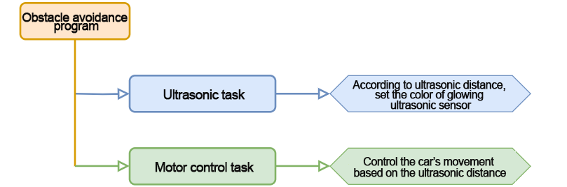

### 6.6.2 Ultrasonic Sensor

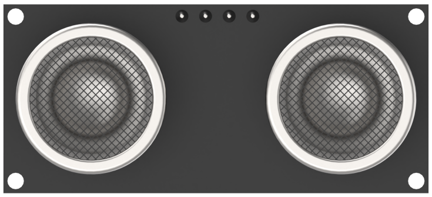

In this lesson, we use a glowing ultrasonic distance sensor module that communicates via the I2C interface. The module retrieves distance measurements from the ultrasonic sensor through I2C communication.

During operation, the module automatically emits eight 40kHz square wave pulses and then listens for an echo. If an echo is detected, it outputs a high signal. The duration of this high-level signal corresponds to the time it takes for the ultrasonic wave to travel to the obstacle and return.

The distance is calculated using the following formula:  

**Distance = (High-level duration × Speed of sound (340 m/s)) ÷ 2**

### 6.6.3 Program Download

[ultrasonic_avoid](../_static/source_code/ultrasonic_avoid.zip)

:::{Note}

- **Remove the Bluetooth module** before uploading the program. Otherwise, the upload may fail due to serial port conflicts.

- **Turn off the battery box** before connecting the Type-B USB cable. This prevents accidental contact with the power pins, which could cause a short circuit.

  :::

(1) Locate and open the ultrasonic_avoid program file (found in the same directory as this tutorial).

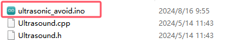

(2) Connect the Arduino board to your computer using a Type-B USB cable.

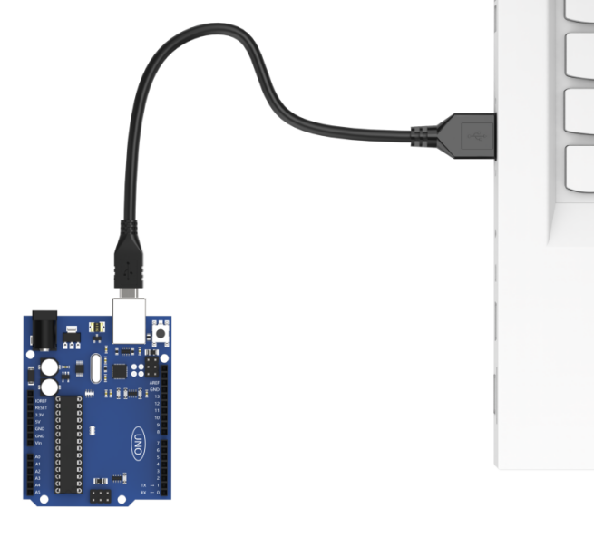

(3) Click **"Select Board"** in the IDE. The software will automatically detect the connected Arduino and its port. Click to confirm.

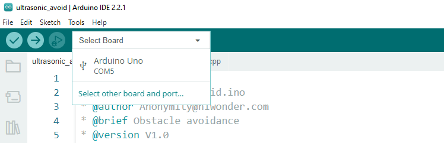

(4) Click  to compile and upload the program. Wait for the upload to complete.


### 6.6.4 Program Outcome

**When the robot car is powered on, it will adjust the color of the glowing ultrasonic module based on the distance to nearby obstacles and will control the car's movement accordingly.**

Place an obstacle directly in front of the ultrasonic sensor and slowly move it closer.

(1) Ultrasonic Sensor Color Effects:

Distance \< 80mm: The RGB light on the ultrasonic module enters red breathing mode.

80mm ≤ Distance \< 180mm: The RGB light on the ultrasonic module transitions through a red gradient, becoming lighter as the distance increases.

180mm ≤ Distance \< 320mm: The RGB light changes to a blue gradient, intensifying as the distance increases.

320mm ≤ Distance \< 500mm: The RGB light shifts to a green gradient, getting brighter as the distance increases.

Distance \> 500mm: The RGB light becomes a solid green.

(2) Car Movement Behavior:

Distance \< 200mm: The car moves backward.

200mm ≤ Distance \< 300mm: The car stops.

300mm ≤ Distance \< 700mm: The car moves forward.

Distance \> 700mm: The car stops again.

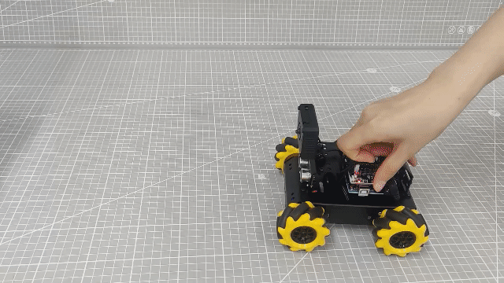

### 6.6.5 Program Analysis

[ultrasonic_avoid](../_static/source_code/ultrasonic_avoid.zip)

The program used for this project is called **"ultrasonic_avoid.ino"** Refer to the following flowchart to understand the implementation logic of the program.

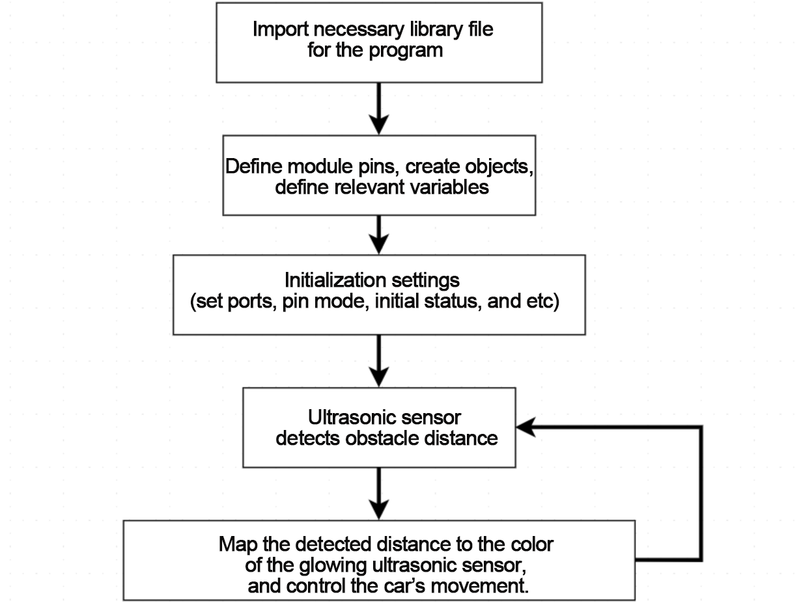

* **Import Library File**

{lineno-start=12}

```
#include "Ultrasound.h"
```

Import the necessary library to control the glowing ultrasonic sensor used in the project.

* **Define Pin and Create Objects**

Define an ultrasonic class to retrieve distance data. Create a variable called **"pwm_min"** to store the minimum PWM mapping value. Additionally, define an array to specify the digital motor pins. A variable "**dis**" is also created to store the distance value obtained from the ultrasonic sensor.

{lineno-start=19}

```
Ultrasound ultrasound;  ///< 实例化超声波类(Instantiate the ultrasound class)

const static uint8_t keyPin = 3;
const static uint8_t pwm_min = 50;
const static uint8_t motorpwmPin[4] = { 10, 9, 6, 11} ;
const static uint8_t motordirectionPin[4] = { 12, 8, 7, 13};

bool keyState;          ///< 按键状态检测(Detect button status)
bool taskStart = 0;
uint16_t dis;
```

* **Initial Setup**

In the `setup()` function, initialize the hardware components. First, set up the serial port with a baud rate of 9600 for communication. Next, call the `Motor_Init()` function to initialize and bind the motors.

{lineno-start=37}

```
void setup() {
  Serial.begin(9600);
  Serial.setTimeout(500);
  pinMode(keyPin, INPUT);
  Motor_Init();
  printf("2");
}
```

* **Main Function**

In the `loop()` function, when the button is pressed, the ultrasonic obstacle avoidance game begins. The ultrasonic task function is continuously called to retrieve distance data and adjust the color of the glowing ultrasonic sensor. The robot's behavior is then controlled based on the detected data.

{lineno-start=45}

```
void loop() {
  keyState = analogRead(keyPin);
  printf("111");
  if(!keyState) taskStart = 1;
  if(taskStart) {
    ultrasonic_distance();
    dis = ultrasonic_distance();
    Velocity_Controller( 0, 100, 0, 0);
    while(dis < 300) {
      dis = ultrasonic_distance();
      Velocity_Controller( 0, 0, -100, 0);
    }  
  }
}
```

* **Ultrasonic Detection**

 Call the `ultrasonic_distance()` function in the `loop()` function to measure the distance and change the RGB light color accordingly.

{lineno-start=85}

```
uint16_t ultrasonic_distance(){
  uint8_t s;
  uint16_t distance = Filter();                                               ///< 获得滤波器输出值(Get the output value of the filter)
  Serial.print("Distance: ");Serial.print(distance);Serial.println(" mm"); ///< 获取并且串口打印距离，单位mm(Get and print the distance via serial port, unit: mm)
```

**(1) Distance: 0 to 80mm** – The ultrasonic sensor displays a red breathing light with a 0.1s transition speed.

{lineno-start=90}

```
  if (distance > 0 && distance <= 80){
      ultrasound.Breathing(1, 0, 0, 1, 0, 0);                                 ///< 呼吸灯模式，周期0.1s，颜色红色(Red breathing light mode, in 0.1s)
   }
```

**(2) Distance: 80 to 180mm** – The sensor light gradually transitions from red, getting lighter as the distance increases.

{lineno-start=94}

```
  else if (distance > 80 && distance <= 180){
      s = map(distance,80,180,0,255);
      ultrasound.Color((255-s), 0, 0, (255-s), 0, 0);                         ///< 红色渐变(Red gradient)
   }
```

**(3) Distance: 180 to 320mm** – The sensor light changes to a blue gradient, becoming bluer as the distance increases.

{lineno-start=99}

```
   else if (distance > 180 && distance <= 320){
      s = map(distance,180,320,0,255);
      ultrasound.Color(0, 0, s, 0, 0, s);                                     ///< 蓝色渐变(Blue gradient)
   }
```

**(4) Distance: 320 to 500mm** – The sensor light transitions to a green gradient, intensifying as the distance increases.

{lineno-start=104}

```
   else if (distance > 320 && distance <= 500){
      s = map(distance,320,500,0,255);
      ultrasound.Color(0, s, 255-s, 0, s, 255-s);                             ///< 绿色渐变(Green gradient)
   }
```

**(5) Distance: \>500mm –** The sensor light turns steady green.

{lineno-start=108}

```
  else if (distance > 500){
      ultrasound.Color(0, 255, 0, 0, 255, 0);                                 ///< 绿色(Green)
   }
```

* **Velocity Control Function**

The velocity control function calculates the control values for each motor based on the kinematic analysis of the mecanum wheel. The "**angle**" parameter defines the direction of motion for the car (0 degrees points to the front, with counterclockwise as the positive direction). The "**velocity**" parameter controls the speed of the car. The "**rot**" parameter defines the rotation direction of the car: counterclockwise for positive values and clockwise for negative values. The "**drift**" parameter enables or disables the car's drift function.

{lineno-start=122}

```
/**
 * @brief 速度控制函数(Speed control function)
 * @param angle   用于控制小车的运动方向，小车以车头为0度方向，逆时针为正方向。("angle" controls the robot's motion direction, with the front of the robot as 0 degrees and counterclockwise as the positive direction)
 *                取值为0~359(range from 0 to 359)
 * @param velocity   用于控制小车速度，取值为0~100。("velocity" controls the robot's speed, with a value range of 0 to 100)
 * @param rot     用于控制小车的自转速度，取值为-100~100，若大于0小车有一个逆("rot" controls the robot's self-rotation speed, with a value range of -100 to 100)
 *                 时针的自转速度，若小于0则有一个顺时针的自转速度。(If it is greater than 0, the robot has a counterclockwise self-rotation speed. If it is less than 0, the robot has a clockwise self-rotation speed)
 * @param drift   用于决定小车是否开启漂移功能，取值为0或1，若为0则开启，反之关闭。("drift" determines whether the robot enables drift. Value range: 0 or 1. If it is 0, drift is enabled; otherwise, it is disabled)
 * @retval None
 */
void Velocity_Controller(uint16_t angle, uint8_t velocity,int8_t rot,bool drift) {
  int8_t velocity_0, velocity_1, velocity_2, velocity_3;
  float speed = 1;
  angle += 90;
  float rad = angle * PI / 180;
  if (rot == 0) speed = 1;///< 速度因子(Speed factor)
  else speed = 0.5; 
  velocity /= sqrt(2);
  if (drift) {
    velocity_0 = (velocity * sin(rad) - velocity * cos(rad)) * speed;
    velocity_1 = (velocity * sin(rad) + velocity * cos(rad)) * speed;
    velocity_2 = (velocity * sin(rad) - velocity * cos(rad)) * speed - rot * speed * 2;
    velocity_3 = (velocity * sin(rad) + velocity * cos(rad)) * speed + rot * speed * 2;
  } else {
    velocity_0 = (velocity * sin(rad) - velocity * cos(rad)) * speed + rot * speed;
    velocity_1 = (velocity * sin(rad) + velocity * cos(rad)) * speed - rot * speed;
    velocity_2 = (velocity * sin(rad) - velocity * cos(rad)) * speed - rot * speed;
    velocity_3 = (velocity * sin(rad) + velocity * cos(rad)) * speed + rot * speed;
  }
  Motors_Set(velocity_0, velocity_1, velocity_2, velocity_3);
}
```

* **Motor Control Function**

The motor control function uses the values calculated in the velocity control function to control each motor using PWM. The **"motors"** array maps the speed values for each motor to PWM values, while the **"pwm_set"** array controls the PWM signals sent to each motor.

{lineno-start=154}

```
/**
 * @brief PWM与轮子转向设置函数(PWM and wheel turning setting function)
 * @param Motor_x   作为PWM与电机转向的控制数值。根据麦克纳姆轮的运动学分析求得。("Motor_x" is the control value for PWM and motor rotating. Calculated based on the kinematics analysis of mecanum wheels)
 * @retval None
 */
void Motors_Set(int8_t Motor_0, int8_t Motor_1, int8_t Motor_2, int8_t Motor_3) {
  int8_t pwm_set[4];
  int8_t motors[4] = { Motor_0, Motor_1, Motor_2, Motor_3};
  bool direction[4] = { 1, 0, 0, 1};///< 前进 左1 右0(Forward; left 1; right 0)
  for(uint8_t i; i < 4; ++i) {
    if(motors[i] < 0) direction[i] = !direction[i];
    else direction[i] = direction[i];

    if(motors[i] == 0) pwm_set[i] = 0;
    else pwm_set[i] = map(abs(motors[i]), 0, 100, pwm_min, 255);

    digitalWrite(motordirectionPin[i], direction[i]); 
    analogWrite(motorpwmPin[i], pwm_set[i]); 
  }
}
```

### 6.6.6 Function Extension

**How to modify the robot's turning direction from right to left when encountering an obstacle?**  

Follow these steps to modify the robot's turning direction:

(1) Locate the section of the code that controls the robot's turning behavior. In the `Velocity_Controller()` function, the robot turns to the right (clockwise) at a speed of 100. This is controlled by the value of the turning parameter: when the value is less than 0, the robot turns clockwise; when the value is greater than 0, it turns counterclockwise.

{lineno-start=55}

```
      Velocity_Controller( 0, 0, -100, 0);
```

(2) To change the turning direction to left (counterclockwise), modify the turning parameter. Replace the value -100 with 100. This will cause the robot to turn left at a speed of 100.

{lineno-start=45}

```
void loop() {
  keyState = analogRead(keyPin);
  printf("111");
  if(!keyState) taskStart = 1;
  if(taskStart) {
    ultrasonic_distance();
    dis = ultrasonic_distance();
    Velocity_Controller( 0, 100, 0, 0);
    while(dis < 300) {
      dis = ultrasonic_distance();
      Velocity_Controller( 0, 0, -100, 0);
    }  
  }
}
```

### 6.6.7 FAQ

**Q1: Since the code was uploaded, the distance measured by the ultrasound is always 0.**

**A:** Please check if the 4-pin cable is properly connected to the I2C interface. A loose or incorrect connection could result in no data being received, leading to a reading of 0.

**Q2: The distance measured by the ultrasonic sensor is sometimes accurate, and sometimes inaccurate.**

**A:** Ensure that you are using a smooth, flat object for distance measurement. Avoid placing the sensor too close to the obstacle for prolonged periods, as this could affect the accuracy. Also, ensure the sensor is not obstructed and is aligned properly for consistent readings.

## 6.7 Line Following

In this section, we will use the 4-channel line follower sensor to detect a black line and control the miniAuto to follow the line.

### 6.7.1 Program Flowchart

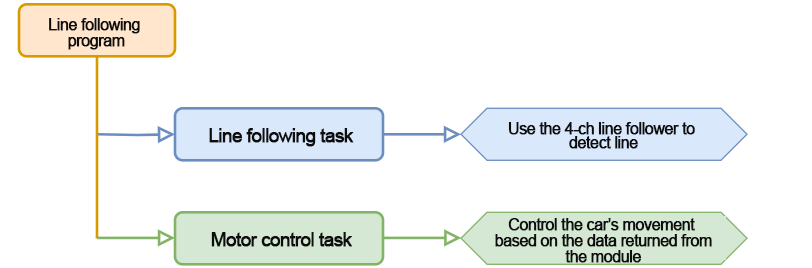

### 6.7.2 4-ch Line Follower

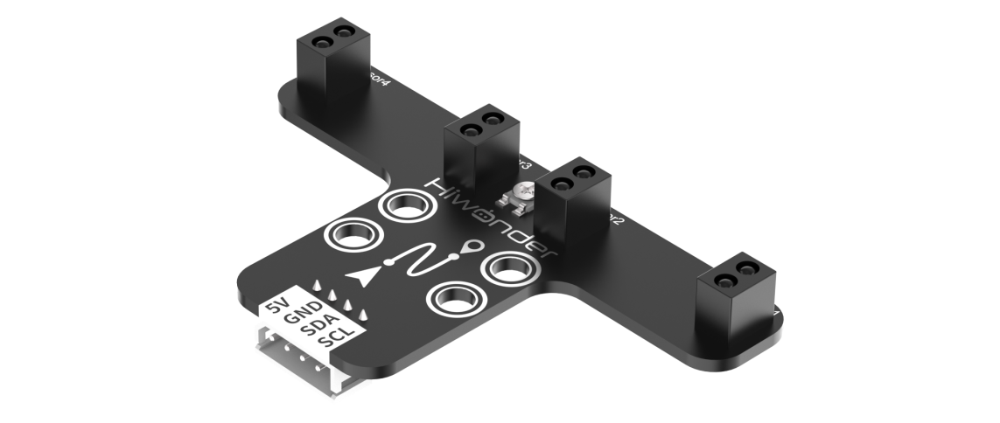

In this lesson, we will use a 4-channel line follower that utilizes an I2C communication interface to read data from the sensor probes.

The sensor module consists of four probes, each equipped with an infrared emitter and an infrared receiver. The infrared light is strongly reflected by white surfaces and weakly reflected by black surfaces. This variation in reflection allows the sensor to detect whether the line is present.

### 6.7.3 Program Download

[tracking_test](../_static/source_code/tracking_test.zip)

:::{Note}

- **Remove the Bluetooth module** before uploading the program. Otherwise, the upload may fail due to serial port conflicts.

- **Turn off the battery box** before connecting the Type-B USB cable. This prevents accidental contact with the power pins, which could cause a short circuit.

:::

(1) Locate and open the **tracking_test** program file.


(2) Connect Arduino to the computer with the Type-B cable.


(3) Click **"Select Board"** in the IDE. The software will automatically detect the connected Arduino and its port. Click to confirm.

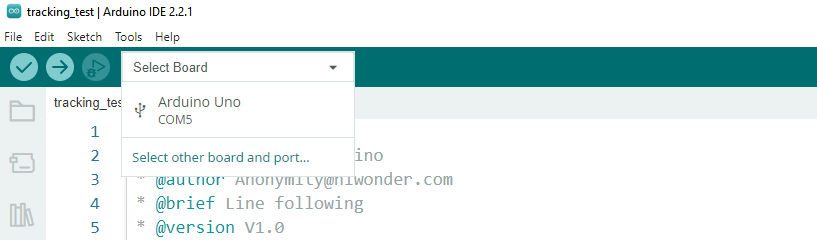

(4) Click  to compile and upload the program. Wait for the upload to complete.


### 6.7.4 Program Outcome

Place the car on the black line and turn on the power. Once the onboard button is pressed, the car will enter line-following mode. It will follow the black line when detected, and move backward if the line is lost—continuing in reverse until the line is detected again.

:::{Note}

Be sure to position the car on the black line before starting the program; otherwise, it will keep moving backward in search of the line.

:::

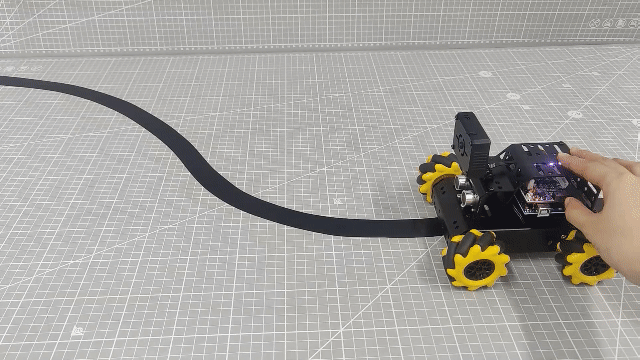

### 6.7.5 Program Analysis

[tracking_test](../_static/source_code/tracking_test.zip)

This section provides an overview of how the line-following program is structured and functions.

* **Import Library File**

{lineno-start=12}

```
#include <Wire.h>
#include "FastLED.h"
```

The program begins by importing the necessary library files for I2C communication and for controlling the RGB LEDs.

* **Defining Pins and Creating Objects**

(1) Next, the I2C addresses for the 4-channel line follower module are defined. Additionally, the pins for the onboard RGB LED, onboard button, and motors are specified.

{lineno-start=15}

```
/* 巡线传感器的iic地址(I2C address of the line follower) */
#define LINE_FOLLOWER_I2C_ADDR 0x78 

const static uint8_t ledPin = 2;
const static uint8_t keyPin = 3;
const static uint8_t pwm_min = 50;
const static uint8_t motorpwmPin[4] = { 10, 9, 6, 11 };
const static uint8_t motordirectionPin[4] = { 12, 8, 7, 13 };
const static uint8_t TRACKING = 4;
```

(2) An object is then created for RGB LED control, and a variable named modestate is introduced to manage the car's line-following mode.

{lineno-start=15}

```
static CRGB rgbs[1];
static uint8_t modestate = TRACKING;
```

* **Initial Setup**

(1) In the setup() function, the serial port is initialized with a baud rate of 9600. The onboard button pin is configured as an input. The RGB LED on the expansion board is initialized using the FastLED library and connected to the specified ledPin. To confirm initialization, the LED is set to white using the Rgb_Show(255, 255, 255) function.

{lineno-start=47}

```
void setup() {
  /* 配置通信(condigure communication) */
  Serial.begin(9600);

  pinMode(keyPin, INPUT);
  FastLED.addLeds<WS2812, ledPin, GRB>(rgbs, 1);
  Rgb_Show(255, 255, 255);
```

(2) I2C communication is then initialized with Wire.begin(), and the motor pins are set up by calling Motor_Init().

{lineno-start=55}

```
  Wire.begin();
  Motor_Init();
```

* **Main Function**

In the `loop()` function, when a button press is detected, the program continuously calls `Sensor_Receive()` to read the line follower sensor data. Based on the received values, the car is controlled to move accordingly. Afterward, the Task_Dispatcher() function is executed to carry out the appropriate line-following behavior.

{lineno-start=59}

```
void loop() {
  keyState = analogRead(keyPin);
  if (!keyState) taskStart = 1;
  if (taskStart) {
    Sensor_Receive();
    Task_Dispatcher();
  }
}
```

* **Reading Sensor Data**

The `WireReadDataByte()` function is used to retrieve data from the line follower sensor. Each of the four probe values is stored in bits 0 through 3 of the rec_data array. A value of 0 indicates no black line detected, while a value of 1 means a black line is detected. These results are then saved in the rec_data array for further processing.

{lineno-start=151}

```
/* 获取传感器数据(Obtain the sensor data) */
void Sensor_Receive(void) {
  WireReadDataByte(1, data);
  rec_data[0] = data & 0x01;
  rec_data[1] = (data >> 1) & 0x01;
  rec_data[2] = (data >> 2) & 0x01;
  rec_data[3] = (data >> 3) & 0x01;
}
```

* **Task Dispatcher**

The `task_dispatcher()` function uses the value of modestate to determine and execute the corresponding behavior or task.

{lineno-start=177}

```
/* 任务调度(Task dispatcher) */
void Task_Dispatcher() {
  switch (modestate) {
    case TRACKING:
      Tracking_Line_Task();
      break;
  }
}
```

* **Line-Following Logic**

(1) During the line-following task, the `Rgb_Show(255, 0, 0)` function is first called to set the RGB LED to red. Sensor data is then evaluated: if both sensor 2 and sensor 3 detect a black line, the car moves forward.

{lineno-start=160}

```
void Tracking_Line_Task(void) {
  Rgb_Show(255, 0, 0);
  if (rec_data[1] == 1 && rec_data[2] == 1) {
    Velocity_Controller(0, 80, 0, 0);
  }
  if (rec_data[1] == 1 && rec_data[2] == 0) {
    Velocity_Controller(0, 80, 65, 0);
  }
  if (rec_data[1] == 0 && rec_data[2] == 1) {
    Velocity_Controller(0, 80, -65, 0);
  }
  while (rec_data[1] == 0 && rec_data[2] == 0) {
    Sensor_Receive();
    Velocity_Controller(0, 0, 0, 0);
  }
}
```

(2) If only sensor 2 detects a black line (while sensor 3 does not), the car turns left by 65 degrees. Conversely, if only sensor 3 detects a black line, the car turns right by 65 degrees.

{lineno-start=160}

```
void Tracking_Line_Task(void) {
  Rgb_Show(255, 0, 0);
  if (rec_data[1] == 1 && rec_data[2] == 1) {
    Velocity_Controller(0, 80, 0, 0);
  }
  if (rec_data[1] == 1 && rec_data[2] == 0) {
    Velocity_Controller(0, 80, 65, 0);
  }
  if (rec_data[1] == 0 && rec_data[2] == 1) {
    Velocity_Controller(0, 80, -65, 0);
  }
  while (rec_data[1] == 0 && rec_data[2] == 0) {
    Sensor_Receive();
    Velocity_Controller(0, 0, 0, 0);
  }
}
```

(3) If neither sensor 2 nor 3 detects a black line, the car reverses until it detects the line again.

{lineno-start=171}

```
  while (rec_data[1] == 0 && rec_data[2] == 0) {
    Sensor_Receive();
    Velocity_Controller(0, 0, 0, 0);
```

* **Velocity Control Function**

In this function, the speed and direction of each motor are calculated using the kinematic model of a mecanum-wheeled robot. The angle parameter defines the movement direction, where 0 degrees corresponds to the car's front, and counterclockwise is considered positive. The velocity parameter controls the movement speed, while rot sets the rotational direction—positive for counterclockwise and negative for clockwise. The drift parameter determines whether the drift functionality is enabled.

{lineno-start=98}

```
/**
 * @brief 速度控制函数(Speed control function)
 * @param angle   用于控制小车的运动方向，小车以车头为0度方向，逆时针为正方向。("angle" controls the robot's motion direction, with the front of the robot as 0 degrees and counterclockwise as the positive direction)
 *                取值为0~359(range from 0 to 359)
 * @param velocity   用于控制小车速度，取值为0~100。("velocity" controls the robot's speed, with a value range of 0 to 100)
 * @param rot     用于控制小车的自转速度，取值为-100~100，若大于0小车有一个逆("rot" controls the robot's self-rotation speed, with a value range of -100 to 100)
 *                 时针的自转速度，若小于0则有一个顺时针的自转速度。(If it is greater than 0, the robot has a counterclockwise self-rotation speed. If it is less than 0, the robot has a clockwise self-rotation speed)
 * @param drift   用于决定小车是否开启漂移功能，取值为0或1，若为0则开启，反之关闭。("drift" determines whether the robot enables drift. Value range: 0 or 1. If it is 0, drift is enabled; otherwise, it is disabled)
 * @retval None
 */
void Velocity_Controller(uint16_t angle, uint8_t velocity, int8_t rot, bool drift) {
  int8_t velocity_0, velocity_1, velocity_2, velocity_3;
  float speed = 1;
  angle += 90;
  float rad = angle * PI / 180;
  if (rot == 0) speed = 1;  // 速度因子(Speed factor)
  else speed = 0.5;
  velocity /= sqrt(2);
  if (drift) {
    velocity_0 = (velocity * sin(rad) - velocity * cos(rad)) * speed;
    velocity_1 = (velocity * sin(rad) + velocity * cos(rad)) * speed;
    velocity_2 = (velocity * sin(rad) - velocity * cos(rad)) * speed - rot * speed * 2;
    velocity_3 = (velocity * sin(rad) + velocity * cos(rad)) * speed + rot * speed * 2;
  } else {
    velocity_0 = (velocity * sin(rad) - velocity * cos(rad)) * speed + rot * speed;
    velocity_1 = (velocity * sin(rad) + velocity * cos(rad)) * speed - rot * speed;
    velocity_2 = (velocity * sin(rad) - velocity * cos(rad)) * speed - rot * speed;
    velocity_3 = (velocity * sin(rad) + velocity * cos(rad)) * speed + rot * speed;
  }
  Motors_Set(velocity_0, velocity_1, velocity_2, velocity_3);
}
```

* **Motor Control Function**

Finally, the control values calculated in the velocity control function are used to control each motor via PWM signals. The motors array maps the speed values to PWM outputs, and the pwm_set array is used to output the corresponding PWM signals to the motors.

{lineno-start=130}

```
/**
 * @brief PWM与轮子转向设置函数(PWM and wheel turning setting function)
 * @param Motor_x   作为PWM与电机转向的控制数值。根据麦克纳姆轮的运动学分析求得。("Motor_x" is the control value for PWM and motor rotating. Calculated based on the kinematics analysis of mecanum wheels)
 * @retval None
 */
void Motors_Set(int8_t Motor_0, int8_t Motor_1, int8_t Motor_2, int8_t Motor_3) {
  int8_t pwm_set[4];
  int8_t motors[4] = { Motor_0, Motor_1, Motor_2, Motor_3 };
  bool direction[4] = { 1, 0, 0, 1 };  // 前进 左1 右0(Forward; left 1; right 0)
  for (uint8_t i; i < 4; ++i) {
    if (motors[i] < 0) direction[i] = !direction[i];
    else direction[i] = direction[i];

    if (motors[i] == 0) pwm_set[i] = 0;
    else pwm_set[i] = map(abs(motors[i]), 0, 100, pwm_min, 255);

    digitalWrite(motordirectionPin[i], direction[i]);
    analogWrite(motorpwmPin[i], pwm_set[i]);
  }
}
```

### 6.7.6 Function Extension

(1) If the line-following sensor fails to detect the black line, you may need to adjust its onboard potentiometer. Rotating the knob clockwise increases the detection range, while turning it counterclockwise decreases it.

(2) Adjust the sensor until it correctly identifies the black line. When the sensor detects the line, its onboard LED will turn off; if the line is not detected, the LED will remain lit.

(3) In this example, we turn the knob counterclockwise to shorten the detection range. Once properly adjusted, the sensor will be able to follow the line accurately.

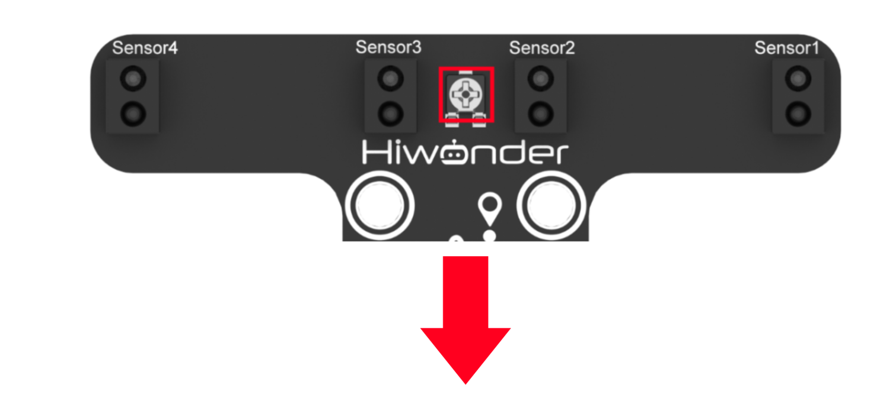

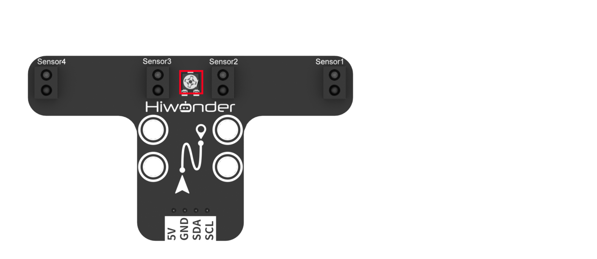

### 6.7.7 FAQ

Q1: After uploading the code, the car keeps moving backward.

A: Please ensure the car is placed on the black line before starting the program. Otherwise, it will not detect the line and will continue reversing.

Q2: The 4-channel line follower's line detection is inaccurate.

A: Try adjusting the potentiometer on the 4-channel line follower to fine-tune the detection sensitivity. Rotate the knob until the sensor accurately detects the black line. 

## 6.8 Pedestrian Detection

In this section, the 4-channel line follower is used to detect black lines, enabling the robot car to follow the path. If the ultrasonic sensor detects a pedestrian on the line during operation, the car will automatically take evasive action to avoid the obstacle.

### 6.8.1 Program Flowchart

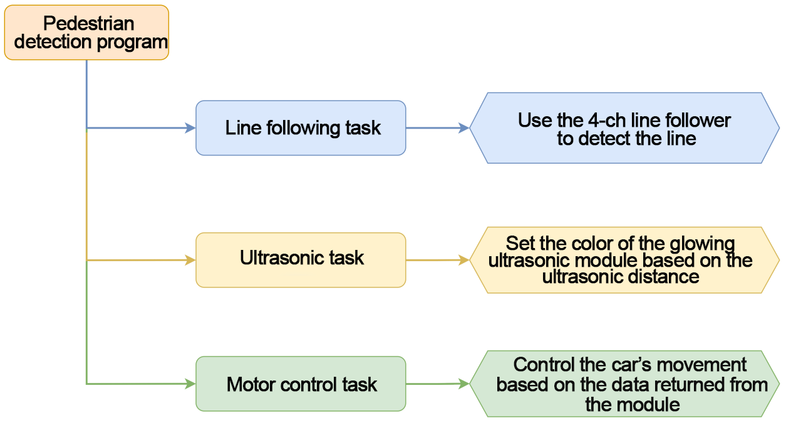

### 6.8.2 Module Introduction

* **4-Channel Line Follower**

The 4-channel line follower uses an I2C communication interface, allowing the module to read data from its probes via I2C.

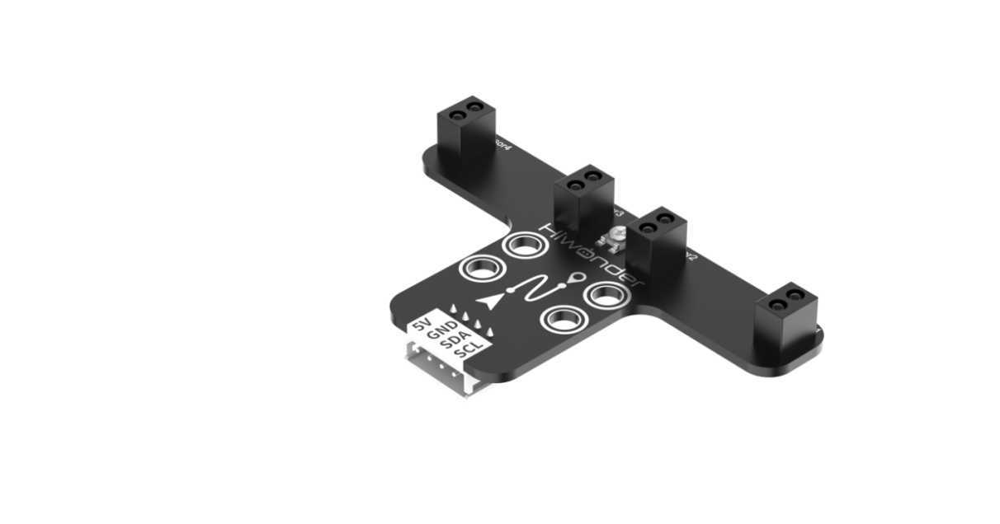

It features four probes, each consisting of an infrared emitter and an infrared receiver. White surfaces reflect infrared light strongly, while black surfaces reflect it weakly. This difference enables the sensor to determine whether a black line has been detected.

* **Ultrasonic Sensor**

This module is a glowing ultrasonic ranging sensor that also uses an I2C communication interface to transmit the measured distance data. It integrates two RGB LEDs positioned near the ultrasonic probes. These LEDs can adjust brightness and display various colors by blending red (R), green (G), and blue (B) light channels.

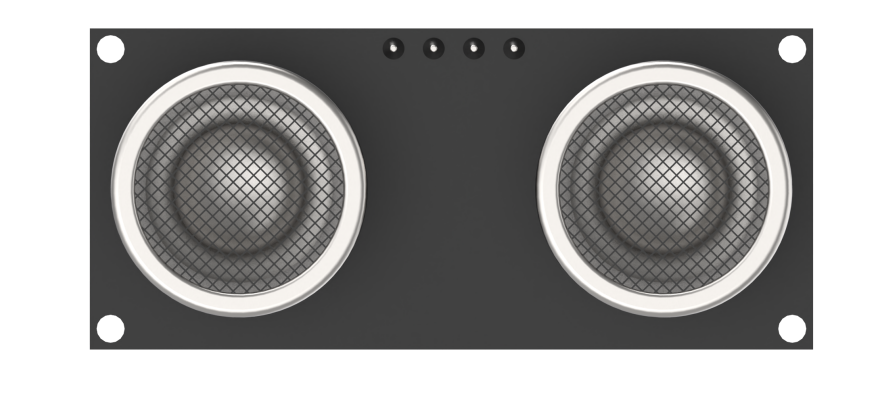

During distance measurement, the sensor automatically emits eight 40kHz square wave pulses and then checks for any returning signals. If a signal is received, it outputs a high voltage level. The duration of this high level corresponds to the time it takes for the ultrasonic wave to travel to the object and back.

### 6.8.3 Program Download 

[tracking_avoid](../_static/source_code/tracking_avoid.zip)

:::{Note}

- **Remove the Bluetooth module** before uploading the program. Otherwise, the upload may fail due to serial port conflicts.

- **Turn off the battery box** before connecting the Type-B USB cable. This prevents accidental contact with the power pins, which could cause a short circuit.

:::

(1) Locate and open the tracking_avoid program file (found in the same directory as this tutorial).

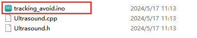

(2) Connect Arduino to the computer with the Type-B cable.


(3) Click **"Select Board"** in the IDE. The software will automatically detect the connected Arduino and its port. Click to confirm.

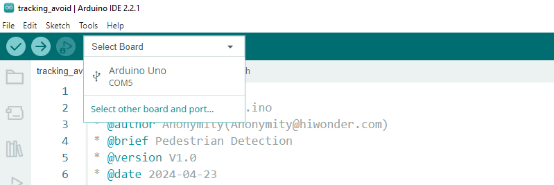

(4) Click  to compile and upload the program. Wait for the upload to complete.


### 6.8.4 Program Outcome

Place the car on the black line first. Once the button is pressed, the car will activate the line-following program. When the car detects the black line, it will follow it. If the black line is lost, the car will move backward until it detects the line again. During the line-following process, if the ultrasonic sensor detects a person in front, the car will stop.

:::{Note}

Ensure that the car is placed on the black line before starting the program, as the car will otherwise continue moving backward.

:::

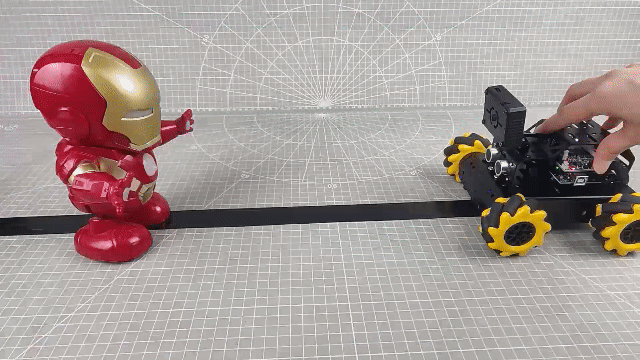

### 6.8.5 Program Analysis

[tracking_avoid](../_static/source_code/tracking_avoid.zip)

* **Import Library File**

{lineno-start=12}

```
#include <Wire.h>
#include "Ultrasound.h"
#include "FastLED.h"
```

To import the required library files for I2C communication, RGB LED, and ultrasonic sensor, you can use the following code snippet in your program:

* **Define Pin and Create Objects**

(1) The I2C communication addresses for the 4-channel line follower and the filtering algorithm's capacity are defined. An ultrasonic object is also created to handle distance measurements.

{lineno-start=16}

```
#define LINE_FOLLOWER_I2C_ADDR 0x78/* 寻线传感器的iic地址(I2C address of the line follower) */ 
#define FILTER_N 3                //递推平均滤波法(Recursive average filtering method)

Ultrasound ultrasound;  //实例化超声波类(Instantiate the ultrasound class)
```

(2) The pins for the onboard RGB LED, onboard button, and motor control are defined. The variable "**TRACKING**" is used to represent the line-following mode, while **"AVOID"** refers to the mode activated when a pedestrian is detected on the path.

{lineno-start=21}

```
const static uint8_t ledPin = 2;
const static uint8_t keyPin = 3;
const static uint8_t buzzerPin = 3;
const static uint8_t pwm_min = 50;
const static uint8_t motorpwmPin[4] = { 10, 9, 6, 11} ;
const static uint8_t motordirectionPin[4] = { 12, 8, 7, 13};
const static uint8_t TRACKING = 4;
const static uint8_t AVOID = 6;
```

(3) An RGB LED control object is initialized. The **"modestate"** variable is set to line-following mode by default, which allows the car to follow the designated path.

{lineno-start=30}

```
static CRGB rgbs[1];
static uint8_t modestate = TRACKING;
```

* **Initial Settings**

(1) In the `setup()` function, set the serial communication baud rate to 9600. Configure the button pin as an input. Initialize the RGB LED on the expansion board using the FastLED library, connecting it to the ledPin. Then, call the `Rgb_Show(255, 255, 255)` function to set the RGB LED to white.

{lineno-start=55}

```
void setup(){
  /* 配置通信(Configure communication) */
  Serial.begin(9600);

  pinMode(keyPin, INPUT);
  FastLED.addLeds<WS2812, ledPin, GRB>(rgbs, 1);
  Rgb_Show(255,255,255);
```

(2) Call `Wire.begin()` to initialize I2C communication. Use `Motor_Init()` to bind and initialize the motor control pins.

{lineno-start=63}

```
  Wire.begin();
  Motor_Init();
```

* **Main Function**

When a button press is detected in the main function, the `Sensor_Receive()` function is called in a loop to retrieve the values from the 4-channel line follower sensor, which are used to detect the black line. Then, the `ultrasonic_distance()` function is called to obtain distance values from the ultrasonic sensor, which help determine if a pedestrian is detected. Once these values are determined, the car's movement is adjusted accordingly. Afterward, the `Task_Dispatcher()` function is called to execute the appropriate task based on the sensor data.

{lineno-start=68}

```
void loop(){
  keyState = analogRead(keyPin);
  if(!keyState) taskStart = 1;
  if(taskStart) {
    Sensor_Receive();
    ultrasonic_distance();
    dis = ultrasonic_distance();
    Task_Dispatcher();
  }
```

* **Obtain Sensor Data**

Call the `WireReadDataByte()`function to retrieve the current line data from the sensor. The values from probes 1 to 4 on the line follower are stored in the 0th to 3rd positions of the rec_data array. A value of 0 indicates that no black line is detected, while a value of 1 indicates that the black line is detected. These values are then stored in the rec_data array.

{lineno-start=165}

```
/* 获取传感器数据(Obtain the sensor data) */
void Sensor_Receive(void){
  WireReadDataByte(1,data);
  rec_data[0] = data & 0x01;
  rec_data[1] = (data>>1) & 0x01;
  rec_data[2] = (data>>2) & 0x01;
  rec_data[3] = (data>>3) & 0x01;
}
```

* **Task Dispatcher Function**

In the `task_dispatcher()` function, the value of the modestate variable determines which task is executed. By default, the car is set to line-following mode. If the ultrasonic sensor detects a pedestrian, the car will enter pedestrian detection mode and continue in this mode until no pedestrian is detected. Once the pedestrian is no longer detected, the car will return to line-following mode.

{lineno-start=257}

```
void Task_Dispatcher(){
	switch(modestate){
		case TRACKING:
			Tracking_Line_Task();
			break;
		case AVOID:
			Avoid_Task();
			break;
	}
}
```

* **Line Following Task**

(1) Call the `Rgb_Show(255,0,0)` function to set the onboard RGB LED to red. Then, check the received sensor data. If both sensor2 and sensor3 detect a black line, the car will move forward.

{lineno-start=174}

```
void Tracking_Line_Task(void){
  Rgb_Show(255,0,0);   
  if(rec_data[1] == 1 && rec_data[2] == 1){
    Velocity_Controller(0, 80, 0, 0);
  }
 if(rec_data[1] == 1 && rec_data[2] == 0){
    Velocity_Controller(0, 80, 65, 0);
  }
 if(rec_data[1] == 0 && rec_data[2] == 1){
    Velocity_Controller(0, 80, -65, 0);
  }
 while(rec_data[1] == 0 && rec_data[2] == 0){
    Sensor_Receive();
    Velocity_Controller(180, 80, 0, 0);
  }
  if(dis <= 80){
    modestate = AVOID;
  }
```

(2) If sensor2 detects a black line while sensor3 does not, the car will turn left by 65 degrees. If sensor3 detects a black line while sensor2 does not, the car will turn right by 65 degrees.

{lineno-start=174}

```
void Tracking_Line_Task(void){
  Rgb_Show(255,0,0);   
  if(rec_data[1] == 1 && rec_data[2] == 1){
    Velocity_Controller(0, 80, 0, 0);
  }
 if(rec_data[1] == 1 && rec_data[2] == 0){
    Velocity_Controller(0, 80, 65, 0);
  }
 if(rec_data[1] == 0 && rec_data[2] == 1){
    Velocity_Controller(0, 80, -65, 0);
  }
 while(rec_data[1] == 0 && rec_data[2] == 0){
    Sensor_Receive();
    Velocity_Controller(180, 80, 0, 0);
  }
```

(3) If neither sensor2 nor sensor3 detects a black line, the car will move backward.

{lineno-start=185}

```
 while(rec_data[1] == 0 && rec_data[2] == 0){
    Sensor_Receive();
    Velocity_Controller(180, 80, 0, 0);
  }
```

* **Pedestrian Detection Task**

When a pedestrian is detected, the function `Velocity_Controller(0, 0, 0, 0)` is called to stop the car. Then, the `Rgb_Show(0, 255, 0)` function is used to turn the RGB LED green. Simultaneously, the tone(buzzerPin, 1000) function activates the buzzer to beep at 1000Hz. The system waits for the pedestrian to leave.

Once the pedestrian is no longer detected, the car switches back to line-following mode, and the buzzer is turned off.

{lineno-start=246}

```
/* 行人检测任务(Pedestrian detection task) */
void Avoid_Task(void){
  Velocity_Controller(0, 0, 0, 0);
  Rgb_Show(0,255,0);
  tone(buzzerPin, 1000);
  if(dis > 80) {
    modestate = TRACKING;
    noTone(buzzerPin);
  }
}
```

* **Velocity Control Function**

The velocity control function calculates the control values for each motor based on the kinematic analysis of the mecanum wheel. The **"angle"** parameter determines the car's motion direction, with 0 degrees representing the car's front. The positive direction is counterclockwise.

The **"velocity"** parameter controls the speed of the car, while the **"rot"** parameter governs the direction of the car's self-rotation. Values greater than 0 correspond to counterclockwise rotation, and values less than 0 correspond to clockwise rotation.

The **"drift"** parameter allows for enabling or disabling the car's drift function.

{lineno-start=112}

```
/**
 * @brief 速度控制函数(Speed control function)
 * @param angle   用于控制小车的运动方向，小车以车头为0度方向，逆时针为正方向。("angle" controls the robot's motion direction, with the front of the robot as 0 degrees and counterclockwise as the positive direction)
 *                取值为0~359(range from 0 to 359)
 * @param velocity   用于控制小车速度，取值为0~100。("velocity" controls the robot's speed, with a value range of 0 to 100)
 * @param rot     用于控制小车的自转速度，取值为-100~100，若大于0小车有一个逆("rot" controls the robot's self-rotation speed, with a value range of -100 to 100)
 *                 时针的自转速度，若小于0则有一个顺时针的自转速度。(If it is greater than 0, the robot has a counterclockwise self-rotation speed. If it is less than 0, the robot has a clockwise self-rotation speed)
 * @param drift   用于决定小车是否开启漂移功能，取值为0或1，若为0则开启，反之关闭。("drift" determines whether the robot enables drift. Value range: 0 or 1. If it is 0, drift is enabled; otherwise, it is disabled)
 * @retval None
 */
void Velocity_Controller(uint16_t angle, uint8_t velocity,int8_t rot,bool drift) {
  int8_t velocity_0, velocity_1, velocity_2, velocity_3;
  float speed = 1;
  angle += 90;
  float rad = angle * PI / 180;
  if (rot == 0) speed = 1;// 速度因子(Speed factor)
  else speed = 0.5; 
  velocity /= sqrt(2);
  if (drift) {
    velocity_0 = (velocity * sin(rad) - velocity * cos(rad)) * speed;
    velocity_1 = (velocity * sin(rad) + velocity * cos(rad)) * speed;
    velocity_2 = (velocity * sin(rad) - velocity * cos(rad)) * speed - rot * speed * 2;
    velocity_3 = (velocity * sin(rad) + velocity * cos(rad)) * speed + rot * speed * 2;
  } else {
    velocity_0 = (velocity * sin(rad) - velocity * cos(rad)) * speed + rot * speed;
    velocity_1 = (velocity * sin(rad) + velocity * cos(rad)) * speed - rot * speed;
    velocity_2 = (velocity * sin(rad) - velocity * cos(rad)) * speed - rot * speed;
    velocity_3 = (velocity * sin(rad) + velocity * cos(rad)) * speed + rot * speed;
  }
  Motors_Set(velocity_0, velocity_1, velocity_2, velocity_3);
}
```

* **Motor Control Function**

The control values for each motor, calculated in the velocity control function, are used to control the motors via PWM (Pulse Width Modulation). The **"motors"** array maps the speed values of each motor to the corresponding PWM values. The **"pwm_set"** array manages the PWM values output to each motor, ensuring precise motor control.

{lineno-start=144}

```
/**
 * @brief PWM与轮子转向设置函数(PWM and wheel turning setting function)
 * @param Motor_x   作为PWM与电机转向的控制数值。根据麦克纳姆轮的运动学分析求得。("Motor_x" is the control value for PWM and motor rotating. Calculated based on the kinematics analysis of mecanum wheels)
 * @retval None
 */
void Motors_Set(int8_t Motor_0, int8_t Motor_1, int8_t Motor_2, int8_t Motor_3) {
  int8_t pwm_set[4];
  int8_t motors[4] = { Motor_0, Motor_1, Motor_2, Motor_3};
  bool direction[4] = { 1, 0, 0, 1};// 前进 左1 右0(Forward; left 1; right 0)
  for(uint8_t i; i < 4; ++i) {
    if(motors[i] < 0) direction[i] = !direction[i];
    else direction[i] = direction[i];

    if(motors[i] == 0) pwm_set[i] = 0;
    else pwm_set[i] = map(abs(motors[i]), 0, 100, pwm_min, 255);

    digitalWrite(motordirectionPin[i], direction[i]); 
    analogWrite(motorpwmPin[i], pwm_set[i]); 
  }
}
```

### 6.8.6 FAQ

**Q1: Since the code was uploaded, the car keeps moving backward.**  

**A:** Please ensure the car is placed on the black line before running the program.

**Q2: The line detection of the 4-channel line follower is inaccurate.**  

**A:** Please adjust the potentiometer on the 4-channel line follower to the correct position for accurate detection.

## 6.9 Intersection Judgment

In this section, we will learn how to use the 4-channel line follower to detect a black line and control the miniAuto to follow it. If the miniAuto encounters an intersection while following the line, it will stop.

### 6.9.1 Program Flowchart

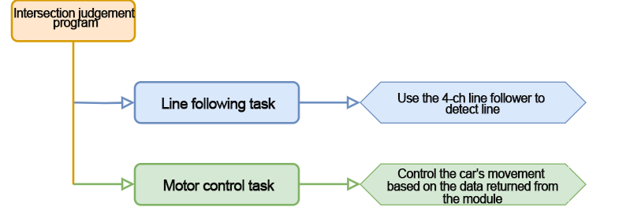

### 6.9.2 Module Introduction

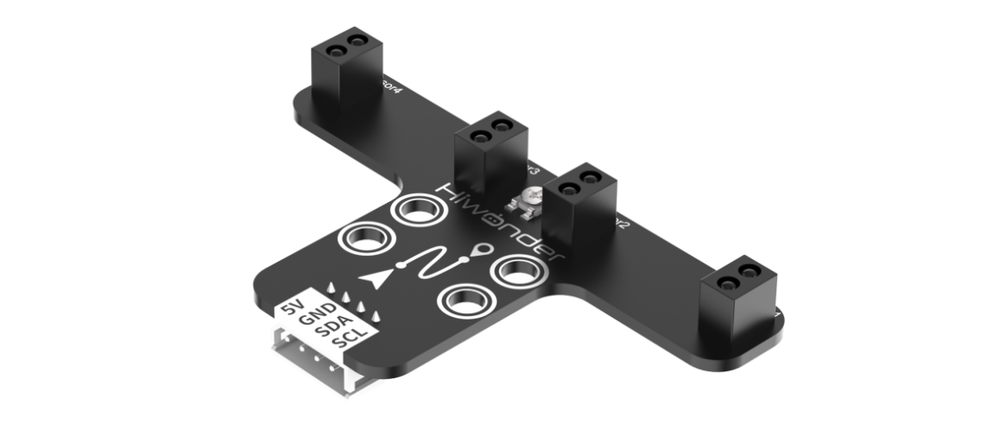

In this section, we will use the 4-channel line follower, which features an I2C communication interface for reading data from the sensor probes.

The module includes four probes, each consisting of an infrared emitter and an infrared receiver. White surfaces strongly reflect infrared light, while black surfaces reflect it weakly. This difference in reflection allows the sensor to determine whether a line is detected.

<p id=anchor_6_9_3"></p>

### 6.9.3 Program Download 

[tracking_crossroads](../_static/source_code/tracking_crossroads.zip)

 :::{Note}

- **Remove the Bluetooth module** before uploading the program. Otherwise, the upload may fail due to serial port conflicts.

- **Turn off the battery box** before connecting the Type-B USB cable. This prevents accidental contact with the power pins, which could cause a short circuit.

:::

(1) Locate and open the tracking_crossroads program file (found in the same directory as this tutorial).


(2) Connect the Arduino board to your computer using a Type-B USB cable.


(3) Click **"Select Board"** in the IDE. The software will automatically detect the connected Arduino and its port. Click to confirm.

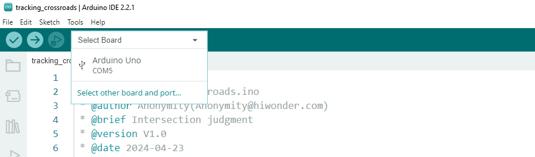

(4) Click  to compile and upload the program. Wait for the upload to complete.


### 6.9.4 Program Outcome

Place the car on the black line and power it on. Once the onboard button is pressed, the car will enter the line-following mode. It will follow the black line when detected. If the line is lost, the car will move backward until it detects the black line again.

:::{Note}

Ensure the car is placed on the black line before starting the line-following program; otherwise, the car will keep moving backward.

:::

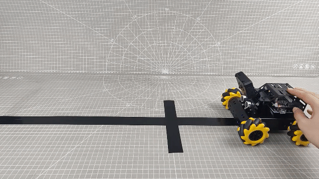

### 6.9.5 Program Analysis

[tracking_crossroads](../_static/source_code/tracking_crossroads.zip)

* **Import Library File**

{lineno-start=12}

```
#include <Wire.h>
#include "FastLED.h"
```

Import the necessary library files for I2C communication and RGB LED control to facilitate the operation of the game.

* **Define Pin and Create Objects**

(1) The I2C communication address for the 4-channel line follower is defined, along with the pins for the onboard RGB LED, button, and motors.

{lineno-start=15}

```
#define LINE_FOLLOWER_I2C_ADDR 0x78 /* 巡线传感器的iic地址(I2C address of the line follower) */

const static uint8_t ledPin = 2;
const static uint8_t keyPin = 3;
const static uint8_t pwm_min = 50;
const static uint8_t motorpwmPin[4] = { 10, 9, 6, 11 };
const static uint8_t motordirectionPin[4] = { 12, 8, 7, 13 };
const static uint8_t TRACKING = 4;
const static uint8_t INTERSECTION_DETECTION = 5;
```

(2) An RGB LED control object is created. The modestate variable is used to set the car to line-following mode, which is the default setting.

{lineno-start=}

```
static CRGB rgbs[1];
static uint8_t modestate = TRACKING;
```

* **Initial Settings**

(1) In the `setup()` function, set the serial communication baud rate to 9600. Configure the button pin as an input. Initialize the RGB LED on the expansion board using the FastLED library and connect it to the ledPin. Then, call the `Rgb_Show(255, 255, 255)` function to set the RGB LED to white.

{lineno-start=47}

```
void setup() {
  /* 配置通信(condigure communication) */
  Serial.begin(9600);

  pinMode(keyPin, INPUT);
  FastLED.addLeds<WS2812, ledPin, GRB>(rgbs, 1);
  Rgb_Show(255, 255, 255);
```

(2) Call `Wire.begin()` to initialize I2C communication. Use `Motor_Init()` to bind and initialize the motor pins.

{lineno-start=55}

```
  Wire.begin();
  Motor_Init();
```

* **Main Function**

When a button press is detected in the main function, the Sensor_Receive() function is continuously called to read values from the 4-channel line follower. These values are used to detect the black line. Based on the sensor data, the car's movement is controlled accordingly. After that, the `Task_Dispatcher()` function is called to execute the corresponding task.

{lineno-start=59}

```
void loop() {
  keyState = analogRead(keyPin);
  if (!keyState) taskStart = 1;
  if (taskStart) {
    Sensor_Receive();
    Task_Dispatcher();
  }
}
```

* **Obtain Sensor Data**

Call the `WireReadDataByte()` function to retrieve the current line data from the 4-channel line follower sensor. The sensor has four probes, and the readings from probes 1 to 4 are stored in bits 0 to 3 of the rec_data array.

A value of **0** indicates no black line detected.

A value of **1** indicates a black line is detected.  

These values are then stored in the rec_data array for further processing.

{lineno-start=151}

```
/* 获取传感器数据(Obtain the sensor data) */
void Sensor_Receive(void) {
  WireReadDataByte(1, data);
  rec_data[0] = data & 0x01;
  rec_data[1] = (data >> 1) & 0x01;
  rec_data[2] = (data >> 2) & 0x01;
  rec_data[3] = (data >> 3) & 0x01;
}
```

* **Task Dispatcher Function**

In the `task_dispatcher()` function, the value of the modestate variable determines which task to execute.  

By default, the car is set to **line-following mode**.  

If an intersection is detected, the car will switch to **intersection detection mode**.

{lineno-start=188}

```
/* 任务调度(Task dispatcher) */
void Task_Dispatcher() {
  switch (modestate) {
    case TRACKING:
      Tracking_Line_Task();
      break;
    case INTERSECTION_DETECTION:
			Intersection_Detection_Task();
			break;
  }
}
```

* **Line Following Task**

(1) First, call the `Rgb_Show(255, 0, 0)` function to set the onboard RGB LED to red. Then, evaluate the received sensor data. If both **Sensor2** and **Sensor3** detect a black line, the car will move forward.

{lineno-start=160}

```
void Tracking_Line_Task(void) {
  Rgb_Show(255, 0, 0);
  if (rec_data[1] == 1 && rec_data[2] == 1) {
    Velocity_Controller(0, 80, 0, 0);
  }
  if (rec_data[1] == 1 && rec_data[2] == 0) {
    Velocity_Controller(0, 80, 65, 0);
  }
  if (rec_data[1] == 0 && rec_data[2] == 1) {
    Velocity_Controller(0, 80, -65, 0);
  }
  while (rec_data[1] == 0 && rec_data[2] == 0) {
    Sensor_Receive();
    Velocity_Controller(0, 0, 0, 0);
  }
```

(2) If **Sensor2** detects a black line and **Sensor3** does not, the car will turn left by 65° while moving forward. If **Sensor3** detects a black line and **Sensor2** does not, the car will turn right by 65° while moving forward.

{lineno-start=160}

```
void Tracking_Line_Task(void) {
  Rgb_Show(255, 0, 0);
  if (rec_data[1] == 1 && rec_data[2] == 1) {
    Velocity_Controller(0, 80, 0, 0);
  }
  if (rec_data[1] == 1 && rec_data[2] == 0) {
    Velocity_Controller(0, 80, 65, 0);
  }
  if (rec_data[1] == 0 && rec_data[2] == 1) {
    Velocity_Controller(0, 80, -65, 0);
  }
  while (rec_data[1] == 0 && rec_data[2] == 0) {
    Sensor_Receive();
    Velocity_Controller(0, 0, 0, 0);
  }
  if(rec_data[0] == 1 && rec_data[3] == 1){     //0没识别到黑线 1识别到黑线(If it is 0, the black line is not detected; if it is 1, the black line is detected)
    modestate = INTERSECTION_DETECTION;    
  }
}
```

(3) If neither **Sensor2** nor **Sensor3** detects a black line, the car will move backward.

{lineno-start=171}

```
  while (rec_data[1] == 0 && rec_data[2] == 0) {
    Sensor_Receive();
    Velocity_Controller(0, 0, 0, 0);
  }
```

(4) If both **Sensor0** and **Sensor3** detect a black line, it indicates the car is at an intersection. The car will then enter the intersection detection mode.

{lineno-start=175}

```
  if(rec_data[0] == 1 && rec_data[3] == 1){     //0没识别到黑线 1识别到黑线(If it is 0, the black line is not detected; if it is 1, the black line is detected)
    modestate = INTERSECTION_DETECTION;    
  }
```

* **Velocity Control Function**

In the velocity control function, the motor control values are calculated using the kinematic analysis of the mecanum wheel. The **"angle"** parameter determines the direction of the car's movement. A value of 0 degrees corresponds to the front of the car, and counterclockwise rotations are considered positive. The **"velocity"** parameter controls the speed of the car, while the **"rot"** parameter controls the car's rotational direction. Positive values of **"rot"** result in counterclockwise rotation, while negative values cause clockwise rotation. The **"drift"** parameter controls whether the car's drift function is active.

{lineno-start=98}

```
/**
 * @brief 速度控制函数(Speed control function)
 * @param angle   用于控制小车的运动方向，小车以车头为0度方向，逆时针为正方向。("angle" controls the robot's motion direction, with the front of the robot as 0 degrees and counterclockwise as the positive direction)
 *                取值为0~359(range from 0 to 359)
 * @param velocity   用于控制小车速度，取值为0~100。("velocity" controls the robot's speed, with a value range of 0 to 100)
 * @param rot     用于控制小车的自转速度，取值为-100~100，若大于0小车有一个逆("rot" controls the robot's self-rotation speed, with a value range of -100 to 100)
 *                 时针的自转速度，若小于0则有一个顺时针的自转速度。(If it is greater than 0, the robot has a counterclockwise self-rotation speed. If it is less than 0, the robot has a clockwise self-rotation speed)
 * @param drift   用于决定小车是否开启漂移功能，取值为0或1，若为0则开启，反之关闭。("drift" determines whether the robot enables drift. Value range: 0 or 1. If it is 0, drift is enabled; otherwise, it is disabled)
 * @retval None
 */
void Velocity_Controller(uint16_t angle, uint8_t velocity, int8_t rot, bool drift) {
  int8_t velocity_0, velocity_1, velocity_2, velocity_3;
  float speed = 1;
  angle += 90;
  float rad = angle * PI / 180;
  if (rot == 0) speed = 1;  // 速度因子(Speed factor)
  else speed = 0.5;
  velocity /= sqrt(2);
  if (drift) {
    velocity_0 = (velocity * sin(rad) - velocity * cos(rad)) * speed;
    velocity_1 = (velocity * sin(rad) + velocity * cos(rad)) * speed;
    velocity_2 = (velocity * sin(rad) - velocity * cos(rad)) * speed - rot * speed * 2;
    velocity_3 = (velocity * sin(rad) + velocity * cos(rad)) * speed + rot * speed * 2;
  } else {
    velocity_0 = (velocity * sin(rad) - velocity * cos(rad)) * speed + rot * speed;
    velocity_1 = (velocity * sin(rad) + velocity * cos(rad)) * speed - rot * speed;
    velocity_2 = (velocity * sin(rad) - velocity * cos(rad)) * speed - rot * speed;
    velocity_3 = (velocity * sin(rad) + velocity * cos(rad)) * speed + rot * speed;
  }
  Motors_Set(velocity_0, velocity_1, velocity_2, velocity_3);
}
```

* **Motor Control Function**

The control values for each motor, which are calculated in the velocity control function, are used to regulate the motors via PWM. The 'motors' array maps the speed values of each motor to their respective PWM values. The `pwm_set` array then controls the PWM signals sent to each motor, determining their speed and direction.

{lineno-start=130}

```
/**
 * @brief PWM与轮子转向设置函数(PWM and wheel turning setting function)
 * @param Motor_x   作为PWM与电机转向的控制数值。根据麦克纳姆轮的运动学分析求得。("Motor_x" is the control value for PWM and motor rotating. Calculated based on the kinematics analysis of mecanum wheels)
 * @retval None
 */
void Motors_Set(int8_t Motor_0, int8_t Motor_1, int8_t Motor_2, int8_t Motor_3) {
  int8_t pwm_set[4];
  int8_t motors[4] = { Motor_0, Motor_1, Motor_2, Motor_3 };
  bool direction[4] = { 1, 0, 0, 1 };  // 前进 左1 右0(Forward; left 1; right 0)
  for (uint8_t i; i < 4; ++i) {
    if (motors[i] < 0) direction[i] = !direction[i];
    else direction[i] = direction[i];

    if (motors[i] == 0) pwm_set[i] = 0;
    else pwm_set[i] = map(abs(motors[i]), 0, 100, pwm_min, 255);

    digitalWrite(motordirectionPin[i], direction[i]);
    analogWrite(motorpwmPin[i], pwm_set[i]);
  }
}
```

### 6.9.6 Function Extension

Let's modify the car's behavior to turn left after detecting an intersection. First, locate the intersection detection function in the code. Modify the code so that the car turns left for 2 seconds upon detecting a crossroad, instead of stopping for 2 seconds.

{lineno-start=183}

```
  Velocity_Controller(0, 0, 65, 0);
  delay(2000);
```

Once the modification is complete, follow the [6.9.3 Program Download](#anchor_6_9_3) section to upload the updated program.

### 6.9.7 FAQ

**Q1:** After uploading the code, the car keeps moving backward.  

**A:** Please ensure that the car is placed on the black line before running the program.

**Q2:** The line detection of the 4-channel line follower is inaccurate.  

**A:** Please adjust the potentiometer on the 4-channel line follower to the correct position for accurate detection.

## 6.10 App Remote Control

In this section, we'll learn how the miniAuto control program works. By exploring the different features and fun functions in the mobile app, you'll get a better idea of how miniAuto works behind the scenes.

### 6.10.1 Program Flowchart

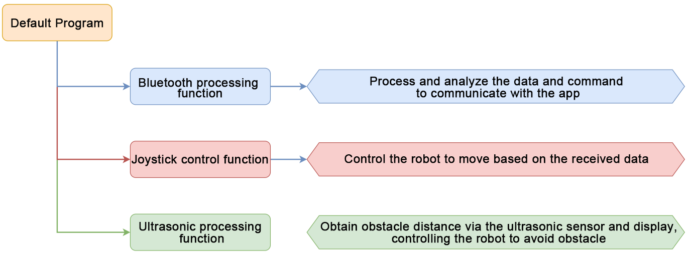

### 6.10.2 Program Download

[app_control](../_static/source_code/10_app_control.zip)

:::{Note}

- **Remove the Bluetooth module** before uploading the program. Otherwise, the upload may fail due to serial port conflicts.

- **Turn off the battery box** before connecting the Type-B USB cable. This prevents accidental contact with the power pins, which could cause a short circuit.

:::

(1) Locate and open the [app_control/app_control.ino](../_static/source_code/10_app_control.zip) program file (found in the same directory as this tutorial).


(2) Connect the Arduino board to your computer using a Type-B USB cable.


(3) Click **"Select Board"** in the IDE. The software will automatically detect the connected Arduino and its port. Click to confirm.

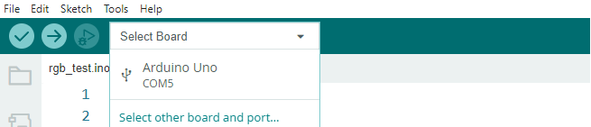

(4) Click  to compile and upload the program. Wait for the upload to complete.


### 6.10.3 Program Outcome

Please access "[**4. App Contro**l](https://docs.hiwonder.com/projects/miniAuto/en/latest/docs/4.App_control.html)" to view the program outcome.


### 6.10.4 Brief Program Analysis 

[app_control](../_static/source_code/10_app_control.zip)

* **Import Library File**

Import the required library files of RGB LED, servo control and ultrasonic sensor for the game.

{lineno-start=13}

```
#include <Arduino.h>
#include "FastLED.h"
#include <Servo.h>
#include "Ultrasound.h"
```

* **Define Variables and Create Objects**

(1) We start by creating a **buzzer alarm**, a **function mode**, and a **voltage status flag** to help us monitor the robot car's behavior.  

Next, we define the control variables that tell the robot car how to move. In the app, you can set the motion speed. We use a variable called speed_update to change the robot's forward speed. This makes speed control possible in real time.

{lineno-start=43}

```
static VoltageWarning g_warning = WARNING_OFF; 
static CarMode g_mode = MODE_NULL; 
static ReadVoltageState g_read = READ_VOLTAGE_ON; 

static uint8_t g_state = 8;         /* 接收的APP子指令(receive app sub-command) */
static uint8_t avoid_flag = 0;      /* 避障模式开关标志位(obstacle avoidance mode switch flag) */
static uint8_t beep_count = 0;      /* 蜂鸣器鸣响次数(number of times of the buzzer sound) */

static int car_derection = 0;       /* 设置小车移动的角度(set the movement angle of the car) */
static int8_t car_rot = 0;          /* 设置小车角速度(set the angular velocity of the car) */
static uint8_t speed_data = 0;      /* 设置小车线速度(set the linear velocity of the car) */
static uint8_t speed_update = 50;   /* APP更新的线速度(the linear velocity updated via the app) */

/* 电压监测相关参数(parameters related to voltage monitoring) */
static float voltage;
static int voltage_send;
static int last_voltage_send;
static int real_voltage_send;
static int error_voltage;
```

(2) We define the pins used for the onboard RGB LEDs, onboard buttons, and the motors.

{lineno-start=68}

```
/* 引脚定义(define pins) */
const static uint8_t ledPin = 2;
const static uint8_t buzzerPin = 3;
const static uint8_t servoPin = 5;
const static uint8_t motorpwmPin[4] = { 10, 9, 6, 11} ;
const static uint8_t motordirectionPin[4] = { 12, 8, 7, 13};
```

(3) We set up the **PWM (Pulse Width Modulation)** frequency and period to control how fast the motors spin.  

To avoid stopping the whole program while waiting (which we call a "**blocking delay**"), we create **non-blocking delay** variables. This way, the robot can keep checking sensors or receiving commands while waiting.  

Finally, we define variables to store the **servo angles** (to know the direction parts are pointing) and **ultrasonic distance** (to measure how far things are from the robot).

{lineno-start=75}

```
const static int pwmFrequency = 500;                /* PWM频率，单位是赫兹(the PWM frequency in units of Hz) */
const static int period = 10000000 / pwmFrequency;  /* PWM周期，单位是微秒(the PWM period in units of microseconds) */
const static uint32_t interval_us = 20000;          /* 微秒计数时间间隔 用于非阻塞延时(the microsecond count interval employed for non-blocking delays) */
const static uint32_t interval_ms = 1000;           /* 毫秒计数时间间隔 用于非阻塞延时(the millisecond count interval employed for non-blocking delays) */

static uint32_t previousTime_us = 0;          /* 上一次的微秒计数时间间隔 用于非阻塞延时(the previous microsecond count interval for non-blocking delays) */
static uint32_t previousTime_ms = 0;          /* 上一次的毫秒计数时间间隔 用于非阻塞延时(the previous millisecond count interval for non-blocking delays) */ 

static int servo_angle = 0;                   /* 设置舵机角度(set servo angle) */
static uint16_t distance = 0;                 /* 超声波距离(distance measured by the ultrasonic sensor) */

```

* **Initial Settings**

(1) Set the **serial baud rate** to **9600** for communication.

Initialize the **RGB LED** using the **FastLED** library and connect it to ledPin.  

Attach the **servo motor** using `myservo.attach()` to set its control pin and angle.  

Use the `tone()` function to make the **buzzer** sound.

{lineno-start=99}

```
void setup() {
  Serial.begin(9600);
  FastLED.addLeds<WS2812, ledPin, RGB>(rgbs, 1);
  Motor_Init();
  pinMode(servoPin, OUTPUT);
  myservo.attach(servoPin);                   /* 绑定舵机指定引脚(bind specific servo pin) */
  myservo.write(servo_angle);                 /* 写入舵机角度(write servo angle) */
  tone(buzzerPin, 1200);                      /* 输出音调信号的函数,频率为1200(function for inputting tone signal with a frequency of 1200) */ 
  delay(100);
  noTone(buzzerPin);
```

(2) Read the **voltage** from the **ADC pin**, calculate the **battery voltage**, and store it in a variable for later use in the **buzzer alarm check**.

{lineno-start=109}

```
  voltage_send = analogRead(A3)*0.02989*1000;   /* 电压计算(calculate voltage) */ 
  last_voltage_send = voltage_send;
  real_voltage_send = voltage_send;
}
```

* **Main Function**

In the **main loop**, call the Velocity_Controller() function to continuously update the robot car's motion status. 


Next, use the Task_Dispatcher() function to process the Bluetooth data and enable different game functions.  

Finally, detect the **battery voltage** with the Voltage_Detection() function. If the voltage is too low, trigger the **buzzer alarm**.

{lineno-start=114}

```
void loop() {
  Velocity_Controller(car_derection, speed_data, car_rot);
  Task_Dispatcher();
  if(g_read == READ_VOLTAGE_ON)
  {
    Voltage_Detection();
  }
}
```

* **Obtain Ultrasonic Data**

Call the `WireReadDataByte()` function to get the obstacle distance from the ultrasonic sensor.  

Use the **recursive average filtering method** to discard the lower bits and shift the remaining data to the left.  

Finally, return the **average value** of the distance data.

{lineno-start=103}

```
int Ultrasound::Filter() {
  int i;
  int filter_sum = 0;
  filter_buf[FILTER_N] = GetDistance();/* 读取超声波测值(read ultrasonic detection value) */
  for(i = 0; i < FILTER_N; i++) {
    filter_buf[i] = filter_buf[i + 1];/* 所有数据左移，低位扔掉(shift all data to the left and remove the low bits) */
    filter_sum += filter_buf[i];
  }
  return (int)(filter_sum / FILTER_N);
}
```

* **Task Dispatch Function**

(1) The **task dispatch function** mainly parses Bluetooth data and switches between functions. It processes the data based on the protocol, obtaining the function number and its associated data for the main controller.

{lineno-start=139}

```
void Task_Dispatcher(void) 
{
  uint8_t index = 0;
  while (Serial.available() > 0) 
  {
    String cmd = Serial.readStringUntil('$');
    while (cmd.indexOf('|') != -1) 
    {
      rec_data[index] = cmd.substring(0, cmd.indexOf('|'));  /* 提取从开始到第一个逗号之前的子字符串(extract the substring from the begining to the bit before the first comma) */
      cmd = cmd.substring(cmd.indexOf('|') + 1);             /* 更新字符串，去掉已提取的子字符串和逗号(update the string by removing the extracted substring and the comma) */
      index++;      /* 更新索引(update index */
    }
    charArray = rec_data[0].c_str();      /* 转成C字符串形式(convert to c string format) */
```

(2) The **function number** is parsed to switch between different functions, such as joystick control, gravity control, RGB light control via ultrasonic sensor, speed control, servo control, ultrasonic data transmission, and obstacle avoidance game control.

{lineno-start=152}

```
    if(strcmp(charArray, "A") == 0 && avoid_flag == 0)  /* 命令判断(determine command)  */ 
    {
        g_mode = MODE_ROCKERANDGRAVITY;
    }
    if(strcmp(charArray, "B") == 0 && avoid_flag == 0) 
    {
      g_mode = MODE_RGB_ADJUST;
    }
    if(strcmp(charArray, "C") == 0 && avoid_flag == 0) 
    {
      g_mode = MODE_SPEED_CONTROL;
    }
    if(strcmp(charArray, "E") == 0 && avoid_flag == 0) 
    {
      g_mode = MODE_SERVO_CONTROL;
    }
    if(strcmp(charArray, "D") == 0) 
    {
      g_mode = MODE_ULTRASOUND_SEND;
    } 
    if(strcmp(charArray, "F") == 0) 
    {
      g_mode = MODE_AVOID;
      avoid_flag = 1;
      g_state = atoi(rec_data[1].c_str());
    }    
  }
```

(3) Based on the selected function, the system switches to the corresponding game mode. For example, if joystick or gravity control is selected, the corresponding function is executed. Once the function is completed, the current mode is cleared to prepare for the next function.

{lineno-start=179}

```
  if(g_mode == MODE_ROCKERANDGRAVITY)
  {
    Rockerandgravity_Task();
    g_mode = MODE_NULL;
  }
```

* **Joystick Control Task**

In **joystick control mode**, parse and retrieve the command data sent from Bluetooth. Based on the command data, determine the **angle**, **angular velocity**, and **linear velocity** of the robot car's movement, enabling its control.

{lineno-start=237}

```
void Rockerandgravity_Task(void) 
{
  g_state = atoi(rec_data[1].c_str());
  switch (g_state) 
  {
    case 0: 
      car_derection = 90;
      car_rot = 0;
      speed_data = speed_update;
      break;
    case 1: 
      car_derection = 45;
      car_rot = 0;
      speed_data = speed_update;
      break;  
    case 2: 
      car_derection = 0;
      car_rot = 0;
      speed_data = speed_update;
      break; 
```

* **Ultrasonic RGB Adjustment Function**

Parse the three parameters in the Bluetooth command to set the **RGB light color**. Use the atoi() function to convert the string data into integer values. r_data corresponds to red, g_data to green, and b_data to blue, with each value ranging from 0 to 255. Then, use the ultrasound.Color() function to display the color.

{lineno-start=302}

```
 /* 超声波RGB调节函数(ultrasonic RGB adjustment function) */
void Rgb_Task(void) 
{
  uint8_t r_data,g_data,b_data;
  r_data = (uint8_t)atoi(rec_data[1].c_str());  
  g_data = (uint8_t)atoi(rec_data[2].c_str());
  b_data = (uint8_t)atoi(rec_data[3].c_str());
  ultrasound.Color(r_data,g_data,b_data,r_data,g_data,b_data);
}
```

* **Voltage Monitor Function**

This function reads the power supply voltage using the ADC and evaluates the voltage value. If the voltage is less than or equal to **7000mV**, the **buzzer** will sound, triggering a **low voltage alarm**.

{lineno-start=312}

```
/* 电压监测(voltage monitoring) */
void Voltage_Detection(void)
{
  uint32_t currentTime_ms;
  currentTime_ms = millis();
  voltage = analogRead(A3)*0.02989;   /* 电压计算(calculate voltage) */
  if(real_voltage_send <= 7000) 
  {
    if(g_warning != WARNING_RGB)
    {
      g_warning = WARNING_BEEP;
    }
  }
  if(g_warning == WARNING_BEEP)
  {
    if(currentTime_ms - previousTime_ms <= interval_ms/2)
    {
      tone(buzzerPin, 800);  /* 电压小于7V蜂鸣器警报(If the voltage is less than 7V, the buzzer will alarm) */
    }
    else if (currentTime_ms - previousTime_ms > interval_ms/2 && currentTime_ms - previousTime_ms < interval_ms)
    {
      noTone(buzzerPin); 
    }
  }
```

* **Robotic Gripper Control Function**

Parse the Bluetooth data to obtain the **servo angle** transmitted by the app. Use the atoi() function to convert it into an integer. Then, use the myservo.write() function to set the angle, controlling the servo to rotate to the desired position, thus controlling the robotic gripper.

{lineno-start=358}

```
void Servo_Data_Receive(void)
{
  servo_angle = atoi(rec_data[1].c_str());
  myservo.write(servo_angle);
}
```

* **Obstacle Avoidance Function**

In the **obstacle avoidance game** function, obtain the obstacle distance from the ultrasonic sensor. If the distance is less than **400mm**, set the **angular velocity** to **100** to allow the robot car to rotate in place and avoid the obstacle. If the distance is greater than or equal to **500mm**, control the robot car to move straight at a speed of **60**.

{lineno-start=365}

```
void Aovid(void)
{
  distance = ultrasound.Filter();
  if(g_state == 1)
  {
    if(distance < 400)
    {
      car_derection = 0;
      car_rot = 100;
      speed_data = 0;
    }
    if(distance >= 500)
    {
      car_derection = 0;
      car_rot = 0;
      speed_data = 60;
    }
  }
  else if(g_state == 0)
  {
    car_derection = 0;
    car_rot = 0;
    speed_data = 0;
    g_mode = NULL;
    avoid_flag = 0;
  }
}
```

* **Velocity Control Function**

In the **velocity control function**, the motor control values are calculated based on the kinematic analysis of the **mecanum wheel**. The angle parameter sets the motion direction of the car, where **0 degrees** is the front, and counterclockwise is positive. The velocity controls the car's speed, and rot controls the direction of the car's rotation—counterclockwise for positive values, clockwise for negative values. The drift parameter determines whether the car's drift function is enabled.

{lineno-start=409}

```
/**
 * @brief 速度控制函数(speed control function)
 * @param angle   用于控制小车的运动方向，小车以车头为0度方向，逆时针为正方向。(Controls the movement direction of the car, with 0 degrees being the direction of the front of the car, and counter-clockwise as the positive direction)
 *                取值为0~359(ranging from 0 to 359)
 * @param velocity   用于控制小车速度，取值为0~100。(Controls the speed of the car, ranging from 0 to 100)
 * @param rot     用于控制小车的自转速度，取值为-100~100，若大于0小车有一个逆(Controls the rotational speed of the car, ranging from -100 to 100)
 *                 时针的自转速度，若小于0则有一个顺时针的自转速度。(If it is greater than 0, the car has a rotational speed in counter-clockwise direction; if it is less than 0, the car has a rotational speed in clockwise direction)
 * @param drift   用于决定小车是否开启漂移功能，取值为0或1，若为0则开启，反之关闭。(Determines whether to enable the drift function with the value 0 or 1.  If it is 0, enable the function; if not, disable the function)
 * @retval None
 */
void Velocity_Controller(uint16_t angle, uint8_t velocity,int8_t rot) 
{
  int8_t velocity_0, velocity_1, velocity_2, velocity_3;
  float speed = 1;
  angle += 90;
  float rad = angle * PI / 180;
  if (rot == 0) speed = 1;///< 速度因子(speed factor)
  else speed = 0.5; 
  velocity /= sqrt(2);
  velocity_0 = (velocity * sin(rad) - velocity * cos(rad)) * speed + rot * speed;
  velocity_1 = (velocity * sin(rad) + velocity * cos(rad)) * speed - rot * speed;
  velocity_2 = (velocity * sin(rad) - velocity * cos(rad)) * speed - rot * speed;
  velocity_3 = (velocity * sin(rad) + velocity * cos(rad)) * speed + rot * speed;
  Motors_Set(velocity_0, velocity_1, velocity_2, velocity_3);
```

* **Motor Control Function**

The motor control values calculated in the **velocity control function** are used to control each motor with **PWM**. The motors array maps the speed values of each motor to corresponding PWM values, while the pwm_set array controls the PWM values output to each motor.

{lineno-start=435}

```
/**
 * @brief PWM与轮子转向设置函数(the function for setting PWM and wheel direction)
 * @param Motor_x   作为PWM与电机转向的控制数值。根据麦克纳姆轮的运动学分析求得。(The control value for PWM and motor direction. It is calculated based on the kinematic analysis of the Mecanum wheels)
 * @retval None
 */
void Motors_Set(int8_t Motor_0, int8_t Motor_1, int8_t Motor_2, int8_t Motor_3) 
{
  int8_t pwm_set[4];
  int8_t motors[4] = { Motor_0, Motor_1, Motor_2, Motor_3};
  bool direction[4] = { 1, 0, 0, 1};///< 前进 左1 右0(forward, left 1, and right 0)
  for(uint8_t i; i < 4; ++i) 
  {
    if(motors[i] < 0) direction[i] = !direction[i];
    else direction[i] = direction[i];

    if(motors[i] == 0) pwm_set[i] = 0;
    else pwm_set[i] = abs(motors[i]);

    digitalWrite(motordirectionPin[i], direction[i]); 
    PWM_Out(motorpwmPin[i], pwm_set[i]);
  }
}
```