# 7. AI Vision Games Lesson

## 7.1 Introduction to ESP32-S3 Vision Module

### 7.1.1 Product Introduction 

The **ESP32-S3 vision module** is a compact camera system capable of functioning as a minimal standalone device. It captures images with its built-in camera, processes the data using an **ESP32 microcontroller**, and wirelessly transmits the data via its **Wi-Fi module**. Supporting various communication protocols and offering low power consumption, it is widely used in various **IoT applications**.

* **Port Layout**

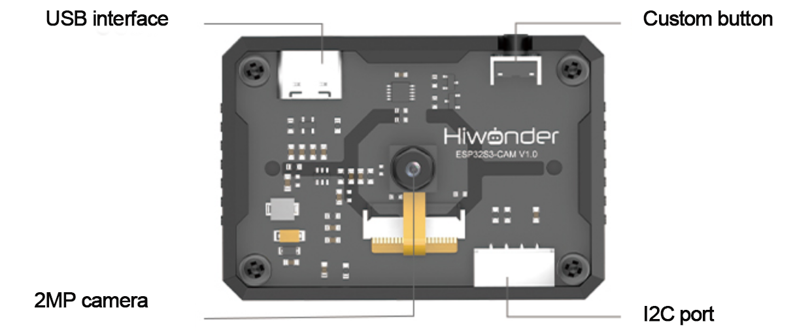

|  **Port Name**  |                   **Function Description**                   |
| :-------------: | :----------------------------------------------------------: |
| USB serial port |     Used for serial communication and firmware flashing      |
|  Custom button  |            Customize the button event in the code            |
|    I2C port     | It is the port for performing secondary development and connecting with the main controller |

* **Image Coordinate System**

We'll briefly introduce some important points about the image coordinate system of the module that users should pay attention to:

The origin is not at the center of the screen, but at the **top-left corner**.

The direction of the **Y-axis** is opposite to that of a typical Cartesian coordinate system.

(1) Image Transmission Mode

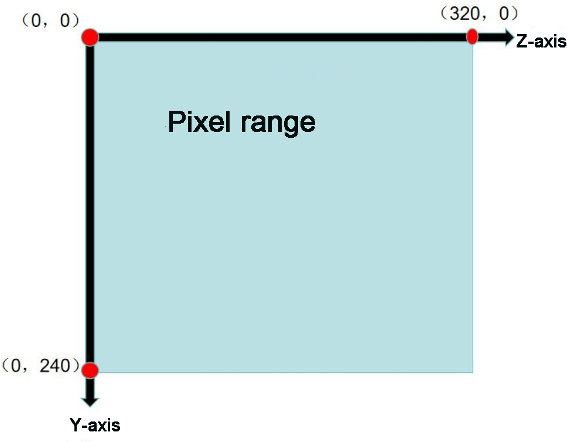

:::{Note}

The image transmission mode uses a resolution of **320×240** to match the requirements of our mobile app's image data interface.

:::

(2) Face Recognition Mode

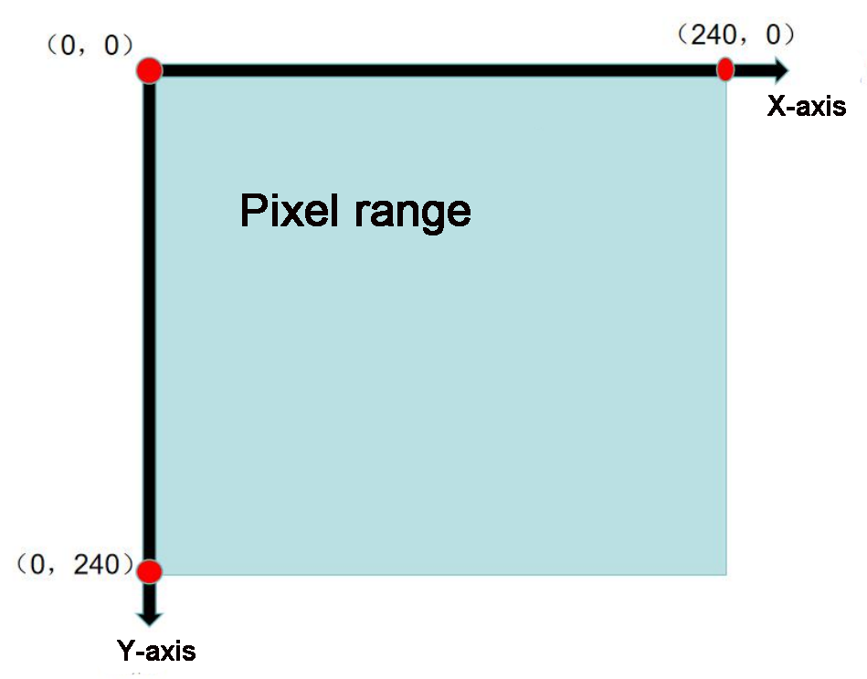

:::{Note}

The image transmission mode uses a resolution of **240×240** to match the requirements of our mobile app's image data interface.

:::

(3) Vision line following/ Color recognition mode

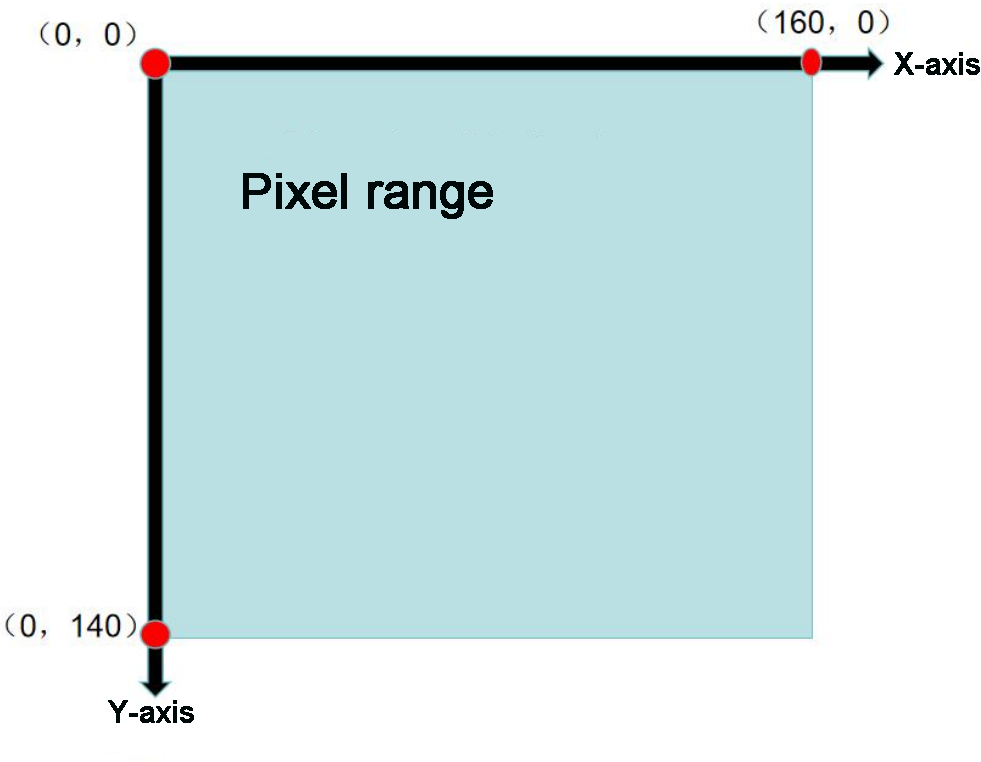

:::{Note}

The vision line following/ color recognition mode uses a resolution of **160×140** to match the requirements of our mobile app's image data interface.

:::

* **Specification**

|     **Parameter**     |            **Specification**            |
| :-------------------: | :-------------------------------------: |
|         Size          |              59\*43\*17.5               |
|  Power Supply Range   |               4.75~5.25V                |
|       SPI Flash       |           Supports up to 16MB           |
|          RAM          | 512 KB internal + 16 MB external PSRAM  |
|       Bluetooth       | Supports Bluetooth 5 and Bluetooth Mesh |
|         WiFi          |              802.11 b/g/n               |
| Supported Interfaces  |                UART、I2C                |
| Serial Port Baud Rate |             Default: 115200             |
|  Image Output Format  |   JPEG (OV2640 only), BMP, Grayscale    |
|    Frequency Range    |              2412~2484MHz               |
|     Antenna Type      |           Onboard PCB antenna           |

:::{Note}

The product specifications are theoretical values provided for reference purposes only. Please refer to the actual product for confirmation.

:::

### 7.1.2 Notice

Please ensure that the module's input power is at least **5V 2A**. Insufficient power may cause image watermarks to appear.

The module comes with pre-installed firmware that supports camera feedback functionality. If vision recognition features are required, you will need to flash the corresponding firmware.

## 7.2 ESP32-S3 Library File Introduction

This section provides an analysis of the drive library for the **ESP32-S3 module**. This library is used to retrieve data on recognized faces or colors from the **ESP32-S3**. It consists of two files: hw_esp32S3cam_ctl.h and hw_esp32S3cam_ctl.cpp.

### 7.2.1 Library File Instruction 

* **Member Function (HW_ESP32S3CAM::Init)**

{lineno-start=55}

```
void HW_ESP32S3CAM::Init()
{
    Wire.setClock(100000);
    Wire.begin();
}
```

The function initializes the **I2C bus configuration**, enabling commands to be sent and data to be received from the vision module in subsequent steps.

* **Underlying Function (Wire_Write_Data_Array)**

{lineno-start=3}

```
static bool Wire_Write_Data_Array(uint8_t addr,
                                  uint8_t reg,
                                  uint8_t *val, 
                                  uint16_t len)
{
   uint16_t i;
    Wire.beginTransmission(addr);
    Wire.write(reg);
    for(i = 0; i < len; i++) 
    {
        Wire.write(val[i]);
    }
    if( Wire.endTransmission() != 0 ) 
    {
        return false;
    }
    return true;
}
```

<table  class="docutils-nobg"  border="1">
<colgroup>
<col  />
<col  />
<col  />
<col  />
</colgroup>
<tbody>
<tr>
<td colspan="4" ><strong>Wire_Write_Data_Array()</strong></td>
</tr>
<tr>
<td >Function Description</td>
<td colspan="3" >Send data to the ESP32-S3 vision module register through the I2C bus.</td>
</tr>
<tr>
<td >Parameter List</td>
<td >Addr, reg, val, and len</td>
<td >Return Value</td>
<td ><p>False:write failed;</p>
<p>True:write succeeded.</p></td>
</tr>
<tr>
<td >Instructions for Use</td>
<td colspan="3" ><p>Call "<b>HW_ESP32S3CAM::Init</b>" before using this function.</p>
<p>This function is not used in the subsequent development. You can just know it.</p></td>
</tr>
</tbody>
</table>

Parameters:

`addr`: ESP32-S3 device address (0x53)

`reg`: Address within the ESP32-S3 to store the target value

`*val`: Address of the data to be sent

`len`: Number of bytes to send

The Arduino master first sends the device address via **I2C**, followed by the target memory address for the ESP32-S3. Then, it transmits the data byte by byte based on the specified data length. Finally, it checks whether the data was successfully transmitted using endTransmission(). If the return value is **0**, the transmission was successful; otherwise, it failed.

* **Underlying Function (Wire_Write_Byte)**

{lineno-start=22}

```
static bool Wire_Write_Byte(uint8_t val)
{
    Wire.beginTransmission(ESP32S3_ADDR);
    Wire.write(val);
    if( Wire.endTransmission() != 0 ) {
        return false;
    }
    return true;
}
```

<table  class="docutils-nobg"  border="1">
<colgroup>
<col  />
<col  />
<col  />
<col  />
</colgroup>
<tbody>
<tr>
<td colspan="4" ><strong>Wire_Write_Byte()</strong></td>
</tr>
<tr>
<td >Function Description</td>
<td colspan="3" >Before reading data from the ESP32-S3 vision module, confirm the address of the data register to be read.</td>
</tr>
<tr>
<td >Parameter List</td>
<td >val</td>
<td >Return Value</td>
<td ><p>False:transmission failed;</p>
<p>True:transmission succeeded.</p></td>
</tr>
<tr>
<td >Instructions for Use</td>
<td colspan="3" ><p>Call "<b>HW_ESP32S3CAM::Init</b>" before using this function.</p>
<p>When transferring or writing data, it is necessary to confirm the address of the data register to be written to the slave. The same implementation statement of this function can be found in "Wire_Write_Data_Array".</p></td>
</tr>
</tbody>
</table>

Parameter:

`val`: Content of the data to be sent

The Arduino master sends the device address and the **1-byte data** content directly to the ESP32-S3. The endTransmission() function checks whether the data was sent successfully. If the return value is **0**, the data was successfully transmitted; otherwise, the transmission failed.

* **Underlying Function (Wire_Read_Data_Array)**

{lineno-start=32}

```
static int Wire_Read_Data_Array(uint8_t reg, 
                                uint8_t *val, 
                                uint16_t len)
{
    uint16_t i = 0;
    
    /* Indicate which register we want to read from */
    if (!Wire_Write_Byte(reg)) {
        return -1;
    }
    
    /* Read block data */
    Wire.requestFrom(ESP32S3_ADDR, len);
    while (Wire.available()) {
        if (i >= len) {
            return -1;
        }
        val[i] = Wire.read();
        i++;
    }   
    return i;
}
```

<table  class="docutils-nobg"  border="1">
<colgroup>
<col  />
<col  />
<col  />
<col  />
</colgroup>
<tbody>
<tr>
<td colspan="4" ><strong>Wire_Read_Data_Array()</strong></td>
</tr>
<tr>
<td >Function Description</td>
<td colspan="3" >Read multi-byte data from the esp32-S3 vision module through the I2C bus.</td>
</tr>
<tr>
<td >Parameter List</td>
<td >Reg, val, and len</td>
<td >Return Value</td>
<td >-1 : read failed; Other: the length of the data successfully read.</td>
</tr>
<tr>
<td >Instructions for Use</td>
<td colspan="3" ><p>Call "<b>HW_ESP32S3CAM::Init</b>" before using this function.</p>
<p>Call "<b>Wire_Write_Byte</b>" to confirm the address of the register to be read before using this function.</p></td>
</tr>
</tbody>
</table>

Parameters:

`reg`: The address of the data to be read from the **ESP32-S3 vision module**.

`val`: the address used for saving the data in Arduino master

`len`: Length of data to be read

The Arduino master first sends the address of the data to be read to the **ESP32-S3**. If no response is received, it returns **-1**, indicating a failed connection. Next, it sends the data length to the **ESP32-S3** and reads the data byte by byte using a while loop and the i variable, storing the result in the val\[\] array. If the actual read length exceeds the requested length, the function returns **-1**, signaling a read failure. Upon successful reading, the function returns i, which represents the actual length of the data read (where i may be less than or equal to len).

* **Member Function (HW_ESP32S3CAM::Facedetection_Data_Receive)**

{lineno-start=66}

```
uint16_t HW_ESP32S3CAM::Facedetection_Data_Receive(uint8_t reg, uint8_t *buf, uint16_t buf_len)
{
    return Wire_Read_Data_Array(reg, buf, buf_len);
}
```

<table  class="docutils-nobg"  border="1">
  <tr>
    <td  colspan="4"><strong>HW_ESP32S3CAM::Facedetection_Data_Receive()</strong></td>
  </tr>
  <tr>
    <td >Function Description</td>
    <td  colspan="3">Read face recognition result from the ESP32-S3 vision module.</td>
  </tr>
  <tr>
    <td >Parameter List</td>
    <td >Reg, buf, and buf_len</td>
    <td >Return Value</td>
    <td >None</td>
  </tr>
  <tr>
    <td >Instructions for Use</td>
    <td  colspan="3">Essentially, it encapsulates the direct calling of the "Wire_Read_Data_Array". Its specific parameters' physical meanings are the same as the "Wire_Read_Data_Array".</td>
  </tr>
</table>

The implementations of **color recognition** and **line following** closely mirror that of  **face recognition**. You can refer to the source code and the **"Device Master-Slave Communication Principle"** section below to understand the significance of the data stored at each address within the vision module's functional registers.

### 7.2.2 Master-Slave Device Communication Principle (Module I2C Register)

ESP32S3 vision module I2C slave address: 0x53 

:::{Note}

For more detailed information, please refer to the corresponding tutorials

:::

## 7.3 Live Camera Feed

In this section, you'll learn how to connect to the hotspot created by the ESP32-S3, then access a designated URL to view the live camera feed.

:::{Note}

If you're unable to use the live camera feed feature or have previously flashed other firmware, please reflash the **image transmission firmware** to restore this functionality.  

For firmware download instructions, refer to **" Image Postback Firmware Flashing (Optional)"** in this section.

:::

### 7.3.1 Device Connection

(1) Connect the **ESP32-S3 vision module** to your computer using a **Type-C cable**. Then, open **Device Manager** to check if the port is properly recognized.

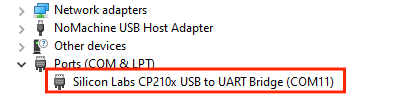

:::{Note}

If the device is not listed under ports, your computer may be missing the required driver. You can find the driver installation package in the folder:  

"[**Apppendix->CH34x Driver (Windows Environment**)](https://docs.hiwonder.com/projects/miniAuto/en/latest/docs/resources_download.html)".

:::

(2) The camera will generate a hotspot named **"HW_ESP32S3CAM"**. Click to connect.

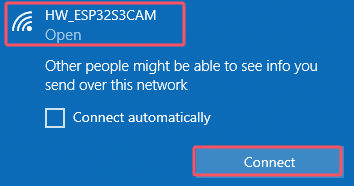

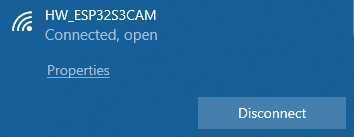

This connection method uses **AP (Access Point) direct mode**.  

The vision module also supports **STA (Station) mode** for connecting through a local area network.  

For more information, please refer to **"4. Expanded Tutorial."**

### 7.3.2 Start Image Transmission

Open a browser and enter **"192.168.5.1"** in the address bar. This works on both mobile and PC browsers.  

For example, on a PC, after the page loads, click  to begin image transmission.

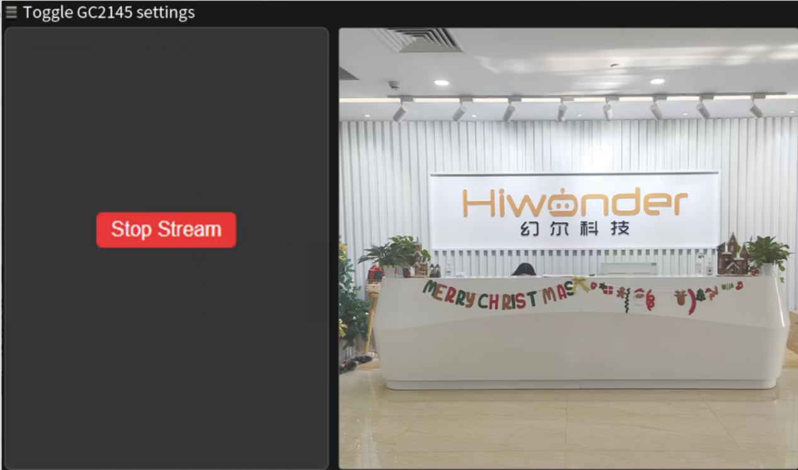

### 7.3.3 Live Camera Feed Firmware Flashing (Optional)

(1) Connect the ESP32-S3 to the computer.

(2) Double click and open **flash_download_tool_3.9.7** file in the "[**Appendix->Firmware Flashing Tools**](https://docs.hiwonder.com/projects/miniAuto/en/latest/docs/resources_download.html)".


(3) Then, select **"ESP32-S3"** in the opening interface.


(4) In the flashing interface, click  to select the firmware ("[**Firmware & Tool/image_transmit.bin**](https://docs.hiwonder.com/projects/miniAuto/en/latest/docs/resources_download.html)").


(5) Next, configure the settings as shown below.**Select an available port number**—this should match the actual port detected on your computer.

:::{Note}

Avoid selecting **COM1**, as it may cause the flashing process to fail.

:::

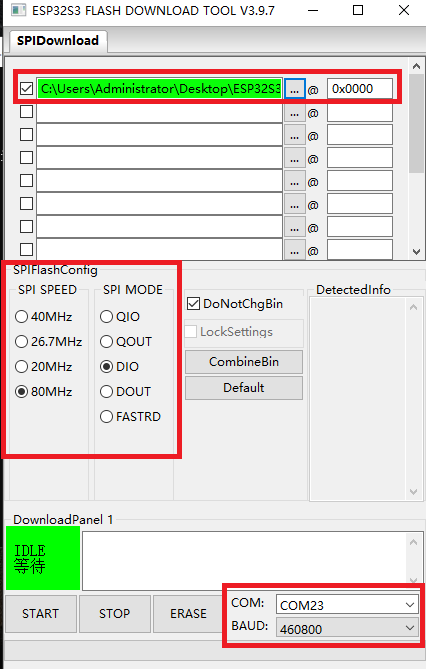

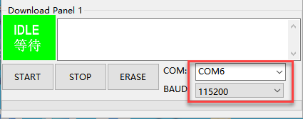

(6) Click **"ERASE"** to wipe the existing firmware—**this step must be done first**.  

Once the erase process is complete, click **"START"** to begin flashing the new firmware.

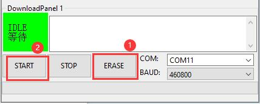

(7) After a while, the **"FINISH"** prompt will come out. Then disconnect <span class="mark">Type-C cable.</span>

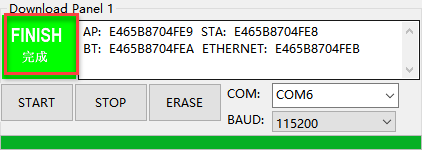

:::{Note}

After flashing is completed, the module needs to be restarted.

:::

## 7.4 Color Recognition

In this section, **miniAuto** will utilize the **ESP32-S3 vision module** to recognize **red** and **blue** blocks. The corresponding color will then be displayed on the **RGB LED** on the expansion board.

### 7.4.1 Program Flowchart

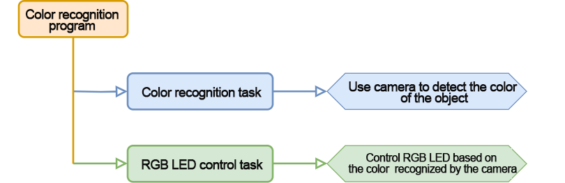

### 7.4.2 ESP32-S3 Vision Module 

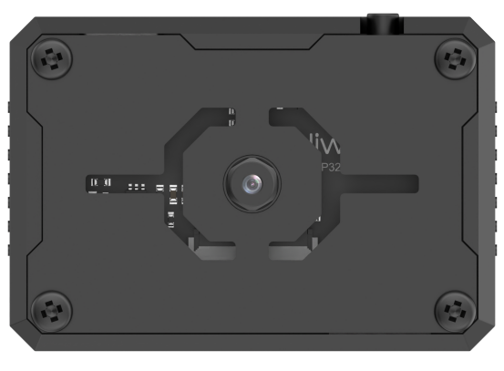

This is a development board integrated with the **ESP32 chip** and a camera module. After inserting the module into the carrier board, it uses the **I2C communication interface** to read color and face data via I2C.

The **ESP32-S3 vision module** is equipped with a **GC2145 camera**. It transmits the captured image data to the **ESP32 chip** via a serial interface. The chip processes the image and then transfers the data to other devices via I2C communication.

<p id="anchor_7_4_3"></p>

### 7.4.3 Program Download

[color_discrimination](../_static/source_code/color_discrimination.zip)

* **ESP32-S3 Vision Module Program Download**

(1) Connect the ESP32S3 vision module to the computer using the ESP32S3 cable.

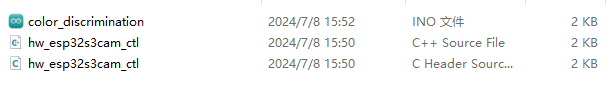

(2) Open the program file [ESP32S3 Color Recognition Program/ColorDetection/ColorDetection.ino](../_static/source_code/ColorDetection.zip) .

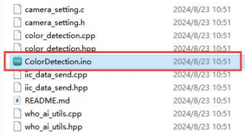

(3) Select the **"ESP32S3 Dev Module"** as the development board.


(4) In the menu bar, click on **"Tools"**, and select the appropriate **ESP32S3 board configuration** as shown in the image below.

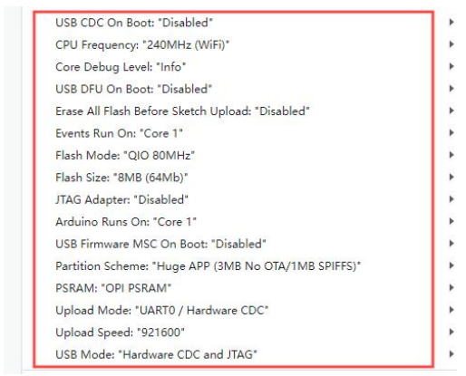

(5) Finally, click  to upload the code to the **ESP32S3** and wait for the flashing process to complete.


* **Arduino UNO Program Download**

:::{Note}

- Before downloading the program, please remove the Bluetooth module to prevent serial port conflicts that could cause the download to fail.

- When connecting the Type-B download cable, ensure the battery box switch is set to the "**OFF**" position. This helps avoid accidental contact with the expansion board's power pins, which could result in a short circuit.

:::

(1) Locate and open the [color_discrimination.ino](../_static/source_code/color_discrimination.zip) file.

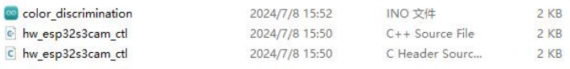

(2) Connect the Arduino to your computer using the UNO Type-B data cable.

(3) Select the **"Board"** option. The software will automatically detect the connected Arduino's serial port. Click to establish the connection.

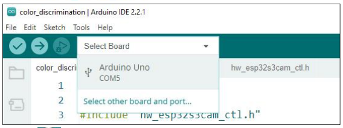

(4) Click  to download the program to the Arduino. Wait for the download to complete.


### 7.4.4 Program Outcome

(1) When the robot detects the color red, the RGB LED on the expansion board lights up red, the buzzer sounds once, and the robot rocks back and forth.

(2) When the robot detects the color blue, the RGB LED on the expansion board lights up blue, the buzzer sounds twice, and the robot rocks left and right.

(3) When neither the red nor blue color is detected, the RGB LED on the expansion board lights up white.

### 7.4.5 Program Analysis

[color_discrimination](../_static/source_code/color_discrimination.zip)

* **Import Library File**

Import the RGB control library and ESP32S3 communication library file required for this program.

{lineno-start=1}

```
#include <Arduino.h>
#include "FastLED.h"
#include "hw_esp32s3cam_ctl.h"
```

* **Define Pin and Create Objects**

(1) First, define the pins for an RGB LED and a buzzer, as well as the pins related to the motors.

{lineno-start=5}

```
const static uint8_t ledPin = 2;
const static uint8_t buzzerPin = 3;
static uint16_t g_current_point = 0;
static uint16_t color_info[4] = { 0, 0, 0, 0};
```

(2) Then, an RGB LED object is created to control the LED's color, and an ESP32-S3 vision module object is created to handle communication with the ESP32-S3 vision module.

{lineno-start=9}

```
static CRGB rgbs[1];
HW_ESP32S3CAM hw_cam; 
```

(3) Initial Settings

① In the `setup()` function, the primary task is to initialize the relevant hardware components. It begins by configuring the serial port with a baud rate of 9600 and setting a data read timeout of 500 ms.

{lineno-start=20}

```
void setup() {
  // put your setup code here, to run once:
  Serial.begin(9600);
  Serial.setTimeout(500);
```

② Set the RGB LED to white to indicate the configured color. Then, initialize the communication interfaces for both the motors and the ESP32-S3 vision module.

{lineno-start=26}

```
  Motor_Init();
  hw_cam.begin(); ///<初始化与ESP32Cam通讯接口
```

③ Configure the buzzer pin as an output, trigger a short beep, and then turn it off.

{lineno-start=28}

```
  pinMode(buzzerPin,OUTPUT);
  tone(buzzerPin, 1200);                                          ///< 输出音调信号的函数,频率为1200(Function for outputting tone signals with a frequency of 1200)
  delay(100);
  noTone(buzzerPin);
}
```

* **Main Function**

(1) After initialization, the program enters the loop() function, where it continuously calls the hw_cam.Colordetection_Data_Receive() function to retrieve the color detected by the ESP32-S3 vision module.

(2) This function accesses the color recognition register at address 0xC5, which contains seven bytes of data. The first five bytes are valid and represent the color IDs for red, yellow, green, blue, and black, with values ranging from 0 to 4

(3) If a color is detected, the corresponding element in the array will be equal to its color ID. If no color is detected, the value will be 255.

(4) Therefore, to determine the detected color, simply check the values in the returned array. For instance, if the first element has a value of 1, it indicates red has been recognized. In response, the RGB LED lights up red, and the car moves back and forth.

{lineno-start=34}

```
void loop() {
  // put your main code here, to run repeatedly:
  hw_cam.Color_ID_Detection(cam_buffer, sizeof(cam_buffer));
  delay(10);
  if(cam_buffer[0] == 1) {
    Rgb_Show(0,10,0);    ///< red
    tone(buzzerPin, 1000);
    delay(100);
    noTone(buzzerPin);
    delay(100);
    Velocity_Controller( 0, 40, 0, 0);
    delay(500);
    Velocity_Controller( 180, 40, 0, 0);
    delay(500);
    Velocity_Controller( 0, 0, 0, 0);
    delay(1000);
  }
```

(5) If the fourth element of the array returns a value of 3, it indicates that blue has been detected. The RGB LED will turn blue, the buzzer will beep twice, and the car will sway from side to side.

{lineno-start=52}

```
  else if(cam_buffer[2] == 3) {
    Rgb_Show(0,0,10); ///< blue
    for(int i=0; i<2; i++){
      tone(buzzerPin, 1000);
      delay(100);
      noTone(buzzerPin);
      delay(100);
    }
    Velocity_Controller( 90, 40, 0, 0);
    delay(500);
    Velocity_Controller( 270, 40, 0, 0);
    delay(500);
    Velocity_Controller( 0, 0, 0, 0);
    delay(1000);
  }
```

(6) If neither red nor blue is detected, the RGB LED will turn white.

{lineno-start=68}

```
  else{
    Rgb_Show(10,10,10);
  }
```

* **ESP32-Cam Communication Task**

Send the command to retrieve color data to the ESP32-S3 vision module using the `WireReadDataArray()` function, and store the retrieved data in the specified storage space (array).

{lineno-start=71}

```
uint16_t HW_ESP32S3CAM::Colordetection_Data_Receive(uint8_t reg, uint8_t *buf, uint16_t buf_len)
{
    return Wire_Read_Data_Array(reg, buf, buf_len);
}
```

### 7.4.6 Function Extension

This section explains how to modify the colors recognized by the ESP32-S3. Follow the steps below to make the necessary adjustments:

(1) First, open the **HSV.exe** program file located in the '[Appendix->Color Threshold Adjustment Tool\HSV\HSV.dist](https://docs.hiwonder.com/projects/miniAuto/en/latest/docs/resources_download.html)' folder within the current directory of this document.

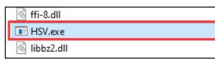

(2) Click to select the image you want to import (ensure the image is stored in the 'img' folder).

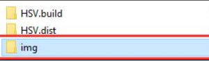

(3) Use the slider to perform HSV threshold segmentation on the image. Adjust the HSV threshold values to a suitable range. You can refer to the color range table below for guidance on making adjustments.

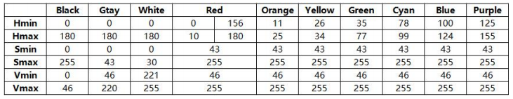

(4) Once the threshold values are set, save them. Then, open the '[ESP32S3 Color Recognition Program\ColorDetection\color_detection.cpp](../_static/source_code/ColorDetection.zip)' file from the same directory. Modify the color data by replacing it with the saved HSV array. Finally, follow the steps in '[7.4.3 Program Download](#anchor_7_4_3)' to flash the updated program to the ESP32-S3.

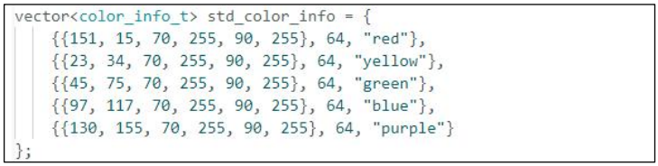

:::{Note}

Pay attention to the array element format and proper comma separation.

:::

(5) Once the flashing is complete, the ESP32 camera will be able to recognize objects of different colors.

### 7.4.7 FAQ

Q1: The colors detected by the camera are inaccurate or incorrectly identified.

Answer: To improve accuracy, try to reduce background clutter. A solid-color or simple background environment is recommended.

Q2: The vision module fails to recognize correctly after flashing the firmware.

Answer: Ensure that the correct flashing address was selected during the flashing process. Double-check the settings to confirm proper configuration.

## 7.5 Color Tracking

In this section, the car, equipped with the ESP32-S3 vision module, is programmed to track a red ball. As the ball moves, the car will rotate in place to follow its direction.

### 7.5.1 Program Flowchart

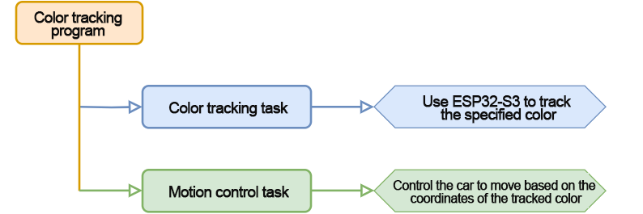

### 7.5.2 ESP32-S3 Vision Module 

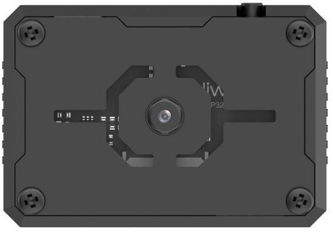

This development board integrates an ESP32 chip and a camera module. When inserted into the baseboard, it communicates via the I²C interface, enabling the reading of color and facial data.

The ESP32-S3 vision module features an onboard camera that captures image data and transmits it to the ESP32 chip through a serial interface. The chip processes the image and communicates the results to other devices via the I²C protocol.

<p id="anchor_7_5_3"></p>

### 7.5.3 Program Download

[ESP32-S3 Color Tracking Program](../_static/source_code/ColorDetection.zip)

[UNO Color Tracking](../_static/source_code/color_tracking.zip)

* **ESP32-S3 Vision Module Program Download**

(1) Connect the ESP32S3 module to the computer using the Type-C cable.

(2) Open the file "[ESP32S3 Color Detection Program/ColorDetection/ColorDetection.ino](../_static/source_code/ColorDetection.zip)" located in the same directory as this document.


(3) Select the **"ESP32S3 Dev Module"** as the development board.


(4) In the menu bar, click on **"Tools"**, and select the appropriate **ESP32S3 board configuration** as shown in the image below.

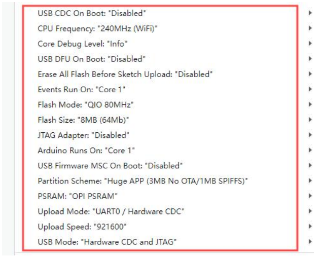

(5) Finally, click  to upload the code to the **ESP32S3** and wait for the flashing process to complete.


<p id="anchor_7_5_3_2"></p>

* **Arduino UNO Program Download**

:::{Note}

- Before downloading the program, please remove the Bluetooth module to prevent serial port conflicts that could cause the download to fail.

- When connecting the Type-B download cable, ensure the battery box switch is set to the "OFF" position. This helps avoid accidental contact with the expansion board's power pins, which could result in a short circuit.

:::

(1) Locate and open "[UNO Color Tracking/color_tracking.ino](../_static/source_code/color_tracking.zip)" program file in the same dictionary as this section.

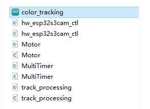

(2) Connect the Arduino to your computer using the Type-B data cable.

(3) Select the **"Board"** option. The software will automatically detect the connected Arduino's serial port. Click to establish the connection.

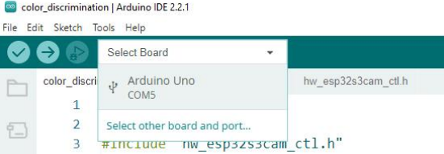

(4) Click  to download the program to the Arduino. Wait for the download to complete.


### 7.5.4 Program Outcome

Once the robot is powered on, the buzzer beeps once and the RGB light on the expansion board turns white. When a red ball is placed in front of the ESP32-S3 vision module and moved, the robot will rotate in place to follow the ball's direction.

### 7.5.5 Program Analysis

[color_tracking](../_static/source_code/color_tracking.zip)

* **Import Library File**

Import the required header files for the timer, tracking actions, motor control, and ESP32-S3 vision module communication to support the game functionality.

{lineno-start=1}

```
#include "MultiTimer.h"
#include "Motor.h"
#include "hw_esp32s3cam_ctl.h"
#include "track_processing.h"
```

* **Define Pin and Create Objects**

Define two timers (currently only Timer1 is in use), an object for the vision module, and two variables to control the robot's speed and steering angle. Additionally, create an array to store the register values used for the vision module's line-tracking function.

{lineno-start=5}

```
Timers timer1;
Timers timer2;

HW_ESP32S3CAM hw_cam;

#define IMAGE_WIDTH 240
#define IMAGE_LENGTH 240


uint8_t set_speed;
uint16_t set_angle;

static uint8_t buffer[DATA_ARRAY_COUNT];

```

* **Initial Settings**

(1) In the `setup()` function, initialize the necessary hardware components. Start with the serial interface, setting the communication baud rate to 115200.

{lineno-start=33}

```
void setup() {
  Serial.begin(115200);
```

(2) Initialize each module in sequence:

`ticksFuncSet(ticksGetFunc)`: Binds the system's default time-fetching function ticksGetFunc to platFormTicksFunction, which will be called to retrieve the current system time.

`Motors_Initialize()`: Initializes the motor hardware.

`hw_cam.Init()`: Initializes the ESP32-S3 vision module.

`Controller_Init()`: Initializes the motion control unit for the robot.

`timerStart(&timer1, 20, timerPIDCalculateCallBack, "20ms cycle PID calculate")`: Starts Timer1 with a 20ms interval. After 20ms, it triggers the timerPIDCalculateCallBack callback function, passing the string "20ms cycle PID calculate" as a descriptive parameter.

{lineno-start=35}

```
  ticksFuncSet(ticksGetFunc);
  Motors_Initialize();
  hw_cam.begin();
  Controller_Init();
  timerStart(&timer1, 20, timerPIDCalculateCallBack, "20ms cycle PID calculate");
}
```

* **Loop Sub-function Execution**

(1) After initialization is complete, the program enters the `loop()` function. Within this loop, the `timersTaskRunning()` function is repeatedly called. This function iterates through the list of timers and executes the interrupt callbacks for any timers that have reached their trigger time.

(2) Next, the `Velocity_Controller(set_angle, set_speed, 0, SIMULATE_PWM_CONTROL)` function is called to control the robot's movement speed and direction based on the given parameters.

{lineno-start=42}

```
void loop() {
   
  timersTaskRunning();
  Velocity_Controller(set_angle, set_speed, 0, SIMULATE_PWM_CONTROL);
}
```

* **Timer Callback Function "timerPIDCalculateCallBack"**

(1) The function is used to determine if the robot has detected the target color position. This is achieved by reading the vision module's line following function register data via the `Linepatrol_Data_Receive` function. Then, control the robot's movement accordingly.

(2) If the target color is detected, the robot adjusts its movement angle, based on the deviation between the color center position and the set target tracking point position. This allows the target center position falls on the set target tracking point position.

(3) The timer starts counting for the next cycle. It works only once by default. Call `timerStart` again can set the timer to loop work.

{lineno-start=25}

```
void timerPIDCalculateCallBack(Timers *ptimer, const void *userdata)
{
  hw_cam.Red_Block_Detection(buffer, sizeof(buffer)); /* red */
  // printf("[%08ld] Timer:%p callback-> %s.\r\n", platformTicksGetFunc(), ptimer, (char*)userdata);
  Position_Controller( buffer[0], buffer[1], IMAGE_WIDTH_SIZE / 2, IMAGE_WIDTH_SIZE / 2, &set_angle, &set_speed);
  timerStart(ptimer, 20000, timerPIDCalculateCallBack, userdata);
  
}
```

* **Timer Monitoring Function "timersTaskRunning"**

(1) The timer list is implemented as a linked list by default. You can traverse and modify the list by using two pointers: pTimerList and entry. These pointers allow you to add or remove timer members.

(2) When a timer reaches its trigger time, it is considered invalid by the timer list and is automatically removed. To make a timer operate repeatedly, you need to call the timerStart function again, either within the callback function or multiple times, depending on the desired behavior.

{lineno-start=99}

```
int timersTaskRunning(void)
{
  //将定时器列表pTimerList（注：定时器列表内各个定时器按下一次触发时间的早晚顺序排布）的地址赋给entry   
  Timers *entry = pTimerList;
  //遍历访问定时器列表的每一个定时器
  for (; entry; entry = entry->next)
  {
    /*如果当前定时器的下一次触发时间晚于当前系统时间（排在后面的定时器
      自然也还没到下一次被触发的时间），则退出函数，结束遍历*/
    if (platFormTicksFunction() < entry->deadline)
    {
      return (int)(entry->deadline - platFormTicksFunction());
    }

    //如果当前定时器到点被触发，则先将该定时器从定时器列表中移除，再执行当前定时器的触发回调函数
    pTimerList = entry->next;
    if(entry->timersCallBack)
    {
      entry->timersCallBack(entry, entry->userdata);
    }
  }
  return 1;
}
```

* **Motor Initialization Function**

This function is used to initialize the motor pins. It calls the pinMode function within a for loop to set the motor I/O ports to output mode. After that, the Velocity_Controller function is called to stop the robot.

{lineno-start=115}

```
void Motors_Initialize(void)
{
  for(uint8_t i = 0; i < 4; i++)
  {
    pinMode(motordirectionPin[i], OUTPUT);
    pinMode(motorpwmPin[i], OUTPUT);
  }
  Velocity_Controller( 0, 0, 0, SIMULATE_PWM_CONTROL);
}
```

* **Robot Velocity Control Function**

This function sets the speed of each wheel on the robot. By analyzing the kinematics of the robot's Mecanum wheels, the speed of each wheel is calculated. These calculated speed values are then used as input parameters for the Motors_Set function, which adjusts the motor speed and controls the overall movement of the robot. For a detailed explanation of kinematic analysis, please refer to the relevant tutorials.

{lineno-start=84}

```
void Velocity_Controller(uint16_t angle, uint8_t velocity,int8_t rot, uint8_t mode)
{
  int16_t velocity_0, velocity_1, velocity_2, velocity_3;
  /* 速度因子 */
  float speed = 1;                                               
  /* 设定初始方向 */
  angle += 90;                                                 
  float rad = angle * PI / 180;
  if (rot == 0) speed = 1;
  else speed = 0.5; 
  velocity *= invSqrt(2);
  velocity_0 = (velocity * sin(rad) - velocity * cos(rad)) * speed + rot * speed;
  velocity_1 = (velocity * sin(rad) + velocity * cos(rad)) * speed - rot * speed;
  velocity_2 = (velocity * sin(rad) - velocity * cos(rad)) * speed - rot * speed;
  velocity_3 = (velocity * sin(rad) + velocity * cos(rad)) * speed + rot * speed;
  switch (mode)
  {
  case PWM_CONTROL:
    Motors_Set(velocity_0, velocity_1, velocity_2, velocity_3);
    break;

  case SIMULATE_PWM_CONTROL:
    _Motors_Set(velocity_0, velocity_1, velocity_2, velocity_3);
    break; 

  default:
    break;
  }
}
```

* **Motor Setting Function**

This function adjusts the speed and direction of each wheel of the robot based on the input parameter values. Inside the for loop, the robot's steering is adjusted according to the calculated results. The map function is used to scale the calculated values from the range "0 to 100" to the range "pwm_min to 255." Then, the digitalWrite and analogWrite functions are called to set the motor direction and speed, respectively.

{lineno-start=66}

```
static void _Motors_Set(int16_t Motor_0, int16_t Motor_1, int16_t Motor_2, int16_t Motor_3)
{
  int8_t pwm_set[4];
  int8_t motors[4] = { Motor_0, Motor_1, Motor_2, Motor_3};
  bool direction[4] = { 1, 0, 0, 1};///< 前进 左1 右0
  for(uint8_t i; i < 4; ++i) {
    if(motors[i] < 0) direction[i] = !direction[i];
    else direction[i] = direction[i];

    if(motors[i] == 0) pwm_set[i] = 0;
    else pwm_set[i] = abs(motors[i]);

    digitalWrite(motordirectionPin[i], direction[i]); 
    PWM_Out(motorpwmPin[i], pwm_set[i]);
  }
}
```

### 7.5.6 Function Extension

(1) To switch to a different color, modify the code to detect blue. Locate the function in the code that retrieves data from the vision module and replace `hw_cam.Red_Block_Detection()` with `hw_cam.Blue_Block_Detection()` to capture blue data.

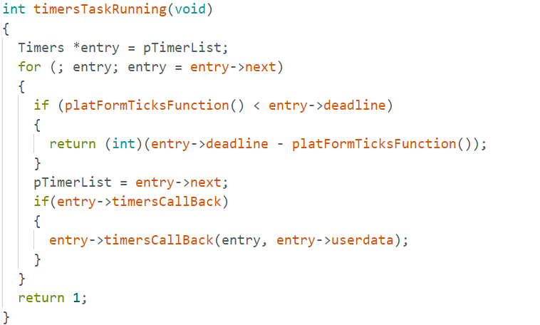

(2) After making the necessary changes, refer to "[**7.5.3 Program Download -> Arduino UNO Program Download**](#anchor_7_5_3_2)" to re-upload the program. This will enable the robot to track blue objects.

### 7.5.7 FAQ

**Question 1:** The color detected by the camera is inaccurate or misidentified.  

**Answer:** To improve accuracy, minimize background distractions by using a solid-colored or simple background.

## 7.6 Vision Line Following

In this section, the robot, equipped with the ESP32-S3 vision module, is programmed to dete·ct a red wide line and move along it.

### 7.6.1 Program Flowchart

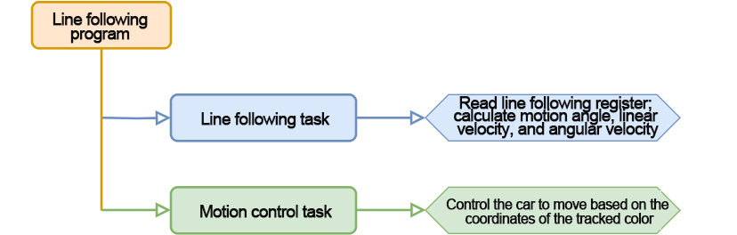

### 7.6.2 ESP32-S3 Vision Module 

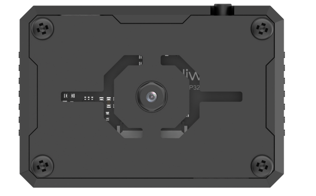

This development board integrates the ESP32 chip with a camera module. Once the module is inserted into the carrier board, it utilizes an I2C communication interface to read color and facial data.

The ESP32-S3 vision module features a built-in camera that captures image data and transmits it to the ESP32 chip via a serial interface. The chip processes the images and then sends the data to other devices via I2C communication.

### 7.6.3 Program Download

[line_tracking](../_static/source_code/line_tracking.zip)

* **ESP32-S3 Vision Module Program Download**

(1) Connect the ESP32S3 module to the computer using the Type-C cable.

(2) Open the file [ESP32S3 Vision Line Following Program \LineTracking\LineTracking.ino](../_static/source_code/LineTracking.zip) located in the same directory as this document.


(3) Select the **"ESP32S3 Dev Module"** as the development board.


(4) In the menu bar, click on **"Tools"**, and select the appropriate **ESP32S3 board configuration** as shown in the image below.


(5) Finally, click  to upload the code to the **ESP32S3** and wait for the flashing process to complete.


* **Arduino UNO Program Download**

:::{Note}

- Before downloading the program, please remove the Bluetooth module to prevent serial port conflicts that could cause the download to fail.

- When connecting the Type-B download cable, ensure the battery box switch is set to the "OFF" position. This helps avoid accidental contact with the expansion board's power pins, which could result in a short circuit.

:::

(1) Locate and open [Program File/02 UNO Line Following/line_tracking](../_static/source_code/line_tracking.zip) program file in the same dictionary as this section.

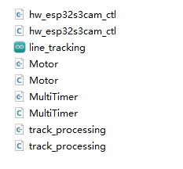

(2) Connect the Arduino to the computer with the Type-B cable.

(3) Select the **"Board"** option. The software will automatically detect the connected Arduino's serial port. Click to establish the connection.

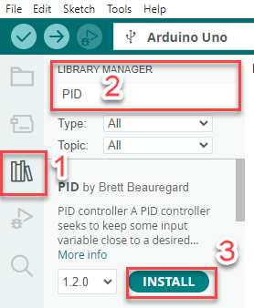

(4) Click  to download the program to the Arduino. Wait for the download to complete.


```
#include "MultiTimer.h"
#include "Motor.h"
#include "hw_esp32s3cam_ct1.h"
#include "track_processing.h"
```

### 7.6.4 Program Outcome

Once the car is powered on, it will begin to follow the red line and move along its path.

### 7.6.5 Program Analysis

[line_tracking](../_static/source_code/line_tracking.zip)

* **Import Library File**

(1) Import the required header files for the timer, tracking actions, motor control, and ESP-S3 vision module communication necessary for the game.

(2) Please note that the tracking action library used in this section differs from the one used in the previous section, "Color Tracking." Although the library files share the same name, their function implementations are different. Therefore, do not mix them.

{lineno-start=1}

```
#include "MultiTimer.h"
#include "Motor.h"
#include "hw_esp32s3cam_ctl.h"
#include "track_processing.h"
```

* **Define Pin and Create Objects**

(1) First, define the timer object, instances of the servo and vision module objects, and set the color for line following to red. The color to be tracked is a green object. Then, define the variables for the coordinate points, as well as for controlling the robot's linear speed, angular speed, and angular direction.

{lineno-start=14}

```
const static uint8_t target_point = 80;

static uint16_t set_angle = 0;
static int8_t set_rot = 0;
static int8_t set_speed = 0;

static uint8_t time_count = 0;
```

(2) Define a line-loss calibration variable to record the position of the color block, which will be used for decision-making when the line is lost. Additionally, define line-following coordinate variables to store the coordinates of the line.

{lineno-start=22}

```
static uint8_t first_calibration_data;
static uint8_t second_calibration_data;
static uint8_t first_block_data[DATA_ARRAY_COUNT];
static uint8_t second_block_data[DATA_ARRAY_COUNT];
```

* **Initial Settings**

(3) Initialize Hardware Components in the setup() Function

Begin by initializing the serial interface. Set the communication baud rate to **115200** to enable proper data transmission.

{lineno-start=89}

```
void setup() {
  Serial.begin(115200);
```

(4) Initialize Each Module and Configure Timer1

Timer1 is configured to operate with a cycle time of **60ms**.

ticksFuncSet(ticksGetFunc): Binds the system's built-in ticksGetFunc—used to retrieve the current system time—to the platform-specific platFormTicksFunction. This function will be called to access the current system time during operation.

`Motors_Initialize()`: Initializes the robot's motors, preparing them for movement control.

`hw_cam.Init()`: Initializes the ESP32-S3 vision module for object recognition and tracking.

`Controller_Init()`: Initializes the control unit that manages the robot's motion control parameters.

`timerStart(&timer1, 60000, timerPIDCalculateCallBack, "60ms cycle PID calculate")`: Starts Timer1 with a 60ms cycle. Once the timer reaches the set interval, it triggers the callback function timerPIDCalculateCallBack, passing the description "60ms cycle PID calculate" as a parameter.

{lineno-start=91}

```
  ticksFuncSet(ticksGetFunc);
  Motors_Initialize();
  hw_cam.begin();
  Calculation_Init();
  timerStart(&timer1, 60000, timerPIDCalculateCallBack, "60ms cycle PID calculate");
}
```

* **Loop Call Sub-function**

After initialization is complete, the program enters the `loop()` function.  

Within the loop, the timers  `TaskRunning()`  function is continuously called. This function iterates through the list of timers, checks which ones have reached their trigger time, and executes their corresponding interrupt (callback) functions.

Then, the `Velocity_Controller(set_angle, set_speed, set_rot, SIMULATE_PWM_CONTROL)` function is called  

This function controls the robot's movement speed and direction based on the specified angle (set_angle), linear speed (set_speed), and rotational speed (set_rot).

{lineno-start=98}

```
void loop() {
  timersTaskRunning();
  Velocity_Controller(set_angle, set_speed, set_rot, SIMULATE_PWM_CONTROL);
}
```

* **Timer Callback Function "timerPIDCalculateCallBack"**

**This function determines whether the robot has detected the target color position.** It reads the data from the vision module's line-tracking registers using functions such as  `Region1_Red_Block_Detection()` and calculates the horizontal (X-axis) offset.

{lineno-start=25}

```
void timerPIDCalculateCallBack(Timers *ptimer, const void *userdata)
{
  hw_cam.Red_Block_Detection(buffer, sizeof(buffer)); /* red */
  // printf("[%08ld] Timer:%p callback-> %s.\r\n", platformTicksGetFunc(), ptimer, (char*)userdata);
  Position_Controller( buffer[0], buffer[1], IMAGE_WIDTH_SIZE / 2, IMAGE_WIDTH_SIZE / 2, &set_angle, &set_speed);
  timerStart(ptimer, 20000, timerPIDCalculateCallBack, userdata);
  
}
```

**The detected color is then analyzed.** If only the line is detected (and no object is being transported), the robot follows the line, and the corresponding coordinates are saved to a variable.

{lineno-start=84}

```
void Velocity_Controller(uint16_t angle, uint8_t velocity,int8_t rot, uint8_t mode)
{
  int16_t velocity_0, velocity_1, velocity_2, velocity_3;
  /* 速度因子 */
  float speed = 1;                                               
  /* 设定初始方向 */
  angle += 90;                                                 
  float rad = angle * PI / 180;
  if (rot == 0) speed = 1;
  else speed = 0.5; 
  velocity *= invSqrt(2);
  velocity_0 = (velocity * sin(rad) - velocity * cos(rad)) * speed + rot * speed;
  velocity_1 = (velocity * sin(rad) + velocity * cos(rad)) * speed - rot * speed;
  velocity_2 = (velocity * sin(rad) - velocity * cos(rad)) * speed - rot * speed;
  velocity_3 = (velocity * sin(rad) + velocity * cos(rad)) * speed + rot * speed;
  switch (mode)
  {
  case PWM_CONTROL:
    Motors_Set(velocity_0, velocity_1, velocity_2, velocity_3);
    break;

  case SIMULATE_PWM_CONTROL:
    _Motors_Set(velocity_0, velocity_1, velocity_2, velocity_3);
    break; 

  default:
    break;
  }
}
```

**If the robot is in a transport state, it may deviate from the line.** In this case, position correction is performed to bring the robot back onto the path.

{lineno-start=67}

```
static void _Motors_Set(int16_t Motor_0, int16_t Motor_1, int16_t Motor_2, int16_t Motor_3)
{
  int8_t pwm_set[4];
  int8_t motors[4] = { Motor_0, Motor_1, Motor_2, Motor_3};
  bool direction[4] = { 1, 0, 0, 1};///< 前进 左1 右0
  for(uint8_t i; i < 4; ++i) {
    if(motors[i] < 0) direction[i] = !direction[i];
    else direction[i] = direction[i];

    if(motors[i] == 0) pwm_set[i] = 0;
    else pwm_set[i] = abs(motors[i]);

    digitalWrite(motordirectionPin[i], direction[i]); 
    PWM_Out(motorpwmPin[i], pwm_set[i]);
  }
}
```

* **Timer Monitoring Function "timersTaskRunning"**

(1) The timer list is implemented as a linked list by default. You can traverse, add, or remove timer entries using the two pointers: pTimerList and entry.

(2) Once a timer reaches its trigger time, it is considered expired and automatically removed from the list. If you want a timer to run repeatedly, you need to call the timerStart function again—either manually or within the callback function.


* **Line Following Callback Function "timerPositionCalibrationCallBack"**

(1) The Linepatrol_Data_Receive function retrieves the color information detected by the vision module.

{lineno-start=62}

```
void timerPositionCalibrationCallBack(Timers *ptimer, const void *userdata)
{
  hw_cam.Region1_Red_Block_Detection(first_block_data, sizeof(first_block_data));
  hw_cam.Region2_Red_Block_Detection(second_block_data, sizeof(second_block_data));
```

(2) If the red color is detected, timer1 is restarted to continue line following.

{lineno-start=66}

```
  if(first_block_data[0] != 0 && second_block_data[0] != 0)
  {
    timerStop(ptimer);
    timerStart(&timer1, 60000, timerPIDCalculateCallBack, userdata);
  }
```

(3) If not, the robot continues to execute the line-following logic. This involves evaluating the last recorded block position and adjusting the linear velocity, angular velocity, and motion angle accordingly. The robot will keep tracking until the line is detected again.

{lineno-start=71}

```
  else
  {
    if(first_calibration_data >= 80 || second_calibration_data >= 80)
    {
      set_angle = 0;
      set_speed = 40;
      set_rot = -15;
    }
    else if(first_calibration_data < 80 || second_calibration_data < 80)
    {
      set_angle = 0;
      set_speed = 40;
      set_rot = 15;
    }
    timerStart(ptimer, 100000, timerPositionCalibrationCallBack, userdata);
  }
}
```

* **Motor Initialization Function**

This function initializes the motor control pins. It uses a for loop to call the pinMode function, setting each motor I/O pin to output mode. After that, the Velocity_Controller function is called to stop the robot by setting its velocity to zero.

{lineno-start=115}

```
void Motors_Initialize(void)
{
  for(uint8_t i = 0; i < 4; i++)
  {
    pinMode(motordirectionPin[i], OUTPUT);
    pinMode(motorpwmPin[i], OUTPUT);
  }
  Velocity_Controller( 0, 0, 0, SIMULATE_PWM_CONTROL);
}

```

* **Robot Velocity Control Function**

This function sets the speed of each wheel on the robot. Based on the kinematic model of Mecanum wheels, the velocity for each wheel is calculated accordingly. These calculated speed values are then passed as input parameters to the Motors_Set function, which adjusts the motor speeds to control the robot's overall movement. For more details on how the kinematic calculations are derived, please refer to relevant tutorials on Mecanum wheel dynamics.

{lineno-start=84}

```
void Velocity_Controller(uint16_t angle, uint8_t velocity,int8_t rot, uint8_t mode)
{
  int16_t velocity_0, velocity_1, velocity_2, velocity_3;
  /* 速度因子 */
  float speed = 1;                                               
  /* 设定初始方向 */
  angle += 90;                                                 
  float rad = angle * PI / 180;
  if (rot == 0) speed = 1;
  else speed = 0.5; 
  velocity *= invSqrt(2);
  velocity_0 = (velocity * sin(rad) - velocity * cos(rad)) * speed + rot * speed;
  velocity_1 = (velocity * sin(rad) + velocity * cos(rad)) * speed - rot * speed;
  velocity_2 = (velocity * sin(rad) - velocity * cos(rad)) * speed - rot * speed;
  velocity_3 = (velocity * sin(rad) + velocity * cos(rad)) * speed + rot * speed;
  switch (mode)
  {
  case PWM_CONTROL:
    Motors_Set(velocity_0, velocity_1, velocity_2, velocity_3);
    break;

  case SIMULATE_PWM_CONTROL:
    _Motors_Set(velocity_0, velocity_1, velocity_2, velocity_3);
    break; 

  default:
    break;
  }
}
```

* **Motor Setting Function**

This function adjusts both the speed and direction of each wheel on the robot based on the provided input parameters. Within a for loop, the robot's steering behavior is determined using the calculated values. The map function is used to convert speed values from a range of 0–100 to a PWM range of pwm_min–255. Finally, the digitalWrite and analogWrite functions are used to set the motor's direction and speed accordingly.

{lineno-start=67}

```
static void _Motors_Set(int16_t Motor_0, int16_t Motor_1, int16_t Motor_2, int16_t Motor_3)
{
  int8_t pwm_set[4];
  int8_t motors[4] = { Motor_0, Motor_1, Motor_2, Motor_3};
  bool direction[4] = { 1, 0, 0, 1};///< 前进 左1 右0
  for(uint8_t i; i < 4; ++i) {
    if(motors[i] < 0) direction[i] = !direction[i];
    else direction[i] = direction[i];

    if(motors[i] == 0) pwm_set[i] = 0;
    else pwm_set[i] = abs(motors[i]);

    digitalWrite(motordirectionPin[i], direction[i]); 
    PWM_Out(motorpwmPin[i], pwm_set[i]);
  }
}
```

### 7.6.6 Function Extension

(1) In this section, we demonstrate how to modify the line color detection. For instance, to change from tracking a red line to a blue line, update the coordinate retrieval functions within the position calculation callback. Replace the original functions with Region1_Blue_Block_Detection() and Region2_Blue_Block_Detection(), which correspond to the blue line detection registers.

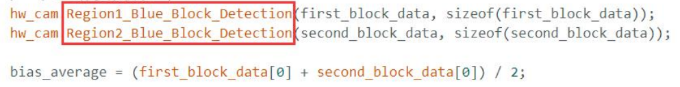

(2) Additionally, ensure that the necessary adjustments are made in the line-loss handling function.

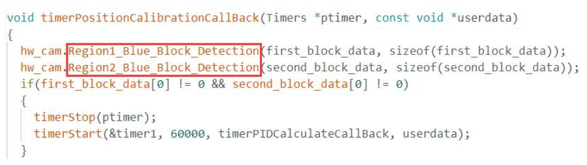

(3) Finally, follow the steps outlined in "[**7.5.3 Program Download**](#anchor_7_5_3)" to re-upload the modified program. This will enable the robot to track the blue line instead of the red one.

### 7.6.7 FAQ

**Question 1:** The camera detects inaccurate or misidentified colors.  

**Answer:** To enhance detection accuracy, reduce background clutter. A solid-colored or simple background with minimal distractions is recommended for optimal performance.

## 7.7 Face Recognition

In this section, the ESP32-S3 vision module is used to detect faces. When a face is detected, the robot gives a slight shake and lights up a green LED as a greeting gesture.

### 7.7.1 Program Flowchart

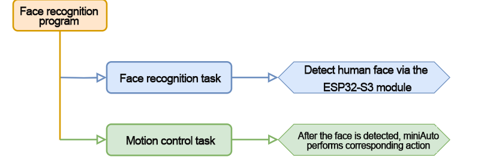

### 7.7.2 ESP32-S3 Vision Module 

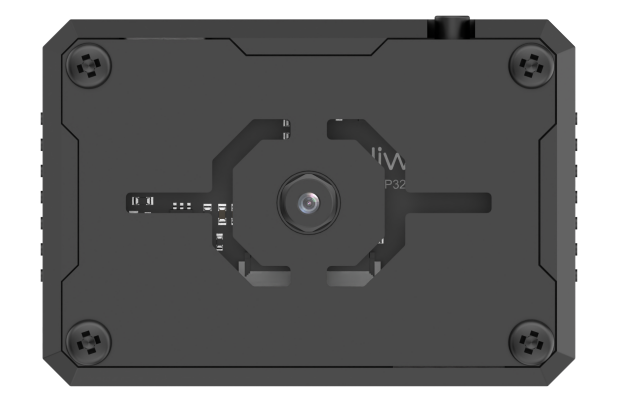

This development board integrates the ESP32 chip and a camera module. Once the module is inserted into the carrier board, it utilizes the IIC communication interface to read color and facial data.

The ESP32-S3 vision module comes with an onboard camera that captures image data and sends it to the ESP32 chip via a serial interface. The chip processes the image and transmits the data to other devices via IIC communication.

### 7.7.3 Program Download

[ESP32-S3 Face Recognition Program](../_static/source_code/FaceDetection.zip)

[UNO esp32_face_recognition](../_static/source_code/esp32_face_recognition.zip)

* **ESP32-S3 Vision Module Program Download**

(1) Connect the ESP32S3 module to the computer using the Type-C cable.

(2) Open the file "[**ESP32S3 Face Recognition Program/FaceDetection/FaceDetection.ino**](../_static/source_code/FaceDetection.zip)" located in the same directory as this document.


(3) Select the **"ESP32S3 Dev Module"** as the development board.


(4) In the menu bar, click on **"Tools"**, and select the appropriate **ESP32S3 board configuration** as shown in the image below.


(5) Click  to upload the code to the **ESP32S3** and wait for the flashing process to complete.


* **Arduino UNO Program Download**

:::{Note}

- Before downloading the program, please remove the Bluetooth module to prevent serial port conflicts that could cause the download to fail.

- When connecting the Type-B download cable, ensure the battery box switch is set to the "OFF" position. This helps avoid accidental contact with the expansion board's power pins, which could result in a short circuit.

:::

(1) Locate and open [esp32_face_recognition.ino](../_static/source_code/esp32_face_recognition.zip) program file.

(2) Connect the Arduino to your computer using the Type-B data cable.

(3) Select the **"Board"** option. The software will automatically detect the connected Arduino's serial port. Click to establish the connection.

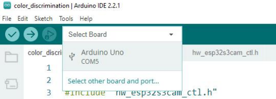

(4) Click  to download the program to the Arduino. Wait for the download to complete.


### 7.7.4 Program Outcome

Once the robot is powered on, the RGB light on the expansion board will turn white. Upon detecting a face, the ultrasonic sensor activates, the RGB light changes to green, and the robot shakes its body to greet.

### 7.7.5 Program Analysis

[UNO esp32_face_recognition](../_static/source_code/esp32_face_recognition.zip)

* **Import Library File**

Import the required Arduino, RGB, ultrasonic sensor, and ESP32-S3 vision module communication header files for the game.

{lineno-start=1}

```
#include <Arduino.h>
#include "FastLED.h"
#include "Ultrasound.h"
#include "hw_esp32s3cam_ctl.h"
```

* **Define Pin and Create Objects**

(1) The Arduino pins used to connect the hardware are defined. They are RGB, buzzer, and motor control pins.

{lineno-start=6}

```
const static uint8_t ledPin = 2;
const static uint8_t buzzerPin = 3;
const static uint8_t motorpwmPin[4] = { 10, 9, 6, 11} ;
const static uint8_t motordirectionPin[4] = { 12, 8, 7, 13};
```

(2) The required variables and constants for the program are defined, including the PWM limit constant, an RGB light static array (with each element of type CRGB), a variable to track the non-blocking delay function, a face detection switch, and the current result of the face detection.

{lineno-start=11}

```
const static uint8_t pwm_min = 50;
static CRGB rgbs[1];
uint32_t previousTime = 0;
bool faceDetected = false;
bool detectionValue = false;
```

(3) The ESP32-S3 vision module and ultrasonic sensor classes are instantiated.

{lineno-start=19}

```
HW_ESP32S3CAM hw_cam;                              ///< 实例化ESP32-Cam摄像头类
Ultrasound ultrasound;                           ///< 实例化超声波类
```

(4) The motor initialization function, face detection task function, non-blocking delay function, speed control function, and motor control function are declared.

{lineno-start=22}

```
void Motor_Init(void);
void Facedetect_Task(void);
bool Check_Delay(uint32_t interval);
void Rgb_Show(uint8_t rValue,uint8_t gValue,uint8_t bValue);
void Velocity_Controller(uint16_t angle, uint8_t velocity,int8_t rot);
void Motors_Set(int8_t Motor_0, int8_t Motor_1, int8_t Motor_2, int8_t Motor_3);
```

* **Initial Settings**

(1) Initialize the related hardware in the `setup()` function. First, set up the serial interface with a baud rate of 9600 and a data reading timeout of 500ms.

{lineno-start=29}

```
void setup() {
  Serial.begin(9600);
  Serial.setTimeout(500);
```

(2) Use the FastLED library to initialize the RGB lights on the expansion board, connecting them to ledPin. Set the color to white by calling the `Rgb_Show` and `ultrasound.Color` functions.

{lineno-start=32}

```
  FastLED.addLeds<WS2812, ledPin, RGB>(rgbs, 1);
  Rgb_Show(10,10,10);
  ultrasound.Color( 10, 10, 10, 10, 10, 10);
```

(3) Initialize the communication interface for the ESP32-S3 vision module.

{lineno-start=35}

```
 hw_cam.begin(); 
```

(4) Call the `Motor_Init` function to initialize the motor control pins.

{lineno-start=36}

```
  Motor_Init();
```

(5) Set the buzzer pin to output mode. This will trigger a short sound from the buzzer before it stops.

{lineno-start=37}

```
  pinMode(buzzerPin,OUTPUT);
  tone(buzzerPin, 1200);                         ///< 输出音调信号的函数,频率为1200
  delay(100);
  noTone(buzzerPin);
```

* **Loop Call Sub-function**

After initialization is complete, the program enters the `loop` function. The `Facedetect_Task` function is repeatedly called. Upon recognizing a face, MiniAuto will shake slightly and turn the RGB light green to greet the user.

{lineno-start=43}

```
void loop() {
  if (Check_Delay(10)) Facedetect_Task();
}
```

* **Non-blocking Delay Function**

This function replicates the effect of the delay(ms) function without blocking the execution of other tasks. It uses the millis() function to get the current timestamp and stores it in the currentTime variable. The difference between the current and previous timestamps is calculated. If the difference exceeds the specified delay time, currentTime is assigned to previousTime, and the function returns true. If the difference is less than the delay time, the function returns false, allowing the program to continue running other tasks without interruption.

{lineno-start=100}

```
bool Check_Delay(uint32_t interval) {
  uint32_t currentTime = millis();
  if (currentTime - previousTime >= interval) {
    previousTime = currentTime;
    return true;
  }
  return false;
}
```

* **"Facedetect_Task" Task Function**

The `Facedetect_Task` function handles the robot's response when a face is detected. Upon detecting a face, the robot performs a shaking motion (moving left and right), and the RGB light changes from white to green to indicate a greeting. The face detection switch is turned on to signal that a face is detected. If no face is detected, the RGB light transitions from green back to white, and the face detection switch is turned off, signaling that the robot is no longer detecting a face. This process ensures that the robot responds dynamically based on face detection.

{lineno-start=48}

```
void Facedetect_Task(void)
{

  hw_cam.Face_Data_Receive(cam_buffer, sizeof(cam_buffer));
  if (cam_buffer[0] != 0 || cam_buffer[1] != 0)
  {
    faceDetected = true;
  }
  else
  {
    faceDetected = false;
  }
  if (faceDetected == true)
  {
    Rgb_Show(10,0,0);  
    ultrasound.Color( 0, 10, 0, 0, 10, 0);
    Velocity_Controller(0, 0, 50); 
    delay(500);
    Velocity_Controller( 0, 0, -50);   
    delay(500); 
    Velocity_Controller( 0, 0, 0);
    faceDetected = false;                       ///< 设置标志为true，表示已经检测到人脸
  }
  else
  {
    Rgb_Show(10,10,10);  
    ultrasound.Color( 10, 10, 10, 10, 10, 10);
  }
  Serial.print(cam_buffer[0]);Serial.print(",");Serial.println(cam_buffer[1]);
}
```

* **RGB LED Setting Function**

This function controls the color of the RGB light on the expansion board. The RGB values for red (rValue), green (gValue), and blue (bValue) are stored in the rgbs array. After assigning the values, the `FastLED.show()` function is called to apply and display the new color on the RGB light. This allows the RGB light to reflect the desired color based on the input values.

{lineno-start=87}

```
void Rgb_Show(uint8_t rValue,uint8_t gValue,uint8_t bValue) {
  rgbs[0].r = rValue;
  rgbs[0].g = gValue;
  rgbs[0].b = bValue;
  FastLED.show();
}
```

* **Motor Initialization Function**

This function initializes the motor pins by iterating through the motor control pins using a for loop and calling the `pinMode` function to set each motor's IO port to output mode. Once the pins are configured, the `Velocity_Controller` function is called to stop the robot, ensuring that all motors are halted at the initial stage.

{lineno-start=110}

```
void Motor_Init(void){
  for(uint8_t i = 0; i < 4; i++){
    pinMode(motordirectionPin[i], OUTPUT);
  }
  Velocity_Controller( 0, 0, 0);
}
```

* **Robot Velocity Control Function**

This function adjusts the speed of each wheel on the robot. By analyzing the kinematics of the robot's Mecanum wheels, the speed for each wheel is calculated based on the desired motion. These calculated speed values are then passed as input parameters to the Motors_Set function, which controls the speed of each motor and ultimately the movement of the robot. For a deeper understanding of the calculations involved, it is recommended to refer to relevant tutorials on kinematic analysis for Mecanum drive systems.

{lineno-start=126}

```
void Velocity_Controller(uint16_t angle, uint8_t velocity,int8_t rot) {
  int8_t velocity_0, velocity_1, velocity_2, velocity_3;
  float speed = 1;                               ///< 速度因子
  angle += 90;                                   ///< 设定初始方向
  float rad = angle * PI / 180;
  if (rot == 0) speed = 1;
  else speed = 0.5; 
  velocity /= sqrt(2);
  velocity_0 = (velocity * sin(rad) - velocity * cos(rad)) * speed + rot * speed;
  velocity_1 = (velocity * sin(rad) + velocity * cos(rad)) * speed - rot * speed;
  velocity_2 = (velocity * sin(rad) - velocity * cos(rad)) * speed - rot * speed;
  velocity_3 = (velocity * sin(rad) + velocity * cos(rad)) * speed + rot * speed;
  Motors_Set(velocity_0, velocity_1, velocity_2, velocity_3);
}
```

* **Motor Setting Function**

This function adjusts the speed and direction of each wheel of the robot based on the provided input parameters. Within a "for" loop, the robot's steering is modified according to the calculated results. The map function is used to convert the calculated values from the range of 0 to 100 into a range between pwm_min and 255. After mapping the values, the digitalWrite and analogWrite functions are called to set the motor direction and speed, effectively controlling the movement of the robot.

{lineno-start=146}

```
void Motors_Set(int8_t Motor_0, int8_t Motor_1, int8_t Motor_2, int8_t Motor_3) {
  int8_t pwm_set[4];
  int8_t motors[4] = { Motor_0, Motor_1, Motor_2, Motor_3};
  bool direction[4] = { 1, 0, 0, 1};///< 前进 左1 右0
  for(uint8_t i; i < 4; ++i) {
    if(motors[i] < 0) direction[i] = !direction[i];
    else direction[i] = direction[i];

    if(motors[i] == 0) pwm_set[i] = 0;
    else pwm_set[i] = map(abs(motors[i]), 0, 100, pwm_min, 255);

    digitalWrite(motordirectionPin[i], direction[i]); 
    analogWrite(motorpwmPin[i], pwm_set[i]); 
  }
}
```
