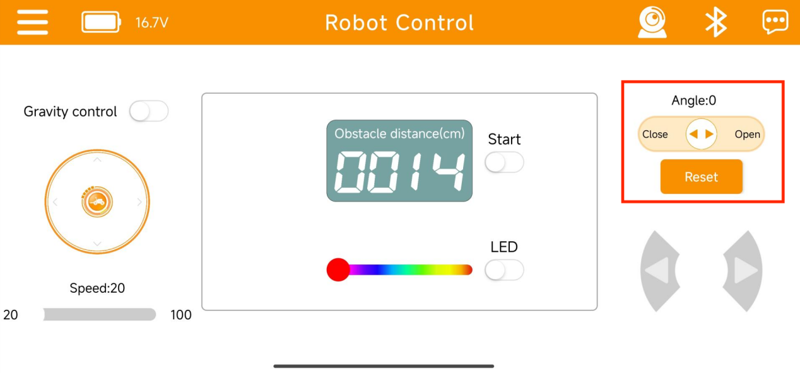
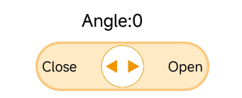
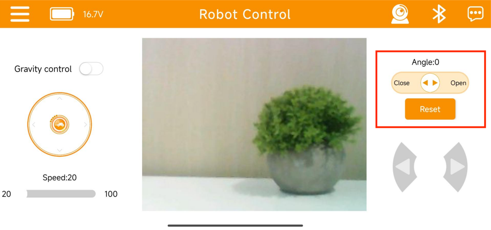
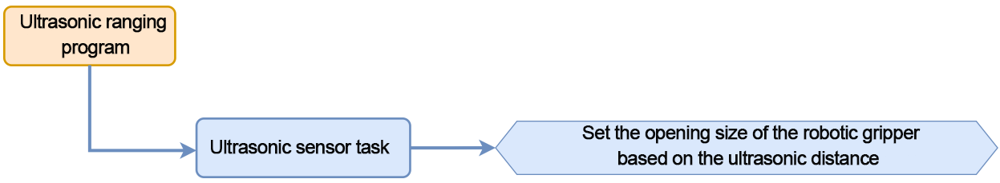
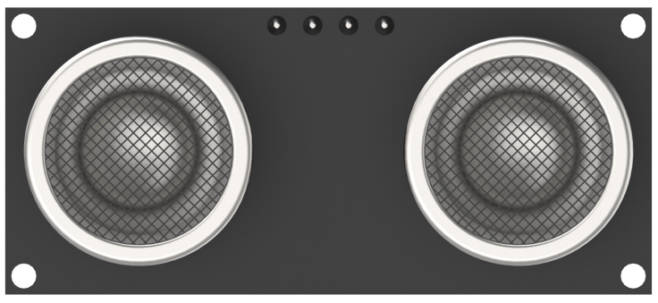
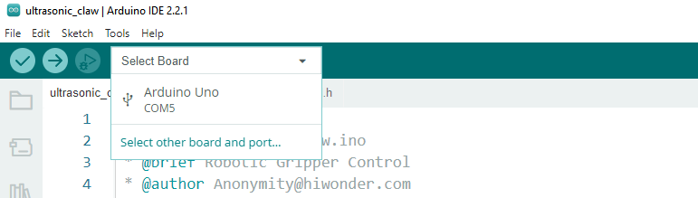
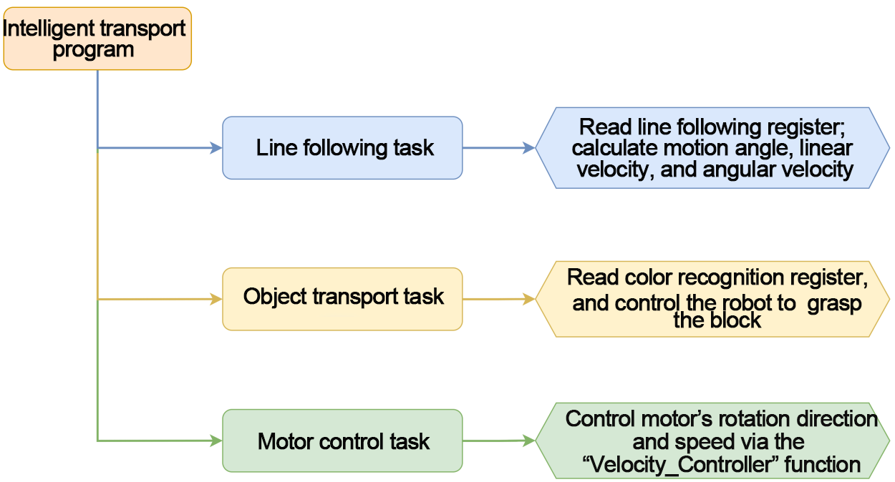
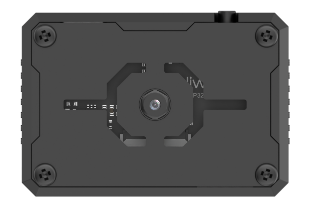
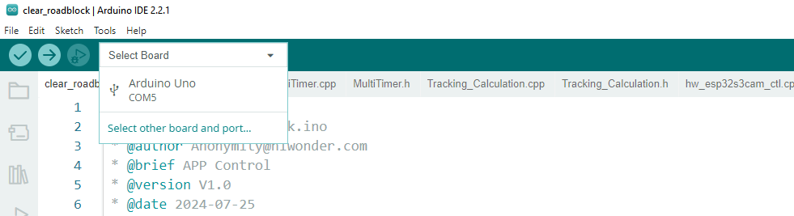

# 8.Robotic Gripper Control Lesson

<p id="anchor_8_1"></p>

## 8.1 Robotic Gripper Assembly Instruction

## 8.2 Robotic Gripper App Control

Please refer to [**4. App Control**](https://docs.hiwonder.com/projects/miniAuto/en/latest/docs/4.App_control.html) for instructions on installing the app and connecting to miniAuto.

(1) After connecting the device to the app, you can control the robotic gripper's opening and closing using the servo control button on the right side of the interface.



(2) Icon Descriptions:

<table  class="docutils-nobg" style="text-align:center;"  border="1">
<colgroup>
<col  />
<col  />
</colgroup>
<tbody>
<tr>
<td ><strong>Icon</strong></td>
<td ><strong>Function</strong></td>
</tr>
<tr>
<td ></td>
<td ><strong>Controls the opening and closing of the robotic gripper.</strong><br />
Angle range: 0–60° (0° = closed, 60° = fully open)</td>
</tr>
<tr>
<td ></td>
<td >Returns the robotic gripper to its initial position (0°)</td>
</tr>
</tbody>
</table>


(3) The robotic gripper control on the image transmission interface is the same as above.

Please refer to "[**4.App Control**](https://docs.hiwonder.com/projects/miniAuto/en/latest/docs/4.App_control.html)" to access the image transmission interface.



If the above functions cannot be achieved, please follow "[**8.1 Robotic Gripper Assembly Instruction**](#anchor_8_1)" to reassemble the gripper.

## 8.3 Robotic Gripper Control

In this section, you can learn to detect the distance of obstacle through glowing ultrasonic module. The opening and closing of the robotic gripper can be controlled simultaneously.

### 8.3.1 Program Flowchart



### 8.3.2 Ultrasonic Sensor



This is a glowing ultrasonic ranging module. It adopts an I2C communication interface, which can read the range measured by an ultrasonic sensor through I2C communication.

The ultrasonic sensor will automatically transmit 8 square waves at 40khz during ranging, and then detect whether there is a signal return. If there is a signal return, it outputs a high voltage level, whose continuing time is the time of the ultrasonic from transmitting to returning.

Formula: measurement distance=(high voltage level time\*sound speed (340m/s))/2.

### 8.3.3 Program Download 

[ultrasonic_claw](../_static/source_code/ultrasonic_claw.zip)

:::{Note}

- Remove the Bluetooth module before downloading the program. Or the program will fail to download because of the serial port conflict.

- Please switch the battery box to the 'OFF' when connecting the Type-B download cable. This action prevents the download cable from accidentally touching the power pins of the expansion board, which may cause a short circuit.

:::

(1) Locate and open [ultrasonic_claw](../_static/source_code/ultrasonic_claw.zip) program file.


(2) Connect the Arduino to your computer using a Type-B USB cable. Then, click on the **"Select Board"** option — the software will automatically detect the Arduino's serial port. Click to establish the connection.



(3) Click  to download the program into Arduino. Then just wait for it to complete.


### 8.3.4 Program Outcome

When powering miniAuto on, the glowing ultrasonic sensor on it will measure the distance to the obstacles and control the rotation angle of the servo accordingly. The servo is mounted on the miniAuto's robotic gripper. Rotate the servo will drive the gripper to open and close.

### 8.3.5 Brief Program Analysis 

* **Import Library File**

{lineno-start=12}

```
#include "Ultrasound.h"
#include <Servo.h>
```

Import the custom libraries needed to control the LED ultrasonic module, along with the servo control library required for this project.

* **Pin Definition and Object Creation**

Create an ultrasonic sensor object and a servo motor object. The ultrasonic sensor is used to obtain distance data, while the servo controls the robotic gripper. Define the pin connections for both the servo motor and the buzzer connected to the Arduino controller. Then, set the initial values for the servo's rotation angle and the distance measurement.

{lineno-start=15}

```
Servo myServo;
Ultrasound ultrasound;            ///< 实例化超声波类
const static uint8_t servoPin = 5;
const static uint8_t buzzerPin = 3;

int angle = 90;
uint16_t distance = 0;
uint32_t previousTime = 0;
```

* **Initial Settings**

In the setup() function, initialize the serial communication and set the baud rate to 9600. Next, initialize the servo connection. The angle value is passed as the rotation angle parameter to the servo, causing it to rotate and close the robotic gripper.

{lineno-start=26}

```
void setup() {
  // put your setup code here, to run once:
  Serial.begin(9600);
  myServo.attach(servoPin);
  myServo.write(angle);
}
```

* **Main Function**

In the **main** function, call the ultrasonic task function in a continuous loop to implement the functionality described in [Ultrasonic Detection](#anchor_8_3_5_5).

{lineno-start=33}

```
void loop() {
  // put your main code here, to run repeatedly:
  ultrasonic_distance();
  Servo_control();
}
```

<p id="anchor_8_3_5_5"></p>

* **Ultrasonic Detection**

(1) Call the `ultrasonic_distance()` function to measure the distance and change the color of the light.

{lineno-start=39}

```
void ultrasonic_distance(){
  uint8_t s;
  distance = ultrasound.Filter();                                           ///< 获得滤波器输出值
  Serial.print("Distance: ");Serial.print(distance);Serial.println(" mm");///< 获取并且串口打印距离，单位mm
```

(2) When the distance is less than 80mm, the ultrasonic sensor will display a breathing light mode, flashing red at a speed of 0.1s.

{lineno-start=44}

```
  if (distance > 0 && distance <= 80){
      ultrasound.Breathing(1, 0, 0, 1, 0, 0);                             
  }
```

(3) When the distance is between 80mm and 180mm, the ultrasonic sensor will show a red light, gradually lightening as the distance increases.

{lineno-start=48}

```
  else if (distance > 80 && distance <= 180){
      s = map(distance,80,180,0,255);
      ultrasound.Color((255-s), 0, 0, (255-s), 0, 0);                     
  }
```

(4) When the distance is between 180mm and 320mm, the ultrasonic sensor will display a blue light, with the color deepening as the distance increases.

{lineno-start=53}

```
   else if (distance > 180 && distance <= 320){
      s = map(distance,180,320,0,255);
      ultrasound.Color(0, 0, s, 0, 0, s);                                 
  }
```

(5) When the distance is between 320mm and 500mm, the ultrasonic sensor will show a green light, becoming more vibrant as the distance increases.

{lineno-start=58}

```
   else if (distance > 320 && distance <= 500){
      s = map(distance,320,500,0,255);
      ultrasound.Color(0, s, 255-s, 0, s, 255-s);                         
  }
```

(6) When the distance exceeds 500mm, the green LED on the ultrasonic sensor will remain steadily on.

{lineno-start=}

```
  else if (distance > 500){
      ultrasound.Color(0, 255, 0, 0, 255, 0);                             
  }
```

* **Servo Control Function**

{lineno-start=67}

```
void Servo_control(void)
{
  if(distance >= 500) distance = 500;
  angle = map(distance, 0,500,0,80);
  myServo.write(angle+90);
}
```

Use an if statement to limit the maximum effective distance to 500mm. Since the map() function will be used to map the current distance (with an effective range of 0-500mm) to the servo's rotation angle (with an effective range of 0-80°), values exceeding 500mm could lead to an invalid angle due to out-of-range mapping.

Once the angle is determined, write it to the servo. The servo will rotate, causing the robotic gripper to open and close. The closer the distance to an obstacle, the more the gripper will close, and vice versa.

### 8.3.6 FAQ 

**Q:** After uploading the code, the distance measured by the ultrasonic sensor always shows 0.

**A:** Please check whether the 4-pin cable is correctly connected to the I²C interface.

**Q:** The distance measured by the ultrasonic sensor is sometimes accurate and sometimes not.

**A:** Please use a smooth, flat object for distance measurement, and avoid long-term detection of obstacles at close range.

## 8.4 Intelligent Transport

In this section, the miniAuto will use the ESP32-S3 vision module to recognize and follow a red line. When a green block is detected, the miniAuto will pick it up and transport it accordingly.

### 8.4.1 Program Flowchart



### 8.4.2 ESP32-S3 Vision Module



This is a development board that integrates an ESP32 chip with a camera module. Once the module is inserted into the carrier board, it uses the I²C communication interface to read data such as color and facial recognition information.

The ESP32-S3 vision module features an onboard camera module, which captures image data and transmits it to the ESP32 chip via a serial interface. The ESP32 then processes the image data and sends the results to other devices through I²C communication.

### 8.4.3 Program Download

[LineTracking](../_static/source_code/8.LineTracking.zip)

[clear_roadblock](../_static/source_code/clear_roadblock.zip)

* **ESP32-S3 Vision Module Program Download**

(1) Connect the ESP32-S3 to the computer with a Type-C cable.

(2) Locate the program file [LineTracking.ino](../_static/source_code/8.LineTracking.zip) saved in the same directory.


(3) Choose the **'ESP32S3 Dev Module'** development board.


(4) From the menu bar, click on **"Tools"** and select the appropriate ESP32-S3 board configuration as shown in the image below.


(5) Click  to upload the program to the ESP32-S3, then wait for the flashing process to complete.


* **Arduino UNO Program Download**

:::{Note}

- Remove the Bluetooth module before downloading the program. Or the program will fail to download because of the serial port conflict.

- Please switch the battery box to the 'OFF' when connecting the Type-B download cable. This action prevents the download cable from accidentally touching the power pins of the expansion board, which may cause a short circuit.

:::

(1) Locate and open the **"clear_roadblock.ino"** program file, which is in the same directory as this section.


(2) Connect the Arduino to your computer using a Type-B USB cable.

(3) Click on **"Select Board"**. The software will automatically detect the current Arduino serial interface. Then, click to connect.



(4) Click  to upload the program to the Arduino, and wait for the process to complete.


### 8.4.4 Program Outcome

Once powered on, the miniAuto will recognize and follow the red line. If a green block is detected while following the line, it will pick up and transport the block.

### 8.4.5 Program Analysis

* **Import Library File**

Import the required header files for the timer, tracking actions, servo control, motor, and ESP-S3 vision module communication to set up the game.

{lineno-start=13}

```
#include "MultiTimer.h"
#include "Motor.h"
#include "hw_esp32s3cam_ctl.h"
#include "Tracking_Calculation.h"
#include "Ultrasound.h"
#include <Servo.h>
```

* **Define Pin and Create Objects**

Instantiate the timer, servo, and vision module objects. Define the pin used for the servo. Set red as the target color for line following and green as the target for block transport. Then, define variables for storing coordinates as well as controlling the robot's linear velocity, angular velocity, and movement angle.

{lineno-start=19}

```
Timers timer1;
Timers timer2;
Timers timer3;
Timers timer4;

Servo myServo;
HW_ESP32S3CAM hw_cam;

/* 引脚定义(Pin definitions) */
const static uint8_t servoPin = 5;

 /* 红色：0 黄色：1 绿色：2 蓝色：3 黑色：4(Red: 0; Yellow: 1; Green: 2; Blue: 3; Black: 4) */
const static uint8_t tracking_color = 0;
const static uint8_t roadblock_color = 2;

const static uint8_t target_point = 80;


static uint16_t set_angle = 0;
static int8_t set_rot = 0;
static int8_t set_speed = 0;

static uint8_t time_count = 0;
```

The line loss calibration parameters are used to record the position of the block, helping the robot make decisions when the line is lost. The line coordinate parameters store the coordinates of the detected line, while the obstacle coordinate parameters store the coordinates of the block.

{lineno-start=43}

```
/* 丢线时校准参数(Calibration parameters when losing the line) */
static uint8_t first_calibration_data;
static uint8_t second_calibration_data;

/* 巡线坐标参数(Parameters for line following coordinates) */
static uint8_t first_block_data[LINE_PATROL_REG_COUNT];
static uint8_t second_block_data[LINE_PATROL_REG_COUNT];

/* 障碍物坐标参数(Parameters for obstacle coordinates) */
static uint8_t roadblock_first_block_data[LINE_PATROL_REG_COUNT];
static uint8_t roadblock_second_block_data[LINE_PATROL_REG_COUNT];
```

* **Initial Settings**

(1) Initialize related hardware equipment in `setup()` function. The first is serial interface, which sets the baud rate of communication to 115200.

{lineno-start=197}

```
void setup() {
  Serial.begin(115200);
```

(2) Initialize each module. Timer1 starts counting with a single time unit of 20ms.

`ticksFuncSet(ticksGetFunc)`: Binds the system's time retrieval function ticksGetFunc to platFormTicksFunction, allowing the current system time to be accessed via platFormTicksFunction.

`Motors_Initialize()`: Initializes the motor system.

`hw_cam.begin()`: Initializes the ESP32-S3 vision module.

`Controller_Init()`: Initializes the computation unit for the robot's motion control parameters.

`myServo.attach(servoPin)`: Attaches the servo to the specified pin and initializes PWM control.

`set_servo(60+90)`: Sets the servo angle to 150°.

`ultrasound.Color(0, 0, 0, 0, 0, 0)`: Turns off all LED lights on the ultrasonic module.

`timerStart(&timer1, 60000, timerPIDCalculateCallBack, "60ms cycle PID calculate")`: Starts timer1, which triggers the timerPIDCalculateCallBack function after 60 ms, passing the string "**60ms cycle PID calculate**" as a parameter to the callback.

{lineno-start=197}

```
void setup() {
  Serial.begin(115200);
  ticksFuncSet(ticksGetFunc);
  Motors_Initialize();
  hw_cam.Init();
  Calculation_Init();
  myServo.attach(servoPin);
  set_servo(60);
  timerStart(&timer1, 60000, timerPIDCalculateCallBack, "60ms cycle PID calculate");
}
```

* **Loop Call Sub-function**

Once initialization is complete, the program enters the loop() function. In each cycle, the `timersTaskRunning()` function is called to check and process all timers that have reached their trigger time, executing the corresponding interrupt functions.  

After that, the `Velocity_Controller(set_angle, set_speed, set_rot, SIMULATE_PWM_CONTROL)` function is used to control the robot's movement speed and direction.

{lineno-start=208}

```
void loop() {
  /* 定时器任务运行(Run the timer task) */
  timersTaskRunning();
  /* 软件PWM驱动电机进行姿态调整(Use software PWM to adjust the posture of the motor) */
  Velocity_Controller(set_angle, set_speed, set_rot, SIMULATE_PWM_CONTROL);
}
```

* **Timer Callback Function "timerPIDCalculateCallBack"**

This function checks whether the robot has detected the target color position. It does so by reading the line-following register data from the vision module using the Linepatrol_Data_Receive function, and then calculating the offset on the x-axis.

{lineno-start=66}

```
/* 每60ms进行位置坐标计算(Calculate the position coordinates every 60ms) */
void timerPIDCalculateCallBack(Timers *ptimer, const void *userdata)
{
  int bias_average;
  /* 寻线坐标参数获取(Get line following coordinate parameters) */
  hw_cam.Linepatrol_Data_Receive(LINE_PATROL_FIRST_COLOR_REG1, first_block_data, sizeof(first_block_data));
  hw_cam.Linepatrol_Data_Receive(LINE_PATROL_FIRST_COLOR_REG2, second_block_data, sizeof(second_block_data));

  /* 障碍物坐标参数获取(Get obstacle coordinate parameters) */
  hw_cam.Linepatrol_Data_Receive(LINE_PATROL_THIRD_COLOR_REG1, roadblock_first_block_data, sizeof(roadblock_first_block_data));
  hw_cam.Linepatrol_Data_Receive(LINE_PATROL_THIRD_COLOR_REG2, roadblock_second_block_data, sizeof(roadblock_second_block_data));
  
  /* 计算x轴偏移均值(Calculate the average x-axis offset) */
  bias_average = (first_block_data[1] + second_block_data[1]) / 2;
```

It then evaluates the detected color. If a line is recognized, the robot will begin line following and store the line's coordinates in a variable.

{lineno-start=81}

```
  if(first_block_data[0] == tracking_color && second_block_data[0] == tracking_color && 
     roadblock_first_block_data[0] != roadblock_color && roadblock_second_block_data[0] != roadblock_color) 
  {
    set_speed = 50;
    Position_Control(&bias_average, &set_rot, &target_point);
    timerStart(ptimer, 60000, timerPIDCalculateCallBack, userdata);
    first_calibration_data = first_block_data[1];   /* 记录色块位置，丢线时做判断处理(Record the position of the color block for judgment when losing the line) */
    second_calibration_data = second_block_data[1];
  }
```

If an obstacle is detected, it will stop line following. Start timer2 to transport the block. If an obstacle is detected, the robot will stop following the line and start timer2 to initiate the block transport process.

{lineno-start=90}

```
  else if(roadblock_first_block_data[0] == roadblock_color)   /* 若看到障碍物就停止巡线(Stop line following when encountering an obstacle) */
  {
    timerStop(ptimer);
    timerStart(&timer2, 100000, timerMovingRoadblockCallBack, "100ms cycle moving_roadblock");
  }
```

If the car is currently in the transport state, it may deviate from the line. The position needs to be corrected to make the car return to the line.

{lineno-start=95}

```
  /* 若偏离程度过大，开启丢线位置矫正定时器回调，关闭PID计算定时器回调(If the deviation is too large, start the timer callback for position calibration and stop the PID calculation timer callback) */
  else if(first_block_data[0] != tracking_color || second_block_data[0] != tracking_color)  
  {
    set_speed = 0;
    set_rot = 0;
    timerStop(ptimer);
    timerStart(&timer3, 60000, timerPositionCalibrationCallBack, "60ms cycle position calibration");
  }
```

* **Timer Monitoring Function "timersTaskRunning"**

The timer list is implemented as a linked list by default. You can traverse and add or remove timers in the list using the two pointers: pTimerList and entry.

When a timer reaches its trigger time, it is considered expired and is removed from the list. Therefore, if you want a timer to run repeatedly, you'll need to call the timerStart function again—either within the callback function or multiple times as needed.

{lineno-start=75}

```
int timersTaskRunning(void)
{
  Timers *entry = pTimerList;
  for (; entry; entry = entry->next)
  {
    if (platFormTicksFunction() < entry->deadline)
    {
      return (int)(entry->deadline - platFormTicksFunction());
    }
    pTimerList = entry->next;
    if(entry->timersCallBack)
    {
      entry->timersCallBack(entry, entry->userdata);
    }
  }
  return 1;
}
```

* **Position Calibration Callback Function: timerPositionCalibrationCallBack**

The `Linepatrol_Data_Receive` function is called to obtain the color information recognized by the visual module.

{lineno-start=169}

```
void timerPositionCalibrationCallBack(Timers *ptimer, const void *userdata)
{
  hw_cam.Linepatrol_Data_Receive(LINE_PATROL_FIRST_COLOR_REG1, first_block_data, sizeof(first_block_data));
  hw_cam.Linepatrol_Data_Receive(LINE_PATROL_FIRST_COLOR_REG2, second_block_data, sizeof(second_block_data));
  
```

 If red is detected, timer1 is restarted, and the robot continues with line following.

{lineno-start=173}

```
  if(first_block_data[0] == tracking_color && second_block_data[0] == tracking_color)
  {
    timerStop(ptimer);
    timerStart(&timer1, 60000, timerPIDCalculateCallBack, userdata);
  }
```

If red is not detected, the position calibration callback task is executed. Based on the previously saved block position, the corresponding linear speed, angular velocity, and movement angle are set. The position calibration task is then restarted and will continue until the line is detected again.

{lineno-start=178}

```
  else
  {
    if(first_calibration_data >= 80 || second_calibration_data >= 80)
    {
      set_angle = 0;
      set_speed = 40;
      set_rot = -15;
    }
    else if(first_calibration_data < 80 || second_calibration_data < 80)
    {
      set_angle = 0;
      set_speed = 40;
      set_rot = 15;
    }
    timerStart(ptimer, 60000, timerPositionCalibrationCallBack, userdata);

  }
```

* **Motor Initialization Function**

This function is used to initialize the motor pins. Call the `pinMode` function in a `for` loop to set the motor IO port to output mode. Then, the `Velocity_Controller` function is called to set the robot to stop.

{lineno-start=115}

```
void Motors_Initialize(void)
{
  for(uint8_t i = 0; i < 4; i++)
  {
    pinMode(motordirectionPin[i], OUTPUT);
    pinMode(motorpwmPin[i], OUTPUT);
  }
  Velocity_Controller( 0, 0, 0, SIMULATE_PWM_CONTROL);
}
```

* **Robot Velocity Control Function**

This function is used to set the speed of each wheel on the robot. By analyzing the kinematics of the Mecanum wheels, the speed for each individual wheel can be calculated. These calculated speed values are then passed as input parameters to the Motors_Set function, which adjusts the motor speeds accordingly to control the robot's overall movement. For more details on the kinematic analysis, please refer to the relevant tutorials.

{lineno-start=84}

```
void Velocity_Controller(uint16_t angle, uint8_t velocity,int8_t rot, uint8_t mode)
{
  int16_t velocity_0, velocity_1, velocity_2, velocity_3;
  /* 速度因子(Speed factor) */
  float speed = 1;                                               
  /* 设定初始方向(Set initial direction) */
  angle += 90;                                                 
  float rad = angle * PI / 180;
  if (rot == 0) speed = 1;
  else speed = 0.5; 
  velocity *= invSqrt(2);
  velocity_0 = (velocity * sin(rad) - velocity * cos(rad)) * speed + rot * speed;
  velocity_1 = (velocity * sin(rad) + velocity * cos(rad)) * speed - rot * speed;
  velocity_2 = (velocity * sin(rad) - velocity * cos(rad)) * speed - rot * speed;
  velocity_3 = (velocity * sin(rad) + velocity * cos(rad)) * speed + rot * speed;
  switch (mode)
  {
  case PWM_CONTROL:
    Motors_Set(velocity_0, velocity_1, velocity_2, velocity_3);
    break;

  case SIMULATE_PWM_CONTROL:
    _Motors_Set(velocity_0, velocity_1, velocity_2, velocity_3);
    break; 

  default:
    break;
  }
}
```

* **Motor Setting Function**

This function adjusts the speed and direction of each wheel based on the provided input parameters. Inside the for loop, the robot's steering is configured according to the calculated values. The map function is used to convert these values from a range of 0 to 100 into a corresponding PWM range between pwm_min and 255. Subsequently, the digitalWrite and analogWrite functions are used to set the motor direction and control its speed accordingly.

{lineno-start=67}

```
static void _Motors_Set(int16_t Motor_0, int16_t Motor_1, int16_t Motor_2, int16_t Motor_3)
{
  int8_t pwm_set[4];
  int8_t motors[4] = { Motor_0, Motor_1, Motor_2, Motor_3};
  bool direction[4] = { 1, 0, 0, 1};///< 前进 左1 右0(Forward: left 1, right 0)
  for(uint8_t i; i < 4; ++i) {
    if(motors[i] < 0) direction[i] = !direction[i];
    else direction[i] = direction[i];

    if(motors[i] == 0) pwm_set[i] = 0;
    else pwm_set[i] = abs(motors[i]);

    digitalWrite(motordirectionPin[i], direction[i]); 
    PWM_Out(motorpwmPin[i], pwm_set[i]);
  }
}
```

### 8.4.6 FAQ

**Q:** The system fails to recognize colors after uploading the code.

**A:** Please ensure that the 4-pin cable is correctly connected to the appropriate I²C interface.

**Q:** The camera detects colors inaccurately or misidentifies them.

**A:** To improve recognition accuracy, try to reduce background distractions. Using a solid-color or simplified background is recommended.