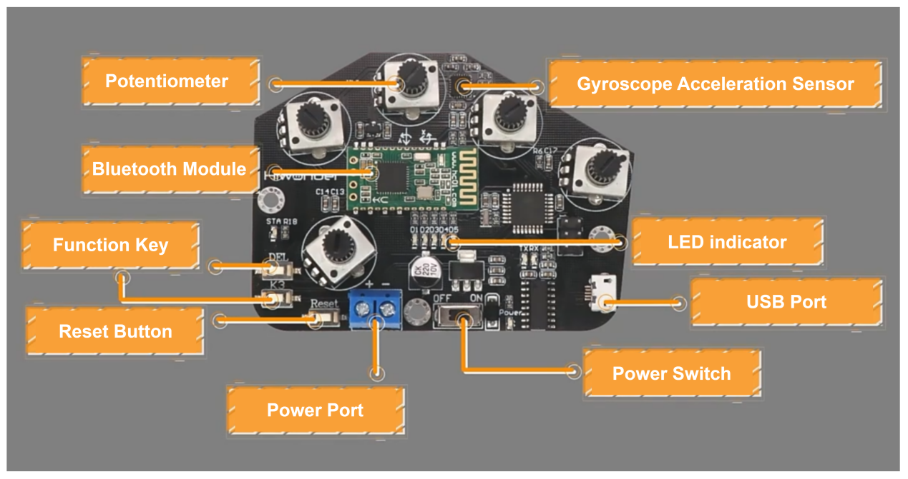
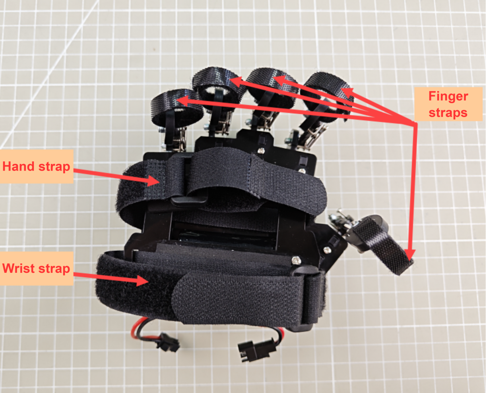
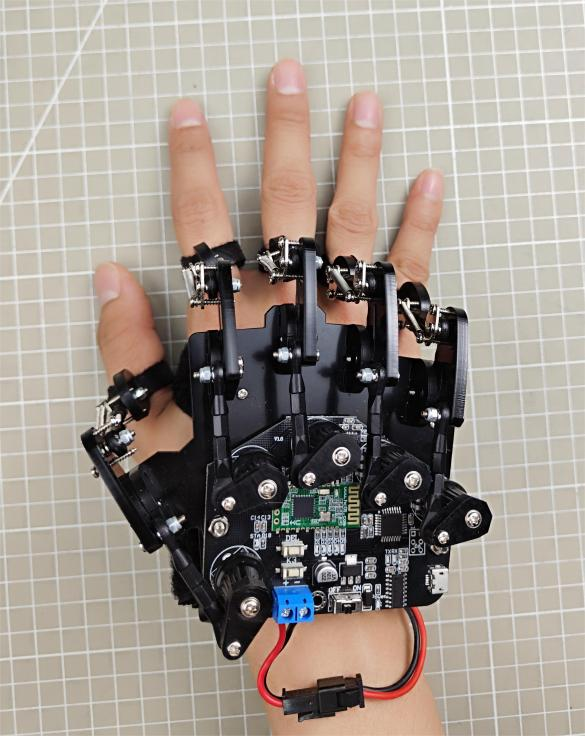
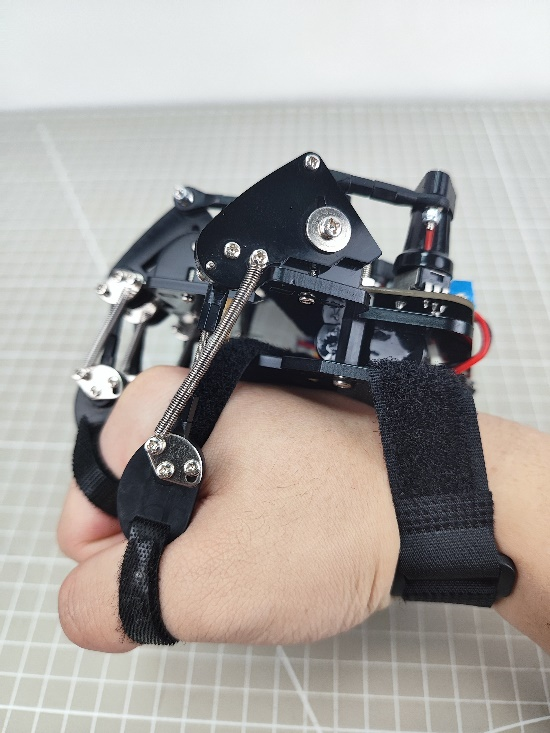
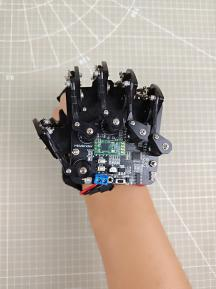
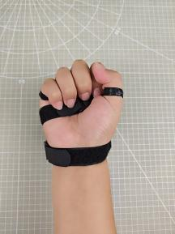
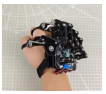
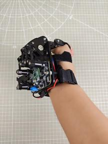
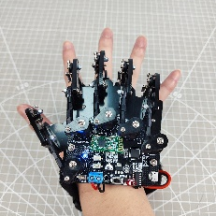

# 9. Wireless Glove Control Lesson

## 9.1 Wireless Glove Introduction and Wearing 

The wireless glove consists of five potentiometers and uses a Bluetooth module to communicate w<span class="mark">ith devices</span>.

### 9.1.1 Structure Introduction



**(1) Potentiometers:** There are five potentiometers located on the back of the wireless glove. These are key components for controlling the opening and closing of the miniAuto's gripper.

**(2) Gyroscope Acceleration Sensor (MPU6050):** This sensor captures acceleration and tilt angles along the X, Y, and Z axes. By rotating the wireless glove, you can perform various operations to control the miniAuto.

**(3) Bluetooth Module:** Facilitates wireless communication between the glove and the miniAuto.

① **Function Keys**: The functions of these two keys are as follows:

② **DEL:** Clears the Bluetooth connection history.

③ **K3:** Switches between different control modes of the wireless glove.

④ **Reset Button**: Used to restart the wireless glove.

⑤ **LED Indicators**: Show the current control mode of the wireless glove.

⑥ **USB Port**: Connects to a PC for debugging and uploading programs.

⑦ **Power Port**: Connects to a lithium battery to power the wireless glove (standard voltage: 7.4V).

### 9.1.2 Wearing Method



First, secure the finger straps around the last knuckles of each finger. Then, fasten the hand strap and wrist strap around the corresponding areas of the hand and wrist.

For a visual reference, please refer to the video located in the same directory as this document. The final fit should look as shown below:

<table class="" style="text-align: center;width: 600px;">
    <tbody>
    <tr>
        <td></td>
        <td></td>
    </tr>
    <tr>
        <td>Front</td>
        <td>Back</td>
    </tr>
    </tbody>
</table>


## 9.2 Wireless Glove Control

The miniAuto can be controlled to move forward, backward, rotate clockwise, and rotate counterclockwise using the potentiometers and IMU integrated into the motion-sensing glove.

**9.2.1 Program Download**

* **Download Program to miniAuto**

[miniAuto Program]()

:::{Note}

Please remove the Bluetooth module before downloading the program to avoid serial port conflicts, which may cause the download to fail.

:::

(1) Locate and open the **'glove_receive.ino'** file in the same directory as this section.


(2) Connect Arduino to the computer with the Type-B cable.


(3) Click **“Select Board”**, and the software will automatically detect the current Arduino serial port. Next, click to connect.


(4) Click  to download the program into Arduino. Then just wait for it to complete.


* **Download Program to Wireless Glove (Optional)**

[Wireless Glove Program]()

The program has already been preloaded onto the wireless glove at the factory, so this section is provided for informational purposes only.

(1) Locate and open the “lehand.ino” program file in the same directory as this section.


(2) Connect the wireless glove to the computer using the micro USB cable.

(3) Click **“Select Board”**; the software will automatically detect the current Arduino port. Then, click to connect.


(4) Click  to download the program to the Arduino and wait for the download to complete.


### 9.2.1 Device Pairing

(1) First, power on the miniAuto and wireless glove, and ensure it is connected to the Bluetooth module.

(2) Wear the wireless glove on your right hand, making a fist with the palm facing down. Then, power on the wireless glove, and its LED indicators will light up.

<p style="margin:0 auto 24px;width:100%">


</p>


(3) Once the LED indicators turn off, stretch your hand. When the LEDs complete the second flashing, it means that the wireless glove has finished its initialization. (This step must be repeated every time you restart the glove.)

<p style="margin:0 auto 24px;width:100%">


</p>

(4) Press the **‘DEL’** key to clear the Bluetooth connection history.

(5) After the clearing process is complete, the ‘STA’ indicator will start flashing, and the wireless glove will automatically connect to the device. Once the connection is successful, the "STA" indicator will remain on.


### 9.2.2 Control Mode Switching

You can press the **‘K3’** key on the wireless glove to switch between control modes. The LEDs (D1 to D5) will provide feedback indicating the currently selected mode. When LEDs 1 and 2 are lit, it indicates the miniAuto control mode.


### 9.2.3 Control Mode Instruction

After connecting the wireless glove to miniAuto, the potentiometers and IMU on the wireless glove can control the movement of miniAuto. Specific information can be found in the following table.

<table  class="docutils-nobg" style="margin:0 auto" border="1">
  <tr align="center">
    <th>Initial Gesture</th>
    <th>Gesture Description (from your perspective)</th>
    <th>Gesture Image</th>
    <th>Feedback Action from the Tank Robot (from the tank robot's perspective)</th>
  </tr>
  <tr>
    <td rowspan="4" align="center">Make a fist.</td>
    <td>The palm faces down.</td>
    <td></td>
    <td>Move forward.</td>
  </tr>
  <tr>
    <td>The palm faces up.</td>
    <td></td>
    <td>Move backward.</td>
  </tr>
  <tr>
    <td>Bend your wrist clockwise, that is, the palm faces to the left.</td>
    <td></td>
    <td>Rotate clockwise in place.</td>
  </tr>
  <tr>
    <td>Bend your wrist counterclockwise, that is, the palm faces to the right.</td>
    <td></td>
    <td>Rotate counterclockwise in place.</td>
  </tr>
  <tr>
    <td align="center" colspan="2">Open the palm.</td>
    <td></td>
    <td>Stop.</td>
  </tr>
</table>
### 9.2.4 Brief Program Analysis

* **miniAuto Program Analysis**

[miniAuto Program]()

(1)  Import Library File

Import the RGB control library required for this program.

{lineno-start=17}

```
#include <Arduino.h>
#include "FastLED.h"
```

(2) Define Pins and Create Objects

① Define the Arduino pins used to connect hardware components, including the RGB LED and motor.

{lineno-start=31}

```
const static uint8_t ledPin = 2;
const static uint8_t pwm_min = 50;
const static uint8_t motorpwmPin[4] = { 10, 9, 6, 11} ;
const static uint8_t motordirectionPin[4] = { 12, 8, 7, 13};
```

② Create an RGB LED object to control the RGB light.

{lineno-start=35}

```
static CRGB rgbs[1];
```

Declare task functions to handle various operations:

`Motor_Init()`: Initializes the motor hardware and prepares it for operation.

`receive_handler()`: Receives and processes incoming Bluetooth data.

`Direction_Control()`: Interprets the received Bluetooth data to determine the movement direction and controls the car accordingly.

`Rgb_Show()`: Controls the RGB LED to display different colors based on system states or commands.

`Velocity_Controller()`: Manages the car’s speed by adjusting velocity parameters.

`Motors_Set()`: Directly controls the motor output, setting speed and direction for each motor.

{lineno-start=37}

```
void Motor_Init(void);
void receive_handlder(void);
void Derection_Control(void);
void Rgb_Show(uint8_t rValue,uint8_t gValue,uint8_t bValue);
void Velocity_Controller(uint16_t angle, uint8_t velocity,int8_t rot);
void Motors_Set(int8_t Motor_0, int8_t Motor_1, int8_t Motor_2, int8_t Motor_3);
```

(3) Initial Settings

Configure the required hardware components in the `setup()` function. Start by initializing the serial communication with a baud rate of 9600 and set the data reading timeout to 500ms for stable communication.

{lineno-start=44}

```
void setup() {
  Serial.begin(9600);
  Serial.setTimeout(500); 
```

Use the **FastLED** library to initialize the RGB LED connected to the expansion board. Assign it to the designated RGB pin, then call the Rgb_Show(255, 255, 255) function to set the LED color to white. The RGB light will turn white, indicating successful initialization.

{lineno-start=47}

```
  FastLED.addLeds<WS2812, ledPin, RGB>(rgbs, 1);
  Rgb_Show(255,255,255);
```

Initialize all four motors of the miniAuto by assigning and binding the appropriate control pins to each motor. This prepares the motors for directional and speed control during operation.

{lineno-start=49}

```
  Motor_Init();
```

(4) Bluetooth Control

The Bluetooth task function receive_handler is primarily responsible for receiving signals via Bluetooth. The Direction_Control function then processes this data to control the movement of the miniAuto accordingly.

① The program reads data transmitted from the wireless glove using the Serial.read() function and stores it in the rx variable.

{lineno-start=59}

```
void receive_handlder() {
  static uint8_t step = 0;
  static uint8_t head_count = 0;
  static uint8_t data_count = 0;
  while (Serial.available() > 0)
  {
    char rx = Serial.read();
```

② The incoming data is analyzed. If a valid frame header is detected, the program proceeds with the data reception process.

{lineno-start=68}

```
      case 0: //帧头(Frame header)
        if(rx == FRAME_HEADER)
        {
          head_count++;
          if(head_count > 1)
          {
            step++;
            head_count = 0;
          }
        }else{
          head_count = 0;
        }
        break;
```

③ In case 1, the number of received data bytes is stored.

{lineno-start=81}

```
      case 1: //接收数(Number of bytes to receive)
        if(rx > 0 || rx < 128)
        {
          rec_oj.rec_num = rx;
          step++;
        }else{
          step = 0;
        }
        break;
```

④ In case 2, the function code of the received command is stored.

{lineno-start=90}

```
      case 2: //功能号(Function number)
        if(rx > 0)
        {
          rec_oj.func = rx;
          step++;
        }else{
          step = 0;
        }
        break;
```

⑤ In case 3, the actual data is stored and processed. Once the data_count exceeds the expected data length minus two, the data is saved to the result_oj variable.

{lineno-start=99}

```
      case 3:
        rec_oj.buf[data_count] = rx;
        data_count++;
        if(data_count > rec_oj.rec_num - 2)
        {
          resule_oj.rec_num = rec_oj.rec_num;
          resule_oj.func = rec_oj.func;
          memcpy(resule_oj.buf , rec_oj.buf , rec_oj.rec_num -2);
          data_count = 0;
          step = 0;
        }
        break;
```

⑥ Finally, the Direction_Control function is called to process the stored data and control the miniAuto’s movement accordingly.

{lineno-start=138}

```
void Derection_Control() {
  if(resule_oj.buf[0] == 0 && resule_oj.buf[1] == 0)
    Velocity_Controller( 0, 0, 0);
  if(resule_oj.buf[0] == 100 && resule_oj.buf[1] == 100)
    Velocity_Controller( 0, 100, 0);
  if(resule_oj.buf[0] == -100 && resule_oj.buf[1] == 100)
    Velocity_Controller( 90, 100, 0);
  if(resule_oj.buf[0] == 100 && resule_oj.buf[1] == -100)
    Velocity_Controller( 270, 100, 0); 
  if(resule_oj.buf[0] == -100 && resule_oj.buf[1] == -100)
    Velocity_Controller( 180, 100, 0);
}
```

* **Wireless Glove Program Analysis**

[Wireless Glove Program]()

(1) Import Library File

Import the soft serial library, robot controlling signal library, MPU6050 library and I2C library file required for this program.

{lineno-start=1}

```
#include <SoftwareSerial.h> //软串口库(Software serial library)
#include "LobotServoController.h" //机器人控制信号库(Robot control signal library)
#include "MPU6050.h" //MPU6050库(MPU6050 library)
#include "Wire.h" //IIC库(I2C library)
```

(2) Define Pins and Create Objects

Firstly, set the Bluetooth module RX, TX of wireless glove to 11 and 12. Then limit the range of potentiometer to 0 to 255, and set the servo position of robot hand to 1500 to facilitate the proceeding map.

Set the calibration flag to **“True”**, initialize the Bluetooth communication port and create control object of the robot.

{lineno-start=6}

```
// 蓝牙TX、RX引脚(Bluetooth TX and RX pins)
#define BTH_RX 11
#define BTH_TX 12

// 创建变位器最小值和最大值存储(Create minimum and maximum values for the potentiometers)
float min_list[5] = {0, 0, 0, 0, 0};
float max_list[5] = {255, 255, 255, 255, 255};
// 各个手指读取到的数据变量(Data variables read by each finger)
float sampling[5] = {0, 0, 0, 0, 0}; 
// 手指相关舵机变量(Variables for controlling the servos of each finger)
float data[5] = {1500, 1500, 1500, 1500, 1500};
uint16_t ServePwm[5] = {1500, 1500, 1500, 1500, 1500};
uint16_t ServoPwmSet[5] = {1500, 1500, 1500, 1500, 1500};
// 电位器校准标志位(Flag for potentiometer calibration)
bool turn_on = true;

// 蓝牙通讯串口初始化(Bluetooth communication serial port initialization)
SoftwareSerial Bth(BTH_RX, BTH_TX);
// 机器人控制对象(Robot control object)
LobotServoController lsc(Bth);
```

Next, define mapping function. The mapping function receives five floating-point parameters: `in`, ` left_in`, ` right_in`, ` left_out`, and ` right_out`. This function maps the input values from the range “in” to “ left_in” to “ right_in” to the range “ left_out” to “ right_out”, and returns the mapped values.

{lineno-start=27}

```
// 浮点数映射函数(Float mapping function)
float float_map(float in, float left_in, float right_in, float left_out, float right_out)
{
  return (in - left_in) * (right_out - left_out) / (right_in - left_in) + left_out;
}
```

Declare variables related to the MPU6050 gyroscope. For example, the ax, ay, az are used for storing raw data of accelerometer. The MPU6050, a commonly used six-axis motion tracking sensor, consists of three-axis gyroscope and three-axis accelerometer.

The gx, gy, gz are used for storing the raw data of gyroscope; ax0, ay0, az0 are calibrated values of the accelerometer data; gx0, gy0, gz0 are calibrated value of the gyroscope data, etc. .

In addition, there are some variables related to acceleration calibration, which are used for calibrating sensor data. After reading raw data, subtract offset from these raw data in order to obtain a more accurate result.

{lineno-start=33}

```
// MPU6050相关变量(MPU6050 related variables)
MPU6050 accelgyro;
int16_t ax, ay, az;
int16_t gx, gy, gz;
float ax0, ay0, az0;
float gx0, gy0, gz0;
float ax1, ay1, az1;
float gx1, gy1, gz1;

// 加速度校准变量(Acceleration calibration variables)
int ax_offset, ay_offset, az_offset, gx_offset, gy_offset, gz_offset;
```

(3) Initial Settings

First, the program will set the baud rate of the serial interface to 9600; set the function key K3 and five potentiometers of wireless glove to output mode; and set the D1 to D5 LEDs of wireless glove to output mode.

{lineno-start=46}

```
void setup() {
  // put your setup code here, to run once:
  Serial.begin(9600);
  //功能按键初始化(Function key initialization)
  pinMode(7, INPUT_PULLUP);
  //各手指电位器配置(Configuration of potentiometers for each finger)
  pinMode(A0, INPUT);
  pinMode(A1, INPUT);
  pinMode(A2, INPUT);
  pinMode(A3, INPUT);
  pinMode(A6, INPUT);
  //LED 灯配置(LED light configuration)
  pinMode(2, OUTPUT);
  pinMode(3, OUTPUT);
  pinMode(4, OUTPUT);
  pinMode(5, OUTPUT);
  pinMode(6, OUTPUT);
```

Next, initialize the Bluetooth port communication and set the baud rate to 9600. Then send two AT orders to the Bluetooth module: one is to set the Bluetooth to main mode, another one is to soft reboot the Bluetooth module. Make sure the Bluetooth module can be activated in correct mode,

The I2C communication is initialized at first and then the I2C clock frequency is set in the MPU6050 configuration. After the MPU6050 sensor is initialized, the range of the angular velocity and acceleration are set and the current angular velocity and acceleration data are read for subsequent calibration. At last, the read data store in corresponding offset variables, which could used for calibrating subsequent read date.

{lineno-start=64}

```
  //蓝牙配置(Bluetooth configuration)
  Bth.begin(9600);
  Bth.print("AT+ROLE=M");  //蓝牙配置为主模式(Configure Bluetooth as main mode)
  delay(100);
  Bth.print("AT+RESET");  //软重启蓝牙模块(Soft reset the Bluetooth module)
  delay(250);

  //MPU6050 配置(MPU6050 configuration)
  Wire.begin();
  Wire.setClock(20000);
  accelgyro.initialize();
  accelgyro.setFullScaleGyroRange(3); //设定角速度量程(Set the angular velocity range)
  accelgyro.setFullScaleAccelRange(1); //设定加速度量程(Set the acceletation range)
  delay(200);
  accelgyro.getMotion6(&ax, &ay, &az, &gx, &gy, &gz);  //获取当前各轴数据以校准(Get current axis data for calibration)
  ax_offset = ax;  //X轴加速度校准数据(X-axis acceleration calibration data)
  ay_offset = ay;  //Y轴加速度校准数据(Y-axis acceleration calibration data)
  az_offset = az - 8192;  //Z轴加速度校准数据(Z-axis acceleration calibration data)
  gx_offset = gx; //X轴角速度校准数据(X-axis angular velocity calibration data)
  gy_offset = gy; //Y轴角速度校准数据(Y-axis angular velocity calibration data)
  gz_offset = gz; //Z轴角速度校准数据(Z-axis angular velocity calibration data)
}
```

(4) Getting Data

This content is about getting the data of fingers bending angle. The data is obtained through the “finger” function defined in the main function.

First, define the `timer_sampling` and  `timer_init` two static variables. There values are held constant between function calls. The `init_step` variable is used for tracking initialization. The  `sampling[]` and  `data[]` are used for storing read array of sensor data. `min_llist[] ` and ` max_list[] ` are used for storing array of minimum and maximum detected values.

Loop through the `for` function to get the finger sensor data. For each finger, in order to minimize the effect of occasional reading errors or outliers, reads simulated value by code and divides it by 2 after adding it to a cumulative value to get obtain a average value.

Then use the `float_map` function to map the average value to a range of 500-2500 pulse-widths for the corresponding servo of robot hand.

{lineno-start=}

```
void finger() {
  static uint32_t timer_sampling;
  static uint32_t timer_init;
  static uint8_t init_step = 0;
  if (timer_sampling <= millis())
  {
    for (int i = 14; i <= 18; i++)
    {
      if (i < 18)
        sampling[i - 14] += analogRead(i); //读取各个手指的数据(Read data from each finger)
      else
        sampling[i - 14] += analogRead(A6);  //读取小拇指的数据， 因为IIC 用了 A4,A5 口，所以不能从A0 开始连续读取(Read data from the little finger, because I2C uses A4 and A5 pins. It cannot read continuously from A0)
      sampling[i - 14] = sampling[i - 14] / 2.0; //取上次和本次测量值的均值(Take the average of the previous and current measurements)
      data[i - 14 ] = float_map( sampling[i - 14],min_list[i - 14], max_list[i - 14], 2500, 500); //将测量值映射到500-2500， 握紧手时为500， 张开时为2500(Map the measurement value to 500 to 2500, with 500 for gripping and 2500 for opening)
      data[i - 14] = data[i - 14] > 2500 ? 2500 : data[i - 14];  // 限制最大值为2500(Limit the maximum value to 2500)
      data[i - 14] = data[i - 14] < 500 ? 500 : data[ i - 14];   //限制最小值为500(Limit the minimum value to 500)
    }
    //timer_sampling = millis() + 10;
  }
```

Next, initialize glove through judgement condition function `if`.

{lineno-start=108}

```
  if (turn_on && timer_init < millis())
  {
    switch (init_step)
    {
      case 0:
        digitalWrite(2, LOW);
        digitalWrite(3, LOW);
        digitalWrite(4, LOW);
        digitalWrite(5, LOW);
        digitalWrite(6, LOW);
        timer_init = millis() + 20;
        init_step++;
        break;
      case 1:
        digitalWrite(2, HIGH);
        digitalWrite(3, HIGH);
        digitalWrite(4, HIGH);
        digitalWrite(5, HIGH);
        digitalWrite(6, HIGH);
        timer_init = millis() + 200;
        init_step++;
        break;
```

Since the wireless glove can control the pan-tilt rotation through rotating the wrist, it is necessary to obtain the MPU6050 data of wireless glove and update it in time.

Declare the static variable  `timer_u`  firstly, which is used for storing the time since the last function call. Then use judgement statement “if” to check if enough time has passed. If it is, execute the code within the judgement statement. Use the statement `accelgyro.getMotion6` to get raw acceleration and angular velocity data from the MPU6050sensor.

{lineno-start=224}

```
void update_mpu6050()
{
  static uint32_t timer_u;
  if (timer_u < millis())
  {
    // put your main code here, to run repeatedly:
    timer_u = millis() + 20;
    accelgyro.getMotion6(&ax, &ay, &az, &gx, &gy, &gz);
```

As follows, three filtering formulas (such as the `ax0 = ((float)(ax)) * 0.3 + ax0 * 0.7`) filter the raw data to reduce noise.

Acceleration data is converted to a multiple of relative gravity acceleration, which is accomplished by subtracting an offset (ax_offset, ay_offset, etc.) and dividing by the constant light 8192.0.

{lineno-start=233}

```
    ax0 = ((float)(ax)) * 0.3 + ax0 * 0.7;  //对读取到的值进行滤波(Filter the read values)
    ay0 = ((float)(ay)) * 0.3 + ay0 * 0.7;
    az0 = ((float)(az)) * 0.3 + az0 * 0.7;
    ax1 = (ax0 - ax_offset) /  8192.0;  // 校正，并转为重力加速度的倍数(Correct and convert to multiples of gravity acceleration)
    ay1 = (ay0 - ay_offset) /  8192.0;
    az1 = (az0 - az_offset) /  8192.0;

    gx0 = ((float)(gx)) * 0.3 + gx0 * 0.7;  //对读取到的角速度的值进行滤波(Filter the read angular velocity values)
    gy0 = ((float)(gy)) * 0.3 + gy0 * 0.7;
    gz0 = ((float)(gz)) * 0.3 + gz0 * 0.7;
    gx1 = (gx0 - gx_offset);  //校正角速度(Correct the angular velocity)
    gy1 = (gy0 - gy_offset);
    gz1 = (gz0 - gz_offset);
```

Use the `atan2` function and calibrated acceleration data to calculate the inclination of the X and Y axis. Inclination is expressed in radians and then converted to degrees. In addition, use the complementary filter to smooth the inclination readings, which combine the data of gyroscope and accelerometer to obtain more accurate inclination readings.

{lineno-start=248}

```
    //互补计算x轴倾角(Complementary calculation of X-axis inclination angle)
    radianX = atan2(ay1, az1);
    radianX = radianX * 180.0 / 3.1415926;
    float radian_temp = (float)(gx1) / 16.4 * 0.02;
    radianX_last = 0.8 * (radianX_last + radian_temp) + (-radianX) * 0.2;

    //互补计算y轴倾角(Complementary calculation of Y-axis inclination angle)
    radianY = atan2(ax1, az1);
    radianY = radianY * 180.0 / 3.1415926;
    radian_temp = (float)(gy1) / 16.4 * 0.01;
    radianY_last = 0.8 * (radianY_last + radian_temp) + (-radianY) * 0.2;
```

(5) Control miniAuto

① The variables are defined and initialized. The `millis()` function is used to is achieve non-blocking delay.

{lineno-start=428}

```
//run2,控制小车(run2 controls the car)
void run2()
{
  static uint32_t timer;
  static uint32_t step;
  static uint8_t count = 0;
  int act = 0;
  static int last_act;
  if (timer > millis())
    return;
  timer = millis() + 100;
```

② Based on the obtained Y-axis angle, the corresponding control command is sent to the car. This allows the car to achieve different movement.

{lineno-start=439}

```
  if (data[2] < 600 && (radianY_last < -30 && radianY_last > -90))
  {
    car_control(100, -100);
  }
  else if (data[2] < 600  && (radianY_last > 30 && radianY_last < 90))
  {
   car_control(-100, 100); 
  }
  else if (data[2] < 600 && abs(radianY_last) < 30 )
  {
    car_control(100, 100);
  }
  else if (data[2] < 600 && (radianY_last < -130 ||  radianY_last > 130 ))
  {
   car_control(-100, -100); 
  }
  else
    car_control(0, 0); 
```

